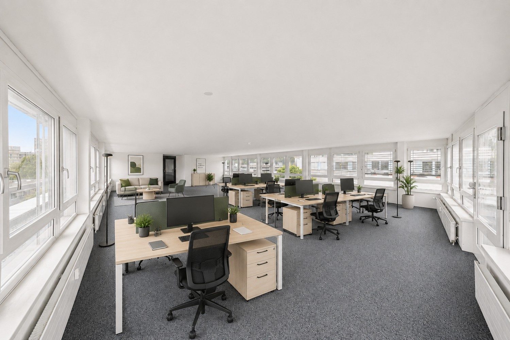
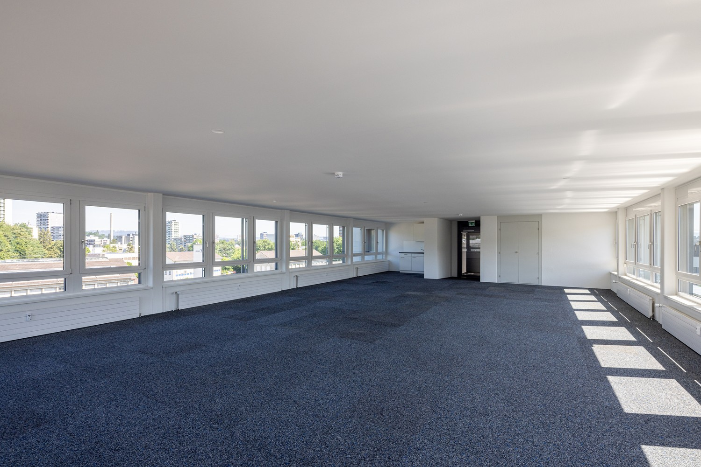
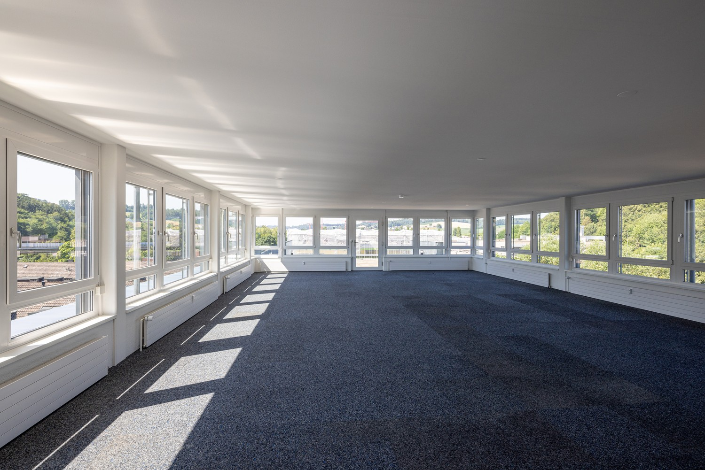
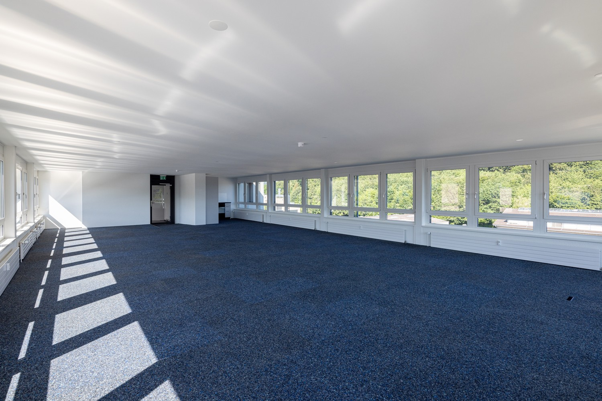
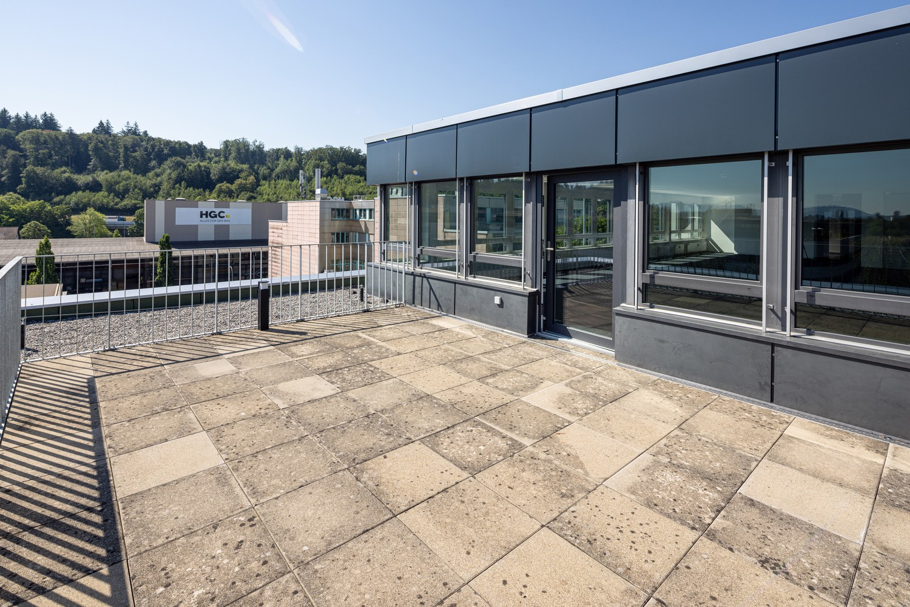
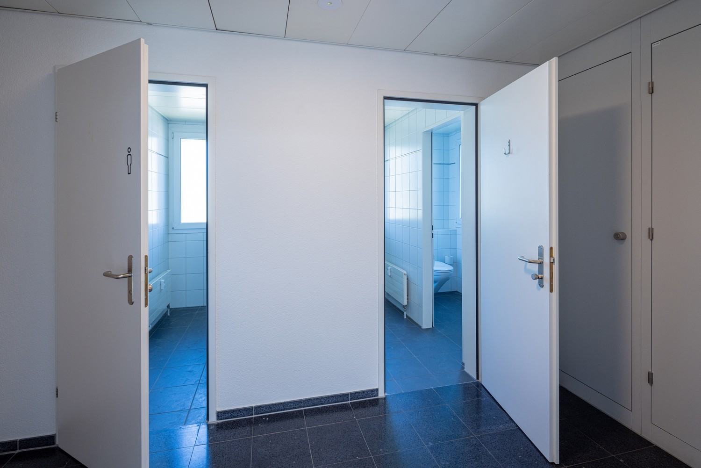
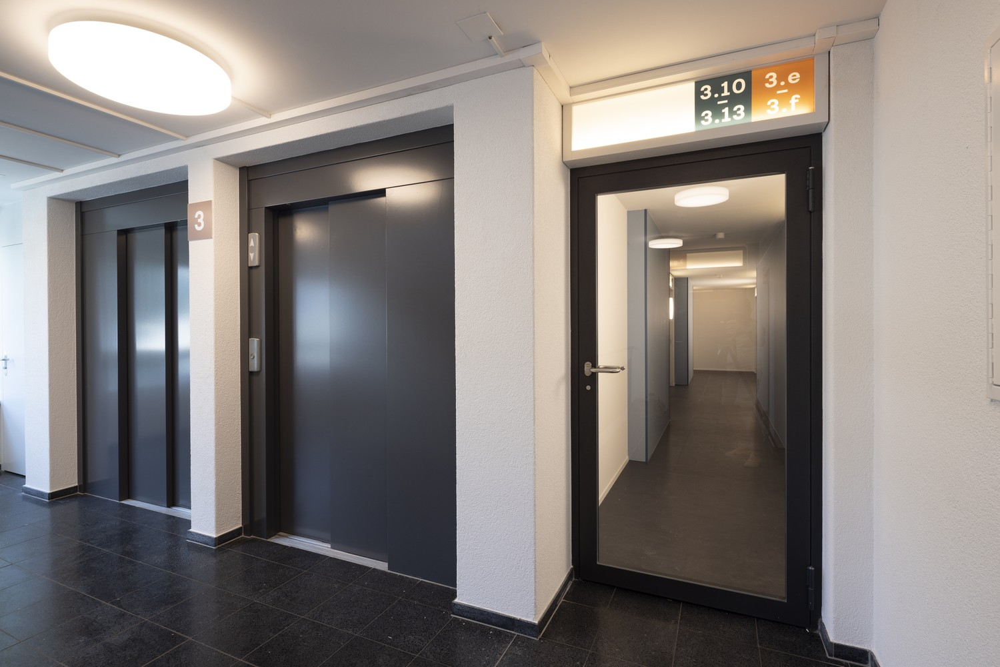
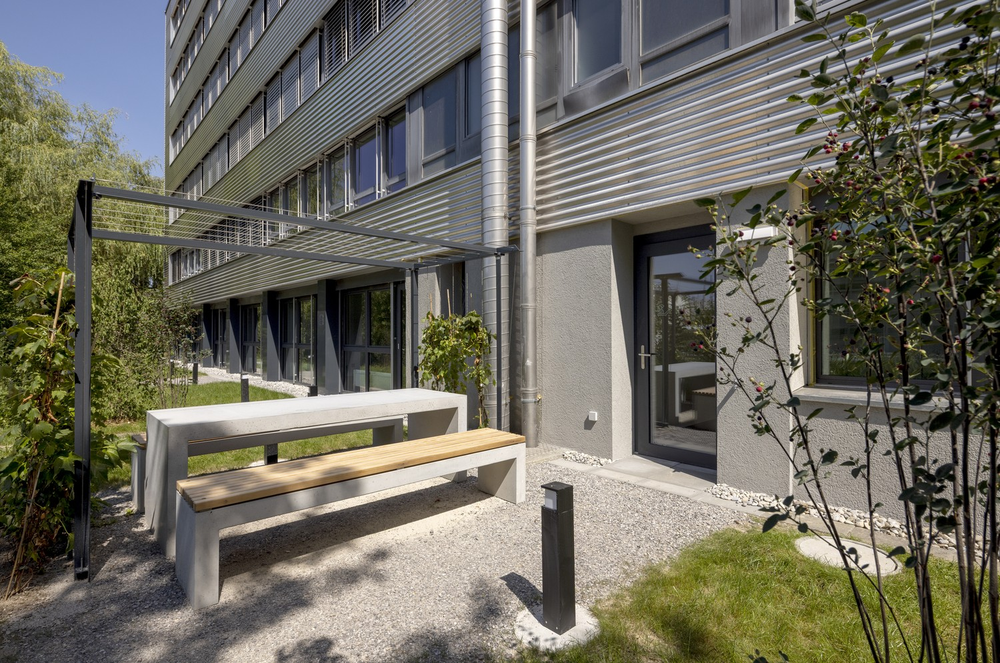

# Wangenstrasse 86a, 3018 Bern - CHF 2’198 inkl. NK pro Monat

> **Categorie:** `B_buero_gewerbe`  
> **Regiune:** Berna (oraș)  
> **Tip ofertă:** RENT / OFFICE  
> **Sursă:** [flatfox.ch](https://flatfox.ch/de/wohnung/wangenstrasse-86a-3018-bern/86098358/)  
> **Descărcat:** 2026-08-17 12:28

## Date obiect

| Câmp | Valoare |
|---|---|
| Adresă | Wangenstrasse 86a, 3018 Bern |
| Categorie obiect | INDUSTRY |
| Tip obiect | OFFICE |
| Nebenkosten | CHF 390 |
| Chirie brută | CHF 2'198 |
| Preț afișat | CHF 2'198 |
| Suprafață utilă | 117 m² |
| Etaj | 6 |
| An renovare | 2026 |
| Disponibil de la | imm |
| Referință | 37360.11.Büro (3) |

## Texte originale (germană)

**Titlu public:** Wangenstrasse 86a, 3018 Bern - CHF 2’198 inkl. NK pro Monat

**Titlu scurt:** 117m² Büro

**Pitch:** 117m² Büro in Bern mieten

**Titlu descriere:** Raum für Ideen, Wachstum und Zusammenarbeit - Büro nahe Stadt Bern

**Titlu chirie:** 117m² Büro in Bern mieten

**Spațiu afișat:** 117

### Descriere completă

Dieses attraktive Attika-Büro verbindet funktionale Arbeitsflächen mit einem besonderen Mehrwert: einer grosszügigen Dachterrasse von rund 27 m² zur exklusiven Nutzung. Die rund 117 m² grosse Bürofläche überzeugt durch helle Räume, Fensterflächen auf 3 Seiten und kann flexibel unterteilt und auf die Bedürfnisse Ihres Unternehmens angepasst werden – von offenen Arbeitsbereichen bis hin zu Besprechungs- oder Einzelbüros. Die WC-Anlagen befinden sich auf der Etage und stehen zur Mitbenutzung mit 1 weiteren Büromieter zur Verfügung.  
  
**Highlights:**  
  

*   Helles, frisch saniertes Attika-Büro
*   Exklusive Dachterrasse mit rund 27 m²
*   Flexible Unterteilungsmöglichkeiten
*   Teeküche vorhanden
*   Neue & bereits eingebaute Teppichbodenplatten (Doppelboden für IT-Verkabelung)
*   **Bezug:** ab sofort oder nach Vereinbarung
*   **Erreichbarkeit öV:** wenige Gehminuten vom Bahnhof Bümpliz Süd
*   **Erreichbarkeit Auto:** Autobahnanschluss Niederwangen in direkter Nähe
*   Einstellhallenplätze für CHF 140.–/Monat verfügbar

Interessiert? Besuchen Sie unsere Projetwebsite unter **https://w86a.ch/** und finden Sie viele weitere Informationen. Bei Fragen oder zur Vereinbarung eines Besichtigungstermins stehen wir sehr gerne zur Verfügung.  
  
_Alle Angaben sind unverbindlich. Änderungen bleiben bis zur Bauvollendung vorbehalten. Die Büros werden unmöbliert vermietet._

## Dotări (attributes)

- garage
- lift
- broadbandinternet

## Ofertant

- **Nume:** Privera AG
- **Stradă:** Worbstrasse 142
- **NPA:** 3073
- **Localitate:** Gümligen

## Imagini (11)

*`01.jpg` — 1500x1026 px*

*`02.jpg` — 1500x1000 px*

*`03.jpg` — 1500x1001 px*

*`04.jpg` — 1500x1001 px*

*`05.jpg` — 1500x1001 px*

*`06.jpg` — 1500x1001 px*

*`07.jpg` — 1500x1001 px*

*`08.jpg` — 1500x1001 px*

*`09.jpg` — 1500x1001 px*

*`10.jpg` — 1500x995 px*

*`11.jpg` — 1500x1026 px*

## Media suplimentară

- **website_url:** https://www.w86a.ch/
