# Pulverstrasse 8, 3063 Ittigen - CHF 4’200

> **Categorie:** `B_buero_gewerbe`  
> **Regiune:** Cantonul Berna  
> **Tip ofertă:** RENT / OFFICE  
> **Sursă:** [flatfox.ch](https://flatfox.ch/de/wohnung/pulverstrasse-8-3063-ittigen/86100611/)  
> **Descărcat:** 2026-08-17 12:33

## Date obiect

| Câmp | Valoare |
|---|---|
| Adresă | Pulverstrasse 8, 3063 Ittigen |
| Categorie obiect | INDUSTRY |
| Tip obiect | OFFICE |
| Chirie netă | CHF 3'500 |
| Nebenkosten | CHF 700 |
| Chirie brută | CHF 4'200 |
| Preț afișat | CHF 4'200 |
| Suprafață utilă | 238 m² |
| Etaj | 3 |
| Disponibil de la | agr |
| Referință | ..SI-25-234 |

## Texte originale (germană)

**Titlu public:** Pulverstrasse 8, 3063 Ittigen - CHF 4’200

**Titlu scurt:** 238m² Büro

**Pitch:** 238m² Büro in Ittigen mieten

**Titlu descriere:** Einzigartige Lofteinheit im legendären Stufenbau

**Titlu chirie:** 238m² Büro in Ittigen mieten

**Spațiu afișat:** 238

### Descriere completă

Der einzigartige und legendäre Stufenbau liegt am Rand von Ittigen und beherbergt eine Vielfalt an Nutzern. Die ehemalige Nitrocellulose-Fabrik, ein Schweizer Kulturgut von regionaler Bedeutung wurde im Jahr 1988 durch die Atelier5-Architekten umgebaut und ist 1990 ins Inventar der kantonalen Kunstaltertümer der Denkmalpflege aufgenommen worden. Lange war der Stufenbau als trendige Kulturlokalität für Konzerte, Partys, Theater und Kunstausstellungen bekannt. Heute gehört der Stufenbau verschiedenen Stockwerkeigentümern, welche dort unterschiedliche Gewerbe betreiben und/oder die Räumlichkeiten als originelle Loftwohnung nutzen. Seit 2013 werden die beiden obersten Stockwerke als stilvolle Event-Location genutzt.   
  
Unverkennbare Architektur   
Der terrassierte Eisenbetonbau unter schwach geneigten Betondächern mit Oberlichtern verfügt über eine mittig angelegte Erschliessungsachse mit Schräglift für den Warentransport. Daran angegliedert ist ein turmartiger Baukörper, der die gestufte Anlage spannungsvoll durchbricht.   
  
Nettomiete: CHF 3'500.- (inkl. Parkplätze)   
Nebenkosten akonto: CHF 700.-   
  
  
  
Raumbeschrieb   
  
Diese einzigartige Lofteinheit befindet sich in der dritten Etage, auf der rechten Gebäudeseite und verbindet auf eindrucksvolle Weise industriellen Charakter mit moderner, minimalistischer Architektur. Die Kombination aus grosszügiger Raumwirkung, viel Tageslicht und klarer Gestaltung macht diese Einheit zu einem besonderen Ort für berufliche, kreative oder wohnähnliche Nutzungen.   
  
Die Highlights auf einen Blick:   
Lichtdurchfluteter, grosszügiger Loft-/Atelierraum auf 179 m².   
Beeindruckende Raumhöhe und viele grosse Fenster und Oblichter, die ein einzigartiges Lichtspiel erzeugen und dem Raum Grosszügigkeit verleihen.   
Drei abgeschlossene Räume, ergänzt durch einen kleiner Rückzugsraum sowie ein praktisches Réduit.   
Sanitärbereich mit einer Dusche, zwei Toiletten und Lavabo.   
Fünf Parkplätze: 4 x ungedeckt, 1 x gedeckt   
Küche/Teeküche: Bei einer Nutzung als Wohnatelier kann eine vollwertige Küche eingebaut werden (die Anschlüsse sind bereits vorhanden). Bei einer Büronutzung würde eine praktische Teeküche mehr Sinn machen. Beide Varianten würden von der Eigentümerin unter Einbezug der Mieterschaft eingebaut werden.   
Mitbenutzung an Aussenbereichen: Im naturnahen Waldbereich am Steilhang befindet sich eine Terrasse im 1. OG auf der Ostseite, ausgestattet mit Grill und Tischen.   
Vielseitige Nutzungsmöglichkeiten, zum Beispiel als Büro- oder Atelierräume (Architekturbüro, Grafik- oder Designatelier, IT-Supporter), Wohnatelier, Loftwohnung, Kreativ- oder Bewegungsraum.

## Dotări (attributes)

- lift

## Ofertant

- **Nume:** Schneller Immobilien AG
- **Stradă:** Kramgasse 48
- **NPA:** 3011
- **Localitate:** Bern

## Imagini (13)

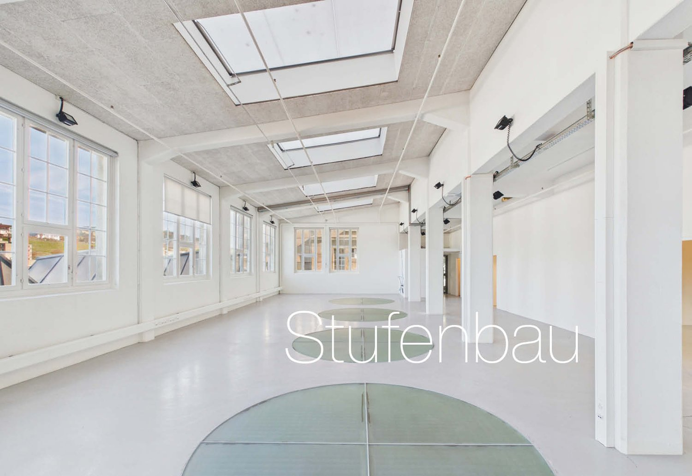
*`01.jpg` — Loft-/Atelierraum*

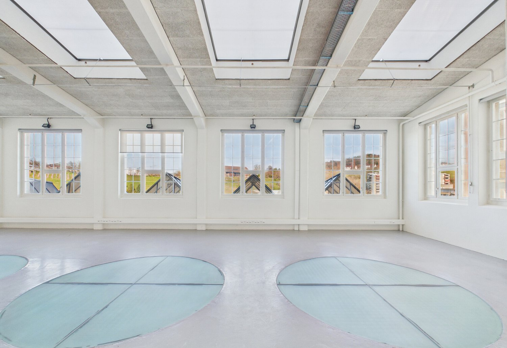
*`02.jpg` — Loft-/Atelierraum*

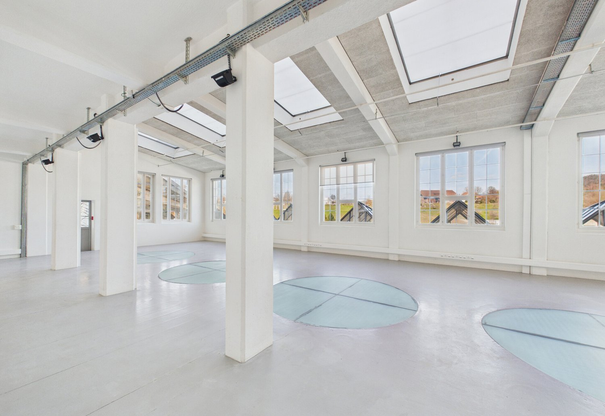
*`03.jpg` — Loft-/Atelierraum*

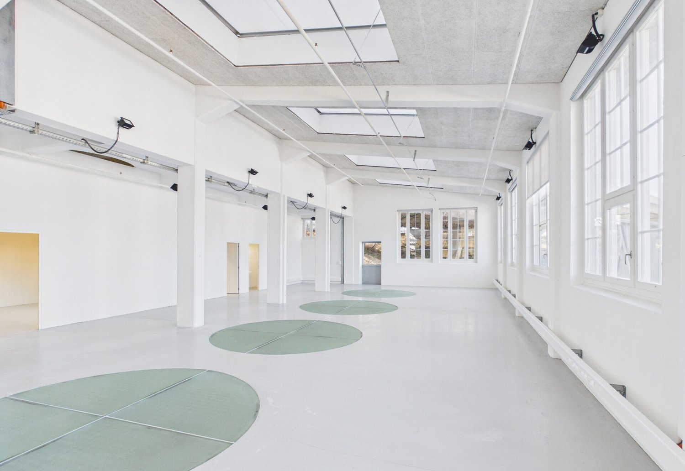
*`04.jpg` — Loft-/Atelierraum*

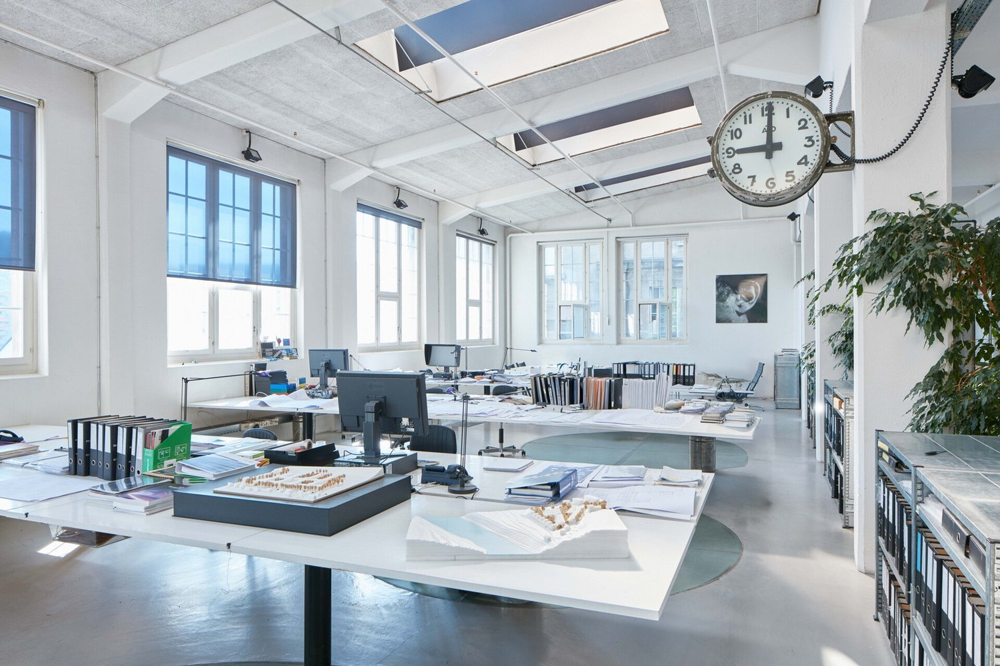
*`05.jpg` — Loft-/Atelierraum möbliert*

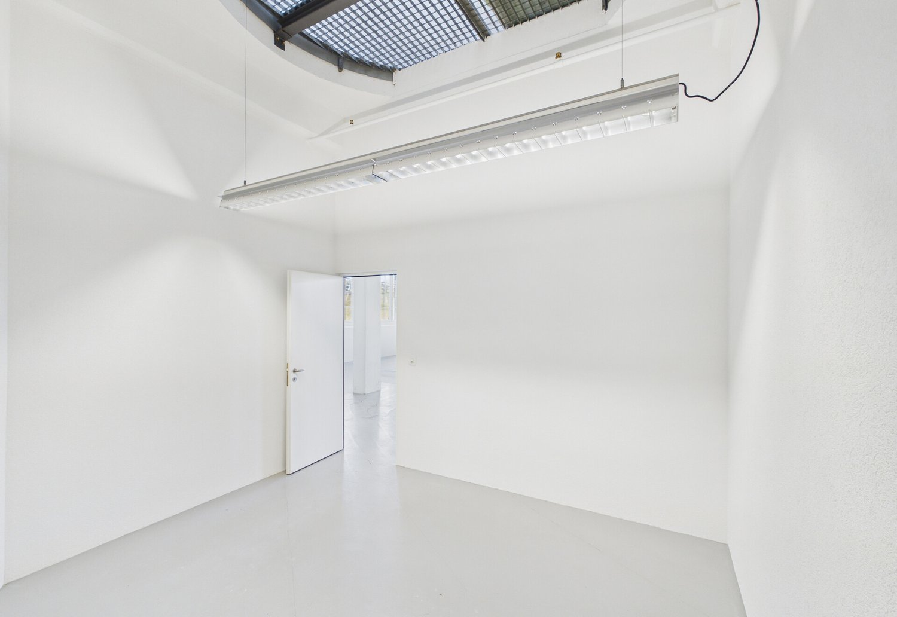
*`06.jpg` — Büro/Zimmer*

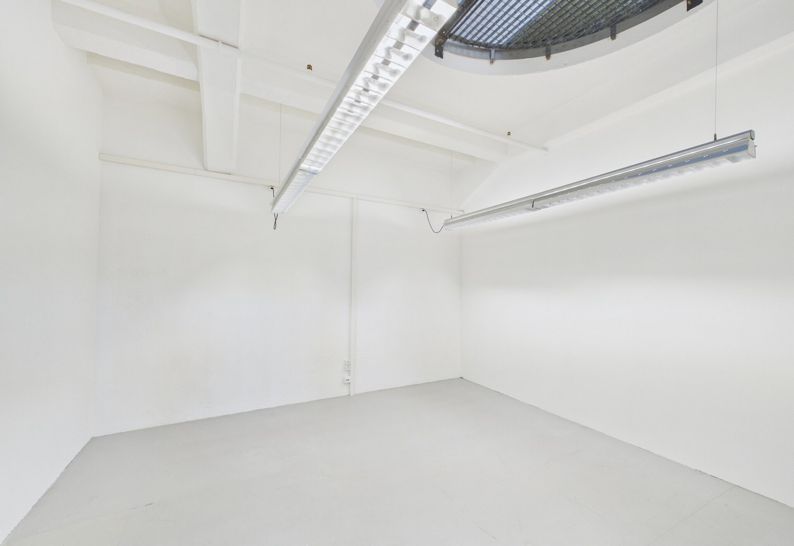
*`07.jpg` — Büro/Zimmer*

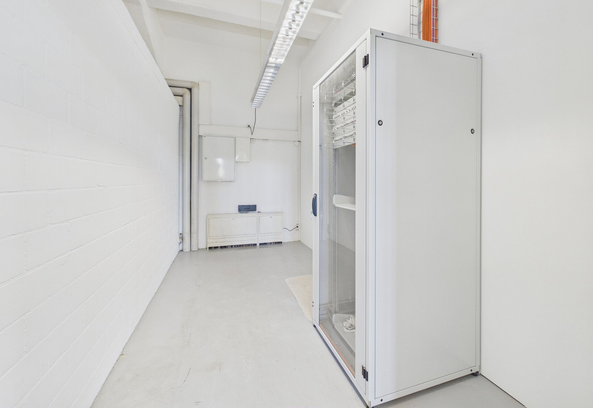
*`08.jpg` — Technikraum*

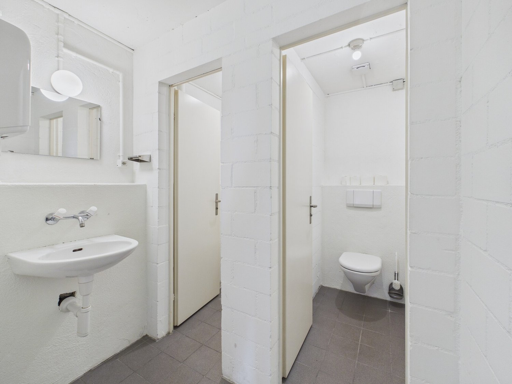
*`09.jpg` — Toiletten*

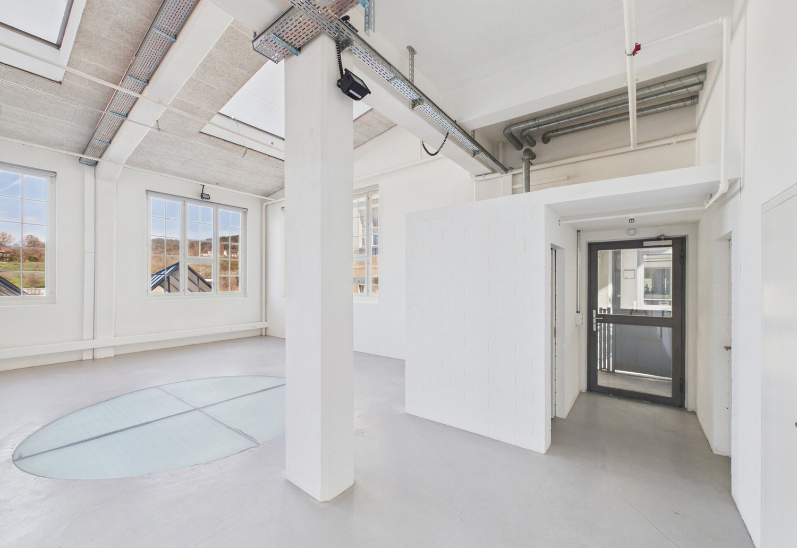
*`10.jpg` — Eingang*

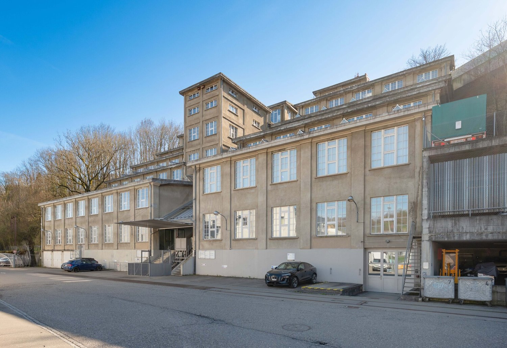
*`11.jpg` — Aussenansicht*

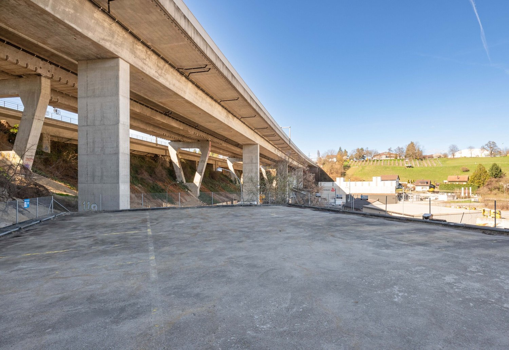
*`12.jpg` — Parkplatz*

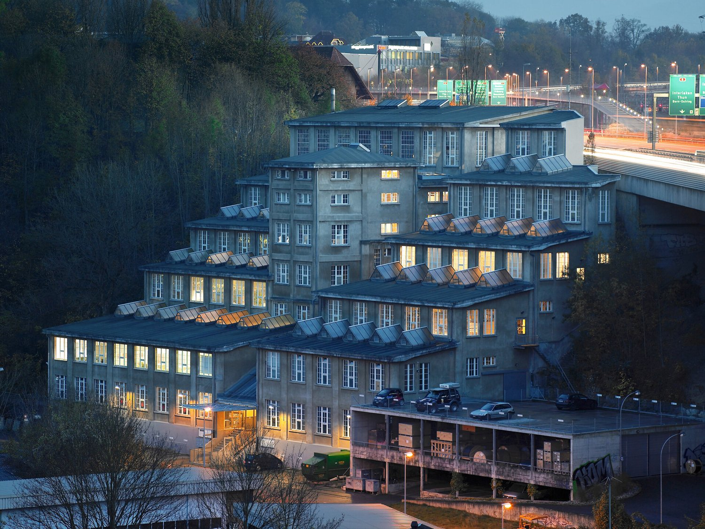
*`13.jpg` — Aussenansicht*

## Media suplimentară

- **tour_url:** https://tour.giraffe360.com/ff9e585a7a854ac2b11fd08f86b01383
