# Strandweg 35, 3004 Bern - CHF 6’865 inkl. NK pro Monat

> **Categorie:** `B_buero_gewerbe`  
> **Regiune:** Berna (oraș)  
> **Tip ofertă:** RENT / OFFICE  
> **Sursă:** [flatfox.ch](https://flatfox.ch/de/wohnung/strandweg-35-3004-bern/86109398/)  
> **Descărcat:** 2026-08-17 12:27

## Date obiect

| Câmp | Valoare |
|---|---|
| Adresă | Strandweg 35, 3004 Bern |
| Categorie obiect | INDUSTRY |
| Tip obiect | OFFICE |
| Chirie netă | CHF 5'920 |
| Nebenkosten | CHF 945 |
| Preț afișat | CHF 6'865 |
| Suprafață utilă | 355 m² |
| Etaj | 0 |
| Disponibil de la | agr |

## Texte originale (germană)

**Titlu public:** Strandweg 35, 3004 Bern - CHF 6’865 inkl. NK pro Monat

**Titlu scurt:** 355-355m² Büro

**Pitch:** 355-355m² Büro in Bern mieten

**Titlu descriere:** Am Aarestrand kommt man gerne zur Arbeit!

**Titlu chirie:** 355-355m² Büro in Bern mieten

**Spațiu afișat:** 355

### Descriere completă

Auf dem Felsenauareal bieten sich nach Vereinbarung vielseitig nutzbare Büro- und Empfangsflächen zur Miete an. Zur Verfügung stehen repräsentative Räumlichkeiten im Erdgeschoss sowie zusätzliche Büroflächen im Zwischengeschoss, insgesamt rund 355 m2 mit flexiblem Nutzungspotenzial.  
  
Die heutigen Mieter bündeln ihre Standorte und werden die Flächen ab Herbst 2026 freigeben. Die bestehende Büroeinrichtung sowie bereits realisierte Mieterausbauten, darunter die Empfangstheke im Erdgeschoss, können bei Interesse übernommen werden und ermöglichen einen unkomplizierten Start am neuen Standort.  
  
Ein besonderes Plus bietet die gemeinschaftlich genutzte „Aarestube“ im 2. Obergeschoss. Sie steht allen Mietern für Pausen, informelle Meetings oder einen kurzen Perspektivenwechsel im Arbeitsalltag zur Verfügung. Der Balkon mit direktem Blick auf die Aare schafft dabei einen Ort, der Ruhe bringt und neue Energie schenkt. Die Nutzung ist bereits im Mietzins inbegriffen.  
  
Des weiteren stehen genügend Aussenparkplätze für Mitarbeiter und Kunden auf dem Areal zur Verfügung, welche zu CHF 70.00 dazu gemietet werden können. Ein allfälliger Bedarf an Lagerflächen lässt sich, in begrenztem Ausmass, auch abdecken.  
  
Das Brauereiareal erreichen Sie ab Hauptbahnhof Bern mit dem Bus Nr. 21 Richtung Bremgarten. Steigen Sie bei der Haltestelle Felsenau (direkt beim Gewerbepark) oder Fährstrasse aus und folgen Sie den Wegweisern zur Brauerei Felsenau. Von dort führt ein ca. 3-minütiger Fussweg entlang des Strandwegs am linken Aareufer direkt zum Areal.  
  
Wenn Sie einen Standort suchen, der Funktionalität mit einem einzigartigen Arbeitsumfeld verbindet, zeigen wir Ihnen die Räumlichkeiten gerne persönlich bei einer Besichtigung vor Ort. Wir freuen uns auf Ihre Kontaktaufnahme.

## Dotări (attributes)

- lift
- balconygarden
- parkingspace
- view

## Ofertant

- **Nume:** Von Graffenried AG Liegenschaften
- **Stradă:** Marktgass-Passage 3
- **NPA:** 3011
- **Localitate:** Bern

## Imagini (14)

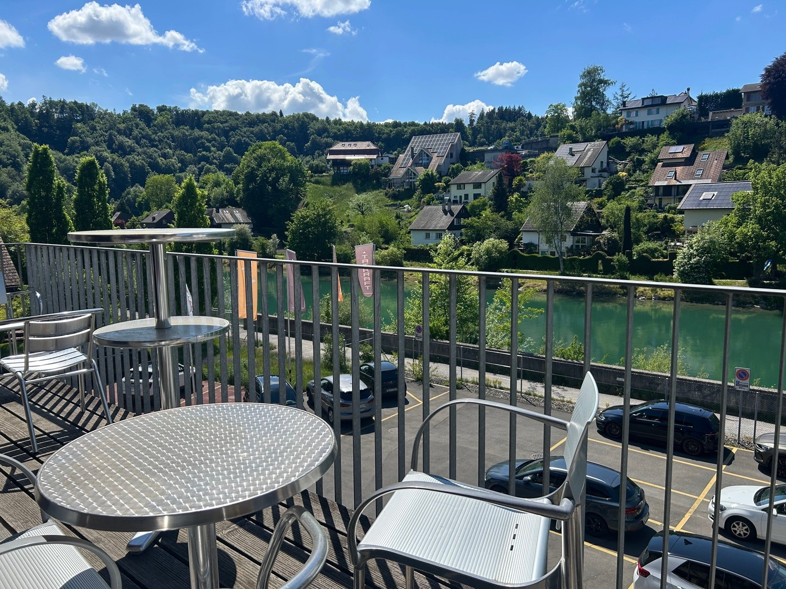
*`01.jpg` — 1500x1125 px — Balkon Aarestube*

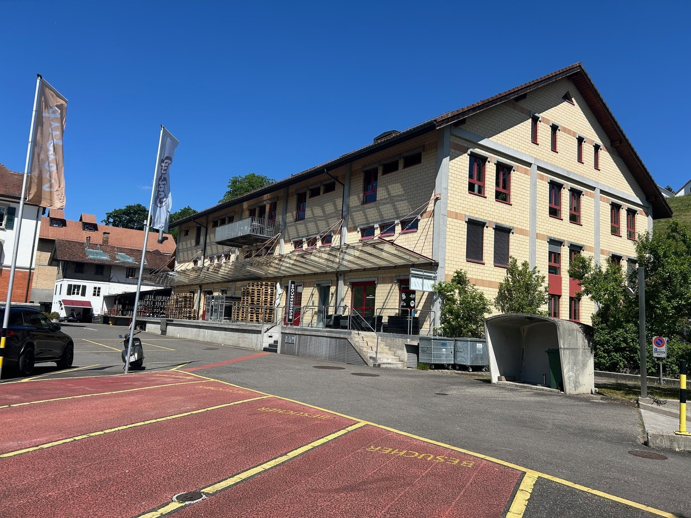
*`02.jpg` — 1500x1125 px — Aussenansicht*

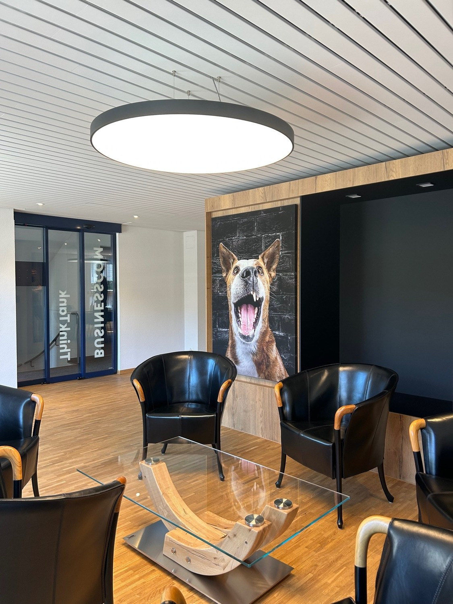
*`03.jpg` — 1125x1500 px — Empangsbereich EG*

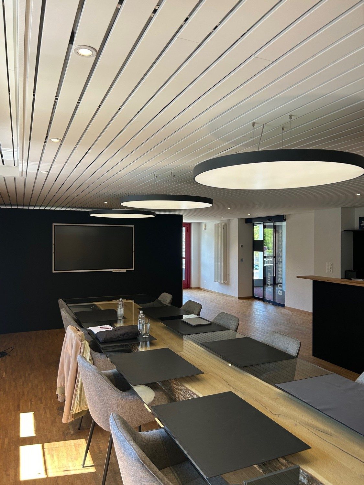
*`04.jpg` — 1125x1500 px — Aufenthaltsbereich EG*

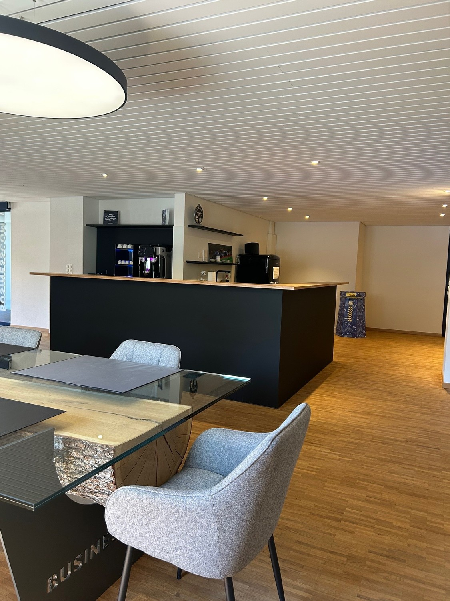
*`05.jpg` — 1125x1500 px — Empfangstheke EG*

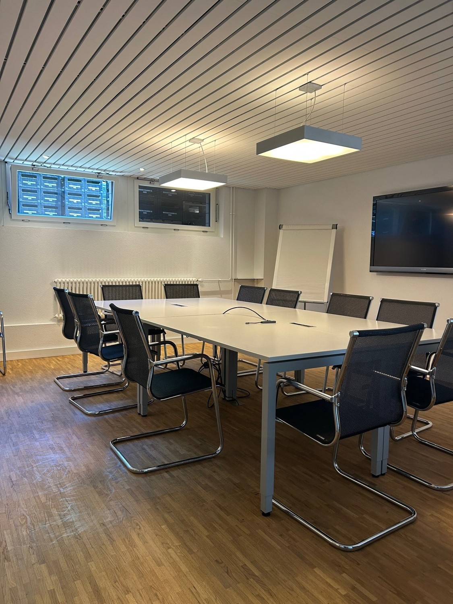
*`06.jpg` — 1125x1500 px — Sitzungszimmer EG*

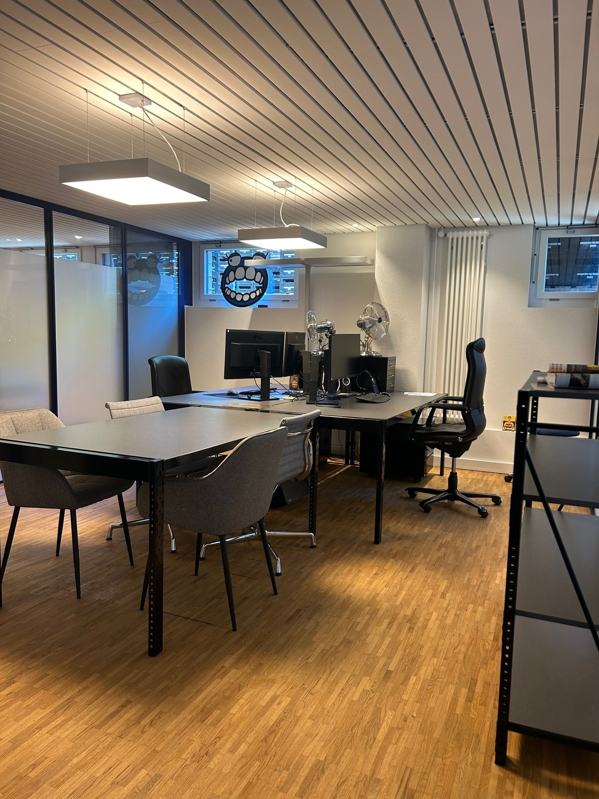
*`07.jpg` — 1125x1500 px — Büro EG 1*

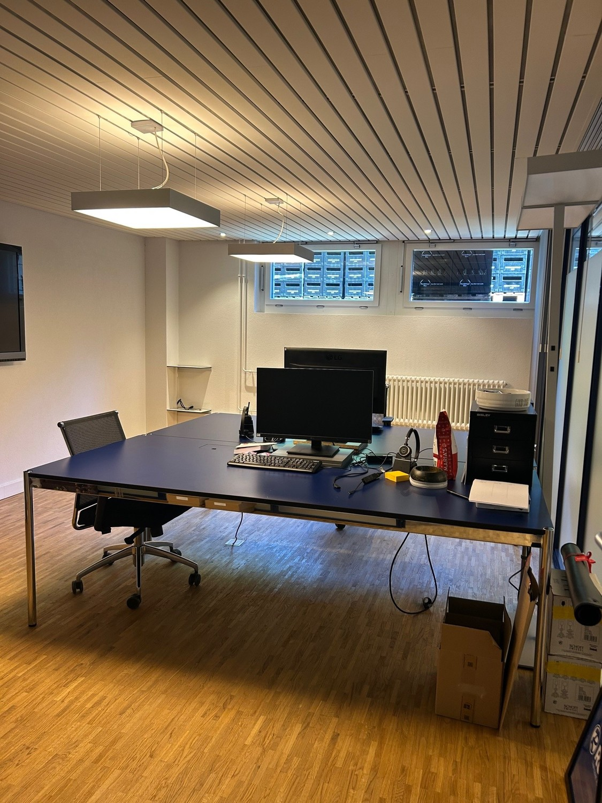
*`08.jpg` — 1125x1500 px — Büro EG 2*

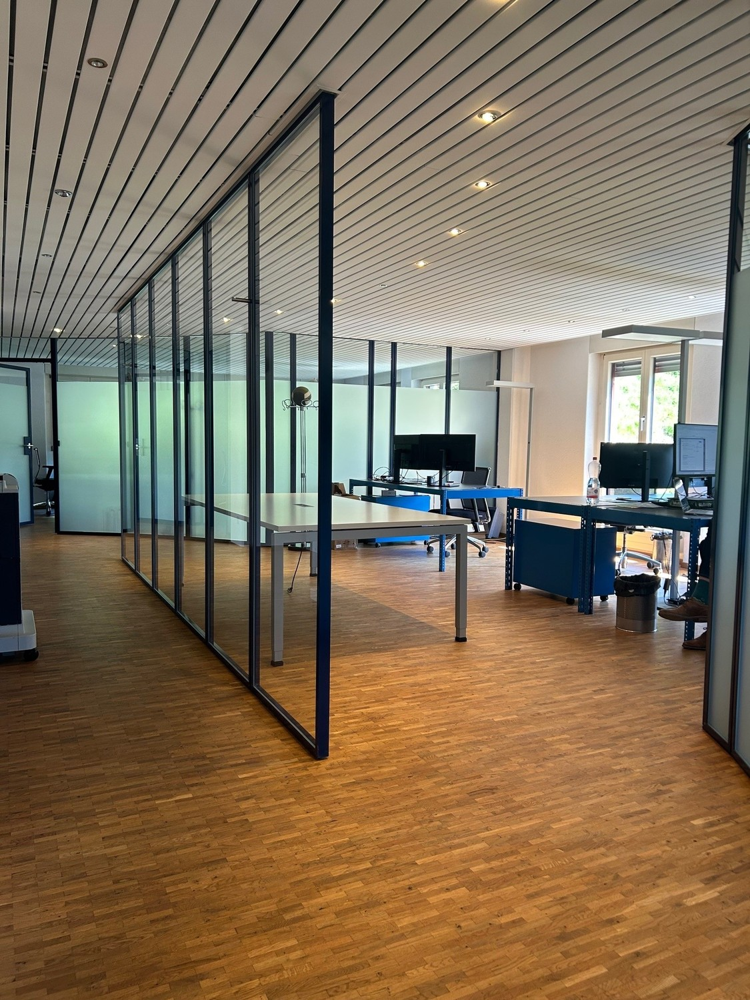
*`09.jpg` — 1125x1500 px — Büro OG*

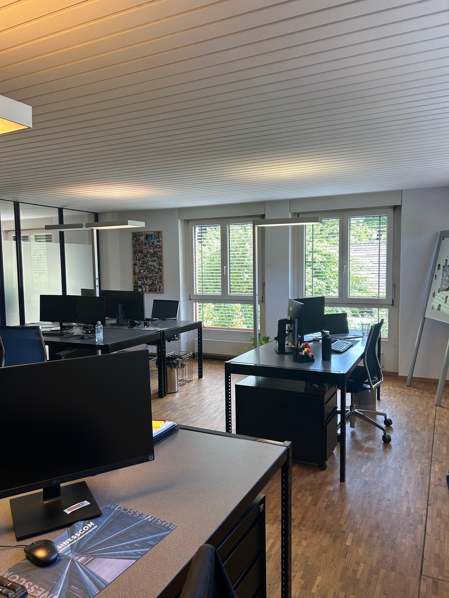
*`10.jpg` — 1125x1500 px — Büro OG*

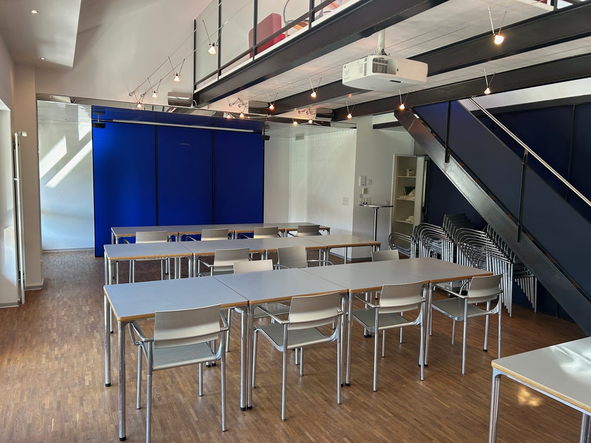
*`11.jpg` — 1500x1125 px — Aarestube*

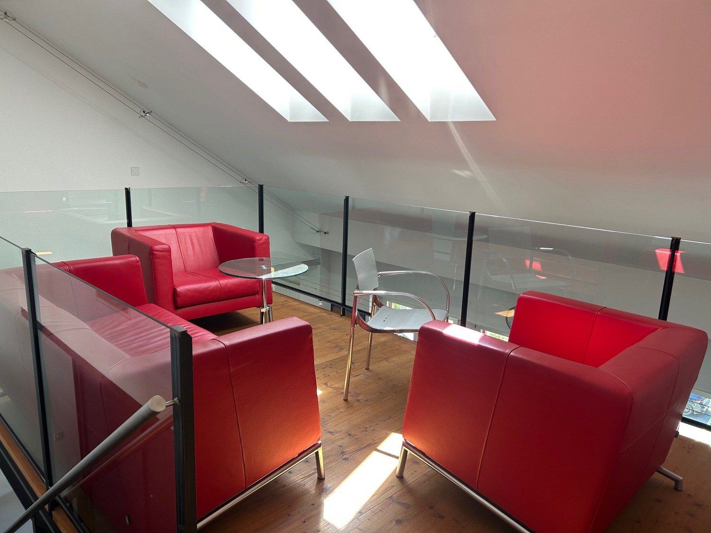
*`12.jpg` — 1500x1125 px — Galerie Aarestube*

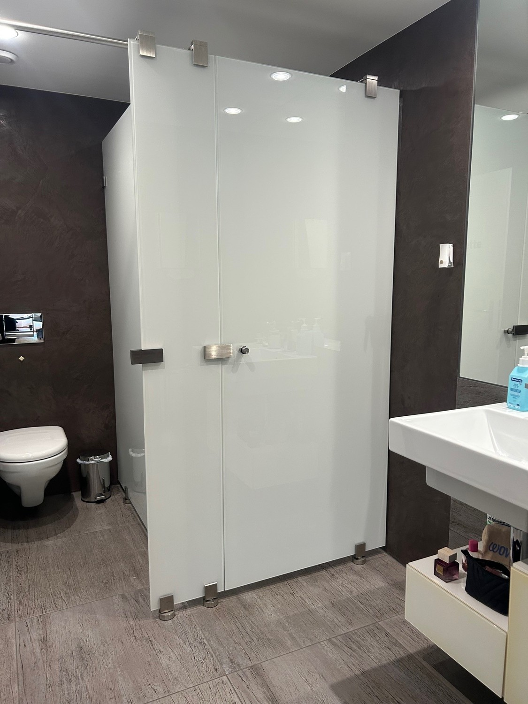
*`13.jpg` — 1125x1500 px — Toilette Damen*

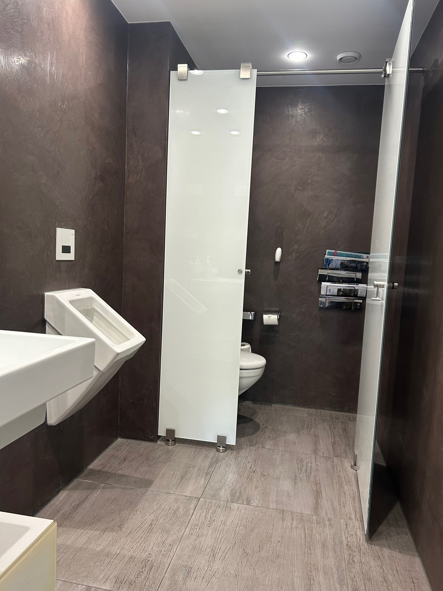
*`14.jpg` — 1125x1500 px — Toilette Herren*
