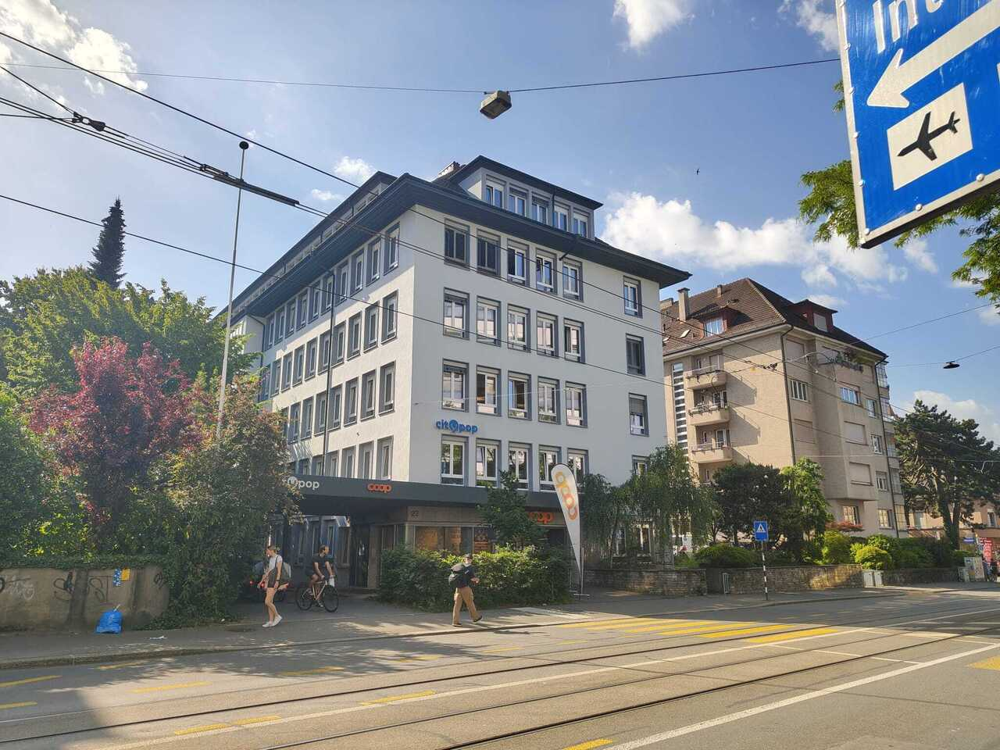
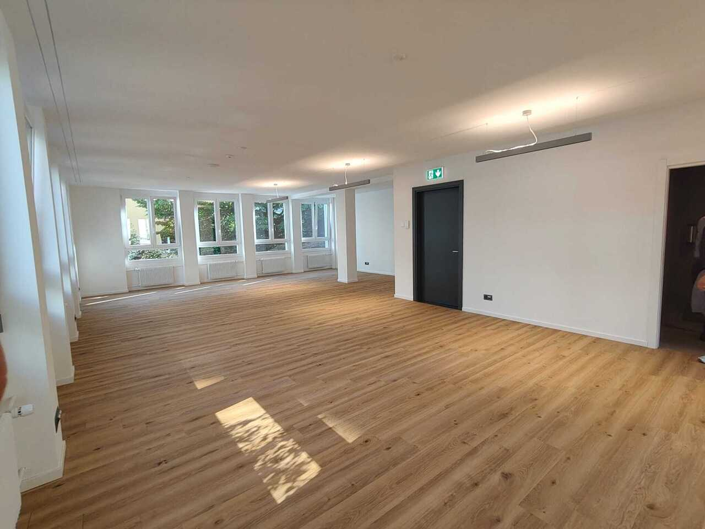
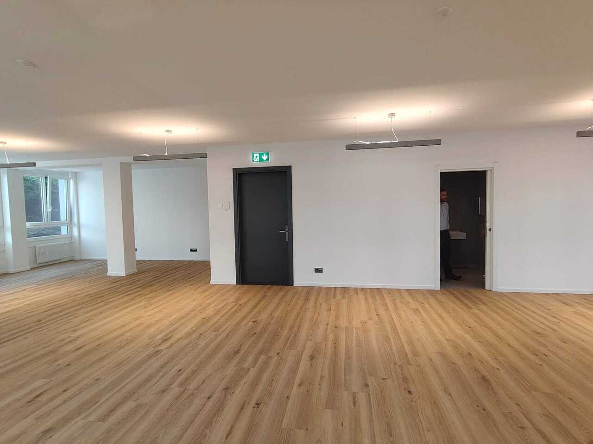
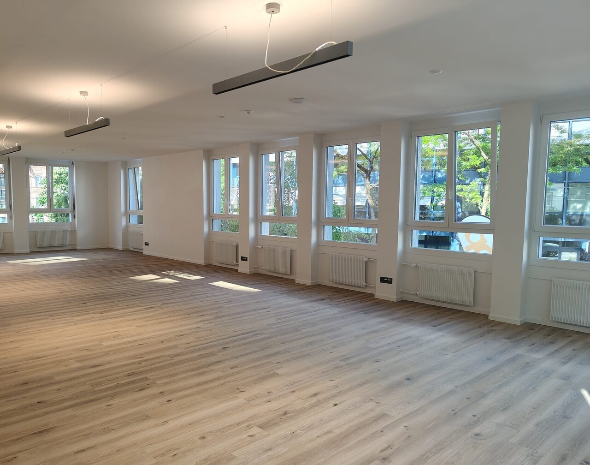
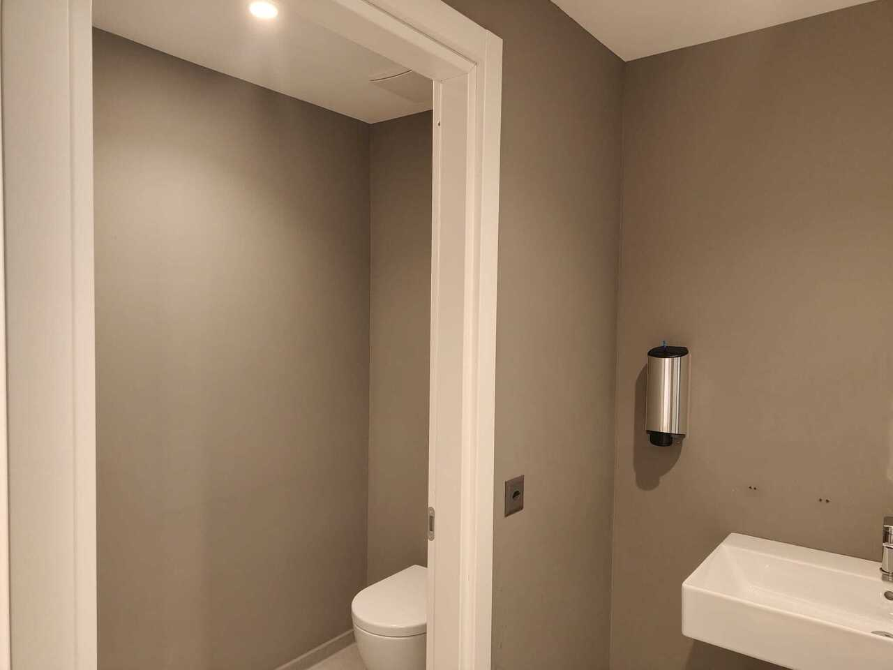
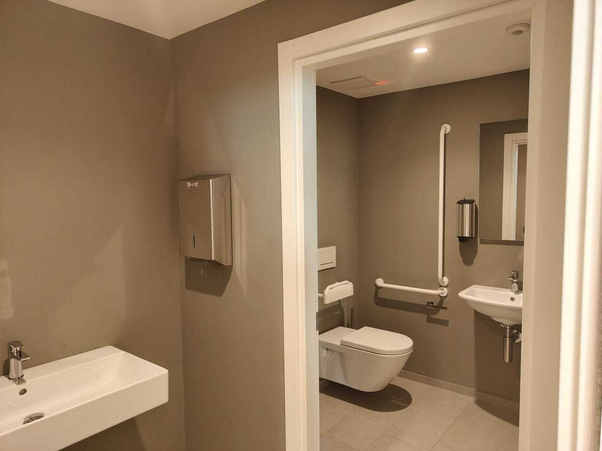

# Belpstrasse 23, 3007 Bern - CHF 2’200

> **Categorie:** `B_buero_gewerbe`  
> **Regiune:** Berna (oraș)  
> **Tip ofertă:** RENT / OFFICE  
> **Sursă:** [flatfox.ch](https://flatfox.ch/de/wohnung/belpstrasse-23-3007-bern/86120467/)  
> **Descărcat:** 2026-08-17 12:34

## Date obiect

| Câmp | Valoare |
|---|---|
| Adresă | Belpstrasse 23, 3007 Bern |
| Categorie obiect | INDUSTRY |
| Tip obiect | OFFICE |
| Chirie netă | CHF 2'000 |
| Nebenkosten | CHF 200 |
| Chirie brută | CHF 2'200 |
| Preț afișat | CHF 2'200 |
| Suprafață utilă | 96 m² |
| Disponibil de la | imm |
| Referință | ..6030001 |

## Texte originale (germană)

**Titlu public:** Belpstrasse 23, 3007 Bern - CHF 2’200

**Titlu scurt:** 96m² Büro

**Pitch:** 96m² Büro in Bern mieten

**Titlu descriere:** Modernes Büro in CityPop Gebäude

**Titlu chirie:** 96m² Büro in Bern mieten

**Spațiu afișat:** 96

### Descriere completă

**Moderne Bürofläche an Top-Lage in Bern - sofort bezugsbereit**   
Sichern Sie sich Ihren neuen Unternehmensstandort im beliebten Monbijou-Quartier. An der Belpstrasse 23 vermieten wir eine **komplett ausgebaute Bürofläche mit ca. 96 m²** im 1. Obergeschoss - ideal für **Kleinunternehmen mit 6 bis 8 Mitarbeitenden** , Start-ups oder Dienstleistungsunternehmen.   
Die hellen Räumlichkeiten mit grosszügigen Fensterfronten schaffen eine angenehme Arbeitsatmosphäre und bieten dank bestehender Grundbeleuchtung, Strom- und Netzwerkanschlüssen sowie eigenen Sanitäranlagen beste Voraussetzungen für einen **sofortigen Einzug.**   
Die zentrale Lage überzeugt auf ganzer Linie: Der Bahnhof Bern ist in nur **5 Gehminuten** erreichbar, ein **Coop** befindet sich direkt im Erdgeschoss und die **City Pop Apartments** im selben Gebäude bieten eine praktische Übernachtungsmöglichkeit für Gäste oder Mitarbeitende.   
  
**Highlights auf einen Blick**   

  * Ca. 96 m² komplett ausgebaute Bürofläche 
  * Ideal für 6-8 Arbeitsplätze 
  * Sofort bezugsbereit 
  * Helle Räume mit grosszügigen Fensterfronten 
  * Eigene Sanitäranlagen 
  * Bahnhof Bern in nur 5 Gehminuten 
  * Coop im Haus 
  * City Pop Apartments im selben Gebäude 

  
Nutzen Sie diese Gelegenheit und bringen Sie Ihr Unternehmen an einen modernen, zentralen Standort mit bester Infrastruktur. Vereinbaren Sie noch heute eine Besichtigung - wir freuen uns auf Ihre Kontaktaufnahme.

## Ofertant

- **Nume:** H&B Real Estate AG
- **Stradă:** Lagerstrasse 107
- **NPA:** 8004
- **Localitate:** Zürich

## Imagini (6)

*`01.jpg` — 1280x960 px*

*`02.jpg` — 1280x960 px*

*`03.jpg` — 1280x960 px*

*`04.jpg` — 1280x1008 px*

*`05.jpg` — 1280x960 px*

*`06.jpg` — 1280x960 px*
