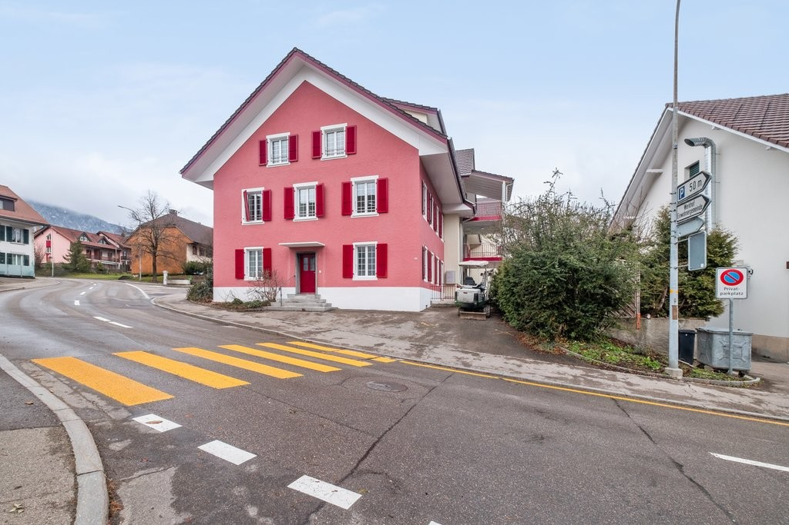
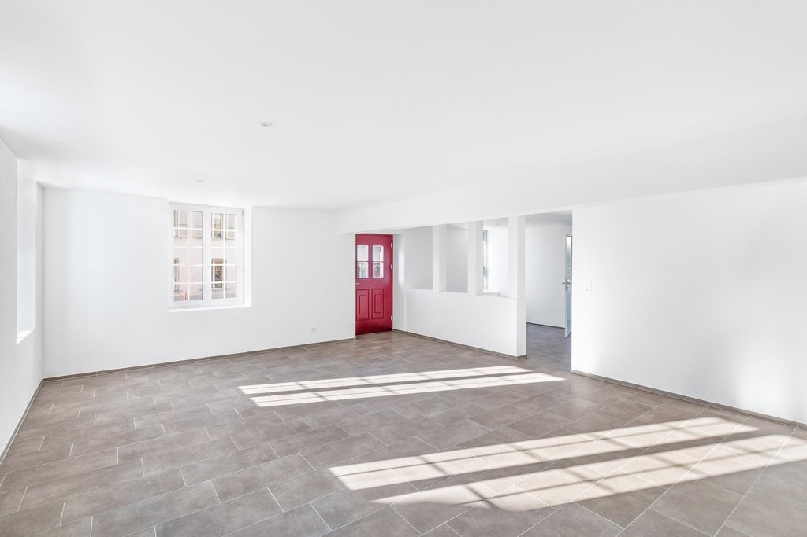
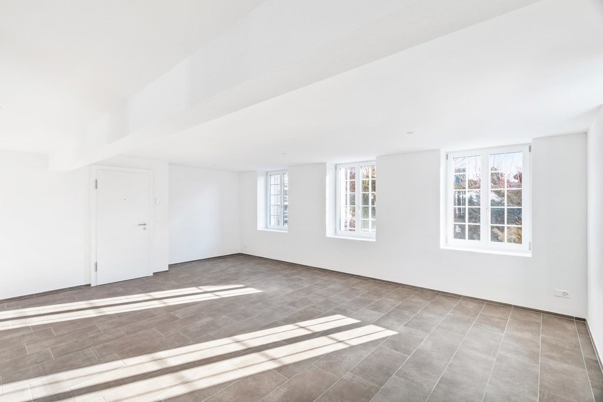
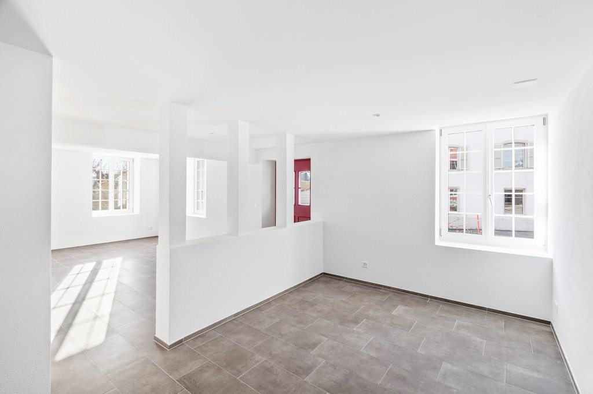
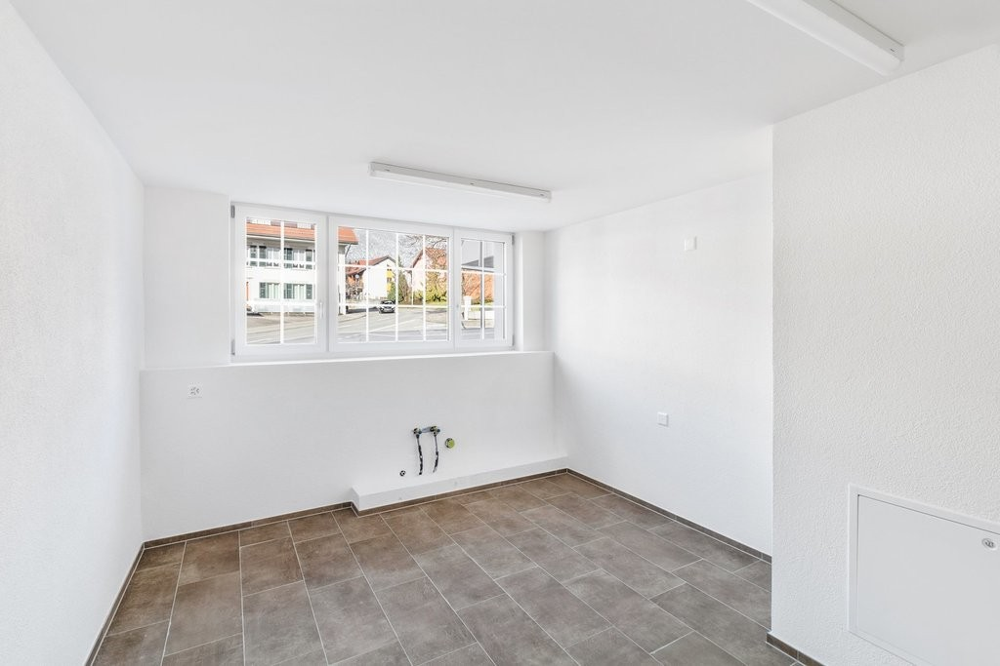
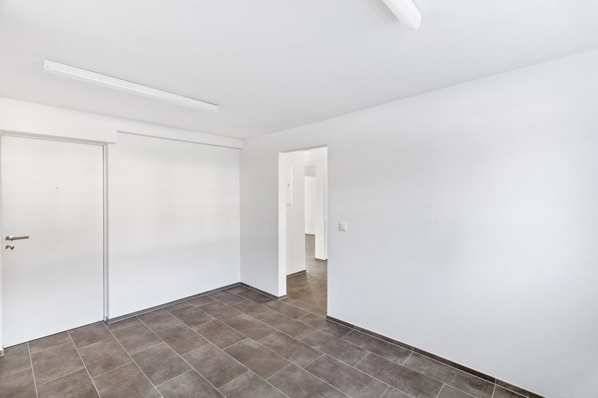
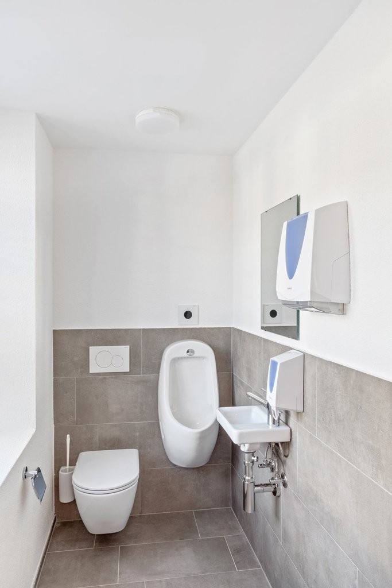
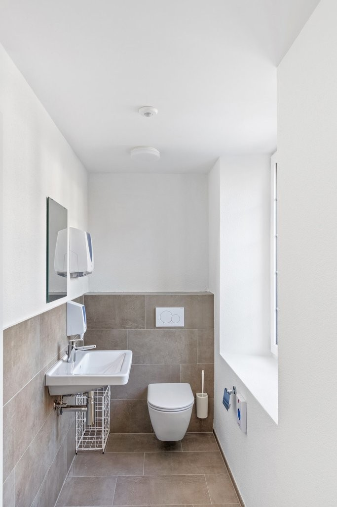
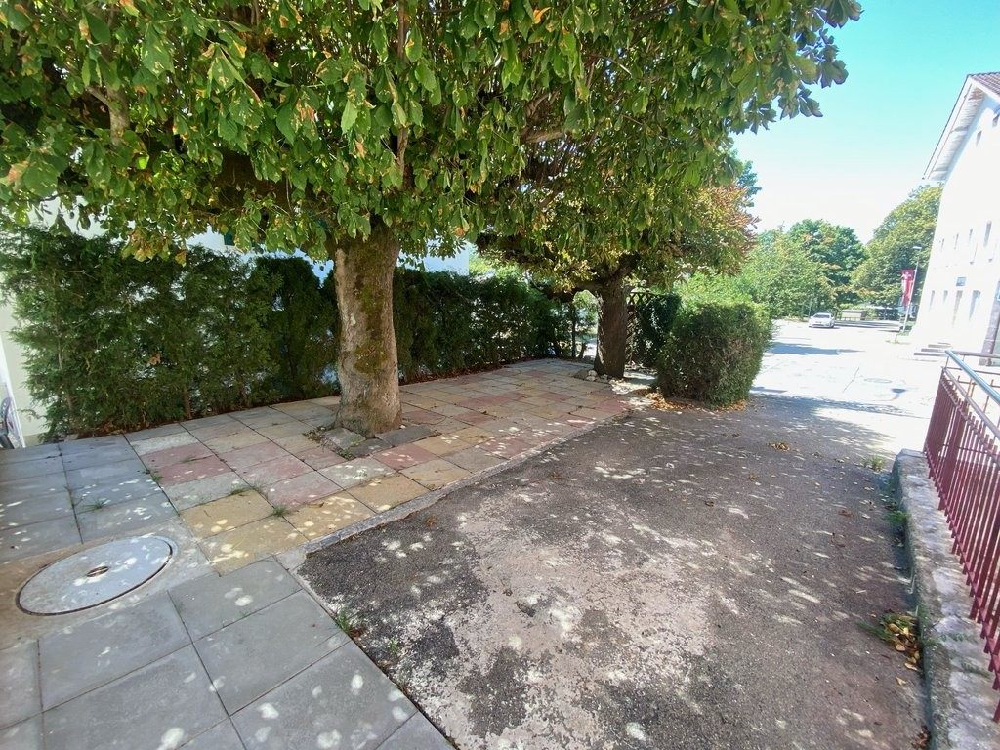

# Dorfstrasse 34, 2545 Selzach - CHF 1’190 inkl. NK pro Monat

> **Categorie:** `B_buero_gewerbe`  
> **Regiune:** Cantonul Berna  
> **Tip ofertă:** RENT / COMMERCIAL  
> **Relevant pentru praxis:** da (praxis)  
> **Sursă:** [flatfox.ch](https://flatfox.ch/de/wohnung/dorfstrasse-34-2545-selzach/86136284/)  
> **Descărcat:** 2026-08-17 12:27

## Date obiect

| Câmp | Valoare |
|---|---|
| Adresă | Dorfstrasse 34, 2545 Selzach |
| Categorie obiect | INDUSTRY |
| Tip obiect | COMMERCIAL |
| Chirie netă | CHF 1'040 |
| Nebenkosten | CHF 150 |
| Chirie brută | CHF 1'190 |
| Preț afișat | CHF 1'190 |
| Suprafață utilă | 73 m² |
| Etaj | 0 |
| Disponibil de la | imm |
| Referință | ..10156.2.1001.1 |

## Texte originale (germană)

**Titlu public:** Dorfstrasse 34, 2545 Selzach - CHF 1’190 inkl. NK pro Monat

**Titlu scurt:** 73m² Gewerbe

**Pitch:** 73m² Gewerbe in Selzach mieten

**Titlu descriere:** EINLADENDES GEWERBEOBJEKT FÜR IHREN GESCHÄFTSERFOLG IN SELZACH

**Titlu chirie:** 73m² Gewerbe in Selzach mieten

**Spațiu afișat:** 73

### Descriere completă

Per sofort oder nach Vereinbarung vermieten wir diese hochwertig renovierten Gewerberäumlichkeiten an zentraler Lage in Selzach. Das vielseitig nutzbare Objekt im Erdgeschoss eignet sich hervorragend als Büro, moderne Praxis oder für kreative Dienstleistungen. Dank der attraktiven Ecklage und den grossen Fensterfronten profitieren Sie hier von einer lichtdurchfluteten Atmosphäre, die eine äusserst motivierende Arbeitsumgebung schafft und Ihrem Unternehmen eine erstklassige repräsentative Wirkung verleiht. Die Raumaufteilung bietet Ihnen maximale Flexibilität bei der Gestaltung Ihrer Arbeitsplätze und Kundenbereiche.   
  
**Profitieren Sie von unserem exklusiven Einzugsgeschenk im Wert von CHF 2'600!**   
Erleichtern Sie sich den Umzug und sparen Sie bares Geld. Wir gewähren Ihnen für die ersten 10 Monate einen Mietzinsrabatt von CHF 260. Die monatliche Miete beträgt in diesem Zeitraum lediglich CHF 1190.- brutto inklusive Nebenkosten. Anschliessend gilt wieder der reguläre Mietzins von CHF 1450.- brutto.   
  
Die Highlights im Überblick:   
\- Lichtdurchflutete Räumlichkeiten mit grossen Fensterfronten für einen rundum professionellen Firmenauftritt und ein freundliches Arbeitsumfeld   
\- Attraktives Mitspracherecht beim finalen Innenausbau inklusive der Möglichkeit zum Einbau einer massgeschneiderten Teeküche ganz nach Ihren Vorstellungen   
\- Hervorragende Parksituation mit eigenen Tiefgaragenplätzen für Sie sowie bequemen Besucherparkplätzen direkt vor dem Gebäude für Ihre Kundschaft   
\- Eigener separater Zugang für maximale Unabhängigkeit und Flexibilität im täglichen Geschäftsbetrieb   
\- Viel zusätzlicher Platz durch einen grosszügigen Lagerraum oder Archivraum im Untergeschoss   
\- Wohlfühlatmosphäre dank der modernen Fussbodenheizung sowie einer tollen Option zur Aussennutzung für erholsame Teampausen an der frischen Luft   
\- Zeitgemässe Infrastruktur mit komplett erneuerten und separat geführten Toilettenanlagen für Damen und Herren   
  
Der Standort:   
Die Dorfstrasse 34 befindet sich an einer erstklassigen und gut sichtbaren Ecklage mitten in Selzach. Ihr Team und Ihre Kundschaft profitieren von einer hervorragenden Anbindung an den öffentlichen Verkehr, da der Bahnhof sowie die Bushaltestellen in bequemer Gehdistanz liegen. Zudem bietet der Standort eine optimale Erreichbarkeit für den Individualverkehr und verbindet ein charmantes Umfeld perfekt mit einer professionellen Infrastruktur für Ihren Betrieb.   
  
Haben wir Ihr Interesse geweckt? Dann freuen wir uns auf Ihre Kontaktaufnahme über das Inserat.

## Ofertant

- **Nume:** VIVIQ
- **Stradă:** Lerchenstrasse 24
- **NPA:** 8045
- **Localitate:** Zürich

## Imagini (9)

*`01.jpg` — 1024x683 px*

*`02.jpg` — 1024x683 px*

*`03.jpg` — 1024x683 px*

*`04.jpg` — 1024x683 px*

*`05.jpg` — 1024x683 px*

*`06.jpg` — 1024x683 px*

*`07.jpg` — 683x1024 px*

*`08.jpg` — 683x1024 px*

*`09.jpg` — 1024x768 px*
