# Zürichstrasse 3, 2504 Biel - CHF 3’600

> **Categorie:** `B_buero_gewerbe`  
> **Regiune:** Cantonul Berna  
> **Tip ofertă:** RENT / OFFICE  
> **Sursă:** [flatfox.ch](https://flatfox.ch/de/wohnung/zurichstrasse-3-2504-biel/86138435/)  
> **Descărcat:** 2026-08-17 12:36

## Date obiect

| Câmp | Valoare |
|---|---|
| Adresă | Zürichstrasse 3, 2504 Biel |
| Categorie obiect | INDUSTRY |
| Tip obiect | OFFICE |
| Chirie brută | CHF 3'600 |
| Preț afișat | CHF 3'600 |
| Suprafață utilă | 326 m² |
| Etaj | 3 |
| Disponibil de la | imm |
| Referință | ..72df6.tszsn |

## Texte originale (germană)

**Titlu public:** Zürichstrasse 3, 2504 Biel - CHF 3’600

**Titlu scurt:** 326m² Büro

**Pitch:** 326m² Büro in Biel mieten

**Titlu descriere:** Moderne und klimatisierte Büroflächen an optimaler Lage

**Titlu chirie:** 326m² Büro in Biel mieten

**Spațiu afișat:** 326

### Descriere completă

Willkommen in diesem repräsentativen und modernen Büro. Dieses Objekt bietet ideale Voraussetzungen und ist nach Vereinbarung verfügbar. 

**Raumaufteilung**

  * 2 Sitzungszimmer/Büroräume 

  * 1 Grossraumbüro 

  * 2 Einzelbüros 

  * 1 Lagerraum 

  * grosszügiger Vorplatz 

**Ausstattung**

  * Grosszügige Fensterflächen für helle und angenehme Arbeitsräume 

  * Klimaanlage für ein angenehmes Raumklima 

  * automatische Storen 

  * Eigene WC-Anlagen 

  * Kitchenette im Sitzungszimmer 

  * Moderne Liftanlage mit Direktzugang 

Das Objekt befindet sich unmittelbar beim Autobahnanschluss Bözingen und ist somit ideal gelegen. 

Parkplätze können für CHF 70.00 dazu gemietet werden. 

Interessiert? Gerne können Sie sich für eine Besichtigung dieser attraktiven Bürofläche melden. 

**************************************************************** 

Bienvenue dans ce bureau prestigieux et moderne. Ce bien offre des conditions idéales et est disponible à convenir. 

**Agencement**

  * 2 salles de réunion/bureaux 

  * 1 open space 

  * 2 bureaux individuels 

  * 1 local de stockage 

  * grand parvis 

**Équipements**

  * De grandes baies vitrées pour des espaces de travail lumineux et agréables 

  * Climatisation pour un confort thermique optimal 

  * Stores automatiques 

  * Toilettes privées 

  * Coin cuisine dans la salle de réunion 

  * Ascenseur moderne avec accès direct 

Le bien est situé à proximité immédiate de la sortie d'autoroute de Boujean et bénéficie ainsi d'un emplacement idéal. 

Des places de parc peuvent être louées en supplément pour CHF 70.00. 

Cela vous intéresse ? N'hésitez pas à nous contacter pour visiter cet espace de bureaux attrayant.

## Dotări (attributes)

- lift
- balconygarden
- view

## Ofertant

- **Nume:** PG Immoservice AG
- **Stradă:** Johann-Renferstrasse 5
- **NPA:** 2504
- **Localitate:** Biel/Bienne

## Imagini (14)

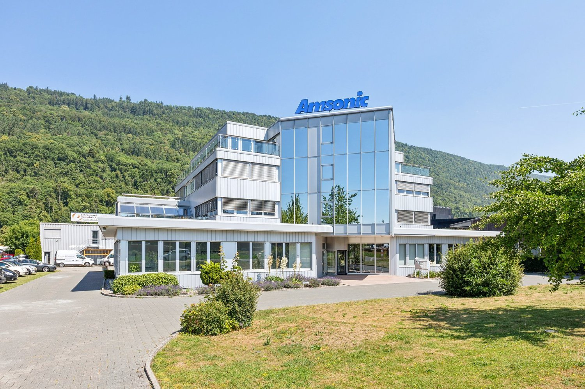
*`01.jpg` — 1500x1000 px*

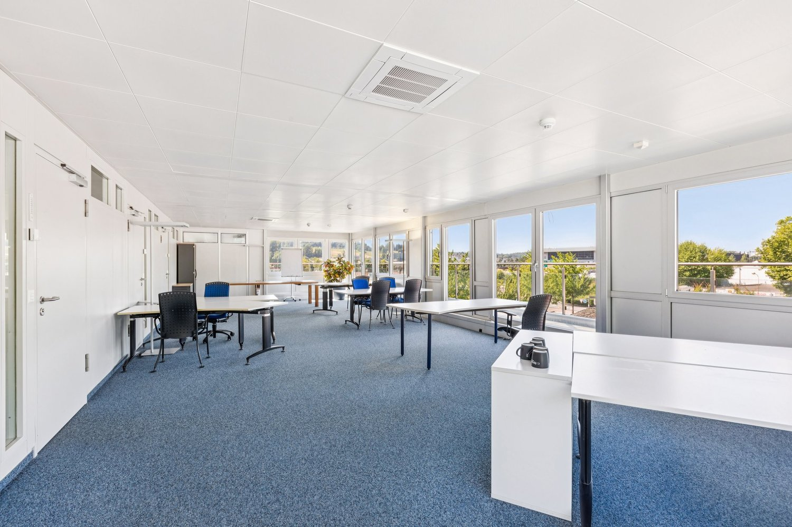
*`02.jpg` — 1500x1000 px*

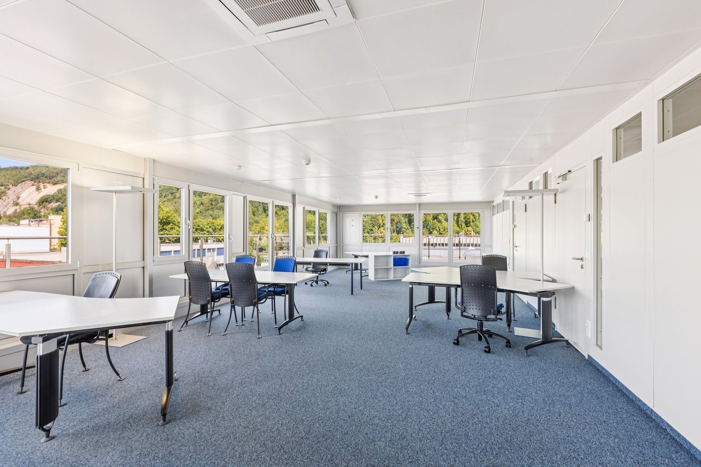
*`03.jpg` — 1500x1000 px*

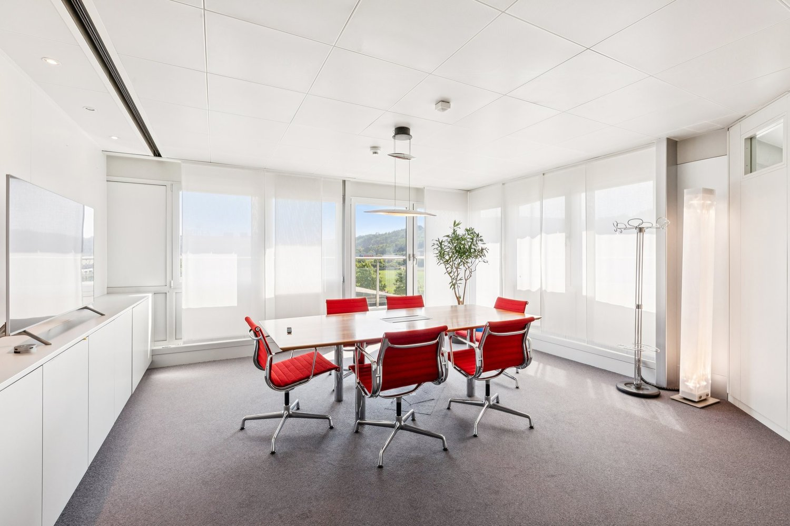
*`04.jpg` — 1500x1000 px*

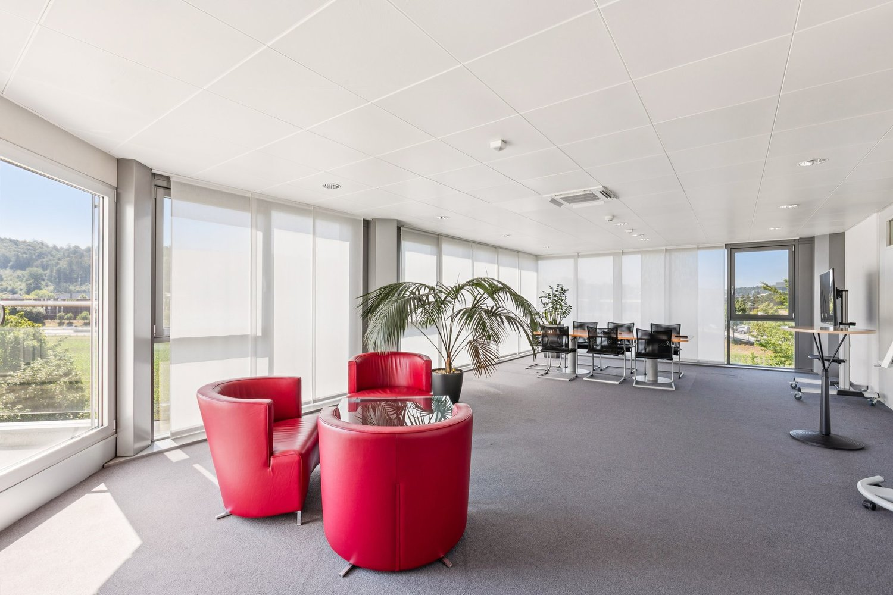
*`05.jpg` — 1500x1000 px*

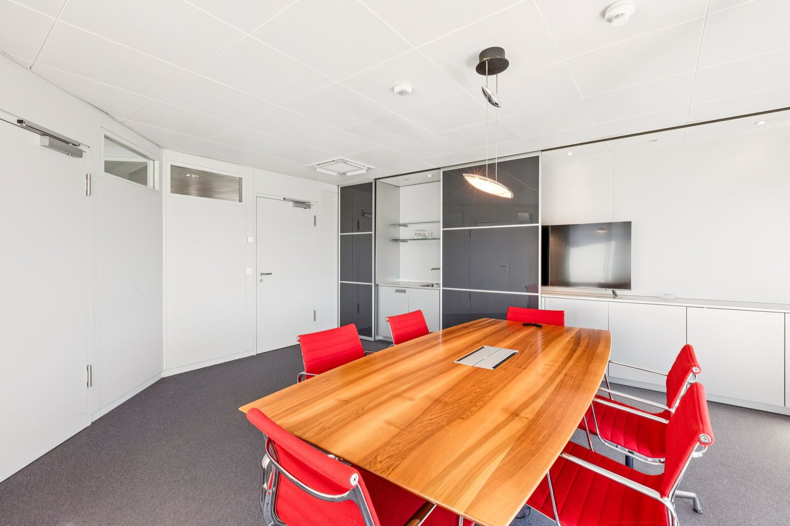
*`06.jpg` — 1500x1000 px*

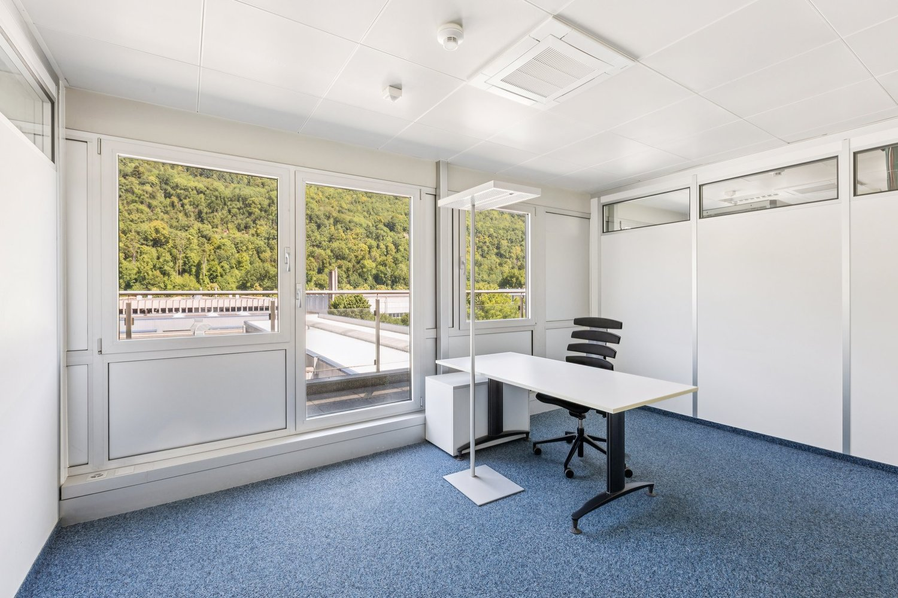
*`07.jpg` — 1500x1000 px*

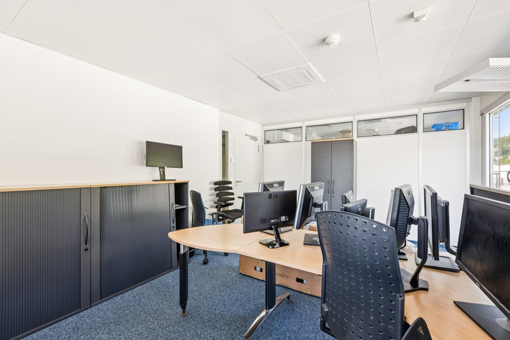
*`08.jpg` — 1500x1000 px*

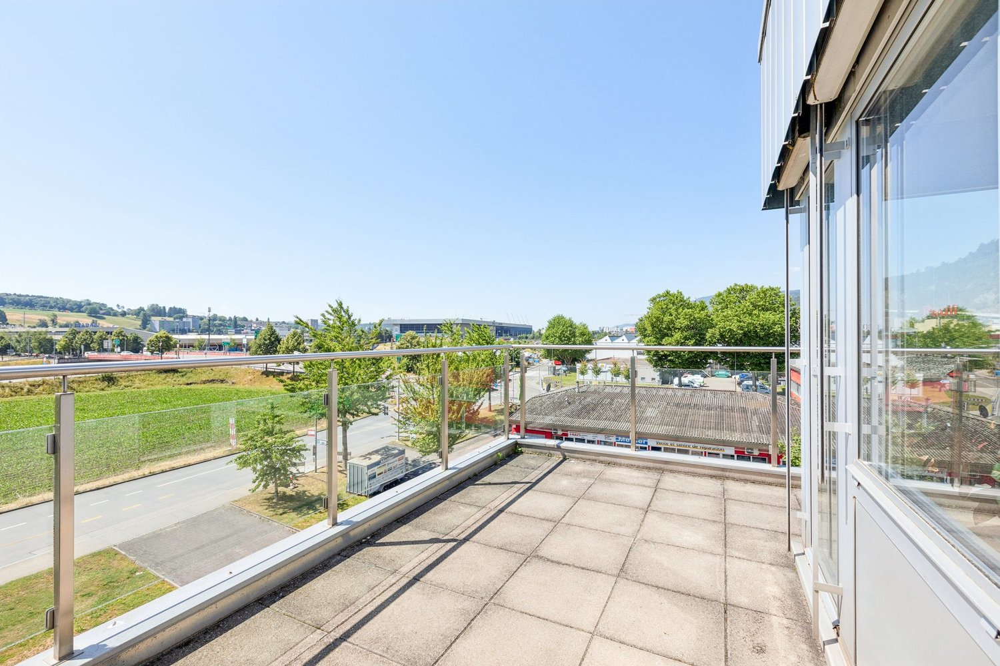
*`09.jpg` — 1500x1000 px*

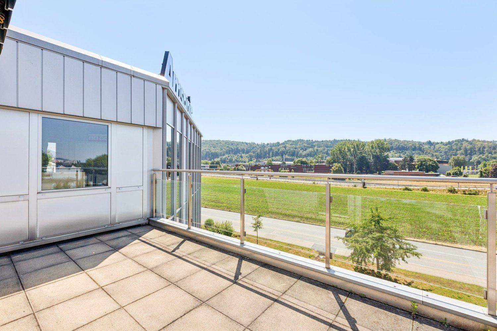
*`10.jpg` — 1500x1000 px*

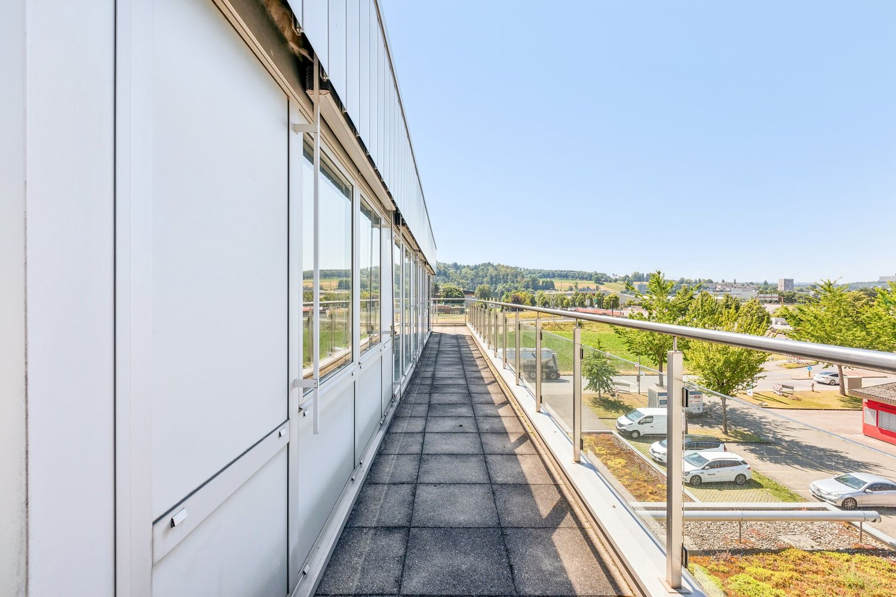
*`11.jpg` — 1500x1000 px*

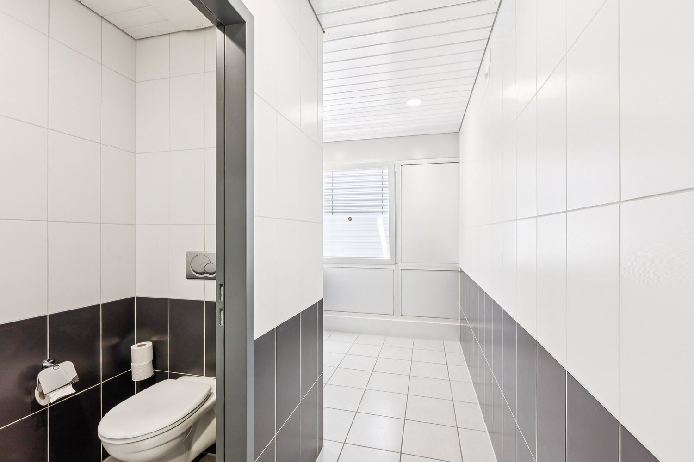
*`12.jpg` — 1500x1000 px*

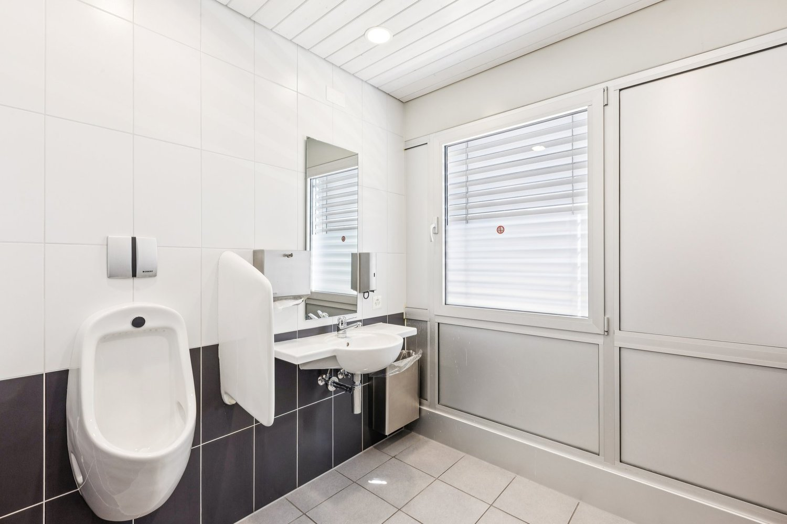
*`13.jpg` — 1500x1000 px*

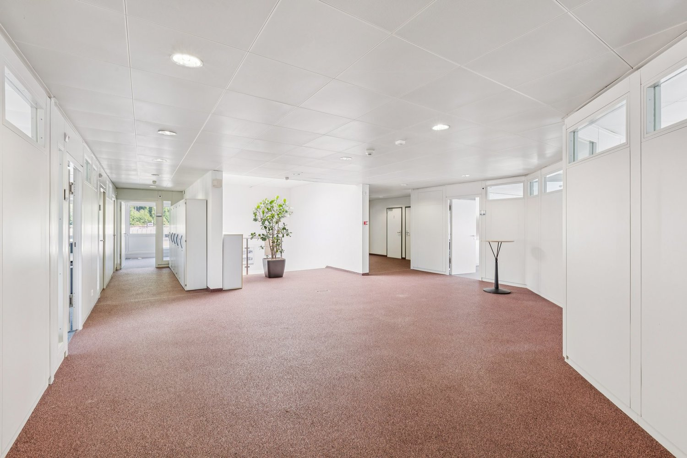
*`14.jpg` — 1500x1000 px*
