# Holzikofenweg 8, 3007 Bern - CHF 6’375

> **Categorie:** `B_buero_gewerbe`  
> **Regiune:** Berna (oraș)  
> **Tip ofertă:** RENT / OFFICE  
> **Sursă:** [flatfox.ch](https://flatfox.ch/de/wohnung/holzikofenweg-8-3007-bern/86149624/)  
> **Descărcat:** 2026-08-17 12:27

## Date obiect

| Câmp | Valoare |
|---|---|
| Adresă | Holzikofenweg 8, 3007 Bern |
| Categorie obiect | INDUSTRY |
| Tip obiect | OFFICE |
| Chirie netă | CHF 5'610 |
| Nebenkosten | CHF 765 |
| Chirie brută | CHF 6'375 |
| Preț afișat | CHF 6'375 |
| Etaj | 3 |
| An renovare | 2022 |
| Disponibil de la | 2026-10-01 |
| Referință | ..vqoxg.4jgvx |

## Texte originale (germană)

**Titlu public:** Holzikofenweg 8, 3007 Bern - CHF 6’375

**Titlu scurt:** Büro

**Pitch:** Büro in Bern mieten

**Titlu descriere:** Repräsentative gestaltbare Bürofläche an Top-Lage in Bern

**Titlu chirie:** Büro in Bern mieten

### Descriere completă

Suchen Sie den perfekten neuen Standort für Ihr Unternehmen? Am Holzikofenweg 8 in Bern erwartet Sie eine hochwertig ausgebaute und helle Bürofläche von 306 m². Dank der flexiblen Trennwände lässt sich die Raumaufteilung optimal an Ihre individuellen Bedürfnisse anpassen – ob Open-Space-Office, Einzelbüros oder kreative Meetingräume. 

**Die Highlights auf einen Blick**

  * **Vollausgestattete Teeküche:** Moderne Küche mit Kochfeld, Geschirrspüler und Kühlschrank – ideal für die Kaffeepause oder das gemeinsame Mittagessen im Team. 

  * **Flexibles Raumkonzept:** Die bestehenden Trennwände können flexibel angepasst oder versetzt werden, um Ihre Wunsch-Struktur zu realisieren. 

  * **Komfort & Licht: ** Die Fensterfronten sorgen für ein helles Arbeitsklima. Die Storen sind teilweise elektrisch bedienbar. 

  * Toiletten auf der gleichen Etage zur Mitbenutzung 

  * **Bezugsbereit:** Die Fläche ist bereits ausgebaut und nach Vereinbarung verfügbar 

**Mietkonditionen im Überblick**

**Nettomiete**

CHF 220.00 / m2 / Jahr 

CHF 5'610.00 pro Monat 

**Heiz- & Nebenkosten (Akonto) **

CHF 30.00 / m2 / Jahr 

CHF 765.00 / Monat 

**Bruttomiete**

CHF 250.00 / m2 / Jahr 

CHF 6'375.00 / Monat 

**Parkplätze:** In der hauseigenen Einstellhalle stehen genügend Parkplätze zur Verfügung. Diese können unkompliziert für **CHF 130.00/Monat** dazu gemietet werden. 

**Lage & Erreichbarkeit **

Das Bürogebäude am Holzikofenweg 8 zeichnet sich durch seine erstklassige und dennoch ruhige Lage in Bern aus. 

  * Hervorragende Anbindung an den öffentlichen Verkehr (Tram/Bus in Gehdistanz). 

  * Der Autobahnanschluss ist in wenigen Minuten erreichbar. 

  * Verpflegungs- und Einkaufsmöglichkeiten für Ihre Mitarbeitenden befinden sich in unmittelbarer Umgebung. 

**Haben wir Ihr Interesse geweckt?**

Vereinbaren Sie noch heute einen Besichtigungstermin und überzeugen Sie sich selbst von den Vorzügen dieser erstklassigen Geschäftsfläche. Wir freuen uns auf Ihre Kontaktaufnahme. 

Bemerkung: Die Aufnahmen zeigen Einrichtungsbeispiele; insbesondere das Beleuchtungskonzept kann vor Ort individuell angepasst werden und von den Bildern abweichen

## Dotări (attributes)

- parkingspace
- lift
- accessiblewithwheelchair

## Ofertant

- **Nume:** Emanuel Immobilien
- **Stradă:** Luzernerstrasse 8
- **NPA:** 6045
- **Localitate:** Meggen

## Imagini (12)

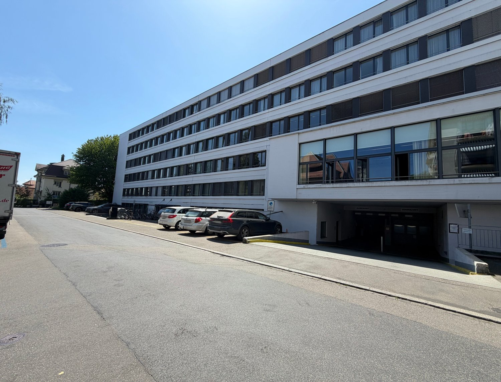
*`01.jpg` — 1500x1145 px*

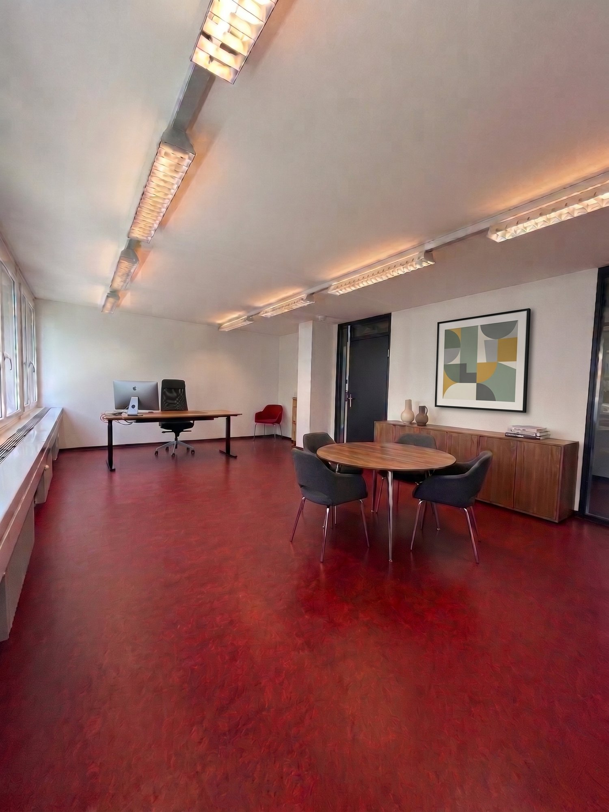
*`02.jpg` — 1500x2000 px*

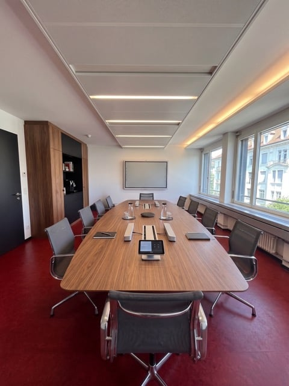
*`03.jpg` — 480x640 px*

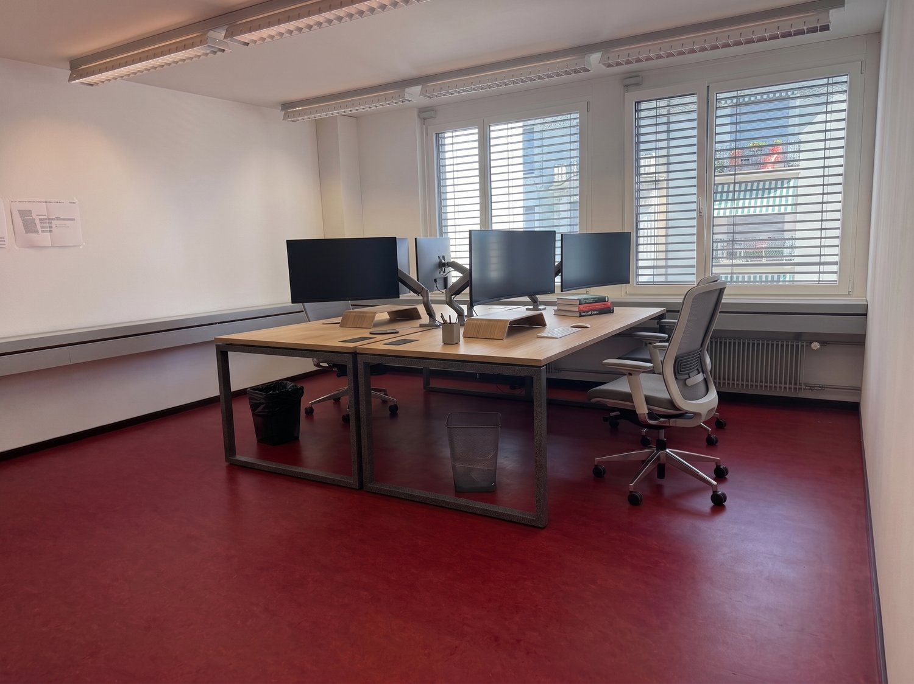
*`04.jpg` — 1500x1124 px*

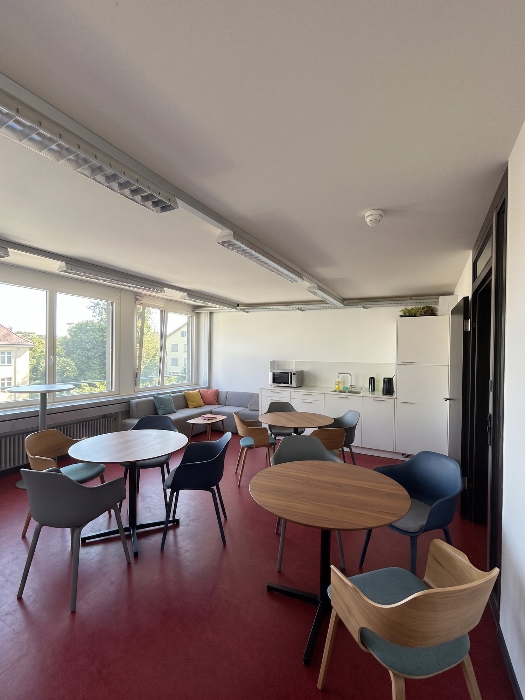
*`05.jpg` — 1500x2000 px*

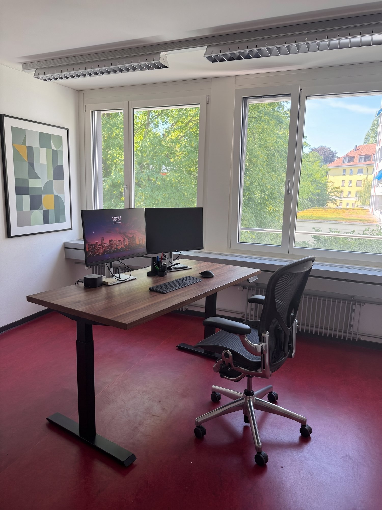
*`06.jpg` — 1500x2000 px*

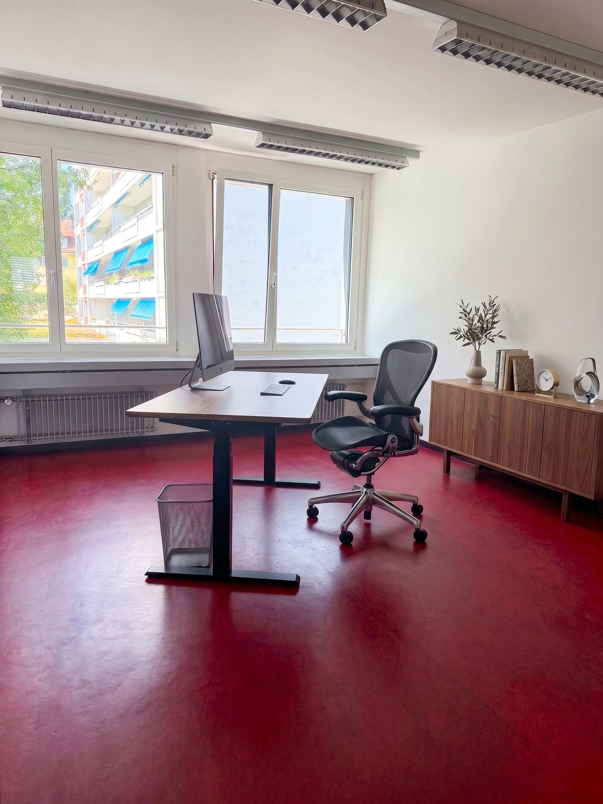
*`07.jpg` — 1500x2000 px*

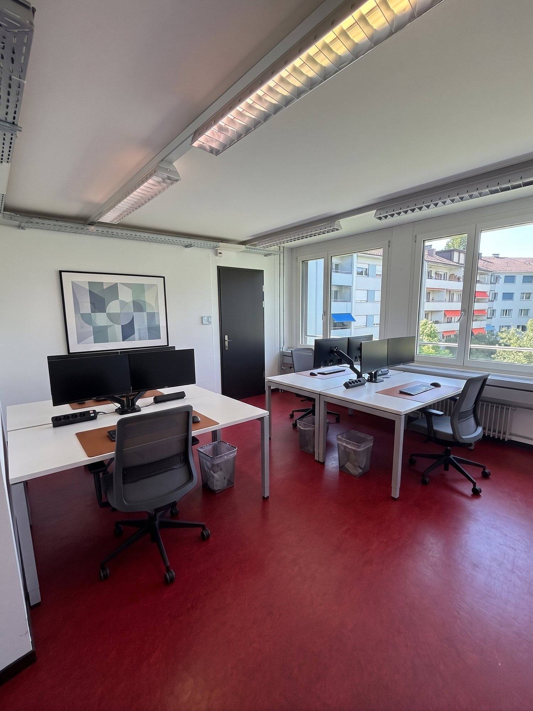
*`08.jpg` — 1500x2000 px*

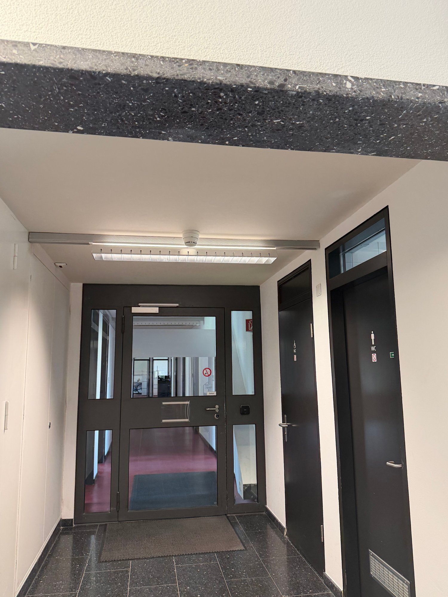
*`09.jpg` — 1500x2000 px*

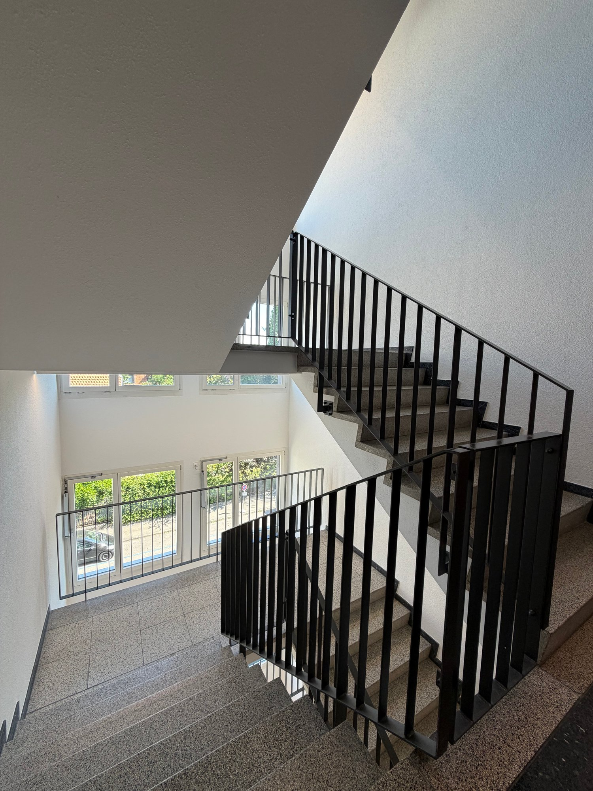
*`10.jpg` — 1500x2000 px*

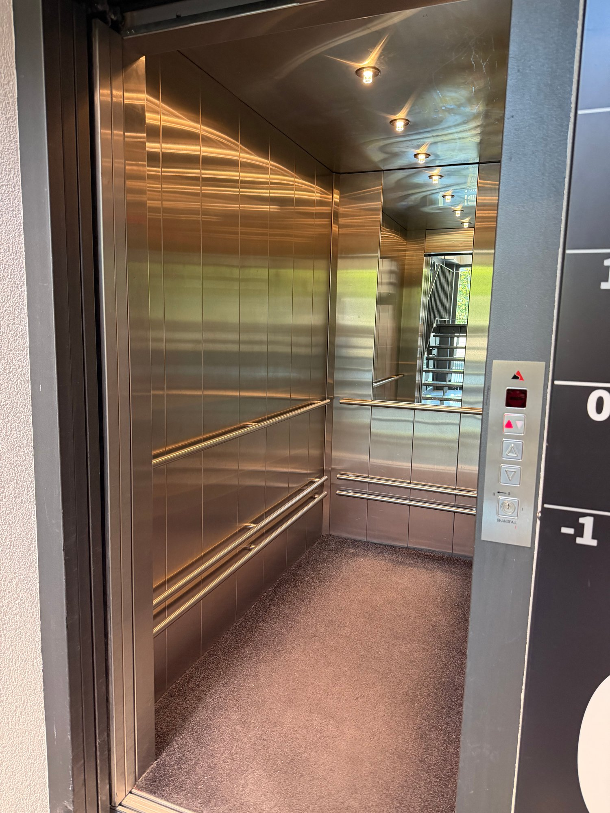
*`11.jpg` — 1500x2000 px*

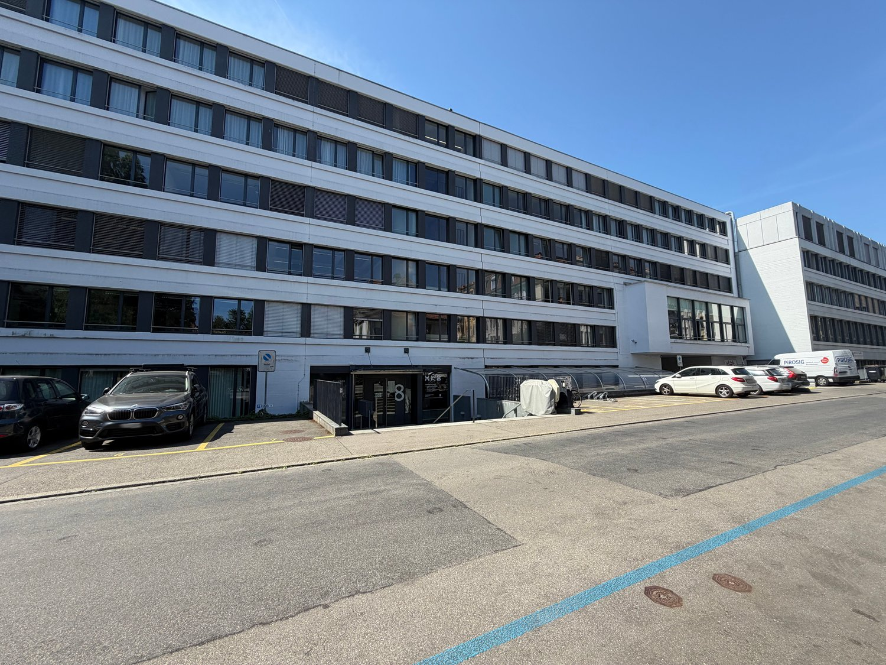
*`12.jpg` — 1500x1125 px*
