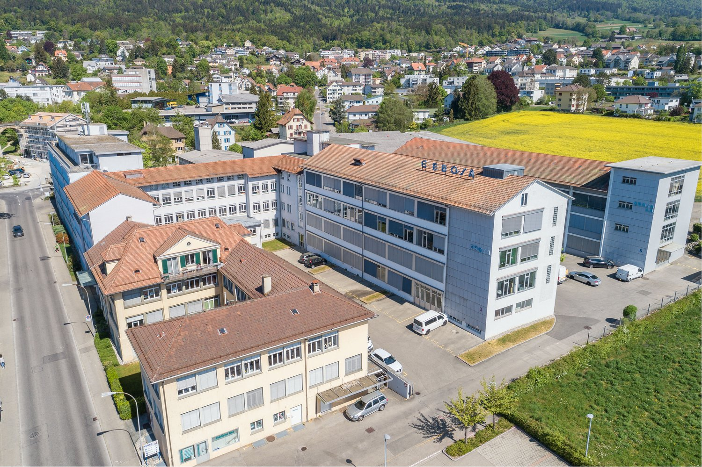
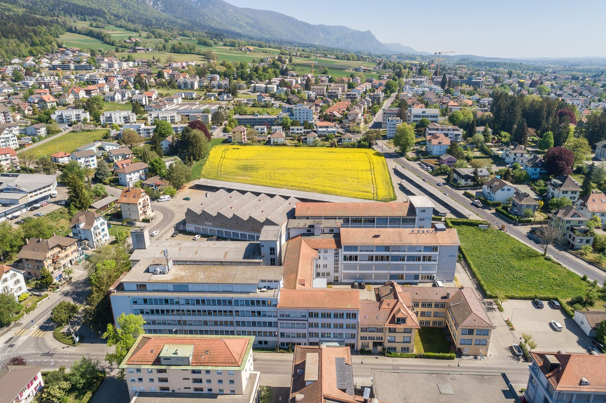
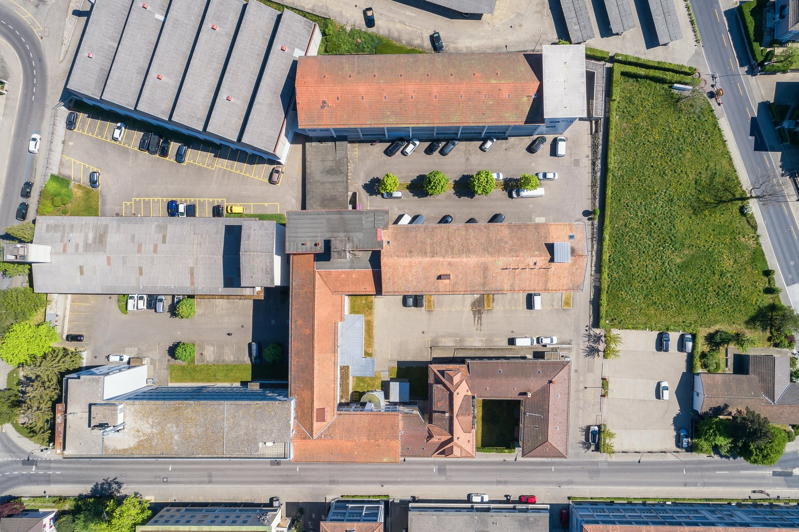
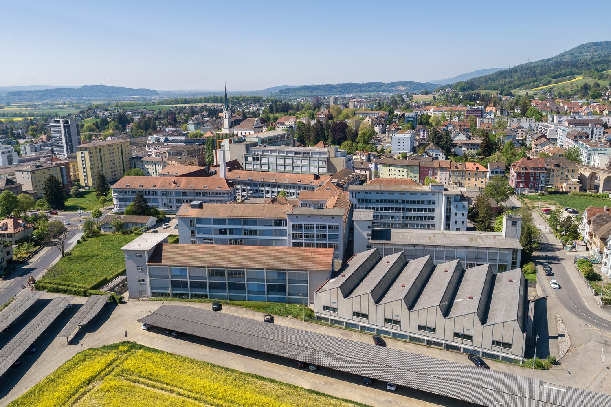
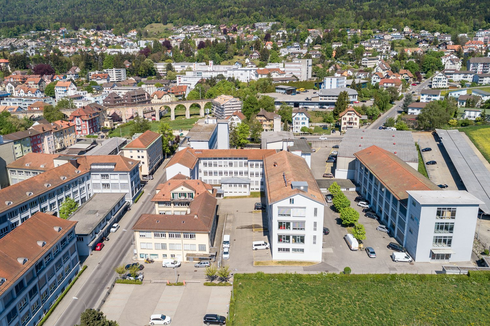
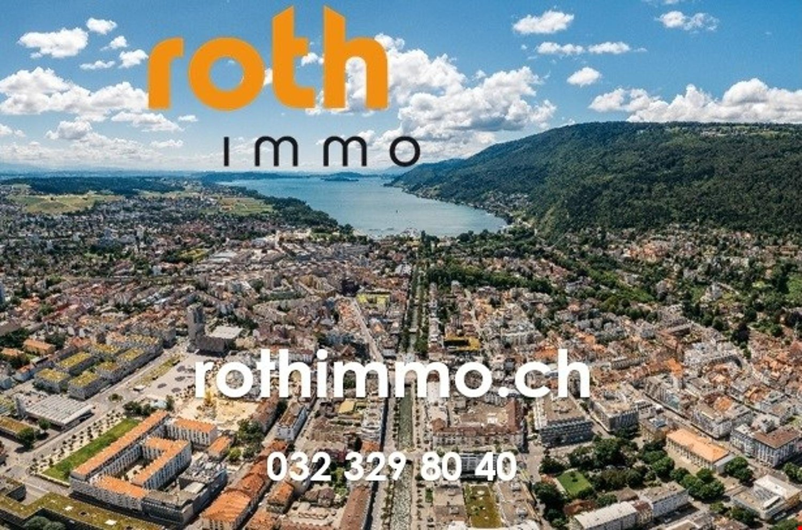

# Kapellstrasse 28, 2540 Grenchen - CHF 1’080

> **Categorie:** `B_buero_gewerbe`  
> **Regiune:** Cantonul Berna  
> **Tip ofertă:** RENT / WORKSHOP  
> **Relevant pentru praxis:** da (praxen)  
> **Sursă:** [flatfox.ch](https://flatfox.ch/de/wohnung/kapellstrasse-28-2540-grenchen/86154452/)  
> **Descărcat:** 2026-08-17 12:30

## Date obiect

| Câmp | Valoare |
|---|---|
| Adresă | Kapellstrasse 28, 2540 Grenchen |
| Categorie obiect | INDUSTRY |
| Tip obiect | WORKSHOP |
| Chirie netă | CHF 840 |
| Nebenkosten | CHF 240 |
| Chirie brută | CHF 1'080 |
| Preț afișat | CHF 1'080 |
| Suprafață utilă | 116 m² |
| Etaj | 2 |
| Disponibil de la | agr |
| Referință | ..aiyy8.ogx4v |

## Texte originale (germană)

**Titlu public:** Kapellstrasse 28, 2540 Grenchen - CHF 1’080

**Titlu scurt:** 116m² Werkstatt

**Pitch:** 116m² Werkstatt in Grenchen mieten

**Titlu descriere:** Werkstatt mit ca. 117m2 im 2. OG

**Titlu chirie:** 116m² Werkstatt in Grenchen mieten

**Spațiu afișat:** 116

### Descriere completă

Das EBOSA-Areal in Grenchen verfügt im Ganzen über 18'000m2 Gewerbeflächen, welche sich für verschiedenste Nutzungen eignen und auch über eine eigene Mensa, welche durch den Verein Netzwerke Grenchen bewirtschaftet wird. 

Zur Zeit vermieten wir eine helle Werkstatt mit ca. **117m2 im 2.Obergeschoss** . Nicht zu unterschätzen ist auch die zentrale Lage des EBOSA-Areals in der Stadt Grenchen. Der Bahnhof der Stadt ist einfach zu Fuss erreichbar. Die Kapellstrasse mündet in die Verkehrsachse Bielstrasse, von welcher aus die Autobahn bequem in 3-4 Minuten zu erreichen ist. Auch ist Grenchen die ideale Umgebung dank des Flughafens und renomierten Unternehmen mit internationaler Bedeutung. 

Weitere Pluspunkt sind: 

  * Nettomietzins CHF 840.00 pro Monat 

  * HK/NK-Akonto CHF 240.00 pro Monat 

  * lichturchflutete Räumlichkeiten 

  * Beleuchtung und Standard-Elektroinstallation installiert 

  * Mitbenützung allg. WC-Anlagen 

  * 2 vollamtliche Hauswarte vor Ort 

  * Besucherparkplätze 

  * im Areal vorhandene Mensa 

  * Parkplätze können dazu gemietet werden 

  * Zentrumsnahe lage 

  * Restaurants, Einkaufsläden, Praxen, usw. in unmittelbarer Nähe 

Gerne stehen wir Ihnen für weitere Auskünfte und/oder einer individuellen Besichtigung zur Verfügung.

## Dotări (attributes)

- parkingspace

## Ofertant

- **Nume:** Roth Immobilien Management
- **Stradă:** Florastrasse 30
- **NPA:** 2500
- **Localitate:** Biel/Bienne

## Imagini (7)

*`01.jpg` — 1500x999 px*

*`02.jpg` — 1500x999 px*

*`03.jpg` — 1500x999 px*

*`04.jpg` — 1500x999 px — Multiple buildings, large parking lot, roads, open field, cars parked in different areas*

*`05.jpg` — 1500x999 px — School building, multiple floors, multiple buildings, large parking lot, solar panels*

*`06.jpg` — 1500x999 px — Aerial view of a town with multiple buildings, parking lots, and a road with cars*

*`07.jpg` — 1500x992 px — Aerial view of a city with buildings, a lake, and a mountain*
