# Bümplizstrasse 111, 3018 Bern - CHF 1’730 inkl. NK pro Monat

> **Categorie:** `B_buero_gewerbe`  
> **Regiune:** Berna (oraș)  
> **Tip ofertă:** RENT / SHOP  
> **Sursă:** [flatfox.ch](https://flatfox.ch/de/wohnung/bumplizstrasse-111-3018-bern/86190525/)  
> **Descărcat:** 2026-08-17 12:35

## Date obiect

| Câmp | Valoare |
|---|---|
| Adresă | Bümplizstrasse 111, 3018 Bern |
| Categorie obiect | INDUSTRY |
| Tip obiect | SHOP |
| Chirie netă | CHF 1'500 |
| Nebenkosten | CHF 230 |
| Chirie brută | CHF 1'730 |
| Preț afișat | CHF 1'730 |
| Etaj | 0 |
| Disponibil de la | 2026-11-01 |
| Referință | 22940.01.403010 |

## Texte originale (germană)

**Titlu public:** Bümplizstrasse 111, 3018 Bern - CHF 1’730 inkl. NK pro Monat

**Titlu scurt:** Ladenfläche

**Pitch:** Ladenfläche in Bern mieten

**Titlu descriere:** Attraktives Büro oder Ladenlokal im Zentrum von Bümpliz zu vermieten

**Titlu chirie:** Ladenfläche in Bern mieten

### Descriere completă

Per 01. November 2026 oder nach Vereinbarung vermieten wir an der beliebten Lage Bachmätteli in Bern-Bümpliz ein vielseitig nutzbares Büro oder Ladenlokal. 

  

Die Räumlichkeiten eignen sich ideal für stilles Gewerbe , beispielsweise als Büro oder ein Ladenlokal. 

  

Ihre Vorteile auf einen Blick: 

  * Heller und gut geschnittener Gewerberaum 
  * Vielseitige Nutzungsmöglichkeiten für stilles Gewerbe 
  * Plattenboden in allem Räumen 
  * WC 
  * Loggia und gemütlichem Gärtchen 
  * Gute Erreichbarkeit mit dem öffentlichen Verkehr und dem Auto 
  * Attraktive Lage im Quartier Bachmätteli 
  * Kundenparkplätze in der Umgebung (Blaue Zone), keine Parkplätze vor der Liegenschaft 

  

Nutzen Sie diese Gelegenheit und verwirklichen Sie Ihre Geschäftsidee an einem attraktiven Standort in Bern-Bümpliz. 

  

**Haben wir Ihr Interesse geweckt?** Gerne stehen wir Ihnen für weitere Auskünfte oder einen Besichtigungstermin zur Verfügung. Wir freuen uns auf Ihre Kontaktaufnahme.

## Dotări (attributes)

- balconygarden

## Ofertant

- **Nume:** Von Graffenried AG Liegenschaften
- **Stradă:** Marktgass-Passage 3
- **NPA:** 3011
- **Localitate:** Bern

## Imagini (11)

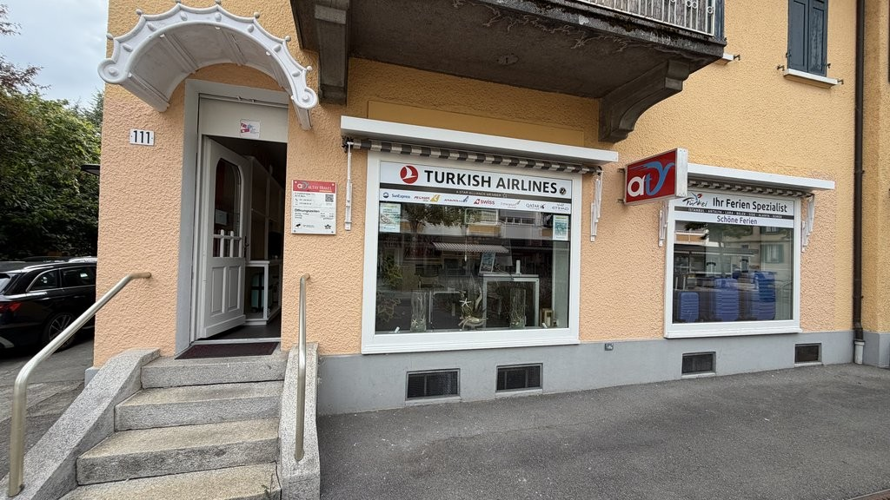
*`01.jpg` — 1024x576 px*

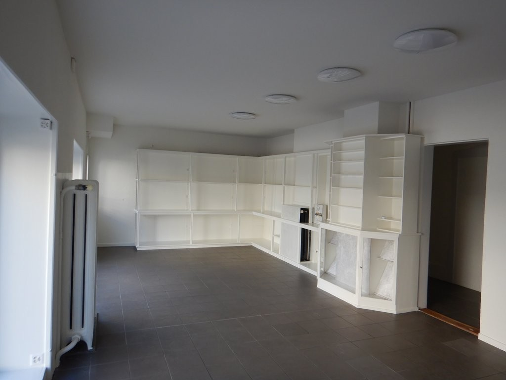
*`02.jpg` — 1024x768 px*

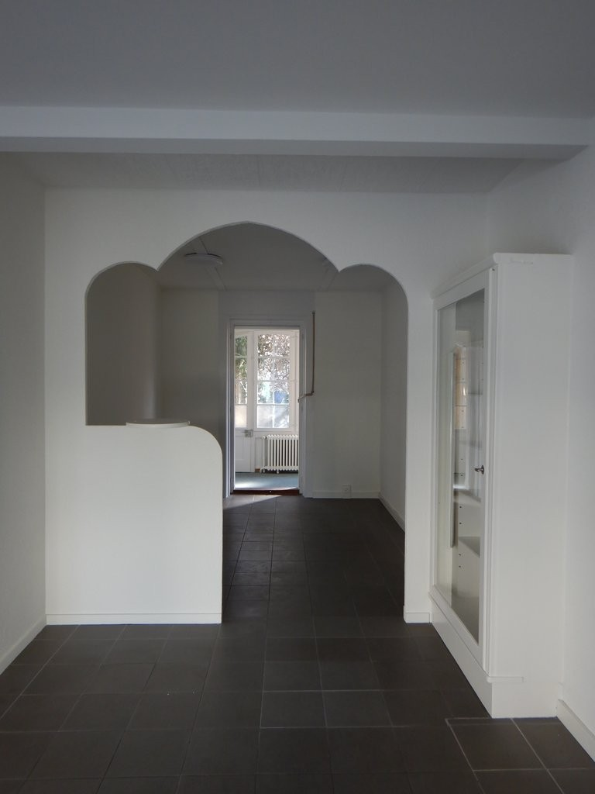
*`03.jpg` — 768x1024 px*

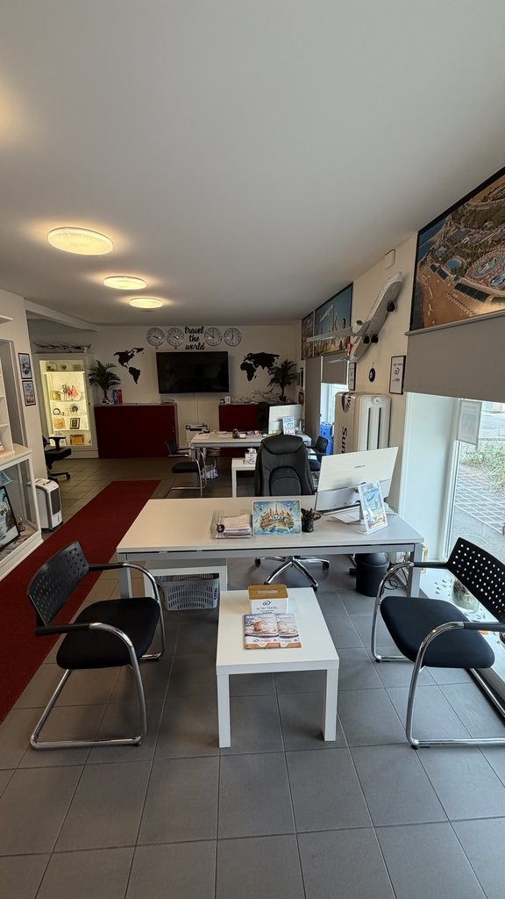
*`04.jpg` — 576x1024 px*

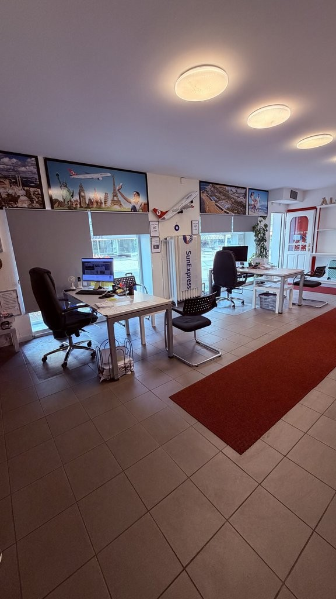
*`05.jpg` — 576x1024 px*

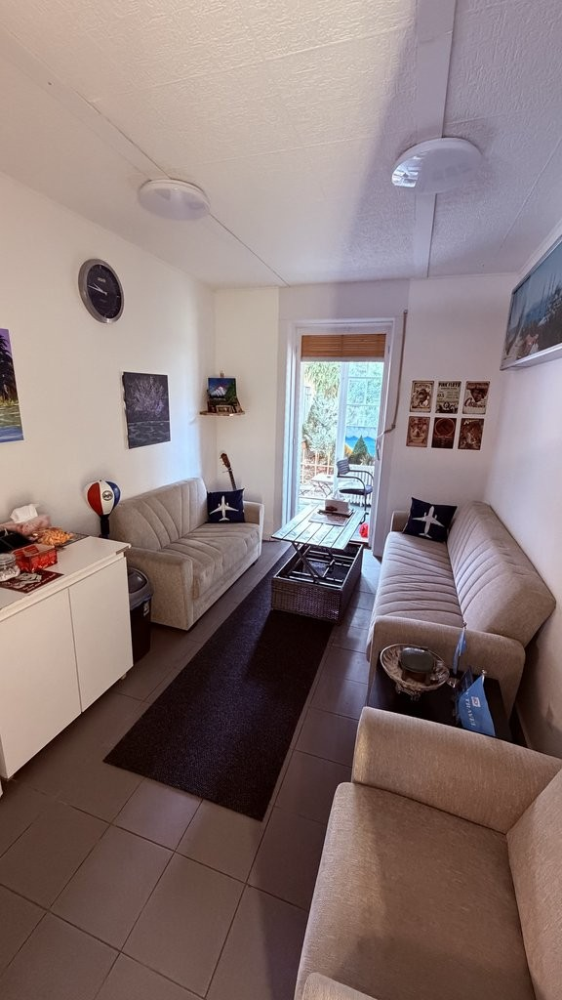
*`06.jpg` — 576x1024 px*

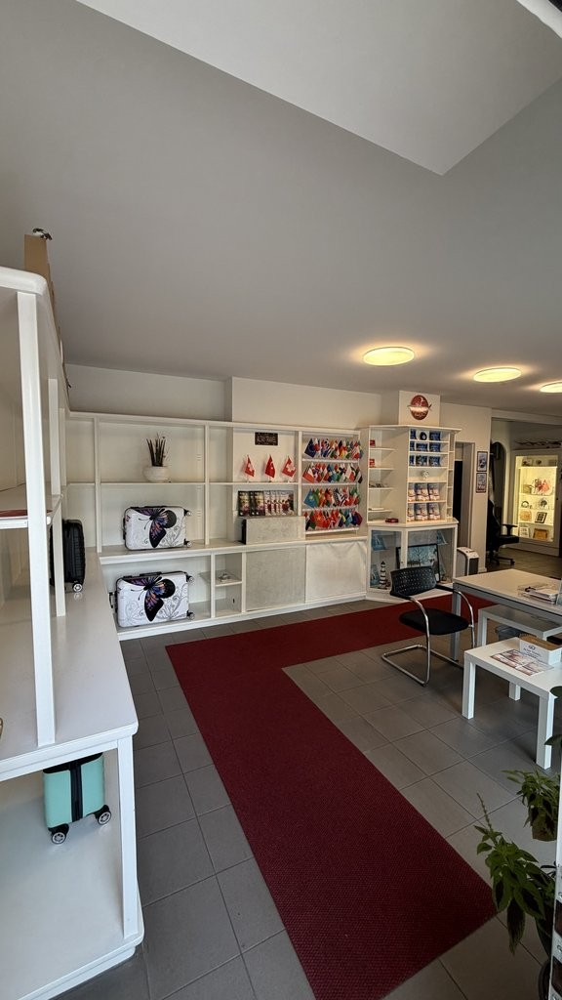
*`07.jpg` — 576x1024 px*

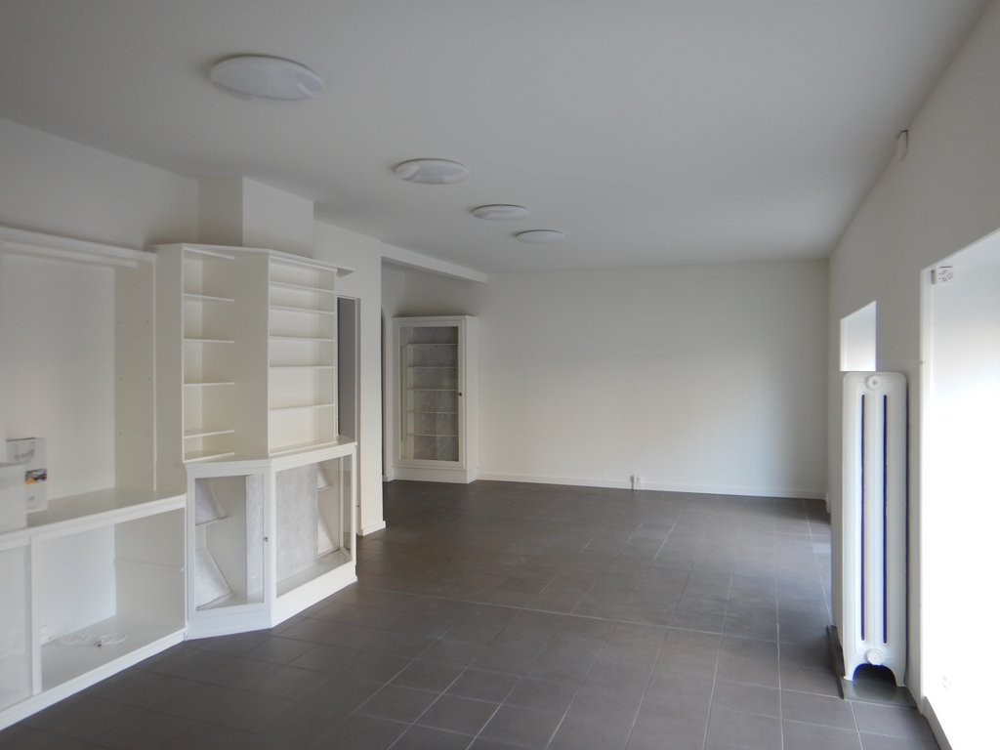
*`08.jpg` — 1024x768 px*

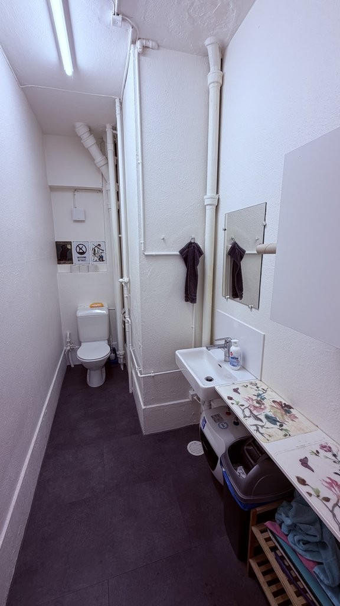
*`09.jpg` — 576x1024 px*

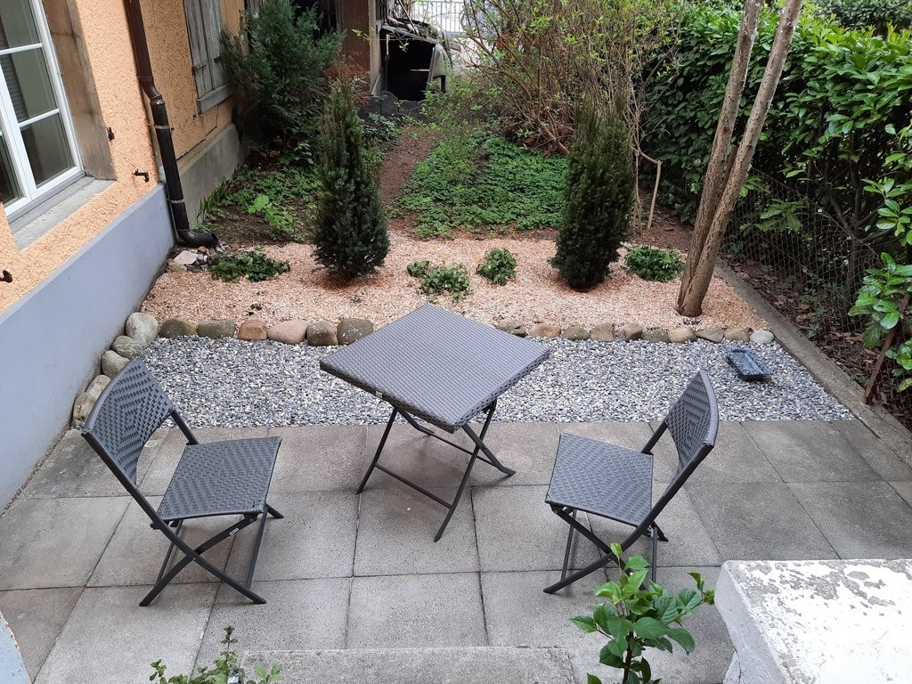
*`10.jpg` — 1024x768 px*

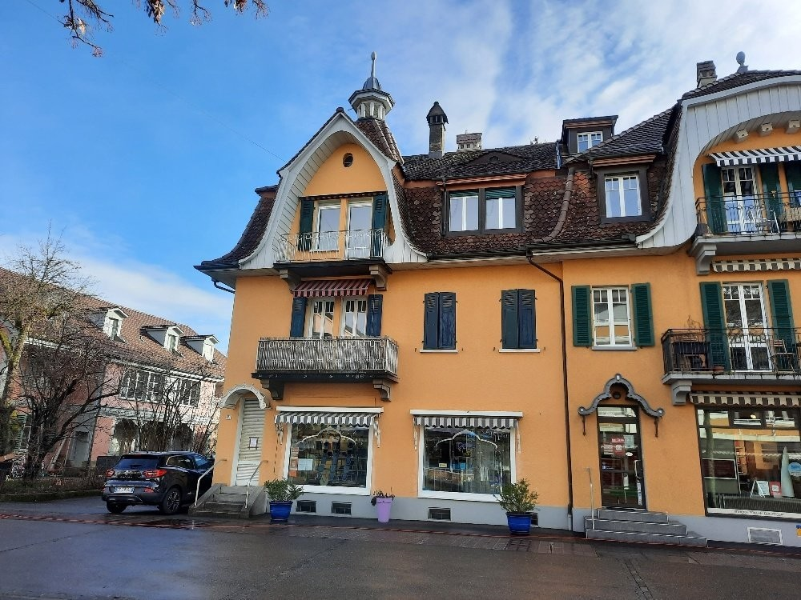
*`11.jpg` — 1000x750 px*
