# Schläflistrasse 14, 3013 Bern - CHF 358 inkl. NK pro m² / Jahr

> **Categorie:** `B_buero_gewerbe`  
> **Regiune:** Berna (oraș)  
> **Tip ofertă:** RENT / OFFICE  
> **Sursă:** [flatfox.ch](https://flatfox.ch/de/wohnung/schlaflistrasse-14-3013-bern/86190533/)  
> **Descărcat:** 2026-08-17 12:31

## Date obiect

| Câmp | Valoare |
|---|---|
| Adresă | Schläflistrasse 14, 3013 Bern |
| Categorie obiect | INDUSTRY |
| Tip obiect | OFFICE |
| Chirie netă | CHF 330 |
| Nebenkosten | CHF 28 |
| Chirie brută | CHF 358 |
| Preț afișat | CHF 358 |
| Suprafață utilă | 80 m² |
| Etaj | 0 |
| Disponibil de la | imm |
| Referință | 26640.02.400000 |

## Texte originale (germană)

**Titlu public:** Schläflistrasse 14, 3013 Bern - CHF 358 inkl. NK pro m² / Jahr

**Titlu scurt:** 80m² Büro

**Pitch:** 80m² Büro in Bern mieten

**Titlu descriere:** Gewerberaum inkl. Garage und eigenem Vorplatz zu vermieten

**Titlu chirie:** 80m² Büro in Bern mieten

**Spațiu afișat:** 80

### Descriere completă

Die sehr zentral gelegene Liegenschaft befindet sich im Breitenrainquartier in Bern. Unmittelbar in der Nähe befindet sich der Viktoriaplatz, verschiedene Restaurants und Einkaufsmöglichkeiten sowie die Bus- und Tramstation "Viktoriaplatz" der Linien 10 und Tram 9.   
  
Wir vermieten an der Optingenstrasse 37/Schläflistrasse 14 folgende Gewerberäumlichkeiten:   
  
\- Offene Fläche   
\- kleine Küche mit Geschirrspüler   
\- WC mit Lavabo   
\- Reduit   
\- Eigener Vorplatz   
\- Eigene Garage   
\- Waschküche kann mitbenutzt werden   
  
Haben wir Ihr Interesse geweckt? Dann freuen wir uns über Ihre Kontaktanfrage.

## Ofertant

- **Nume:** Von Graffenried AG Liegenschaften
- **Stradă:** Marktgass-Passage 3
- **NPA:** 3011
- **Localitate:** Bern

## Imagini (12)

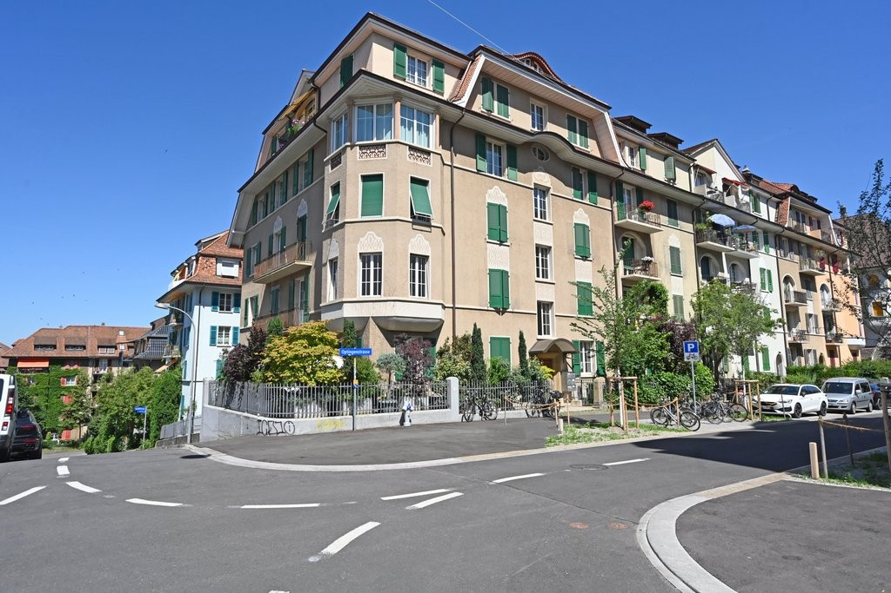
*`01.jpg` — 1024x683 px — DSC_4083.JPG*

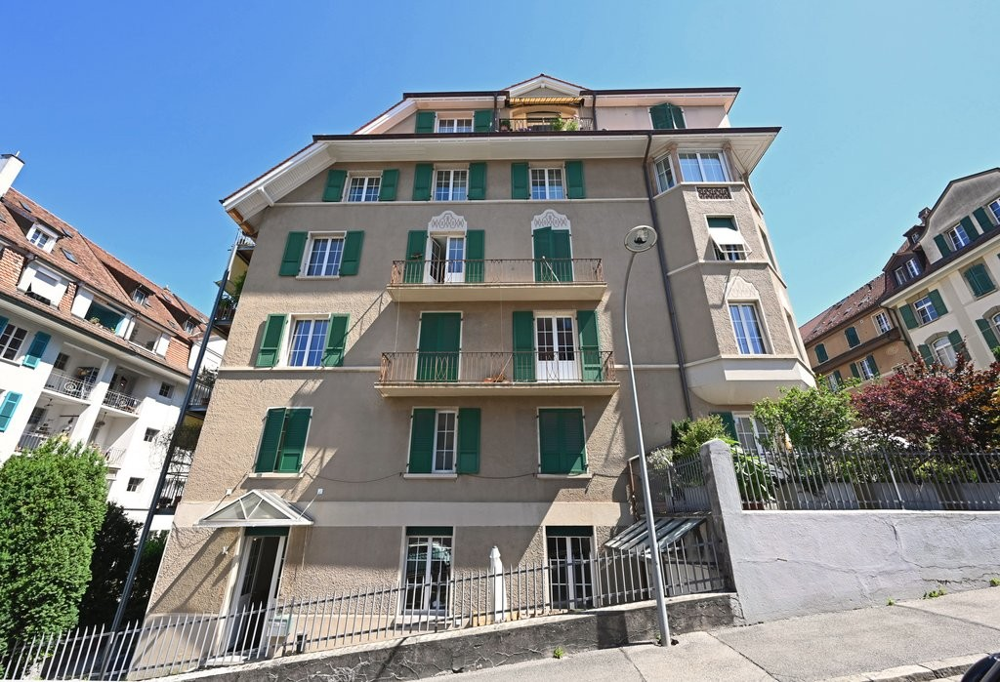
*`02.jpg` — 1024x699 px — DSC_3969.JPG*

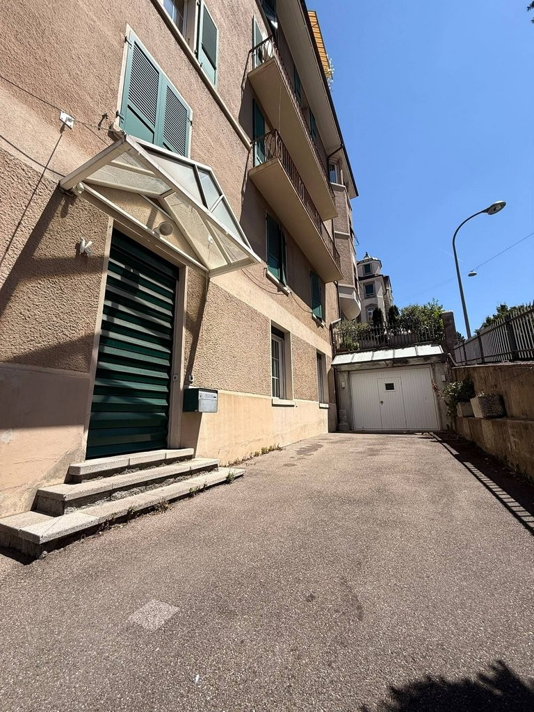
*`03.jpg` — 768x1024 px — b1a216d0-a53c-4846-aed9-0bb787089593.jpg*

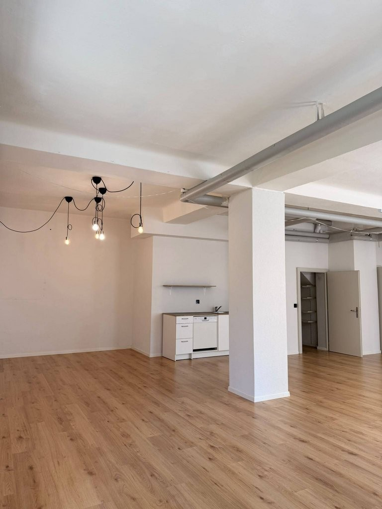
*`04.jpg` — 768x1024 px — dff35532-b090-4d93-834a-3ba95bc53c7a.jpg*

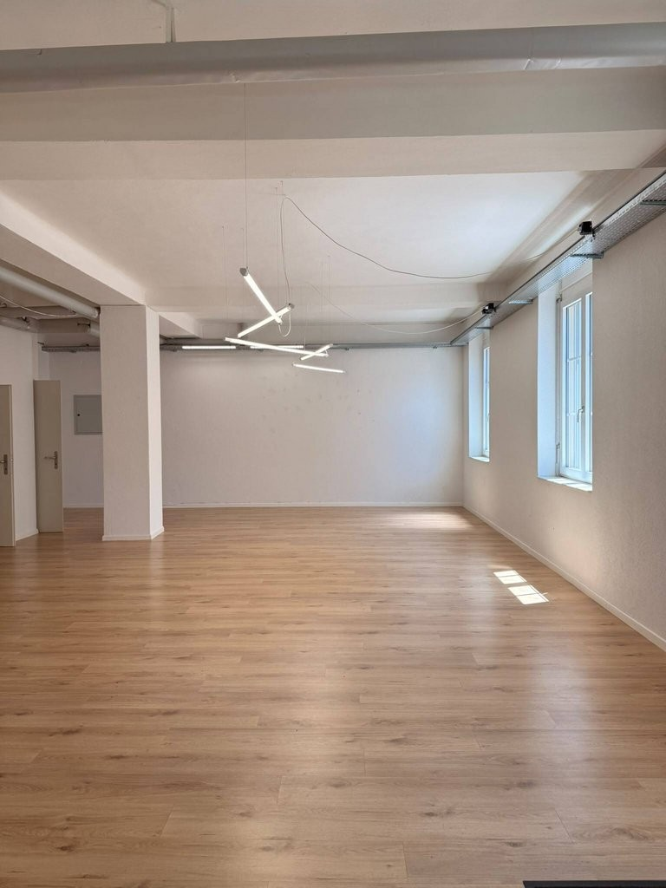
*`05.jpg` — 768x1024 px — c47aee61-9f7d-4a2e-a1bc-9bf70b5e0c4d.jpg*

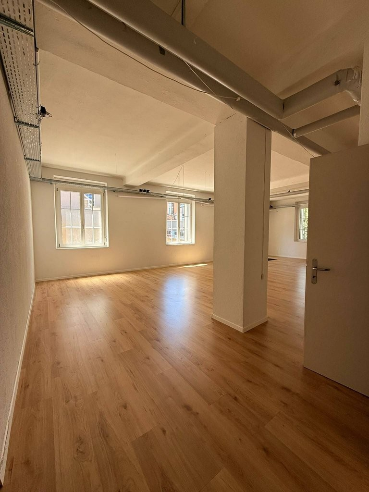
*`06.jpg` — 768x1024 px — 86f1e691-2464-4095-b1b2-92b5b053b9a8.jpg*

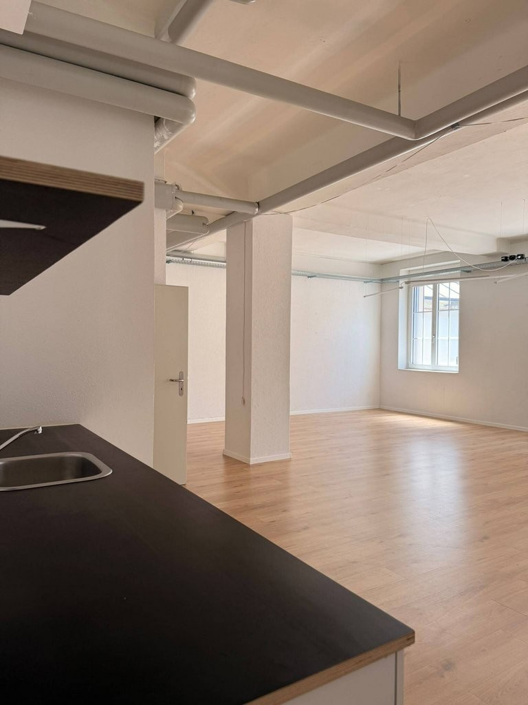
*`07.jpg` — 768x1024 px — 8d0b8a80-1e32-4d4c-8056-5ccf73b80d73.jpg*

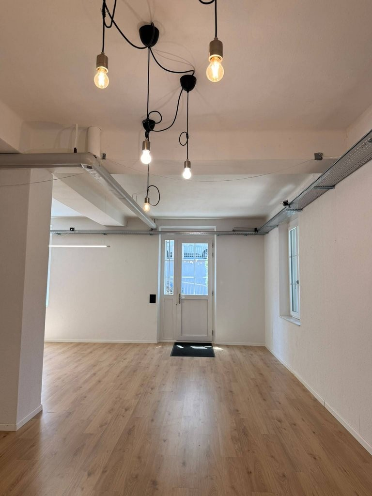
*`08.jpg` — 768x1024 px — 7d06e219-c5c9-4e87-b2e4-c5e19bfcc3a1.jpg*

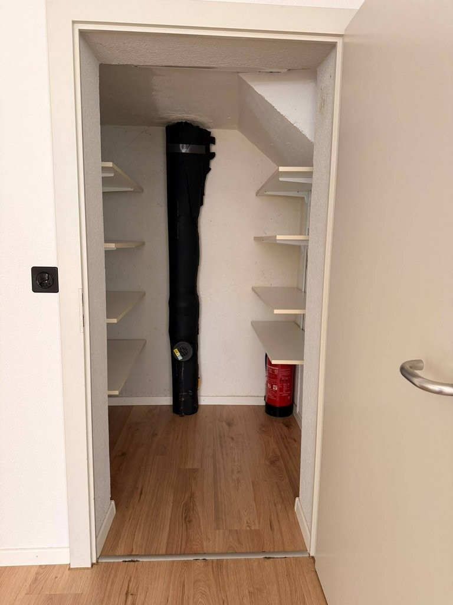
*`09.jpg` — 768x1024 px — e1ac7dd1-f519-4548-91ee-6c90eeba001d.jpg*

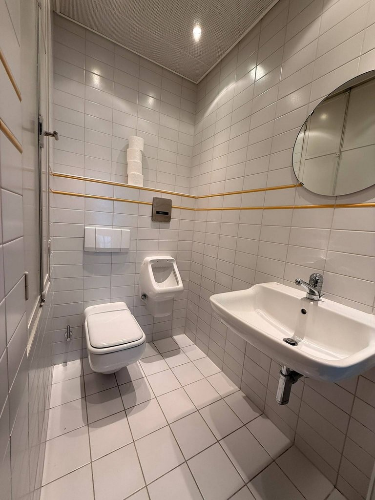
*`10.jpg` — 768x1024 px — cbed7e33-02e2-48b5-9cf4-d0f903b19349.jpg*

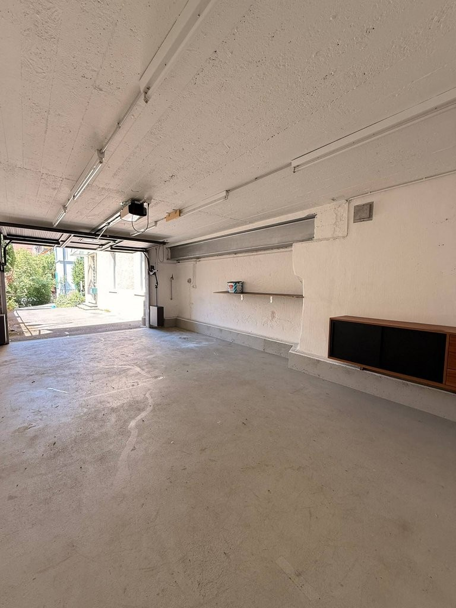
*`11.jpg` — 768x1024 px — cb89e825-067e-42a8-add1-fee0e2d235f3.jpg*

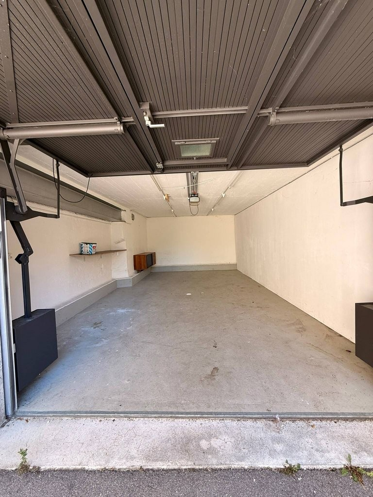
*`12.jpg` — 768x1024 px — 6659d1f9-2dc1-4960-baa6-0234234152a6.jpg*
