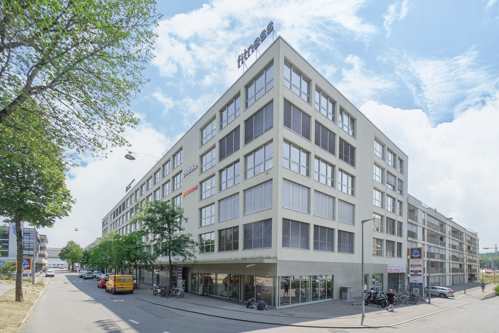
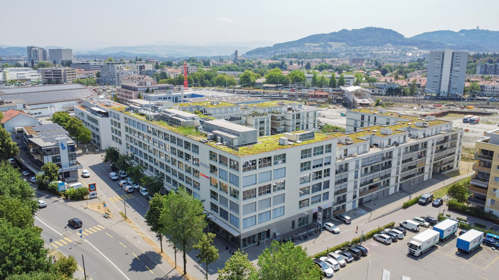
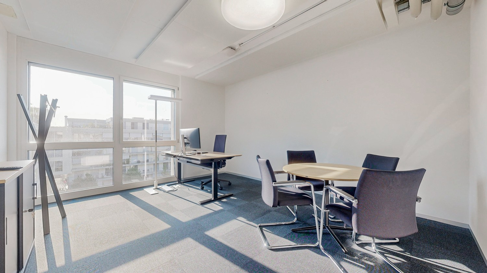
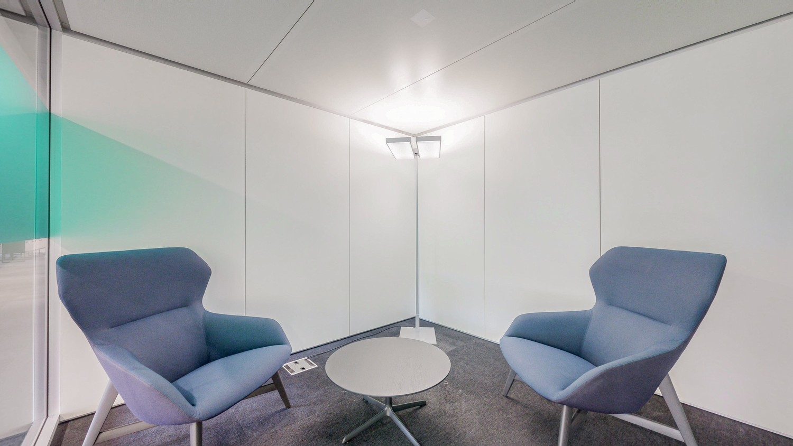
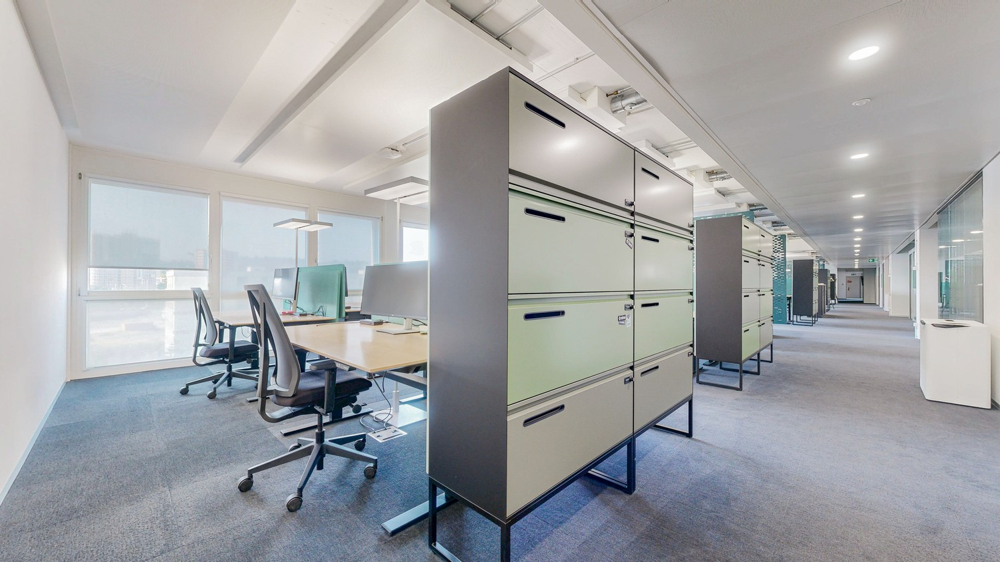
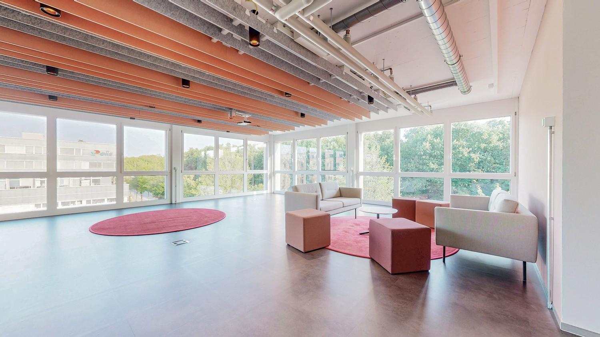
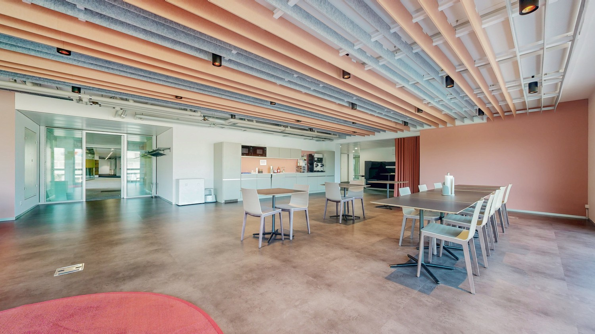
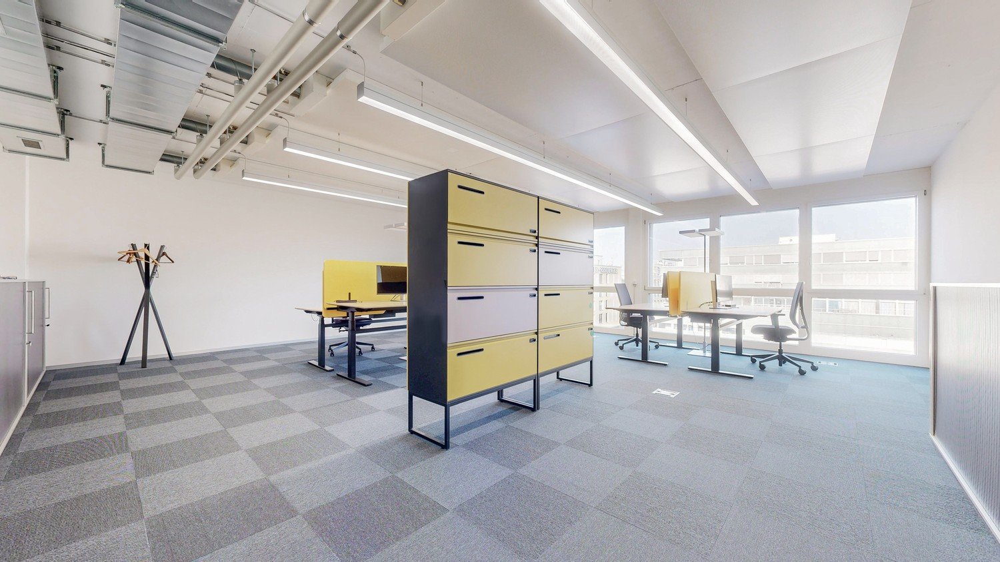
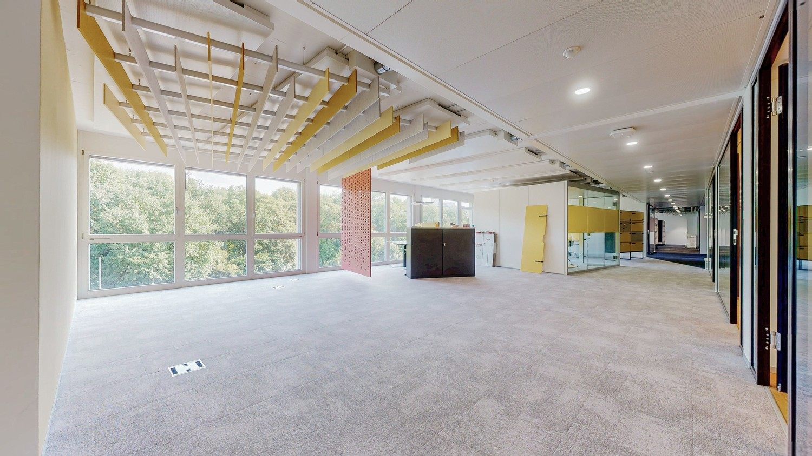
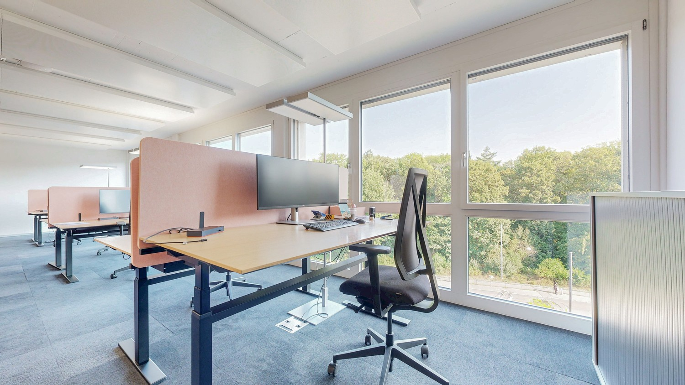

# Murtenstrasse 143, 3008 Bern - CHF 220 exkl. NK pro m² / Jahr

> **Categorie:** `B_buero_gewerbe`  
> **Regiune:** Berna (oraș)  
> **Tip ofertă:** RENT / OFFICE  
> **Sursă:** [flatfox.ch](https://flatfox.ch/de/wohnung/murtenstrasse-143-3008-bern/86197041/)  
> **Descărcat:** 2026-08-17 12:28

## Date obiect

| Câmp | Valoare |
|---|---|
| Adresă | Murtenstrasse 143, 3008 Bern |
| Categorie obiect | INDUSTRY |
| Tip obiect | OFFICE |
| Chirie netă | CHF 220 |
| Preț afișat | CHF 220 |
| Suprafață utilă | 1068 m² |
| Disponibil de la | agr |
| Referință | LB.003.BRN |

## Texte originale (germană)

**Titlu public:** Murtenstrasse 143, 3008 Bern - CHF 220 exkl. NK pro m² / Jahr

**Titlu scurt:** 1068m² Büro

**Pitch:** 1068m² Büro in Bern mieten

**Titlu descriere:** Moderne, lichtdurchflutete Bürofläche an zentraler Lage

**Titlu chirie:** 1068m² Büro in Bern mieten

**Spațiu afișat:** 1068

### Descriere completă

An attraktiver Lage an der Murtenstrasse 143 in Bern wird eine helle, vollständig ausgebaute Bürofläche zur **Nachmiete oder Untermiete** angeboten. Die Fläche ist **auf Vereinbarung bezugsbereit**, überzeugt durch ihre grosszügige, tageslichtdurchflutete Raumgestaltung und ist dank ihrer zentralen Lage hervorragend erschlossen.  
  
**Eckdaten**  
**Objekt / Standort**  
Murtenstrasse 143, 3008 Bern  
**Geschoss**  
4\. Obergeschoss  
**Fläche**  
1068 m²  
**Nutzung**  
Bürofläche  
**Verfügbarkeit**  
nach Vereinbarung  
**Mietzins**  
CHF 220 p.a./m²  
**Nebenkosten**  
ca. CHF 24 p.a./m²  
**Parkplätze**  
auf Anfrage  
  
**Ausstattung & Eigenschaften**  
  

*   **Lichtdurchflutet:** Grosszügige Fensterfronten sorgen für viel Tageslicht und ein angenehmes, produktives Arbeitsumfeld.
*   **Zentral gelegen:** Optimale Anbindung an den öffentlichen Verkehr sowie kurze Wege zu Verpflegungs-, Einkaufs- und Dienstleistungsangeboten in unmittelbarer Umgebung.
*   **Bezugsbereit:** Die Fläche kann ohne Umbau- oder Wartezeit unmittelbar bezogen werden.
*   **Ausgebaut:** Bestehender, hochwertiger Ausbau (z. B. Bodenbeläge, Beleuchtung, Trennwände, Teeküche, Serverraum) bereit für den direkten Betrieb.

**Vertragsmodalitäten**  
Gesucht wird ein **Nachmieter oder Untermieter**. Die Konditionen sind flexibel gestaltbar:  
  

*   **Mietdauer:** befristet oder unbefristet, nach Absprache.
*   **Vertrag:** Übernahme des bestehenden Mietvertrags oder Neuabschluss möglich
*   **Ausbau & Flächen:** individuelle Anpassungen und Erweiterungen verhandelbar
*   **Übernahme:** bestehendes Mobiliar / Ausbau optional übernehmbar

Gerne vereinbaren wir mit Ihnen eine unverbindliche Besichtigung.  
Helvetia Service AG

## Dotări (attributes)

- parkingspace
- garage
- lift
- accessiblewithwheelchair

## Imagini (10)

*`01.jpg` — 1500x1002 px*

*`02.jpg` — 1500x844 px*

*`03.jpg` — 1500x844 px*

*`04.jpg` — 1500x844 px*

*`05.jpg` — 1500x844 px*

*`06.jpg` — 1500x844 px*

*`07.jpg` — 1500x844 px*

*`08.jpg` — 1500x844 px*

*`09.jpg` — 1500x844 px*

*`10.jpg` — 1500x844 px*

## Media suplimentară

- **tour_url:** https://my.matterport.com/show/?m=wkXhSnhYTgk
