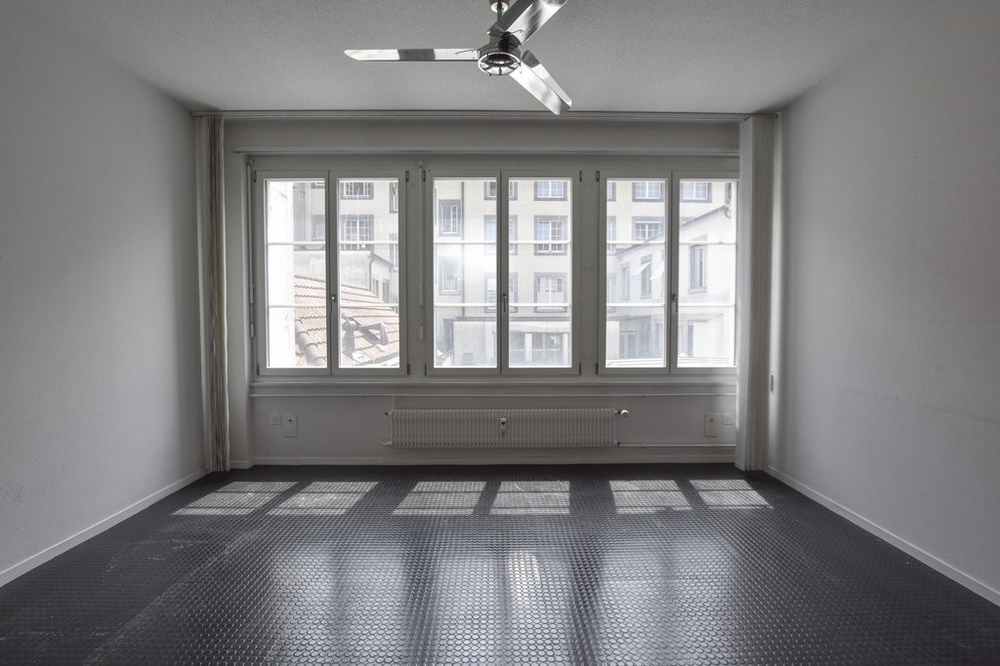
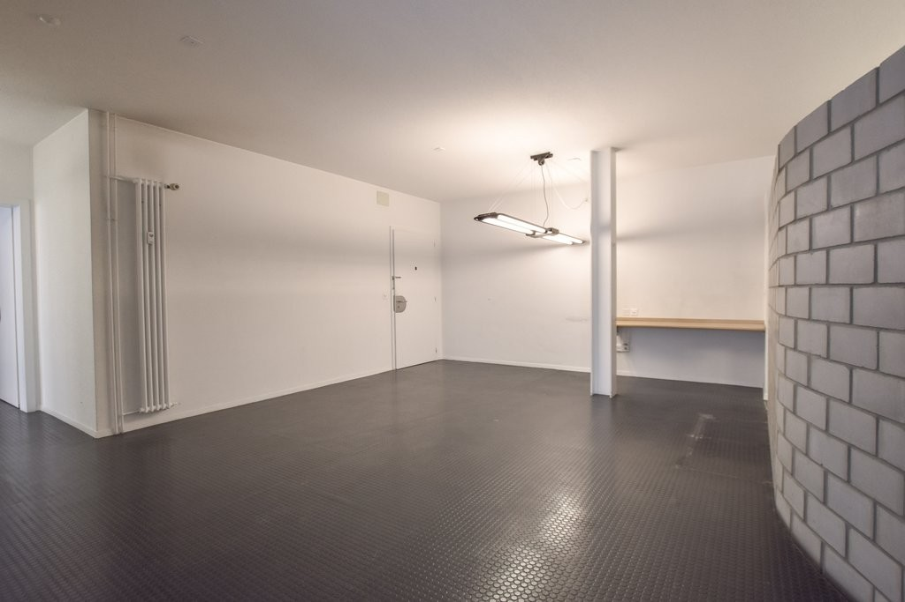
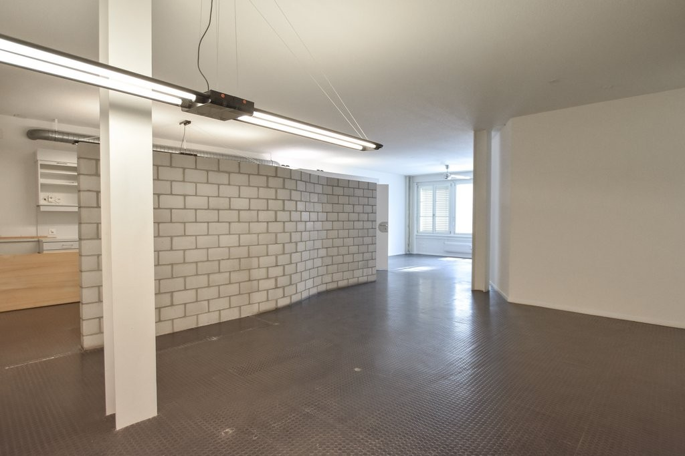
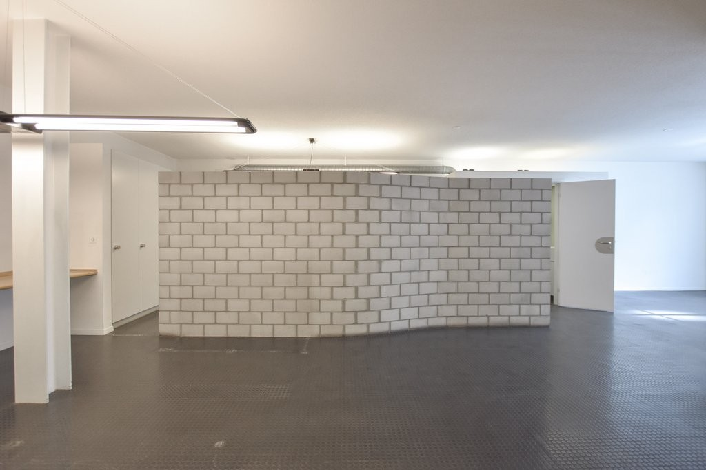
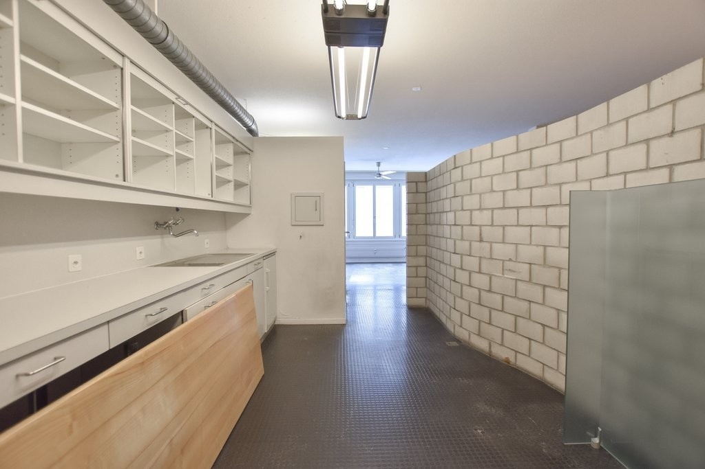
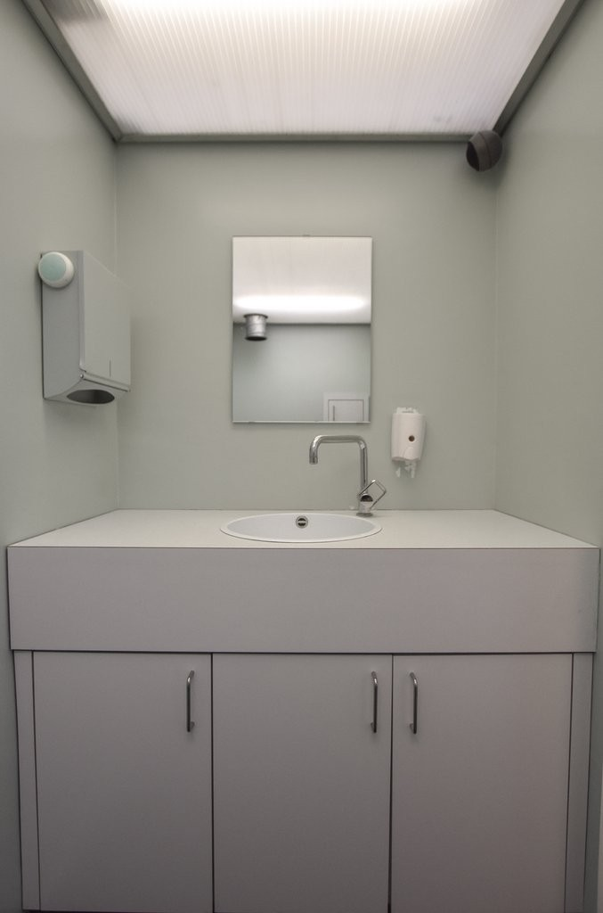
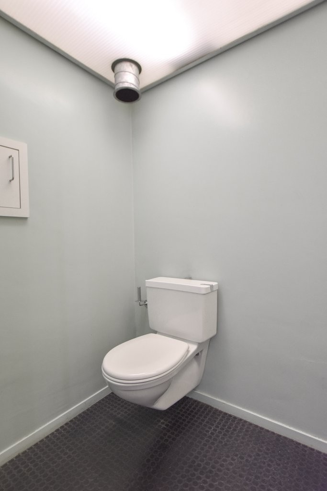
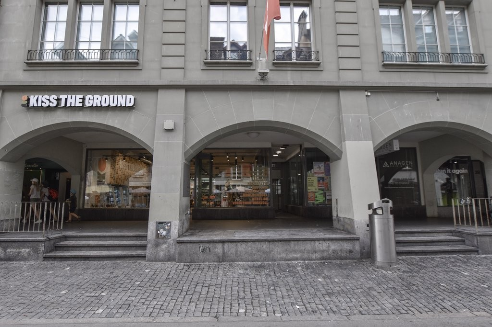
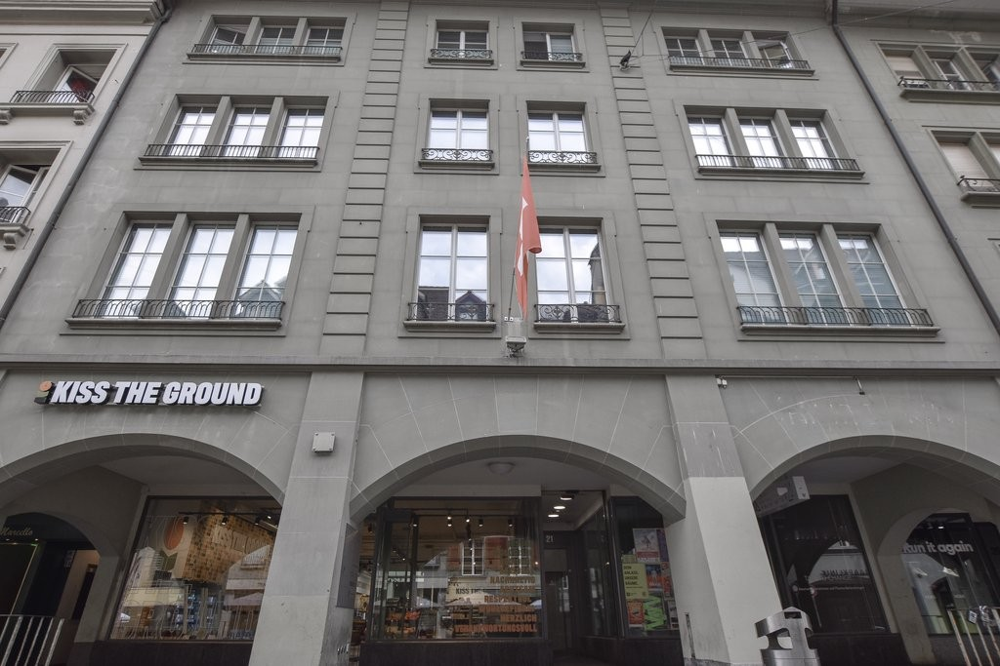

# Aarbergergasse 21, 3011 Bern - CHF 2’890 inkl. NK pro Monat

> **Categorie:** `B_buero_gewerbe`  
> **Regiune:** Berna (oraș)  
> **Tip ofertă:** RENT / COMMERCIAL  
> **Relevant pentru praxis:** da (praxis)  
> **Sursă:** [flatfox.ch](https://flatfox.ch/de/wohnung/aarbergergasse-21-3011-bern/86210400/)  
> **Descărcat:** 2026-08-17 12:26

## Date obiect

| Câmp | Valoare |
|---|---|
| Adresă | Aarbergergasse 21, 3011 Bern |
| Categorie obiect | INDUSTRY |
| Tip obiect | COMMERCIAL |
| Chirie netă | CHF 2'550 |
| Nebenkosten | CHF 340 |
| Chirie brută | CHF 2'890 |
| Preț afișat | CHF 2'890 |
| Suprafață utilă | 133 m² |
| Etaj | 2 |
| Disponibil de la | agr |
| Referință | 28410.01.0201 |

## Texte originale (germană)

**Titlu public:** Aarbergergasse 21, 3011 Bern - CHF 2’890 inkl. NK pro Monat

**Titlu scurt:** 133m² Gewerbe

**Pitch:** 133m² Gewerbe in Bern mieten

**Titlu descriere:** Attraktive Gewerbefläche an zentraler Lage in Bern

**Titlu chirie:** 133m² Gewerbe in Bern mieten

**Spațiu afișat:** 133

### Descriere completă

An der Aarbergergasse 21 in Bern vermieten wir per sofort oder nach Vereinbarung eine vielseitig nutzbare Gewerbefläche an zentraler Lage. 

  

Die Fläche mit rund 133 m2 liegt im 2. Obergeschoss (Personenaufzug vorhanden) und eignet sich für unterschiedlichste Nutzungen - sei es als Büro, Praxis, Atelier, Showroom, Studio oder für andere gewerbliche Konzepte. Lagerräumlichkeiten im Untergeschoss sind vorhanden und können bei Bedarf separat dazu gemietet werden. 

  

Dank der flexiblen Gestaltungsmöglichkeiten können die Räumlichkeiten individuell auf Ihre Bedürfnisse abgestimmt werden. 

  

**Ihre Vorteile auf einen Blick:**

  * Zentrale Lage in der Berner Innenstadt 
  * Nur 5 Gehminuten vom Hauptbahnhof Bern entfernt 
  * Individuell nutzbare Gewerbefläche 
  * Vielseitige Einsatzmöglichkeiten 
  * Attraktives Umfeld mit guter Infrastruktur sowie zahlreichen Restaurants, Einkaufsmöglichkeiten und Dienstleistungen in unmittelbarer Nähe 

  

Der ausgeschriebene Mietzins gilt bei einer Übernahme der Gewerbefläche im heutigen Ausbaustandard. Individuelle Anpassungen oder Ausbauten können nach Absprache realisiert werden. Umfang und Ausführung der gewünschten Arbeiten werden gemeinsam definiert und entsprechend bei der Festlegung des Mietzinses berücksichtigt. 

  

Nutzen Sie diese Gelegenheit und verwirklichen Sie Ihr Geschäftskonzept an einem hervorragend erschlossenen Standort! 

  

Wir freuen uns auf Ihre Kontaktaufnahme.

## Dotări (attributes)

- lift

## Ofertant

- **Nume:** Previs Vorsorge
- **Stradă:** Brückfeldstrasse 16
- **NPA:** 3001
- **Localitate:** Bern

## Imagini (9)

*`01.jpg` — 1024x683 px — DSC_0184.jpg*

*`02.jpg` — 1024x683 px — DSC_0206.jpg*

*`03.jpg` — 1024x683 px — DSC_0178.jpg*

*`04.jpg` — 1024x683 px — DSC_0182.jpg*

*`05.jpg` — 1024x683 px — DSC_0187.jpg*

*`06.jpg` — 677x1024 px — DSC_0204.jpg*

*`07.jpg` — 683x1024 px — DSC_0194.jpg*

*`08.jpg` — 1024x683 px — DSC_0266.jpg*

*`09.jpg` — 1024x683 px — DSC_0263.jpg*

## Media suplimentară

- **website_url:** http://www.previs-immobilien.ch
