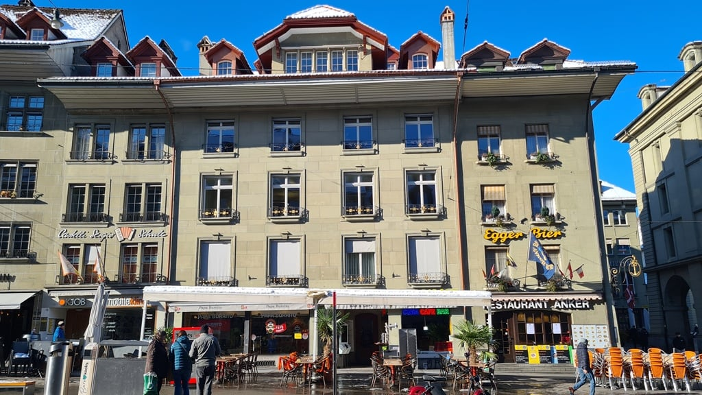
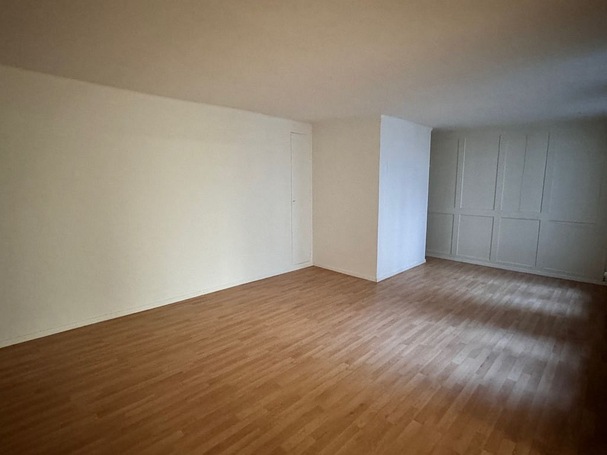
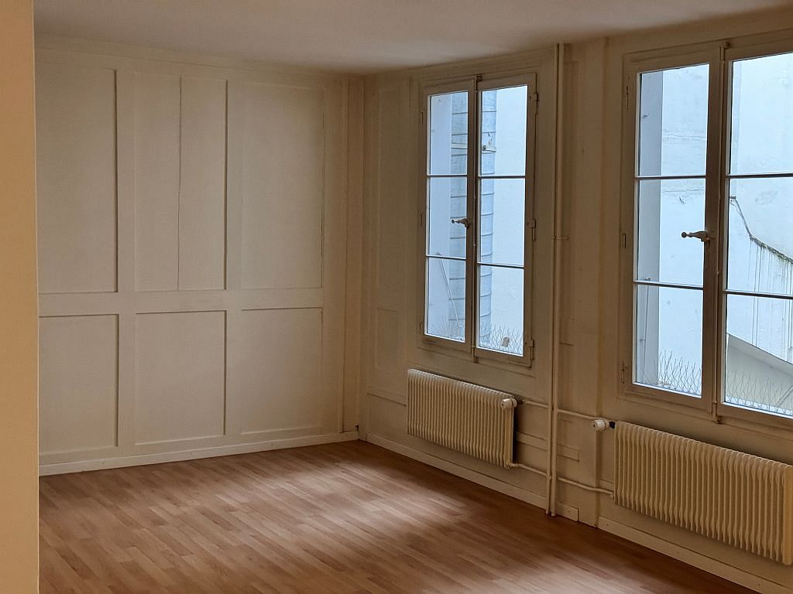
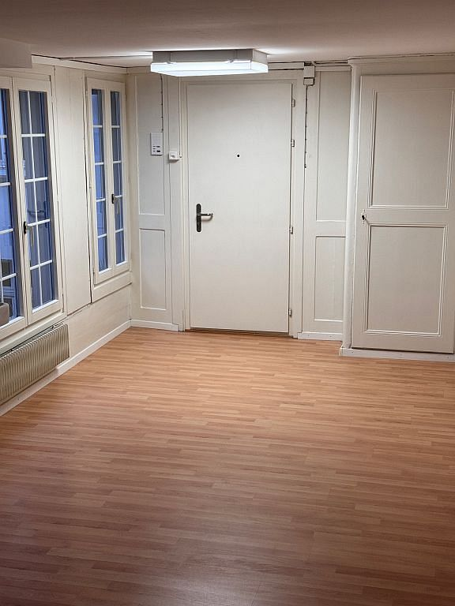

# Kornhausplatz 14, 3011 Bern - CHF 312

> **Categorie:** `B_buero_gewerbe`  
> **Regiune:** Berna (oraș)  
> **Tip ofertă:** RENT / ATELIER  
> **Relevant pentru praxis:** da (praxisraum)  
> **Sursă:** [flatfox.ch](https://flatfox.ch/de/wohnung/kornhausplatz-14-3011-bern/86212866/)  
> **Descărcat:** 2026-08-17 12:35

## Date obiect

| Câmp | Valoare |
|---|---|
| Adresă | Kornhausplatz 14, 3011 Bern |
| Categorie obiect | INDUSTRY |
| Tip obiect | ATELIER |
| Chirie netă | CHF 277 |
| Nebenkosten | CHF 35 |
| Chirie brută | CHF 312 |
| Preț afișat | CHF 312 |
| Suprafață utilă | 41 m² |
| Etaj | 3 |
| Disponibil de la | 2027-02-01 |
| Referință | .104170.430010 |

## Texte originale (germană)

**Titlu public:** Kornhausplatz 14, 3011 Bern - CHF 312

**Titlu scurt:** 41m² Atelier

**Pitch:** 41m² Atelier in Bern mieten

**Titlu descriere:** Atelier, 3. Stock

**Titlu chirie:** 41m² Atelier in Bern mieten

**Spațiu afișat:** 41

### Descriere completă

Die Liegenschaft befindet sich an sehr zentraler Lage. Verkehrstechnisch ist die Liegenschaft optimal gelegen: die Haltestellen der öffentlichen Verkehrsmittel befinden sich in unmittelbarer Nähe zur Liegenschaft - der Hauptbahnhof ist nur ein paar Gehminuten entfernt. Einkaufsmöglichkeiten in Filialen von Grossverteilern und in Spezialgeschäften sind vor Ort und bequem zu Fuss erreichbar.   
Atelier / Therapie- oder Praxisraum mit Laminatböden. Eigenes WC vorhanden. Es handelt sich im Inserat um Beispielbilder.

## Dotări (attributes)

- lift

## Ofertant

- **Nume:** Robert Pfister AG
- **Stradă:** Neuengasse 17
- **NPA:** 3011
- **Localitate:** Bern

## Imagini (4)

*`01.jpg` — 1024x576 px — Liegenschaft*

*`02.jpg` — 1024x768 px — Bild 1*

*`03.jpg` — 1024x768 px — Bild 2*

*`04.jpg` — 576x768 px — Bild 3*
