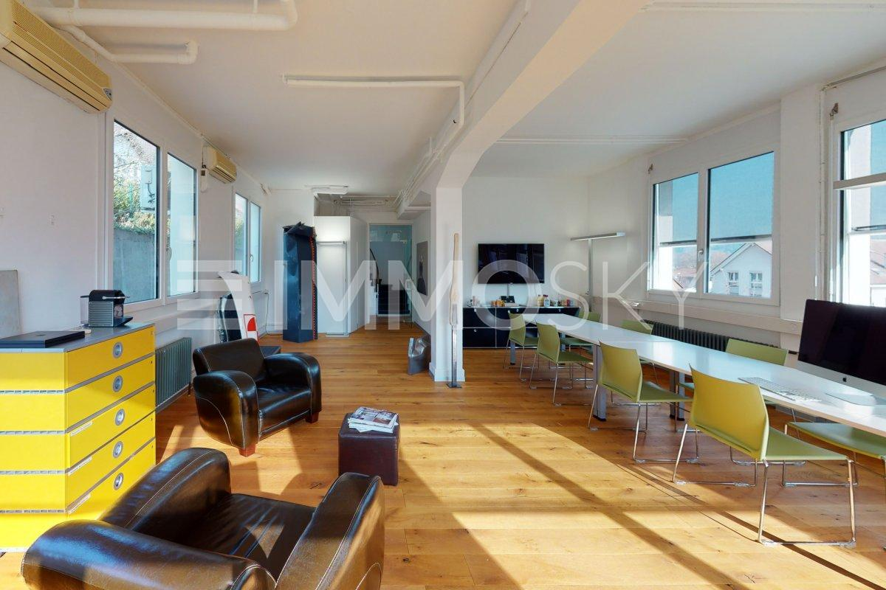
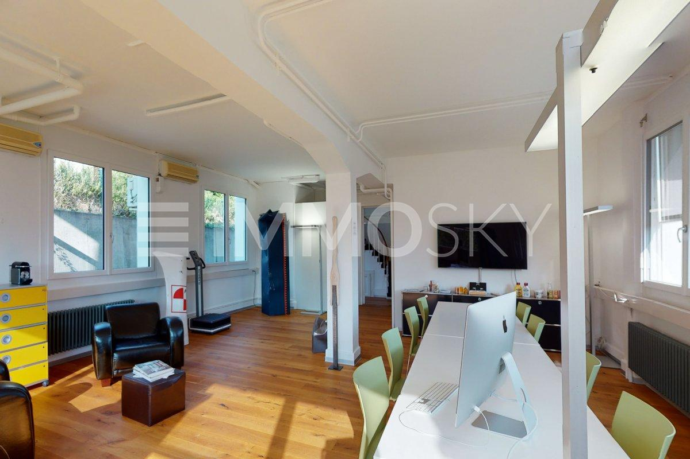
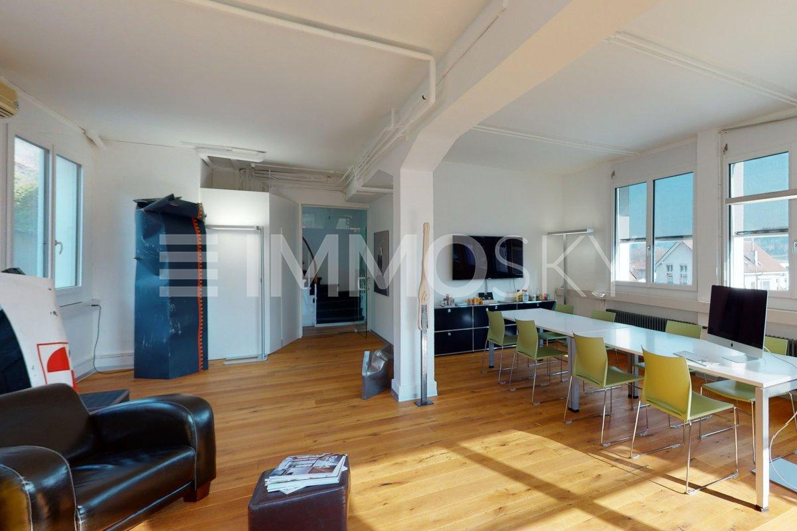
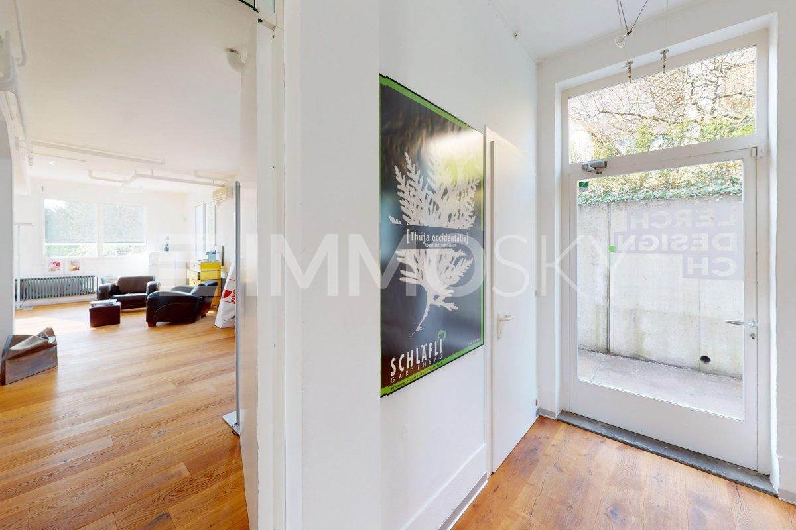
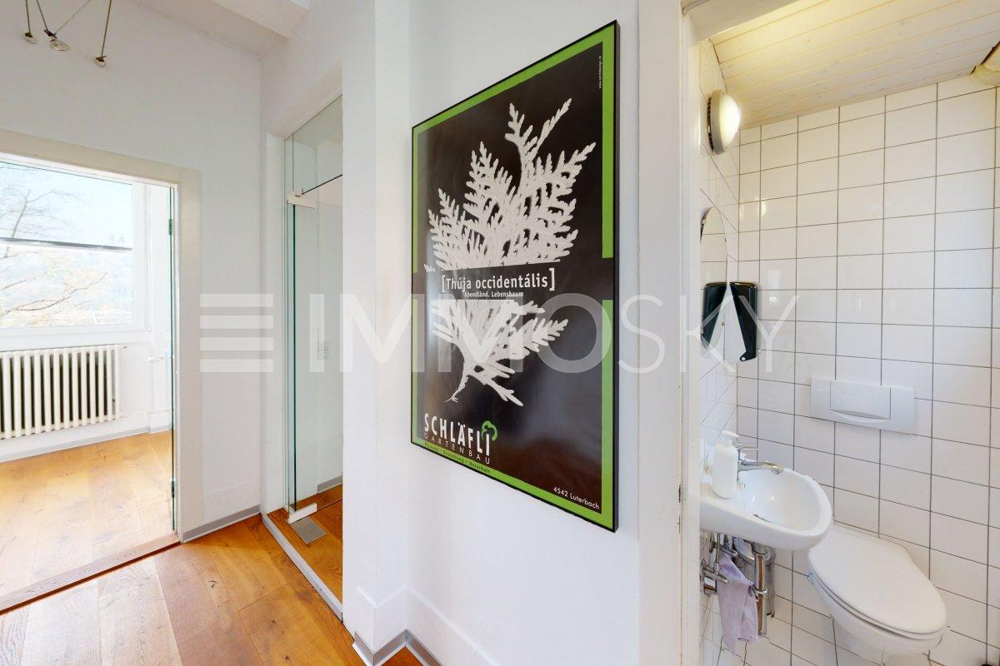
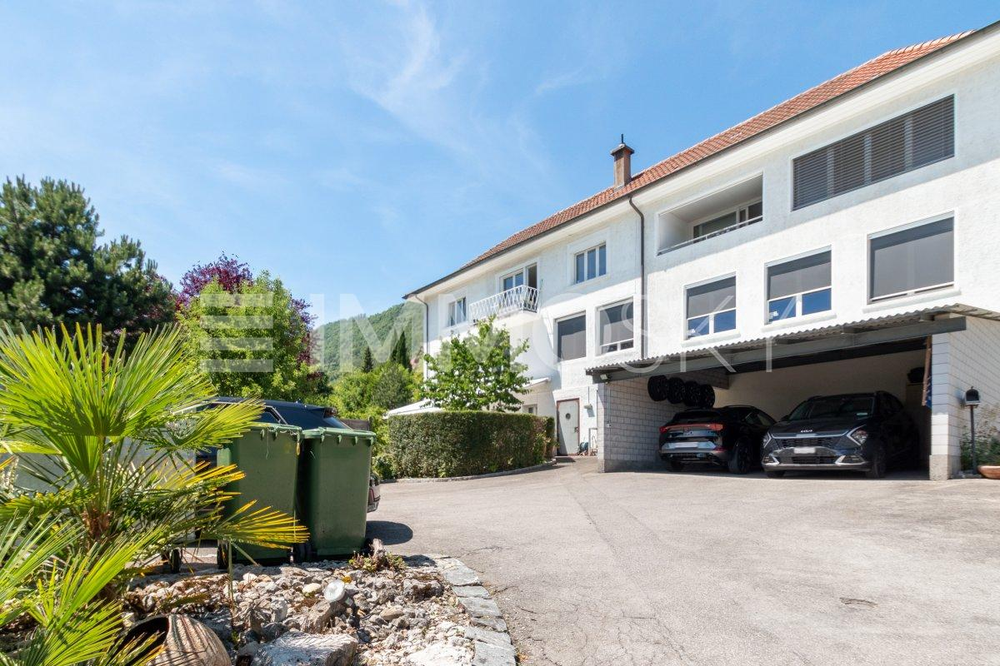

# Auf Anfrage 1, 2542 Pieterlen - CHF 1’240

> **Categorie:** `B_buero_gewerbe`  
> **Regiune:** Cantonul Berna  
> **Tip ofertă:** RENT / OFFICE  
> **Relevant pentru praxis:** da (praxis)  
> **Sursă:** [flatfox.ch](https://flatfox.ch/de/wohnung/auf-anfrage-1-2542-pieterlen/86225381/)  
> **Descărcat:** 2026-08-17 12:34

## Date obiect

| Câmp | Valoare |
|---|---|
| Adresă | Auf Anfrage 1, 2542 Pieterlen |
| Categorie obiect | INDUSTRY |
| Tip obiect | OFFICE |
| Chirie netă | CHF 990 |
| Nebenkosten | CHF 250 |
| Chirie brută | CHF 1'240 |
| Preț afișat | CHF 1'240 |
| Suprafață utilă | 68 m² |
| An construcție | 1920 |
| Disponibil de la | agr |
| Referință | 6758150.6758150. |

## Texte originale (germană)

**Titlu public:** Auf Anfrage 1, 2542 Pieterlen - CHF 1’240

**Titlu scurt:** 68m² Büro

**Pitch:** 68m² Büro in Pieterlen mieten

**Titlu descriere:** Hochwertige Bürofläche an zentraler Lage

**Titlu chirie:** 68m² Büro in Pieterlen mieten

**Spațiu afișat:** 68

### Descriere completă

Helles Büro mit moderner Ausstattung   
  
Dieses gepflegte Büro bietet auf kompakter Fläche ein angenehmes und funktionales Arbeitsumfeld. Der helle Raum sorgt für eine freundliche Atmosphäre und schafft ideale Voraussetzungen für konzentriertes und effizientes Arbeiten.   
Die moderne Ausstattung ist zeitgemäss und praktisch gestaltet, sodass ein komfortabler Arbeitsalltag gewährleistet ist.   
Dank der zentralen Lage profitieren Sie von einer sehr guten Anbindung an den öffentlichen Verkehr sowie kurzen Wegen zu Einkaufsmöglichkeiten und Gastronomie. Das Büro eignet sich ideal für Einzelunternehmer, Berater, Kreative oder kleine Dienstleistungsbetriebe, die eine praktische und gut gelegene Arbeitsfläche suchen.   
  
Dieses ImmoSky-Angebot bietet folgende *Mehr Leistung*:   
\+ Heller, repräsentativer Raum mit grossen Fensterflächen   
\+ Optional mit zusätzlichem Meetingraum   
\+ Hochwertiger Holzboden   
\+ Eigenes WC   
\+ Genügend Parkmöglichkeiten   
\+ Grosszügiges Kellerabteil   
\+ Separater Eingangsbereich   
.. und vieles mehr!   
  
Ein Ort, der Produktivität und Wohlbefinden verbindet perfekt für einen erfolgreichen Arbeitsalltag.   
Diese Räumlichkeiten bieten die perfekte Basis für individuelle Geschäftsideen in einem professionellen Rahmen ob Büro, Praxis, Studio oder Beratungsraum. Kontaktieren Sie uns für weitere Informationen oder einen Besichtigungstermin.   
  
(Das Verkaufsdossier wird in der Regel innert maximal 24 Stunden an Sie versendet, bitte prüfen Sie auch Ihren SPAM Ordner.)

## Dotări (attributes)

- petsallowed
- parkingspace

## Ofertant

- **Nume:** ImmoSky AG - Dübendorf
- **Stradă:** Hochbordstrasse 1
- **NPA:** 3018
- **Localitate:** Bern

## Imagini (7)

*`01.jpg` — 1200x800 px — Viel Platz für Ihr Business*

*`02.jpg` — 1200x800 px — Ihr neues Büro zum Durchstarten*

*`03.jpg` — 1200x800 px — Mehr als genug Platz*

*`04.jpg` — 1200x800 px — Eingang Gewerbe*

*`05.jpg` — 1200x800 px — WC Gewerbe*

*`06.jpg` — 1200x800 px — Aussenbereich*

*`07.jpg` — 1200x675 px — Kennen Sie den Wert Ihrer Immobilie?*

## Media suplimentară

- **website_url:** https://www.immosky.ch
