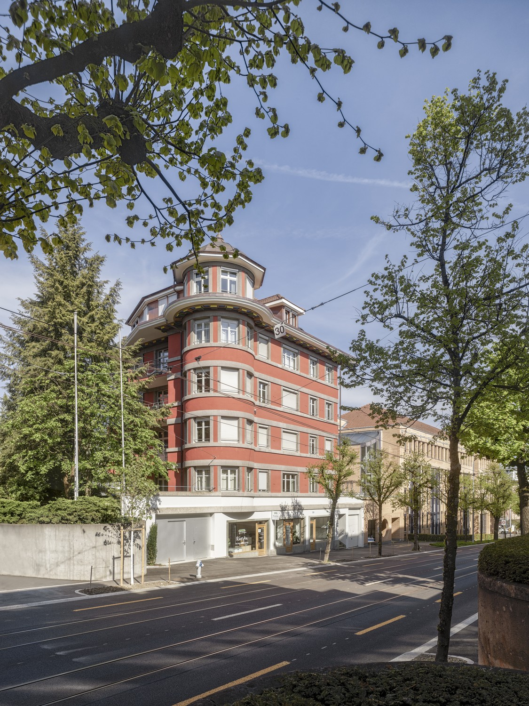
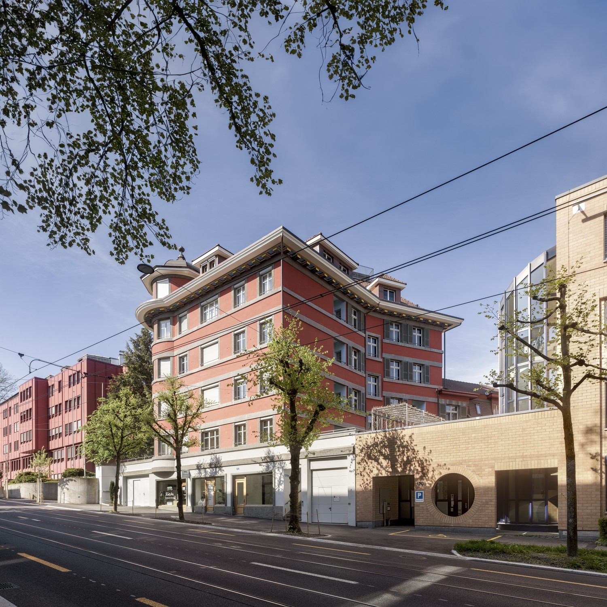
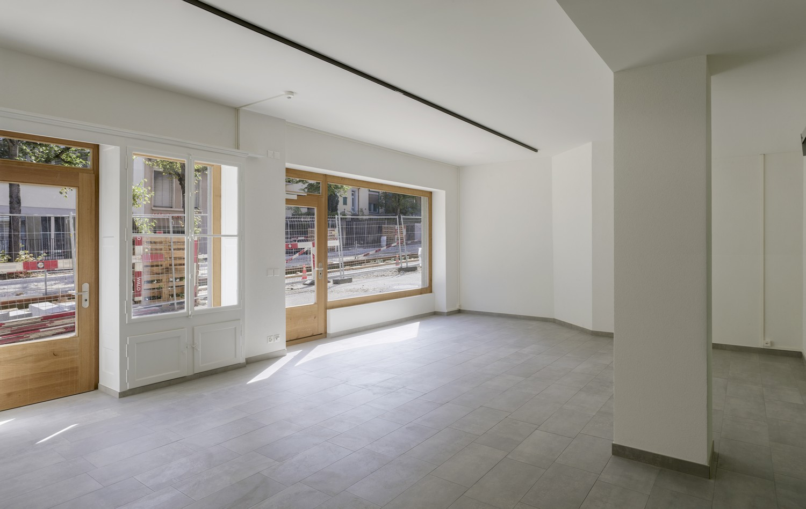
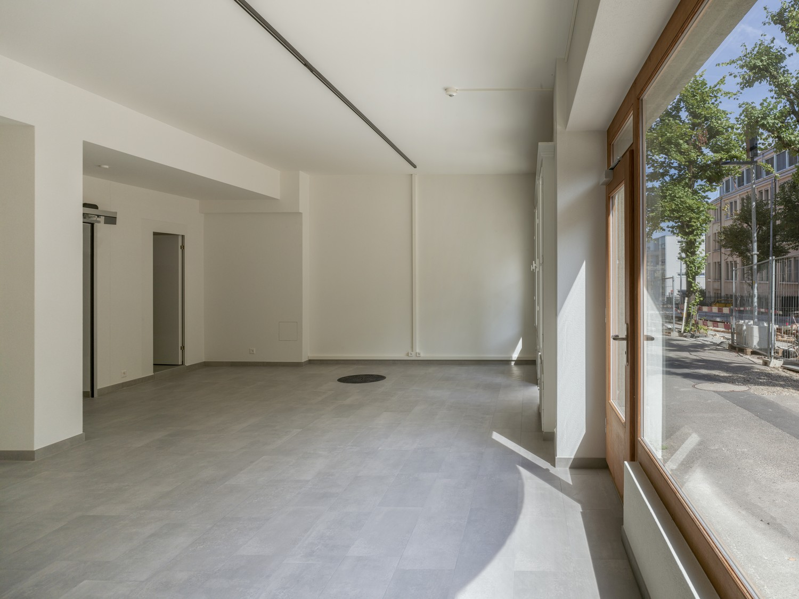
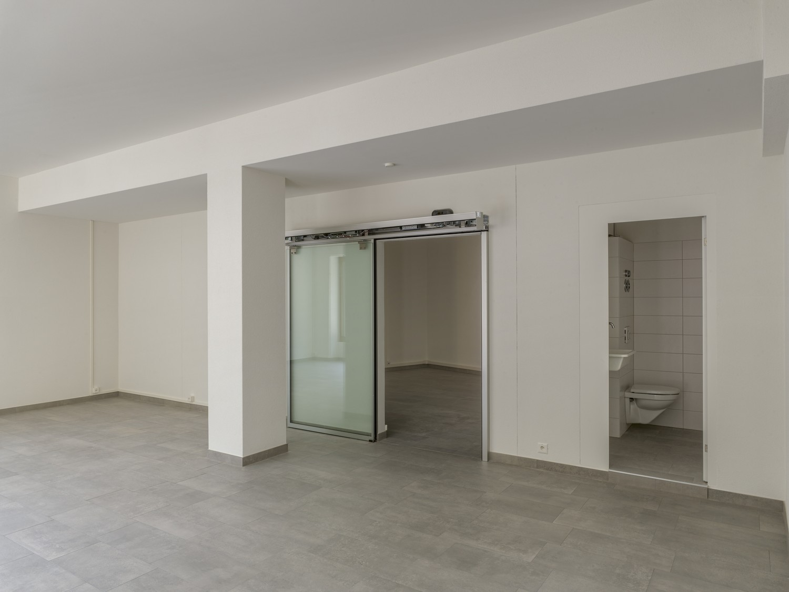
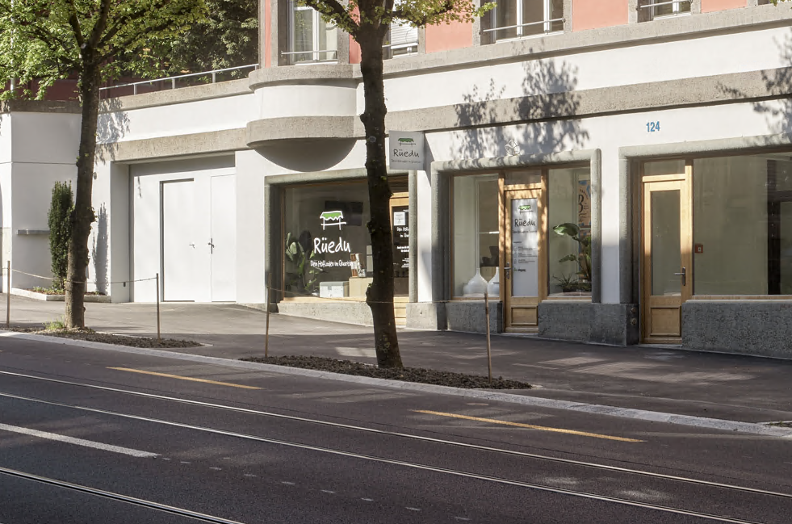
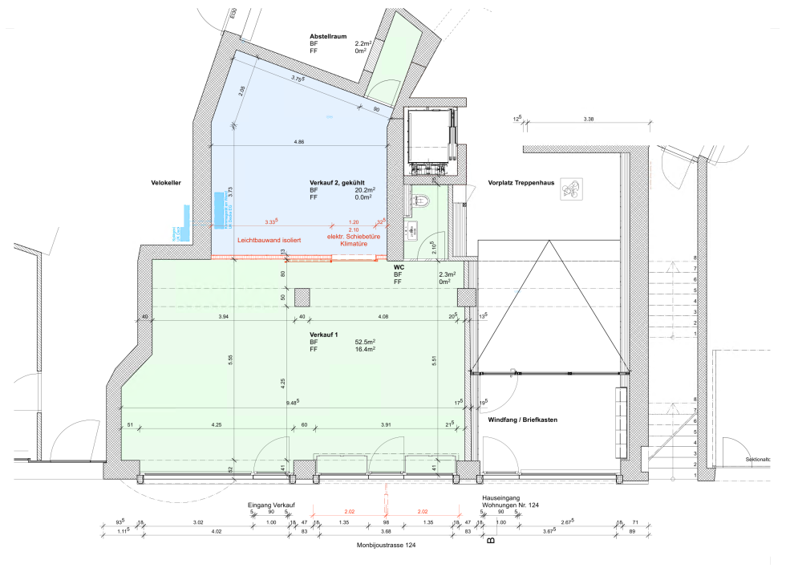

# Monbijoustrasse 124, 3007 Bern - CHF 1’885 inkl. NK pro Monat

> **Categorie:** `B_buero_gewerbe`  
> **Regiune:** Berna (oraș)  
> **Tip ofertă:** RENT / COMMERCIAL  
> **Sursă:** [flatfox.ch](https://flatfox.ch/de/wohnung/monbijoustrasse-124-3007-bern/86228184/)  
> **Descărcat:** 2026-08-17 12:32

## Date obiect

| Câmp | Valoare |
|---|---|
| Adresă | Monbijoustrasse 124, 3007 Bern |
| Categorie obiect | INDUSTRY |
| Tip obiect | COMMERCIAL |
| Chirie netă | CHF 1'635 |
| Nebenkosten | CHF 250 |
| Preț afișat | CHF 1'885 |
| Suprafață utilă | 78 m² |
| Etaj | 0 |
| Disponibil de la | imm |
| Referință | 3401..10001 |

## Texte originale (germană)

**Titlu public:** Monbijoustrasse 124, 3007 Bern - CHF 1’885 inkl. NK pro Monat

**Titlu scurt:** 78m² Gewerbe

**Pitch:** 78m² Gewerbe in Bern mieten

**Titlu descriere:** Attraktive Gewerbefläche an bester Lage im Monbijouquartier in Bern

**Titlu chirie:** 78m² Gewerbe in Bern mieten

**Spațiu afișat:** 78

### Descriere completă

Wir vermieten per sofort oder nach Vereinbarung attraktive Gewerberäumlichkeiten mit einer Gesamtfläche von ca. 78.4 m² an ausgezeichneter Lage im beliebten Monbijouquartier in Bern.  
  
Die Liegenschaft überzeugt durch ihre hervorragende Verkehrsanbindung. Sowohl mit dem öffentlichen Verkehr als auch mit dem Auto ist die Immobilie optimal erreichbar. Der Hauptbahnhof Bern befindet sich nur wenige Minuten entfernt.  
  
Die Räumlichkeiten bieten Ihnen eine grosszügige und helle Laden- oder Bürofläche von ca. 78.4 m². Es handelt sich um zwei Räume, welche durch eine Schiebetüre abgetrennt werden können und ein Reduit.  
Im Mietobjekt ist eine Toilette mit Lavabo zur ausschliesslichen Nutzung vorhanden.  
Das Objekt verfügt über eine attraktive Schaufensterfront mit Vitrine. Ideal für eine ansprechende Warenpräsentation oder als repräsentativer Eingangsbereich.  
Derzeit ist das Mietobjekt als Lebensmittelladen eingerichtet. Die Räumlichkeiten eignen sich jedoch auch für viele weitere Nutzungen wie Detailhandel, Büro, Dienstleistung oder Atelier.  
  
Nutzen Sie die Gelegenheit, Ihren Geschäftssitz an einer attraktiven und gut frequentierten Lage zu etablieren.  
  
Wir freuen uns auf Ihre Kontaktaufnahme.

## Ofertant

- **Nume:** Haussener Verwaltungen AG
- **Stradă:** Monbijoustrasse 22
- **NPA:** 3011
- **Localitate:** Bern

## Imagini (7)

*`01.jpg` — 1125x1500 px*

*`02.jpg` — 1500x1500 px*

*`03.jpg` — 1500x949 px*

*`04.jpg` — 1500x1125 px*

*`05.jpg` — 1500x1125 px*

*`06.png` — 981x649 px*

*`07.png` — 980x708 px*
