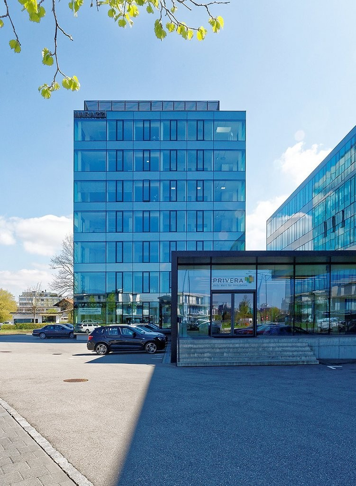
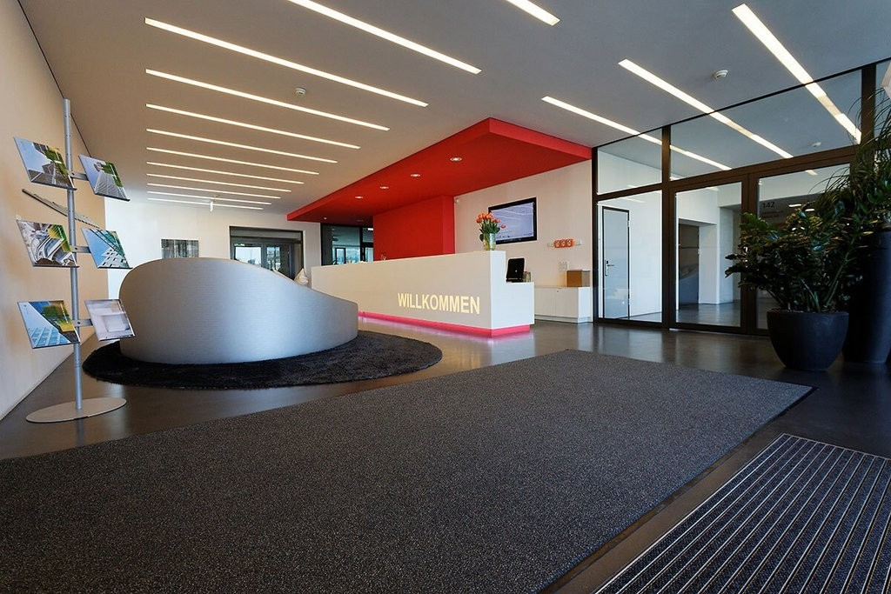
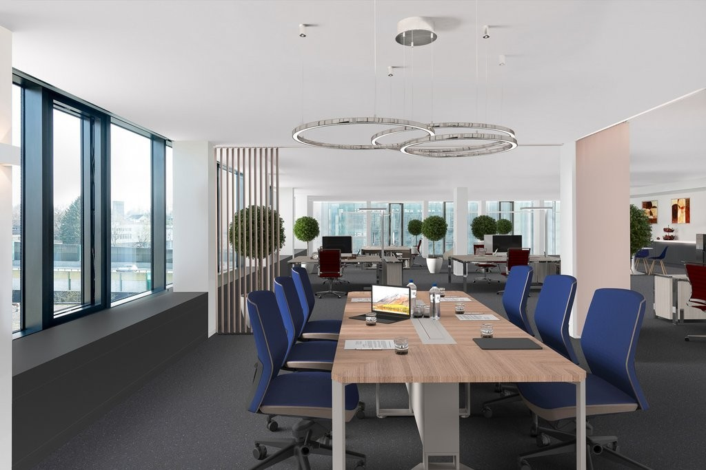
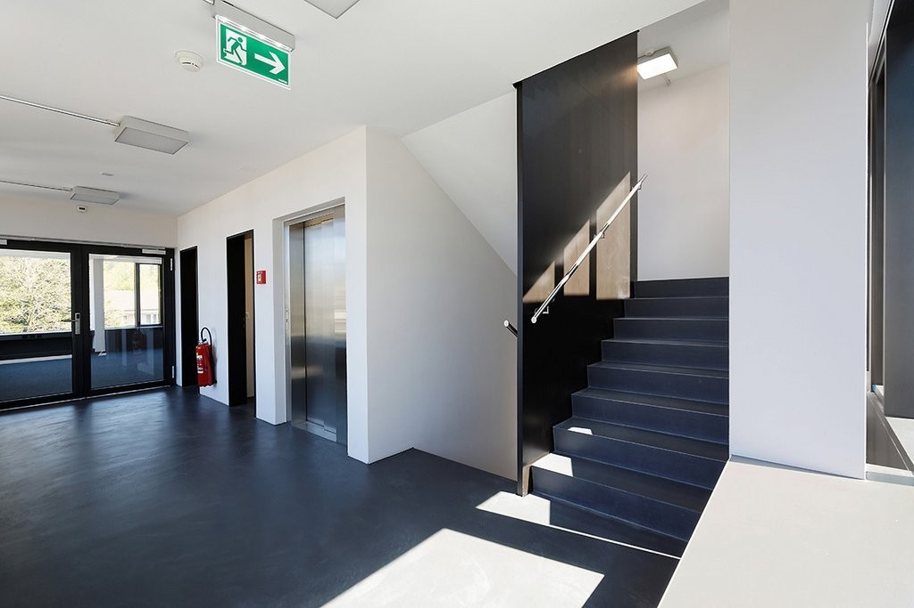
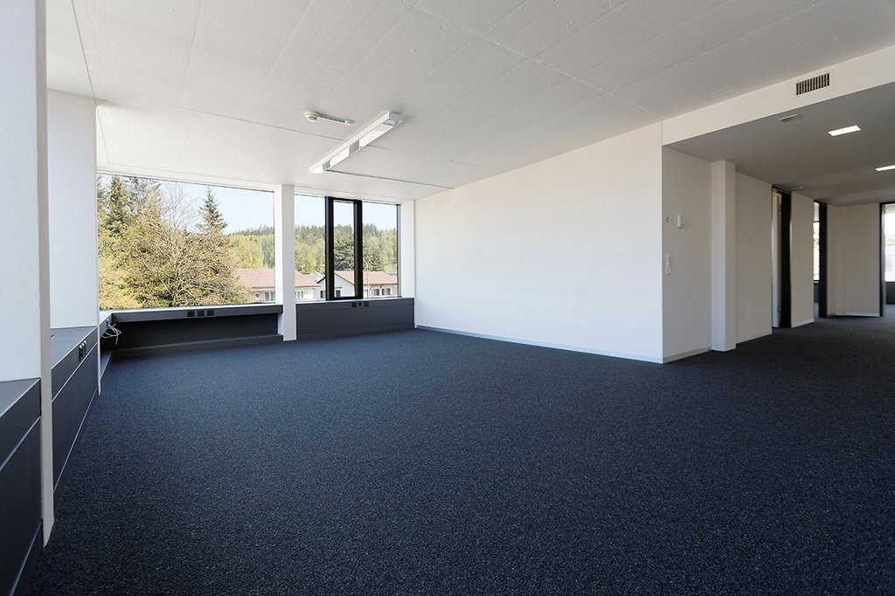
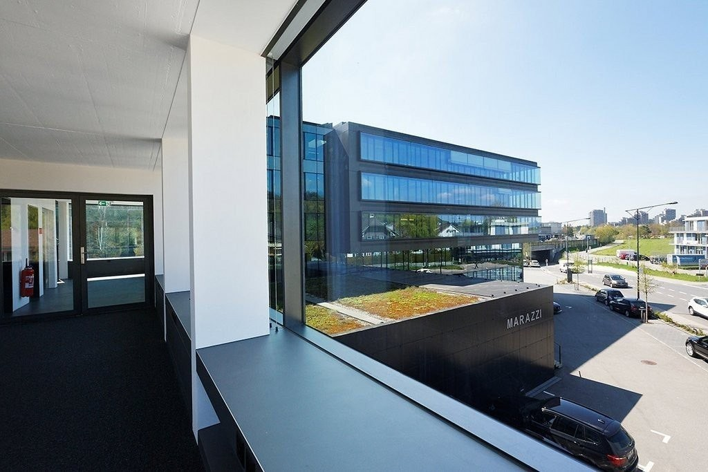
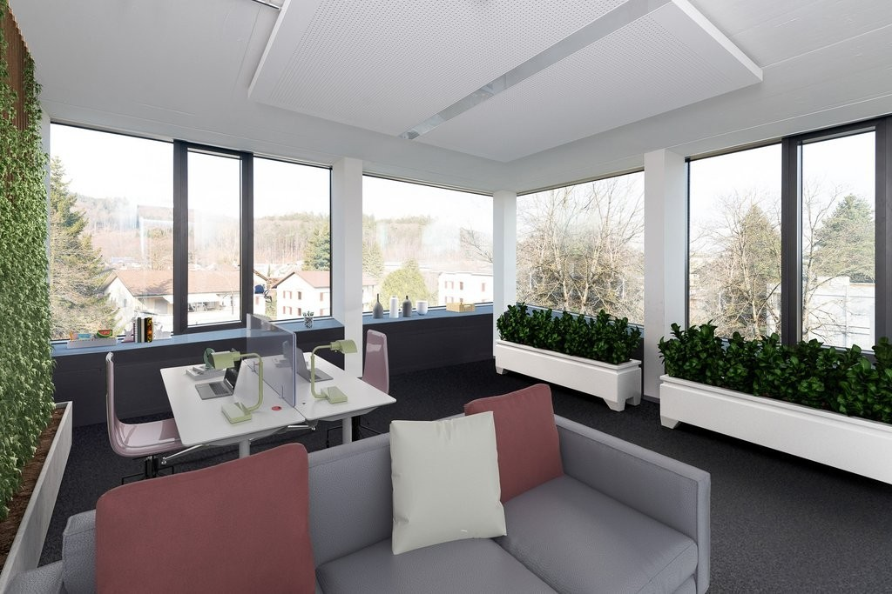
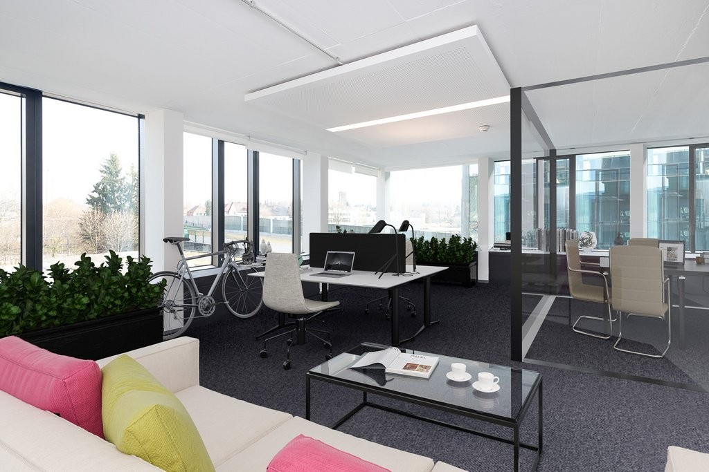

# Worbstrasse 140, 3073 Gümligen - CHF 235 inkl. NK pro m² / Jahr

> **Categorie:** `B_buero_gewerbe`  
> **Regiune:** Cantonul Berna  
> **Tip ofertă:** RENT / OFFICE  
> **Relevant pentru praxis:** da (praxis)  
> **Sursă:** [flatfox.ch](https://flatfox.ch/de/wohnung/worbstrasse-140-3073-gumligen/86228574/)  
> **Descărcat:** 2026-08-17 12:32

## Date obiect

| Câmp | Valoare |
|---|---|
| Adresă | Worbstrasse 140, 3073 Gümligen |
| Categorie obiect | INDUSTRY |
| Tip obiect | OFFICE |
| Chirie netă | CHF 194 |
| Nebenkosten | CHF 41 |
| Preț afișat | CHF 235 |
| Suprafață utilă | 186 m² |
| Etaj | 4 |
| An construcție | 2011 |
| Disponibil de la | agr |

## Texte originale (germană)

**Titlu public:** Worbstrasse 140, 3073 Gümligen - CHF 235 inkl. NK pro m² / Jahr

**Titlu scurt:** 186m² Büro

**Pitch:** 186m² Büro in Gümligen mieten

**Titlu descriere:** Ihr neuer Firmenstandort - bei uns passt alles!

**Titlu chirie:** 186m² Büro in Gümligen mieten

**Spațiu afișat:** 186

### Descriere completă

Wir haben den Standort - Sie den Erfolg! Der aktuelle Innenausbau eignet sich besonders für Anbieter im Bereich Dienstleistung (Büro), Ausstellung, Schulung/Beratung, Praxis etc.  
  
Profitieren Sie von:  
  

*   der steuergünstigen Gemeinde Muri-Gümligen
*   der hervorragenden Anbindung an die regionalen und nationalen Verkehrsnetze
*   sowie dem Flughafen Bern-Belp, welcher lediglich 15 Fahrminuten vom Standort entfernt liegt

Hinter einer eleganten Glasfassade erwarten Sie hochwertige Mietflächen. Die hellen und attraktiven Flächen, lassen sich bequem über das offene Treppenhaus oder den Personenlift (rollstuhlgängig) erreichen. Der 6-geschossige Büroturm wurde 2011 komplett saniert und mit neuer, moderner Gebäudetechnik ausgestattet.  
  
Das repräsentative Büro-/Gewerbehaus besteht aus zwei Gebäudeteilen mit einem gemeinsamen Haupteingang auf der Nordwestseite an der Worbstrasse. Der Zwischentrakt mit bedientem Empfangsbereich, Foyer sowie einladender Cafeteria verbinden die Gebäude miteinander. Dienstleistungen wie Empfang, Post, Sitzungszimmer, Cafeteria können nach Bedarf optional mitbenutzt werden.  
  
Gerne stehen wir Ihnen für weitere Auskünfte sowie die Vereinbarung eines persönlichen Besichtigungstermins direkt vor Ort gerne zur Verfügung.  
Wir garantieren Ihnen bereits heute eine vielversprechende Lage für Ihre Geschäftsidee!  
  

*   Die aufgeführten Impressionen (Visualisierungen und Fotos) sind urheberrechtlich geschützt und dürfen nicht von Dritten verwendet werden. Sie können von den Flächen abweichen und sind ohne Gewähr.

## Dotări (attributes)

- parkingspace
- lift
- accessiblewithwheelchair

## Ofertant

- **Nume:** PRIVERA AG
- **Stradă:** Worbstrasse 142
- **NPA:** 3073
- **Localitate:** Gümligen

## Imagini (8)

*`01.jpg` — 751x1024 px*

*`02.jpg` — 1024x683 px*

*`03.jpg` — 1024x683 px*

*`04.jpg` — 1024x683 px*

*`05.jpg` — 1024x683 px*

*`06.jpg` — 1024x683 px*

*`07.jpg` — 1024x683 px*

*`08.jpg` — 1024x683 px*
