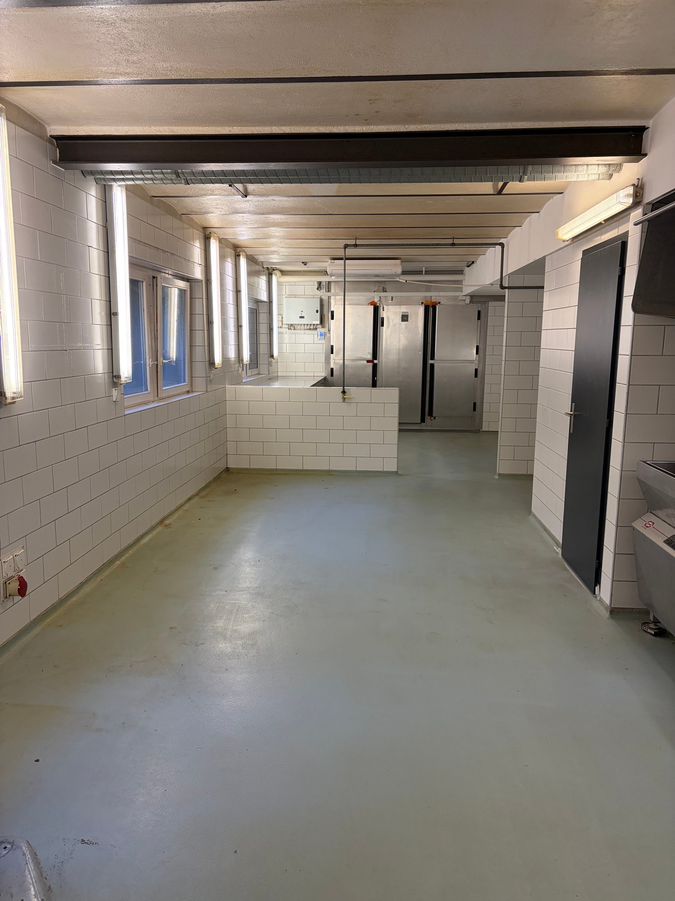
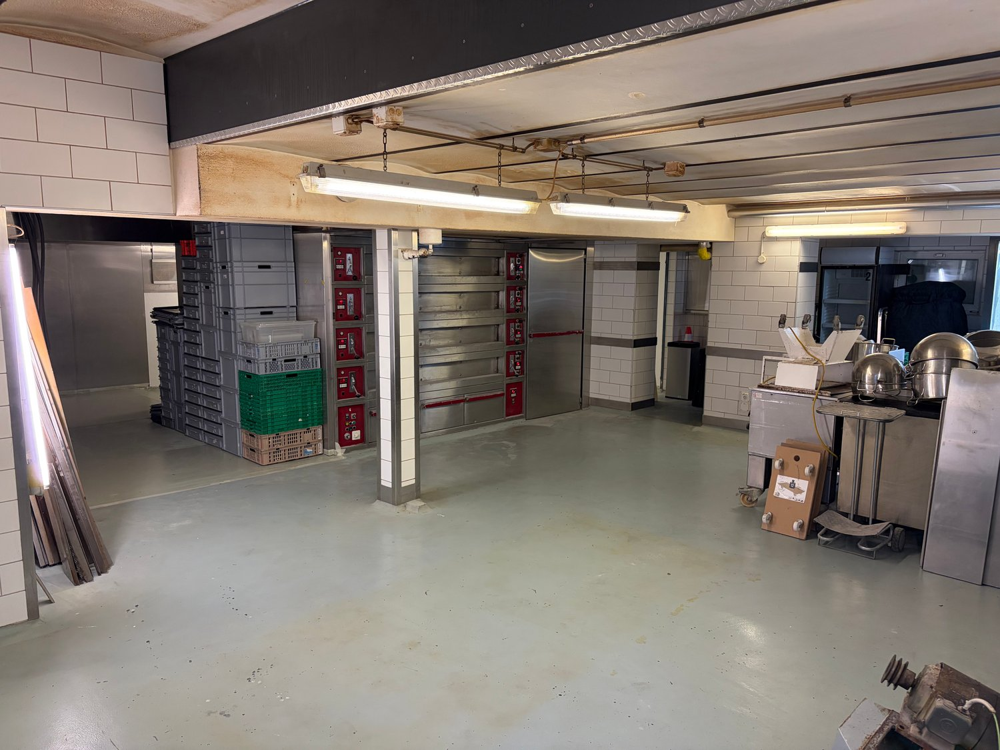
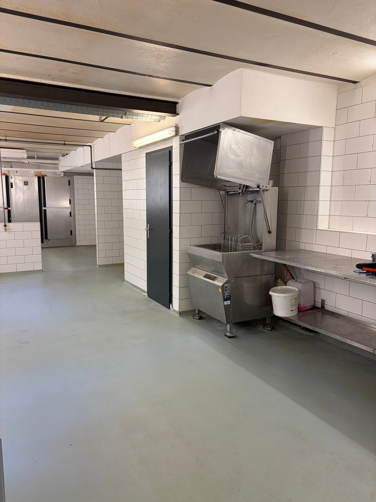
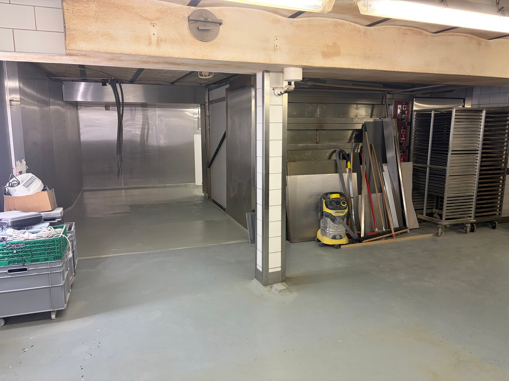
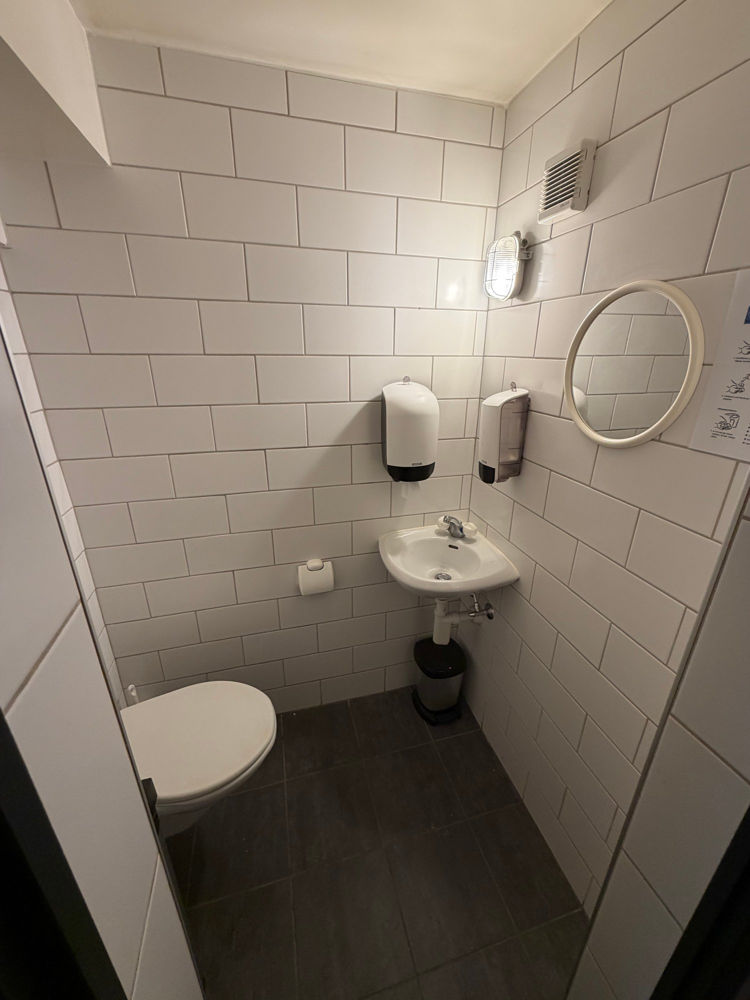

# Kirchstrasse 192, 3084 Köniz - CHF 1’900

> **Categorie:** `B_buero_gewerbe`  
> **Regiune:** Cantonul Berna  
> **Tip ofertă:** RENT / COMMERCIAL  
> **Relevant pentru praxis:** da (physiotherapie, praxen)  
> **Sursă:** [flatfox.ch](https://flatfox.ch/de/wohnung/kirchstrasse-192-3084-koniz/86231057/)  
> **Descărcat:** 2026-08-17 12:38

## Date obiect

| Câmp | Valoare |
|---|---|
| Adresă | Kirchstrasse 192, 3084 Köniz |
| Categorie obiect | INDUSTRY |
| Tip obiect | COMMERCIAL |
| Chirie brută | CHF 1'900 |
| Preț afișat | CHF 1'900 |
| Suprafață utilă | 150 m² |
| An construcție | 1910 |
| An renovare | 2010 |
| Disponibil de la | agr |
| Referință | ..a73bh.759qo |

## Texte originale (germană)

**Titlu public:** Kirchstrasse 192, 3084 Köniz - CHF 1’900

**Titlu scurt:** 150m² Gewerbe

**Pitch:** 150m² Gewerbe in Köniz mieten

**Titlu descriere:** Gewerbliche Räumlichkeiten in Wohn- und Geschäftsgebäude in Wabern

**Titlu chirie:** 150m² Gewerbe in Köniz mieten

**Spațiu afișat:** 150

### Descriere completă

Vielseitige Gewerberäumlichkeiten an zentraler Lage in Wabern zu vermieten 

Entdecken Sie diese vielseitige Gewerberäumlichkeit im Untergeschoss eines gepflegten Gebäudes an der Kirchstrasse 192 in Wabern. Die grosszügige und moderne Gewerbeeinheit bietet ideale Voraussetzungen für verschiedenste Betriebsarten und gewerbliche Nutzungen. 

**Die Räumlichkeiten bieten:**

  * Grosszügiger, offener Arbeitsbereich 

  * Robuster Industrieboden 

  * Industrielle Beleuchtung 

  * Tageslicht 

  * Geflieste Wände 

  * Warenaufzug für den bequemen Transport von Material und Waren 

  * Separates WC 

**Optimale Lage**

Die Liegenschaft befindet sich an zentraler Lage. Die Gurtenbahn, die Tramhaltestelle Gurtenbahn, Bushaltestellen, der Bahnhof Wabern sowie verschiedene Schulen sind in wenigen Gehminuten erreichbar. 

Vielfältige Nutzungsmöglichkeiten 

**Die Räumlichkeiten eignen sich hervorragend für:**

  * Catering- oder Lebensmittelverarbeitungsbetriebe 

  * Maler- und Gipserbetriebe 

  * Elektroinstallationsfirmen 

  * Bodenleger 

  * Massage- oder Physiotherapiepraxen 

  * Ateliers, Werkstätten oder Lager 

Selbstverständlich sind auch andere gewerbliche Nutzungen willkommen. Wir sind offen für Ihre Ideen und prüfen gerne verschiedene Nutzungskonzepte. 

Die zentrale Lage sowie die grosszügigen und funktionalen Räumlichkeiten machen dieses Objekt zu einer ausgezeichneten Wahl für Ihr Unternehmen. 

**Hinweis:** Es ist kein Inventar vorhanden. Es muss daher nichts übernommen werden. 

Der Aktuell vorhandene Ofen wird vor der Übergabe ausgebaut und gehört daher nicht zum Mietobjekt.

## Dotări (attributes)

- lift

## Ofertant

- **Nume:** LAYF GmbH
- **Stradă:** Buckhauserstrasse 36
- **NPA:** 8048
- **Localitate:** Zürich

## Imagini (5)

*`01.jpg` — 1500x2000 px*

*`02.jpg` — 1500x1125 px*

*`03.jpg` — 1500x2000 px*

*`04.jpg` — 1500x1125 px*

*`05.jpg` — 1500x2000 px*
