# Hallwylstrasse 48, 3005 Bern - CHF 2’920

> **Categorie:** `B_buero_gewerbe`  
> **Regiune:** Berna (oraș)  
> **Tip ofertă:** RENT / OFFICE  
> **Sursă:** [flatfox.ch](https://flatfox.ch/de/wohnung/hallwylstrasse-48-3005-bern/86232643/)  
> **Descărcat:** 2026-08-17 12:28

## Date obiect

| Câmp | Valoare |
|---|---|
| Adresă | Hallwylstrasse 48, 3005 Bern |
| Categorie obiect | INDUSTRY |
| Tip obiect | OFFICE |
| Chirie netă | CHF 2'720 |
| Nebenkosten | CHF 200 |
| Chirie brută | CHF 2'920 |
| Preț afișat | CHF 2'920 |
| Suprafață utilă | 93 m² |
| Disponibil de la | imm |
| Referință | ..6136671 |

## Texte originale (germană)

**Titlu public:** Hallwylstrasse 48, 3005 Bern - CHF 2’920

**Titlu scurt:** 93m² Büro

**Pitch:** 93m² Büro in Bern mieten

**Titlu descriere:** BÜRO MIT CHARME IM BELIEBTEN KIRCHENFELDQUARTIER

**Titlu chirie:** 93m² Büro in Bern mieten

**Spațiu afișat:** 93

### Descriere completă

Im renommierten Kirchenfeldquartier vermieten wir ab ab sofort oder nach Vereinbarung diese attraktive und vielseitig nutzbare Bürofläche im 3. Obergeschoss. Die Räumlichkeiten überzeugen mit einem durchdachten Grundriss, hellen Arbeitsbereichen und einer angenehmen Atmosphäre - ideal für Unternehmen, die Wert auf eine repräsentative Geschäftsadresse legen.   
  
Die Bürofläche verfügt über vier grosszügige Büroräume mit einer Fläche von ca. 12.5 m², 16.9 m², 19.6 m² und 23.0 m². Ein einladendes Entrée eignet sich ideal als Empfangs- oder Wartebereich. Ergänzt wird das Raumangebot durch eine praktische Teeküche, ein separates WC sowie einen EDV-/Archivraum. Ein zusätzlicher Estrich bietet wertvollen Stauraum für Akten, Material oder Archivgut. Die Liegenschaft ist zudem mit einem Lift ausgestattet, welcher einen komfortablen Zugang zu den Büroräumlichkeiten ermöglicht.   
  
Die Räumlichkeiten eignen sich ideal für Treuhand-, Architektur-, Ingenieur-, Anwalts-, Beratungs- oder Planungsbüros sowie weitere Dienstleistungsunternehmen.   
  
Ihre Vorteile auf einen Blick:   
\- Vier helle und gut geschnittene Büroräume   
\- Grosszügiger Empfangsbereich   
\- Praktische Teeküche   
\- Separater EDV-/Archivraum   
\- Eigenes WC   
\- Zusätzlicher Estrich als Stauraum   
\- Lift im Gebäude   
\- Repräsentative Adresse im beliebten Kirchenfeldquartier   
\- Lage   
  
Die Hallwylstrasse 48 befindet sich im beliebten Kirchenfeldquartier, einem der exklusivsten und repräsentativsten Quartiere der Stadt Bern. Die Umgebung ist geprägt von stilvollen Altbauten, Botschaften, kulturellen Einrichtungen und einem gepflegten, ruhigen Umfeld - ideale Voraussetzungen für ein professionelles Arbeitsumfeld.   
  
Die Berner Innenstadt sowie der Hauptbahnhof sind in wenigen Minuten mit den öffentlichen Verkehrsmitteln oder dem Velo erreichbar. Tram- und Bushaltestellen befinden sich in kurzer Gehdistanz und sorgen für eine ausgezeichnete Anbindung. Einkaufsmöglichkeiten, Restaurants, Cafés und weitere Dienstleistungen liegen ebenfalls in unmittelbarer Nähe.   
  
Die Kombination aus repräsentativer Lage, hervorragender Erreichbarkeit und funktionalen Büroräumlichkeiten macht dieses Objekt zu einem idealen Standort für Unternehmen verschiedenster Branchen.   
  
Für weitere Auskünfte oder für eine Besichtigung vor Ort stehen wir Ihnen jederzeit gerne zur Verfügung.   
  
"Ihre Spezialisten für Immobilien"

## Dotări (attributes)

- balconygarden
- lift

## Ofertant

- **Nume:** Lifestyle Company AG
- **Stradă:** Hallwylstrasse 48
- **NPA:** 3005
- **Localitate:** Bern

## Imagini (12)

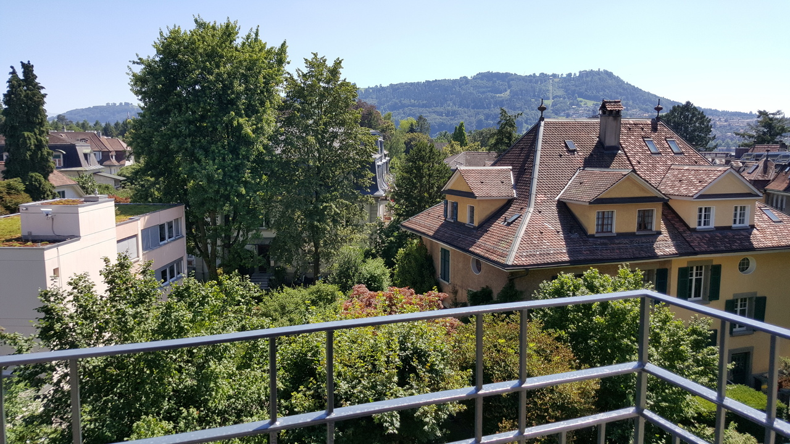
*`01.jpg` — 1280x720 px*

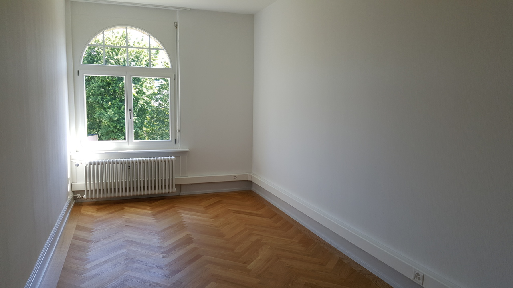
*`02.jpg` — 1280x720 px*

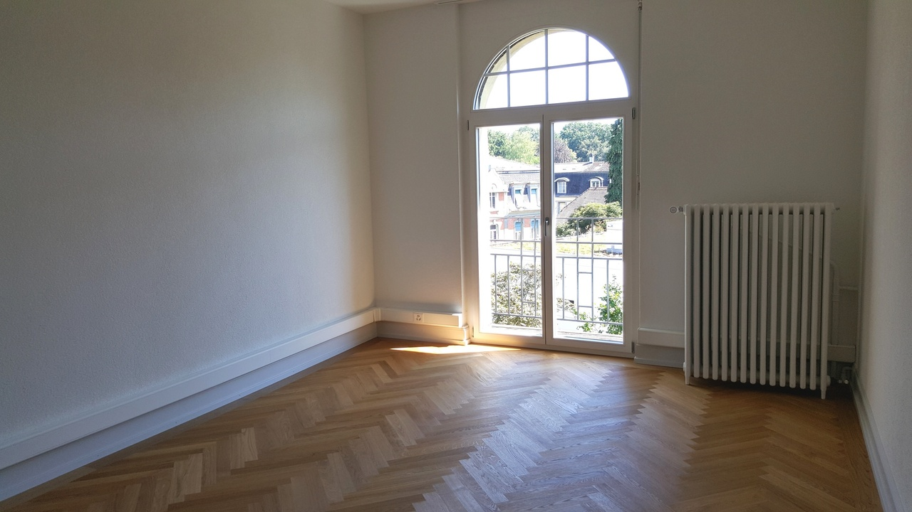
*`03.jpg` — 1280x720 px*

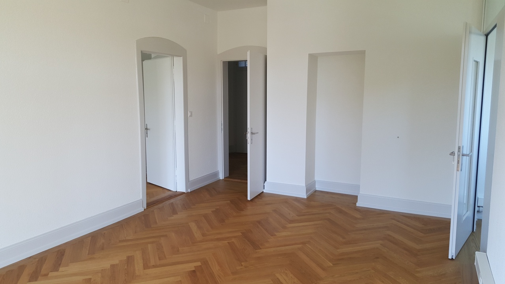
*`04.jpg` — 1280x720 px*

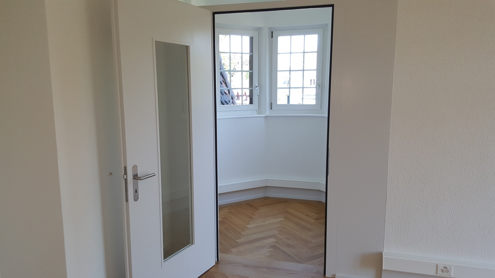
*`05.jpg` — 1280x720 px*

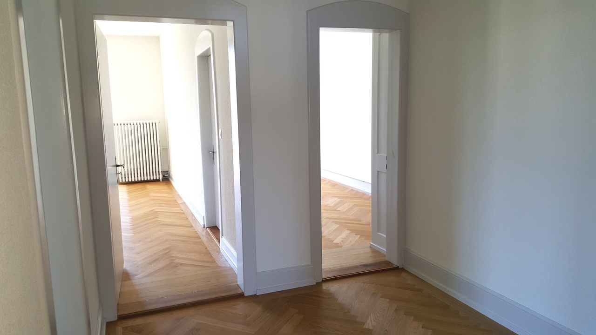
*`06.jpg` — 1280x720 px*

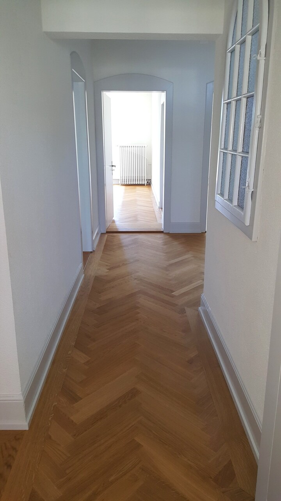
*`07.jpg` — 720x1280 px*

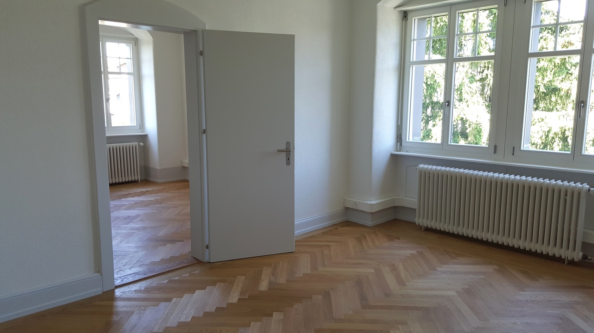
*`08.jpg` — 1280x720 px*

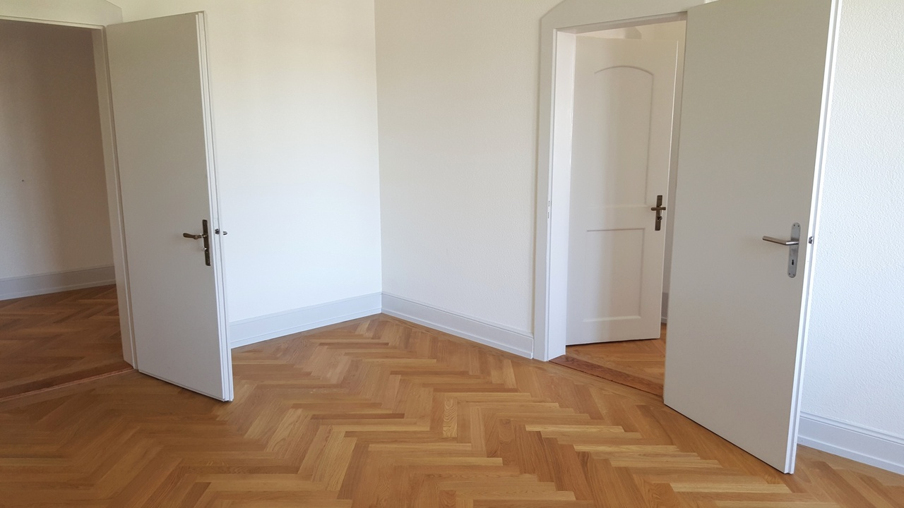
*`09.jpg` — 1280x720 px*

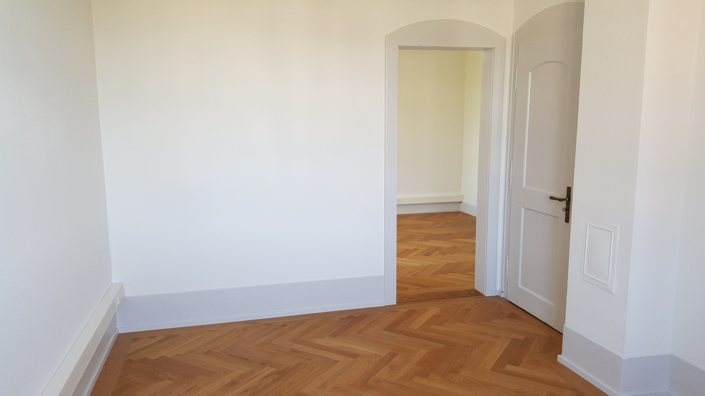
*`10.jpg` — 1280x720 px*

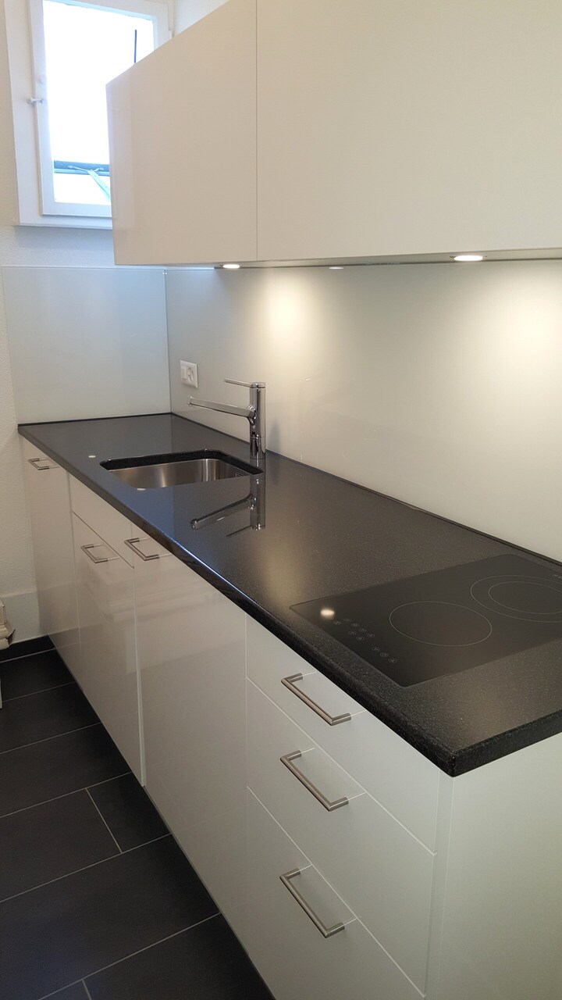
*`11.jpg` — 720x1280 px*

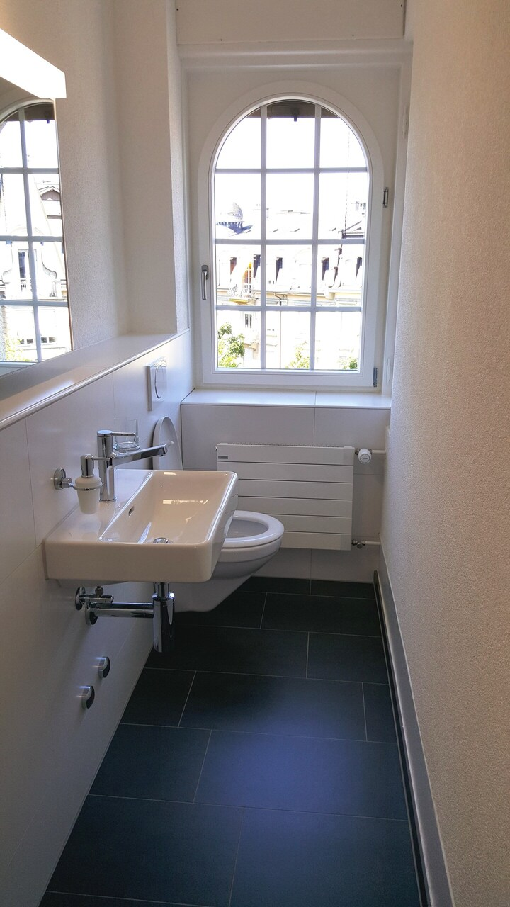
*`12.jpg` — 720x1280 px*
