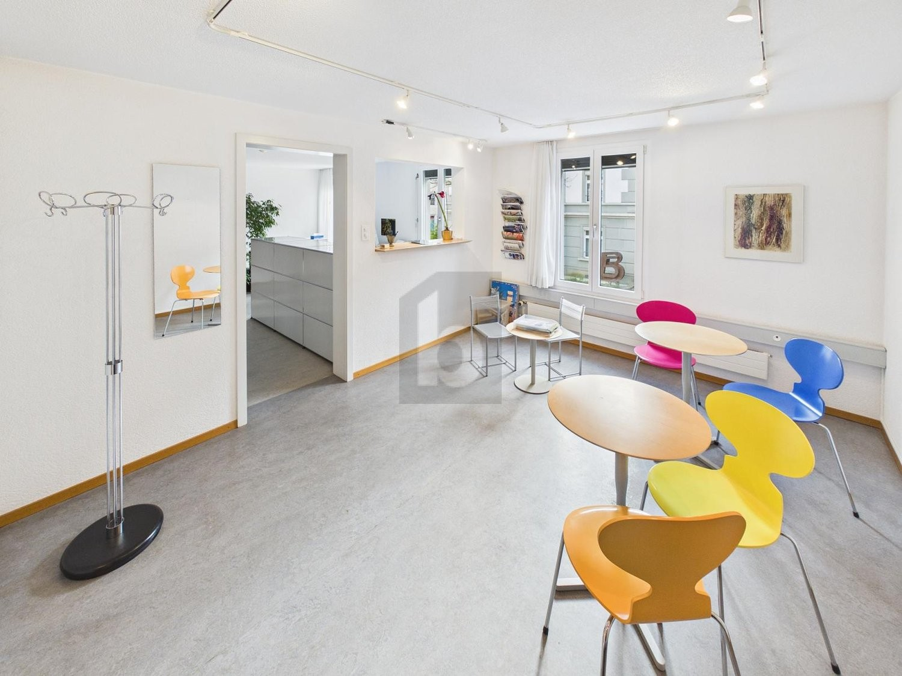
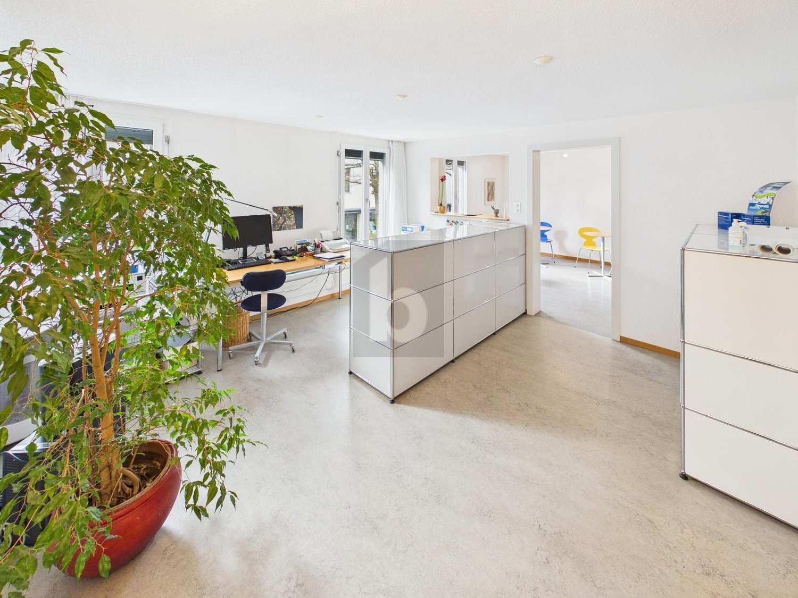
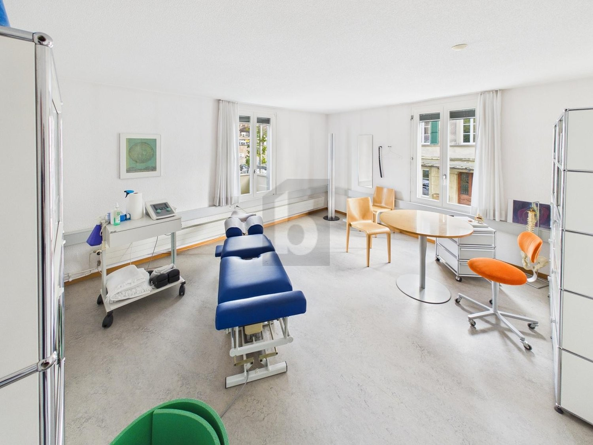
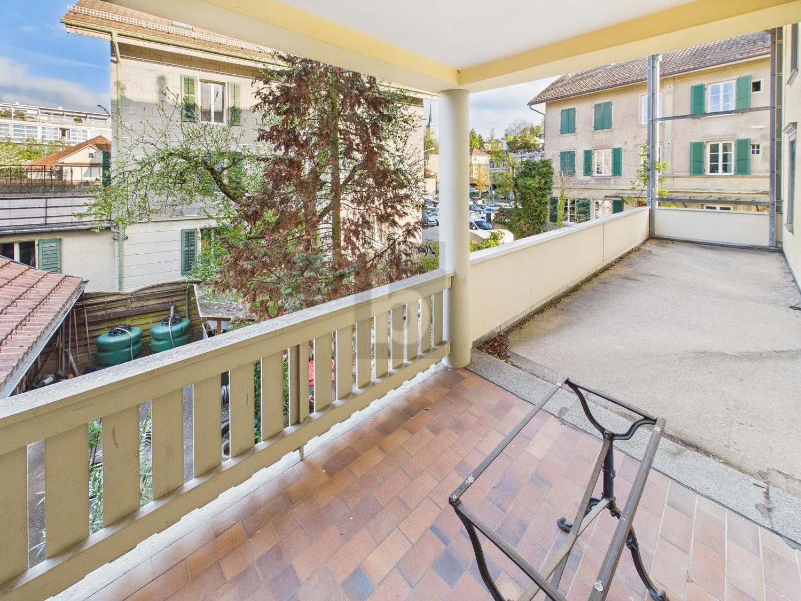

# Auf Anfrage, 3400 Burgdorf - CHF 240 inkl. NK pro m² / Jahr

> **Categorie:** `B_buero_gewerbe`  
> **Regiune:** Cantonul Berna  
> **Tip ofertă:** RENT / OFFICE  
> **Relevant pentru praxis:** da (praxen)  
> **Sursă:** [flatfox.ch](https://flatfox.ch/de/wohnung/auf-anfrage-3400-burgdorf/86236938/)  
> **Descărcat:** 2026-08-17 12:39

## Date obiect

| Câmp | Valoare |
|---|---|
| Adresă | Auf Anfrage, 3400 Burgdorf |
| Categorie obiect | INDUSTRY |
| Tip obiect | OFFICE |
| Chirie brută | CHF 240 |
| Preț afișat | CHF 240 |
| Suprafață utilă | 140 m² |
| Suprafață teren | 0 m² |
| Etaj | 1 |
| Disponibil de la | agr |
| Referință | ..1411759 |

## Texte originale (germană)

**Titlu public:** Auf Anfrage, 3400 Burgdorf - CHF 240 inkl. NK pro m² / Jahr

**Titlu scurt:** 140m² Büro

**Pitch:** 140m² Büro in Burgdorf mieten

**Titlu descriere:** ZENTRAL UND GROSSZÜGIG

**Titlu chirie:** 140m² Büro in Burgdorf mieten

**Spațiu afișat:** 140

### Descriere completă

Diese grosszügige Bürofläche in Burgdorf (3400) bietet 7 helle Zimmer an sehr zentraler Lage nahe Bahnhof. Ideal für Unternehmen, Agenturen oder Praxen, die sichtbar und gut erreichbar arbeiten möchten. Moderne Infrastruktur mit Glasfaseranschluss sorgt für effizientes Arbeiten, der Zugang ist rollstuhlgängig. Beim geplanten Ausbau ist Mitsprache möglich - perfekt, wenn Sie Räume nach Ihren Bedürfnissen mitgestalten wollen. Viele Kundenparkplätze in der Nähe, ein fixer Parkplatz optional möglich.   
  
Dieses BETTERHOMES-Angebot zeichnet sich durch folgende Vorteile aus:   
\- sehr zentrale Lage nähe Bahnhof Burgdorf   
  
\- grosszügige, lichtdurchflutete Räumlichkeiten   
  
\- moderne Infrastruktur mit Glasfaseranschluss   
  
\- rollstuhlgängig   
  
\- Photovoltaikanlage auf dem Dach   
  
\- Mitsprache und Mitfinanzierung bei geplantem Ausbau möglich   
  
\- viele Parkplätze für Kunden in der Nähe   
  
\- ein fester Parkplatz optional möglich   
  
\- Bezugstermin per 01.02.2027 oder nach Vereinbarung   
  
\- und, und, und ...   
  
  
Interessiert? Kontaktieren Sie uns für eine unverbindliche Besichtigung – auch Online-Besichtigung möglich!   
  
Nichts Passendes gefunden? Über 2'000 weitere Angebote unter: www.betterhomes.ch - der Immobilienfairmittler®   
  
Selber eine Immobilie zu vermarkten?   
Profitieren Sie von unserem Know-how: https://www.betterhomes.ch/de/profitieren   
  
Sie möchten eine Immobilie schätzen lassen?   
Erfahren Sie jetzt ihren Wert über unsere Gratis-Schätzung, sofort und unverbindlich!   
https://www.betterhomes.ch/de/knowledge/estimation   
  
  
Mehr Details   
Lage: zentral   
Zustand: wird renoviert   
  
Bäder / Nasszellen: 2 (2 x WC / Lavabo)   
Heizsystem: Grundwasserwärmepumpe   
Öffentliche Verkehrsmittel: Bahn, 200 m   
Geschäfte: Migros / Coop, 50 m

## Dotări (attributes)

- accessiblewithwheelchair
- balconygarden
- lift

## Ofertant

- **Nume:** BETTERHOMES (Schweiz) AG
- **Stradă:** Weltpoststrasse 3E
- **NPA:** 3015
- **Localitate:** Bern

## Imagini (4)

*`01.jpg` — 1500x1125 px*

*`02.jpg` — 1500x1125 px*

*`03.jpg` — 1500x1125 px*

*`04.jpg` — 1500x1125 px*

## Media suplimentară

- **website_url:** https://www.betterhomes.ch/de/immobilie-suchen/detail/objectId/6756c1ffd27db6cd4aef85891ac77dc3
