# Bahnhofplatz 7, 2502 Biel/Bienne - CHF 4’222

> **Categorie:** `B_buero_gewerbe`  
> **Regiune:** Cantonul Berna  
> **Tip ofertă:** RENT / OFFICE  
> **Relevant pentru praxis:** da (praxis)  
> **Sursă:** [flatfox.ch](https://flatfox.ch/de/wohnung/bahnhofplatz-7-2502-bielbienne/86241412/)  
> **Descărcat:** 2026-08-17 12:35

## Date obiect

| Câmp | Valoare |
|---|---|
| Adresă | Bahnhofplatz 7, 2502 Biel/Bienne |
| Categorie obiect | INDUSTRY |
| Tip obiect | OFFICE |
| Chirie netă | CHF 3'522 |
| Nebenkosten | CHF 700 |
| Chirie brută | CHF 4'222 |
| Preț afișat | CHF 4'222 |
| Suprafață utilă | 232 m² |
| Etaj | 3 |
| Disponibil de la | imm |
| Referință | 11031.12127.du7rc.47ho0 |

## Texte originale (germană)

**Titlu public:** Bahnhofplatz 7, 2502 Biel/Bienne - CHF 4’222

**Titlu scurt:** 232m² Büro

**Pitch:** 232m² Büro in Biel/Bienne mieten

**Titlu descriere:** Top Lage vis-à-vis vom Bahnhof - grosse und helle Räume

**Titlu chirie:** 232m² Büro in Biel/Bienne mieten

**Spațiu afișat:** 232

### Descriere completă

Direkt am Bahnhofplatz in Biel vermieten wir eine moderne und helle 

**Gewerbefläche im 3. Obergeschoss**

mit folgender Ausstattung: 

  * Praxis- oder Büroräumlichkeit von 232m2, welche viel individuellen Einrichtungsspielraum bietet 
  * Grosse Fenster 
  * Aufenthaltsbereich + Küche 
  * Eigenes WC 
  * Moderne Liftanlage 

In unmittelbarer Nähe befinden sich zudem zwei Parkings. 

Haben wir Ihr Interesse geweckt? Gerne zeigen wir Ihnen diese attraktive Gewerbefläche!

## Dotări (attributes)

- lift
- view

## Ofertant

- **Nume:** Schmitz Immobilien AG
- **Stradă:** Esplanade Kongresshaus 5
- **NPA:** 2502
- **Localitate:** Biel/Bienne

## Imagini (13)

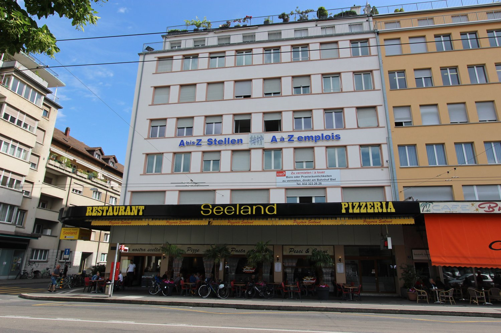
*`01.jpg` — 1500x1000 px — Bahnhofplatz 7, 2502 Biel*

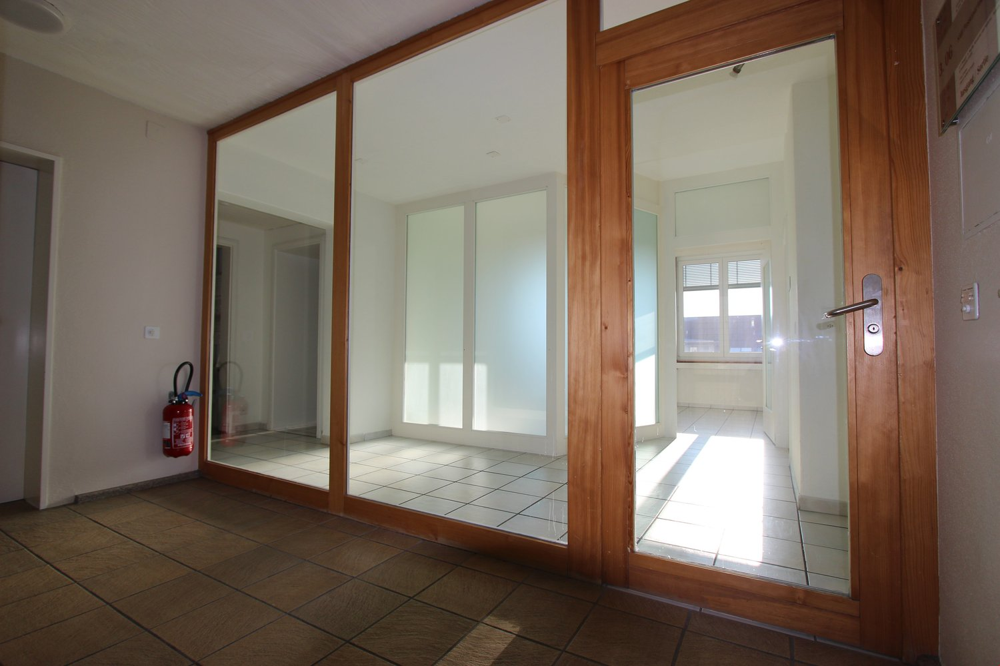
*`02.jpg` — 1500x1000 px*

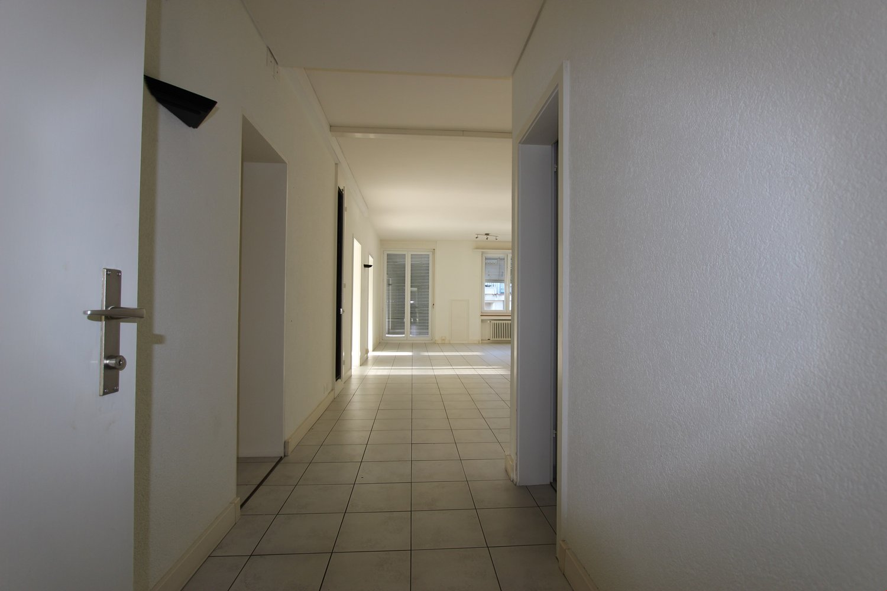
*`03.jpg` — 1500x1000 px*

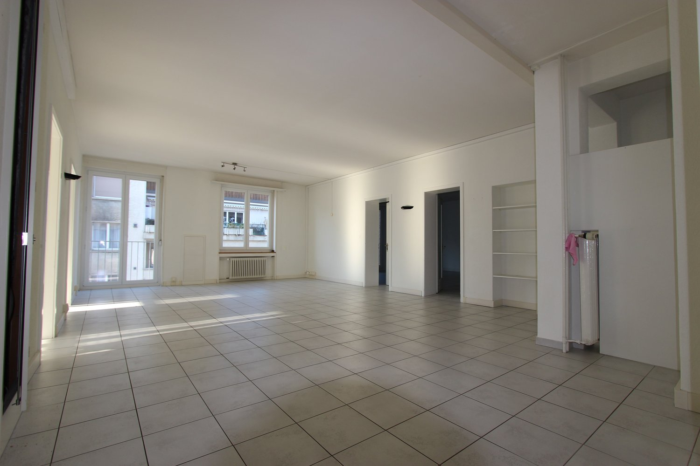
*`04.jpg` — 1500x1000 px*

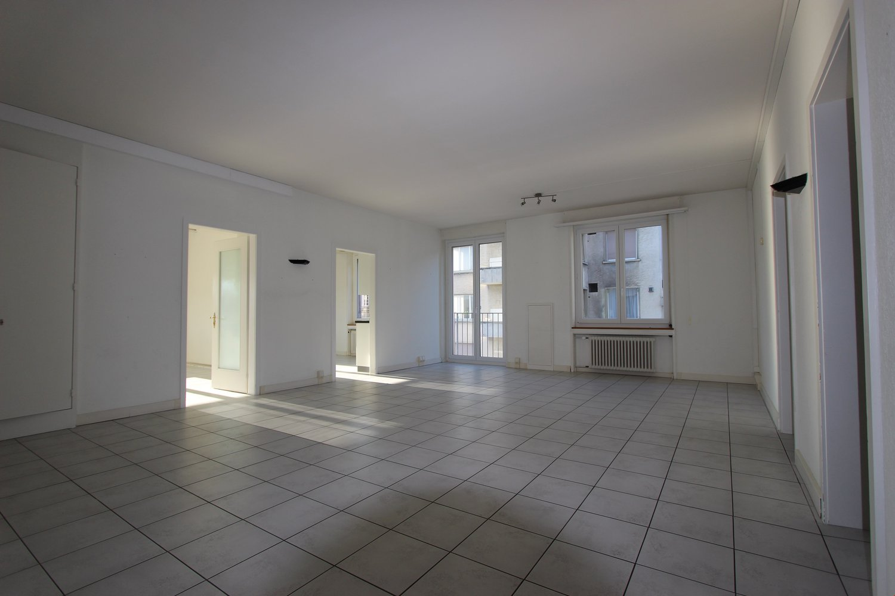
*`05.jpg` — 1500x1000 px*

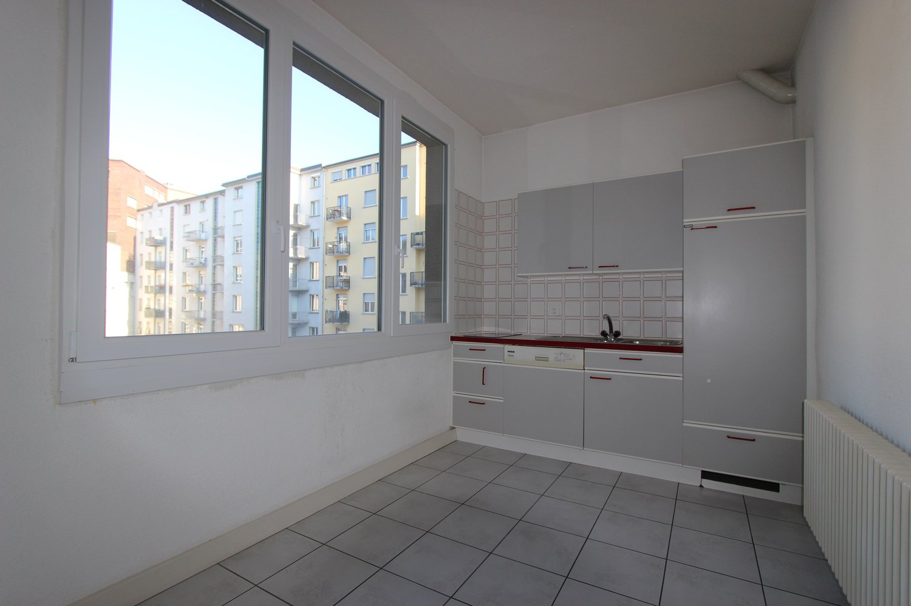
*`06.jpg` — 1500x1000 px*

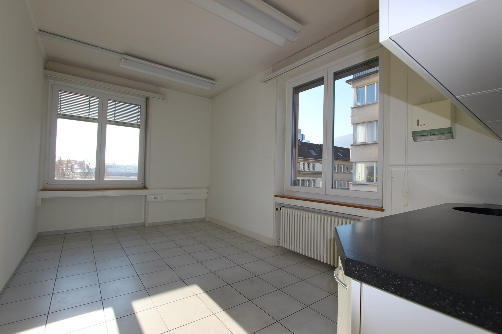
*`07.jpg` — 1500x1000 px*

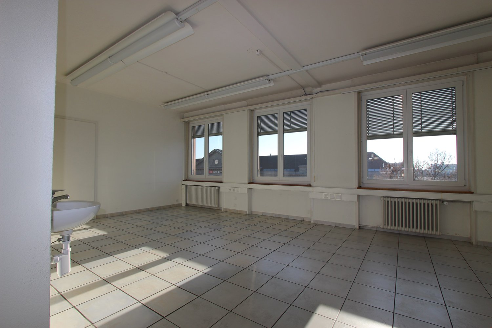
*`08.jpg` — 1500x1000 px*

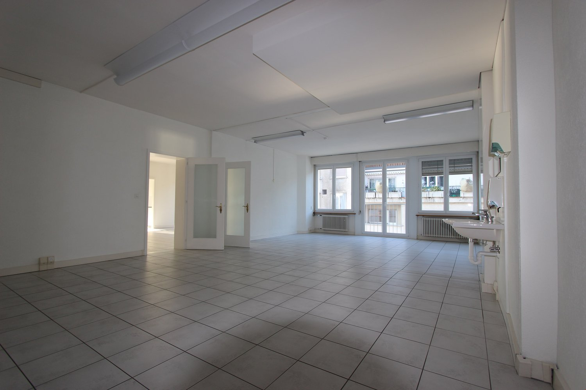
*`09.jpg` — 1500x1000 px*

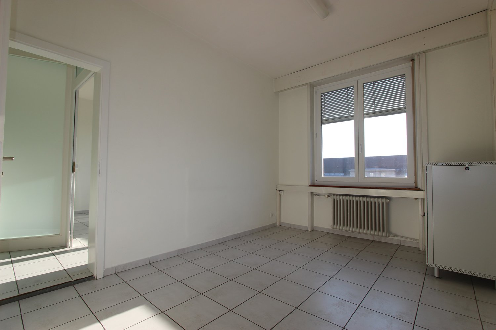
*`10.jpg` — 1500x1000 px*

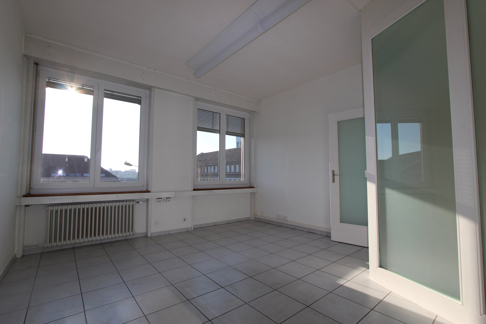
*`11.jpg` — 1500x1000 px*

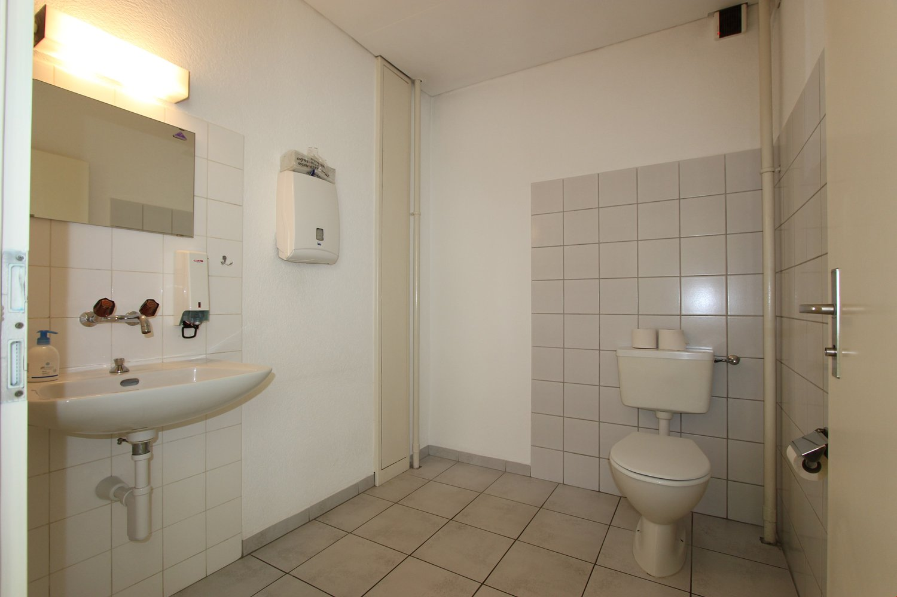
*`12.jpg` — 1500x1000 px*

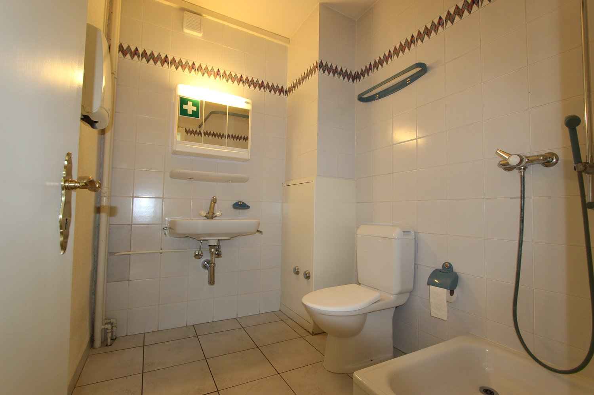
*`13.jpg` — 1500x1000 px*
