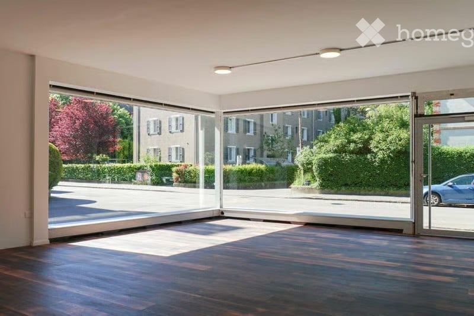
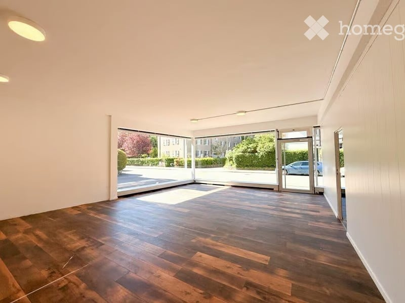
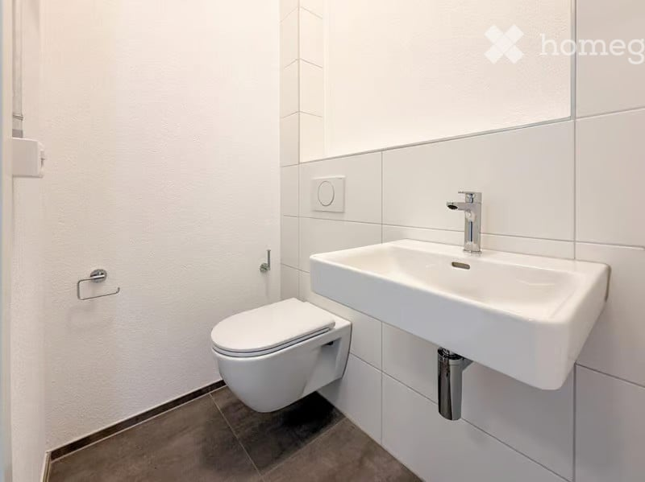
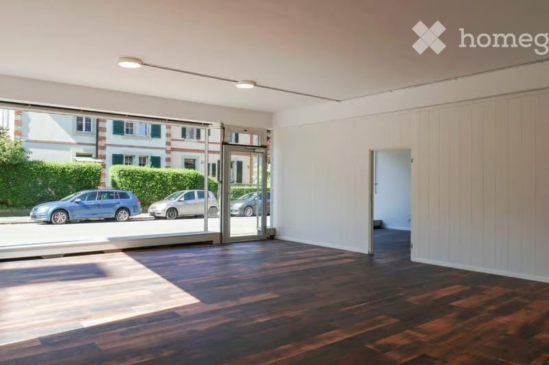
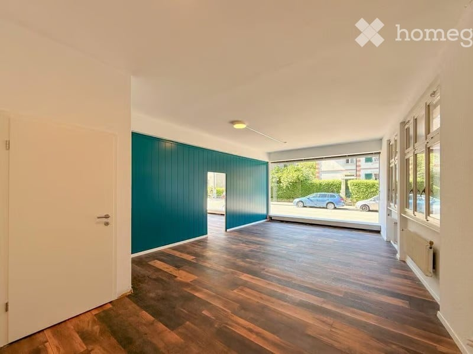
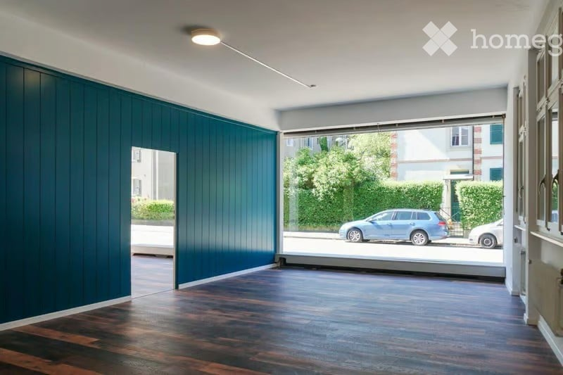
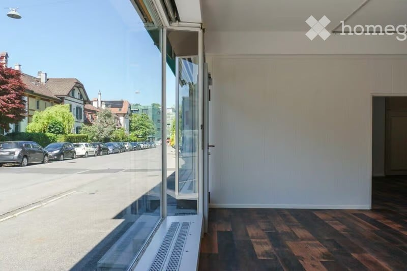

# Freiestrasse 54, 3012 Bern - CHF 2’890

> **Categorie:** `B_buero_gewerbe`  
> **Regiune:** Berna (oraș)  
> **Tip ofertă:** RENT / COMMERCIAL  
> **Sursă:** [flatfox.ch](https://flatfox.ch/de/wohnung/freiestrasse-54-3012-bern/86241731/)  
> **Descărcat:** 2026-08-17 12:37

## Date obiect

| Câmp | Valoare |
|---|---|
| Adresă | Freiestrasse 54, 3012 Bern |
| Categorie obiect | INDUSTRY |
| Tip obiect | COMMERCIAL |
| Chirie brută | CHF 2'890 |
| Preț afișat | CHF 2'890 |
| Suprafață utilă | 92 m² |
| Disponibil de la | imm |
| Referință | ..mgzri.4pn7q |

## Texte originale (germană)

**Titlu public:** Freiestrasse 54, 3012 Bern - CHF 2’890

**Titlu scurt:** 92m² Gewerbe

**Pitch:** 92m² Gewerbe in Bern mieten

**Titlu descriere:** Attraktives Ladenlokal mit grosser Schaufensterfront – 92 m²

**Titlu chirie:** 92m² Gewerbe in Bern mieten

**Spațiu afișat:** 92

### Descriere completă

An gut sichtbarer Lage erwartet Sie dieses vielseitig nutzbare Ladenlokal im Erdgeschoss mit einer Fläche von rund 92 m². Die grosszügige Schaufensterfront bietet ideale Voraussetzungen für eine ansprechende Präsentation Ihres Angebots und sorgt gleichzeitig für viel natürliches Tageslicht im Innenraum. 

Der offene und flexibel gestaltbare Grundriss eignet sich hervorragend für verschiedene Nutzungsmöglichkeiten – sei es als Verkaufsfläche, Dienstleistungsbetrieb, Studio oder modernes Büro. Eine eigene Toilette ergänzt das praktische Raumangebot und bietet zusätzlichen Komfort. 

Dank der attraktiven Lage in einem beliebten Quartier profitieren Sie von hoher Sichtbarkeit, Laufkundschaft sowie einer ausgezeichneten Erreichbarkeit mit den öffentlichen Verkehrsmitteln und dem Auto. 

Highlights 

  * Rund 92 m² Nutzfläche im Erdgeschoss 

  * Grosszügige Schaufensterfront mit optimaler Werbewirkung 

  * Heller, offener und flexibel nutzbarer Grundriss 

  * Ideal für Verkauf, Dienstleistungen, Studio oder Büro 

  * Eigene Toilette vorhanden 

  * Gut frequentierte Lage mit hoher Sichtbarkeit 

  * Hervorragende Anbindung an den öffentlichen Verkehr und das Strassennetz 

Vereinbaren Sie noch heute einen Besichtigungstermin und überzeugen Sie sich selbst von den vielseitigen Möglichkeiten dieser attraktiven Gewerbefläche.

## Dotări (attributes)

- ramp

## Ofertant

- **Nume:** Zollinger Immobilien AG
- **Stradă:** Worbstrasse 237
- **NPA:** 3073
- **Localitate:** Gümligen

## Imagini (7)

*`01.jpg` — 800x533 px*

*`02.jpg` — 800x599 px*

*`03.jpg` — 800x599 px*

*`04.jpg` — 800x533 px*

*`05.jpg` — 800x599 px*

*`06.jpg` — 800x533 px*

*`07.jpg` — 800x533 px*
