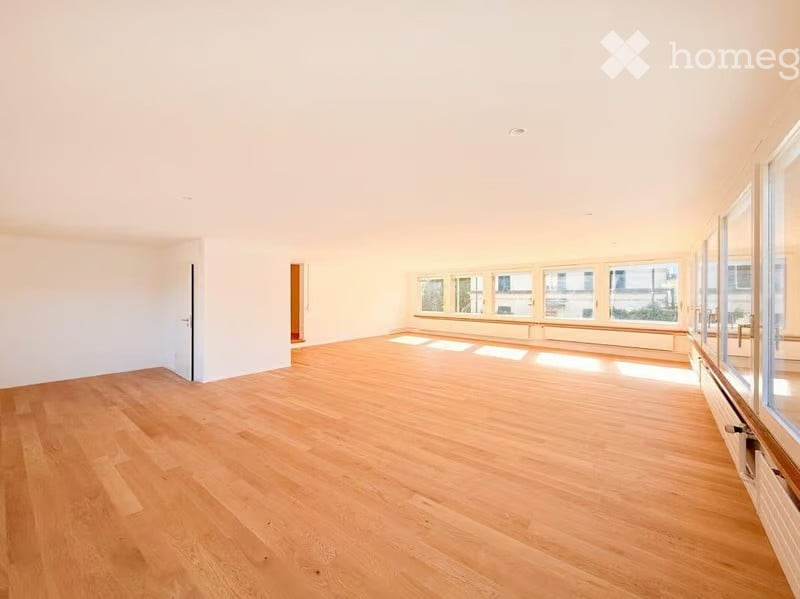
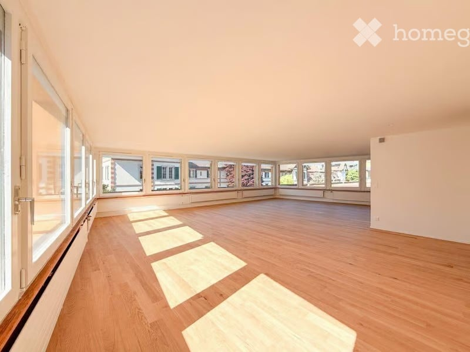
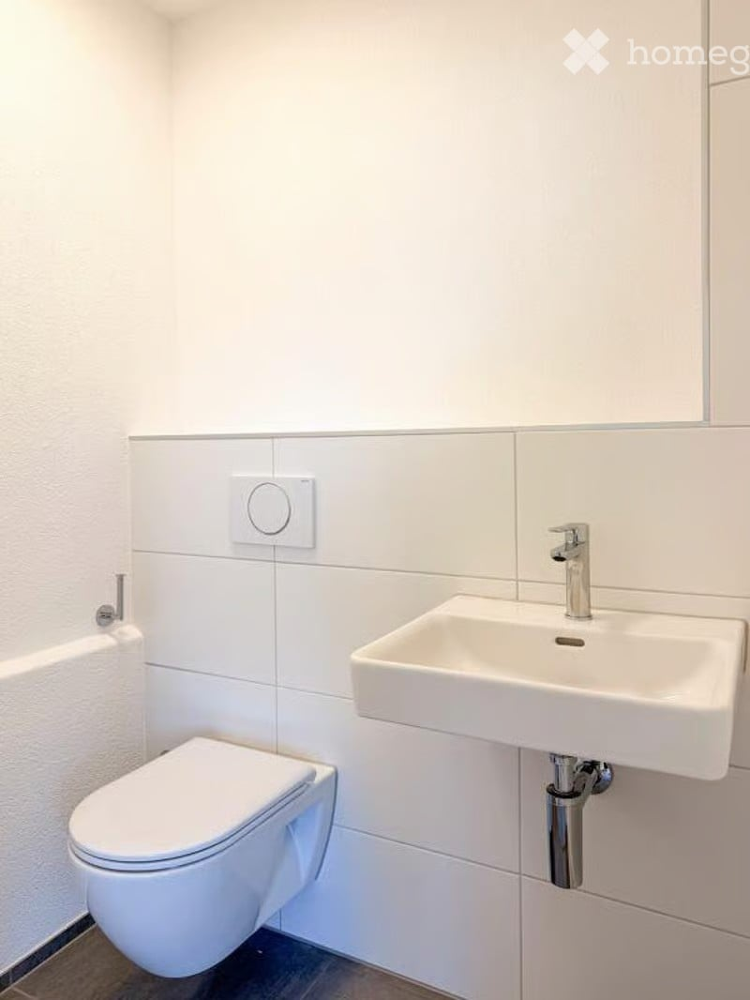
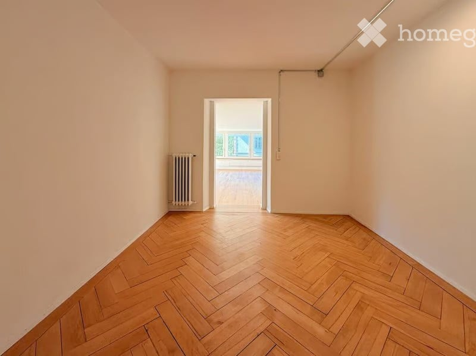
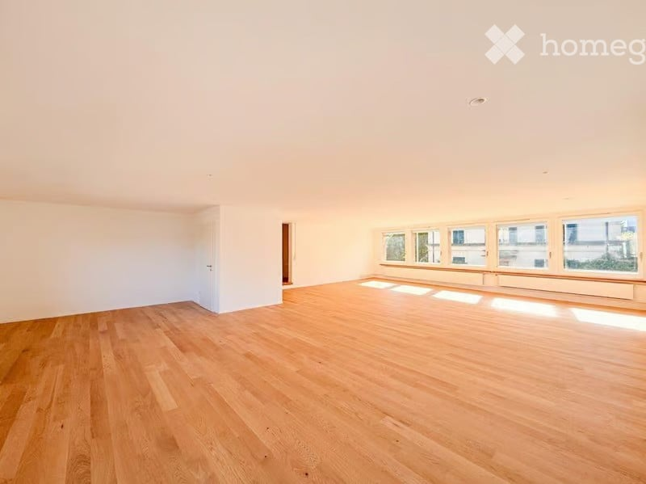

# Freiestrasse 54, 3012 Bern - CHF 2’690

> **Categorie:** `B_buero_gewerbe`  
> **Regiune:** Berna (oraș)  
> **Tip ofertă:** RENT / INDUSTRIAL_OBJECT  
> **Relevant pentru praxis:** da (praxis)  
> **Sursă:** [flatfox.ch](https://flatfox.ch/de/wohnung/freiestrasse-54-3012-bern/86241876/)  
> **Descărcat:** 2026-08-17 12:26

## Date obiect

| Câmp | Valoare |
|---|---|
| Adresă | Freiestrasse 54, 3012 Bern |
| Categorie obiect | INDUSTRY |
| Tip obiect | INDUSTRIAL_OBJECT |
| Chirie brută | CHF 2'690 |
| Preț afișat | CHF 2'690 |
| Suprafață utilă | 104 m² |
| Etaj | 1 |
| Disponibil de la | imm |
| Referință | ..5zeue.pk60h |

## Texte originale (germană)

**Titlu public:** Freiestrasse 54, 3012 Bern - CHF 2’690

**Titlu scurt:** 104m² Industrieobjekt

**Pitch:** 104m² Industrieobjekt in Bern mieten

**Titlu descriere:** Grosszügige, lichtdurchflutete Gewerbefläche an attraktiver Lage

**Titlu chirie:** 104m² Industrieobjekt in Bern mieten

**Spațiu afișat:** 104

### Descriere completă

In der begehrten Länggasse vermieten wir eine frisch renovierte und vielseitig nutzbare Gewerbefläche. Die hellen Räumlichkeiten eignen sich ideal als Büro, Praxis, Studio oder für kreative Konzepte – beispielsweise als Yoga-, Therapie- oder Bewegungsraum. 

Der hochwertige Ausbau mit edlem Eichenparkett und modernen Einbauspots schafft eine stilvolle und einladende Atmosphäre. Dank des flexiblen Grundrisses lässt sich die Fläche optimal an unterschiedliche Nutzungskonzepte anpassen. 

Ein besonderes Highlight ist der separate Eingangsbereich, der sich ideal als Empfang, Wartebereich oder repräsentative Besucherzone nutzen lässt. Ein separates WC sorgt für zusätzlichen Komfort. 

Ihre Vorteile auf einen Blick 

  * Frisch renovierte Gewerbefläche 

  * Hochwertiger Ausbau mit Eichenparkett und Einbauspots 

  * Helle, lichtdurchflutete Räume 

  * Flexible Nutzungsmöglichkeiten (Büro, Praxis, Studio oder Gewerbe) 

  * Ideal für Yoga-, Therapie-, Coaching- oder Bewegungsangebote 

  * Separater Empfangs- bzw. Eingangsbereich 

  * Separates WC 

  * Innen- und Aussenparkplätze können zusätzlich gemietet werden 

  * Attraktive Lage in der Länggasse mit ausgezeichneter Anbindung an den öffentlichen Verkehr sowie einer hervorragenden Infrastruktur 

Überzeugen Sie sich bei einer Besichtigung von den vielseitigen Möglichkeiten dieser modernen Gewerbefläche. Wir freuen uns auf Ihre Kontaktaufnahme.

## Ofertant

- **Nume:** Zollinger Immobilien AG
- **Stradă:** Worbstrasse 237
- **NPA:** 3073
- **Localitate:** Gümligen

## Imagini (5)

*`01.jpg` — 800x599 px*

*`02.jpg` — 800x599 px*

*`03.jpg` — 800x1066 px*

*`04.jpg` — 800x599 px*

*`05.jpg` — 800x599 px*
