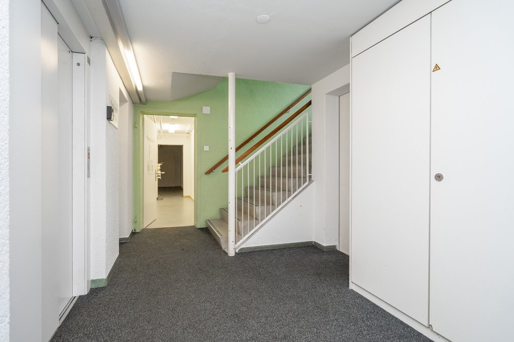
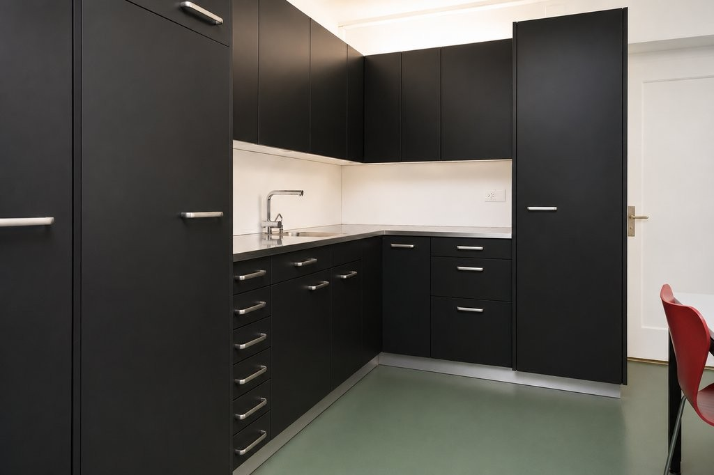
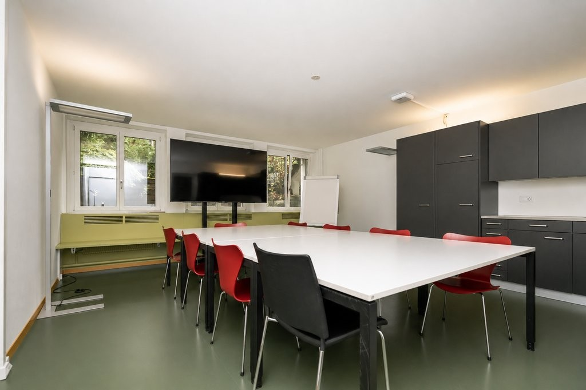
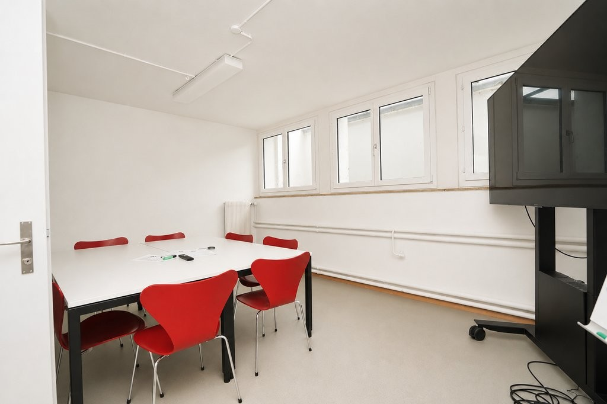
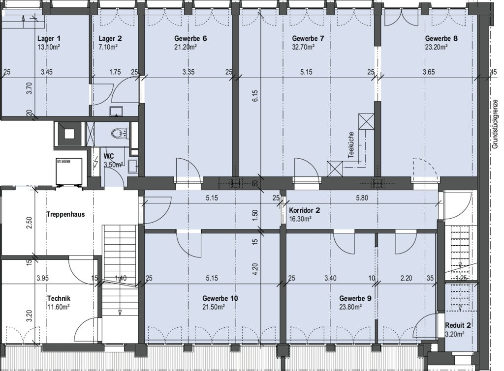

# Effingerstrasse 55, 3008 Bern - CHF 2’690 inkl. NK pro Monat

> **Categorie:** `B_buero_gewerbe`  
> **Regiune:** Berna (oraș)  
> **Tip ofertă:** RENT / COMMERCIAL  
> **Relevant pentru praxis:** da (praxis)  
> **Sursă:** [flatfox.ch](https://flatfox.ch/de/wohnung/effingerstrasse-55-3008-bern/86250352/)  
> **Descărcat:** 2026-08-17 12:27

## Date obiect

| Câmp | Valoare |
|---|---|
| Adresă | Effingerstrasse 55, 3008 Bern |
| Categorie obiect | INDUSTRY |
| Tip obiect | COMMERCIAL |
| Chirie netă | CHF 2'210 |
| Nebenkosten | CHF 480 |
| Chirie brută | CHF 2'690 |
| Preț afișat | CHF 2'690 |
| Suprafață utilă | 166 m² |
| Etaj | -1 |
| Disponibil de la | agr |
| Referință | 15301.01.39103 |

## Texte originale (germană)

**Titlu public:** Effingerstrasse 55, 3008 Bern - CHF 2’690 inkl. NK pro Monat

**Titlu scurt:** 166m² Gewerbe

**Pitch:** 166m² Gewerbe in Bern mieten

**Titlu descriere:** Ihre Idee. Ihr Raum. Ihr Erfolg.

**Titlu chirie:** 166m² Gewerbe in Bern mieten

**Spațiu afișat:** 166

### Descriere completă

**Was würden Sie aus dieser Fläche machen?**

  

Seminarräume? Kreativatelier? Yoga- oder Pilatesstudio? Coaching-Praxis? Schulungszentrum? Oder doch etwas ganz Anderes? 

  

Per sofort oder nach Vereinbarung wartet im Effingerhaus eine vielseitige Fläche darauf, mit Leben gefüllt zu werden. Im Tiefparterre gelegen - dank grosszügiger Fenster jedoch überraschend hell und mit einer angenehmen Atmosphäre für konzentriertes Arbeiten, inspirierende Begegnungen oder entspannte Bewegung. 

  

**Warum diese Fläche?**

  * Vollständig ausgebaut und sofort bezugsbereit 
  * Flexible Nutzungsmöglichkeiten realisierbar 
  * Grosszügige Teeküche und Sanitäranlage zur alleinigen Nutzung 
  * Zentrale Lage mit hervorragender Erreichbarkeit 
  * Erweiterungsmöglichkeiten mit zusätzlichen Büroflächen im 1. Obergeschoss 

  

Ihre Vision passt noch nicht ganz zum bestehenden Ausbau? Gemeinsam finden wir eine Lösung - individuelle Ausbauwünsche sind willkommen. 

  

Überzeugen Sie sich selbst und kontaktieren Sie uns noch heute! 

  

**Achtung. Eigenwerbung:** Sie ziehen in eine Mietwohnung und benötigen Unterstützung für den bestmöglichen Verkauf Ihrer Immobilie? Kontaktieren Sie die Dr.Meyer Immobilien AG für eine unverbindliche Offerte **\- wir sind gut darin.**

## Dotări (attributes)

- lift

## Ofertant

- **Nume:** Dr.Meyer Immobilien AG
- **Stradă:** Morgenstrasse 83A
- **NPA:** 3018
- **Localitate:** Bern

## Imagini (6)

*`01.jpg` — 1024x683 px — Aussenansicht*

*`02.jpg` — 1024x683 px — Treppenabgang*

*`03.jpg` — 1024x682 px — Teeküche*

*`04.jpg` — 1024x682 px — Pausenraum / Sitzungszimmer*

*`05.jpg` — 1024x682 px — Büro / Atelier*

*`06.jpg` — 1024x755 px — Grundrissplan*
