# Chasseralstrasse 156, 3095 Spiegel b. Bern / Spiegel - CHF 3’818

> **Categorie:** `B_buero_gewerbe`  
> **Regiune:** Cantonul Berna  
> **Tip ofertă:** RENT / OFFICE  
> **Relevant pentru praxis:** da (praxen)  
> **Sursă:** [flatfox.ch](https://flatfox.ch/de/wohnung/chasseralstrasse-156-3095-spiegel-b-bern-spiegel/86251117/)  
> **Descărcat:** 2026-08-17 12:37

## Date obiect

| Câmp | Valoare |
|---|---|
| Adresă | Chasseralstrasse 156, 3095 Spiegel b. Bern / Spiegel |
| Categorie obiect | INDUSTRY |
| Tip obiect | OFFICE |
| Chirie netă | CHF 3'129 |
| Nebenkosten | CHF 689 |
| Chirie brută | CHF 3'818 |
| Preț afișat | CHF 3'818 |
| Disponibil de la | agr |
| Referință | ..ZO2479 |

## Texte originale (germană)

**Titlu public:** Chasseralstrasse 156, 3095 Spiegel b. Bern / Spiegel - CHF 3’818

**Titlu scurt:** Büro

**Pitch:** Büro in Spiegel b. Bern / Spiegel mieten

**Titlu descriere:** Büroräumlichkeiten im Spiegel in Bern!

**Titlu chirie:** Büro in Spiegel b. Bern / Spiegel mieten

### Descriere completă

Attraktive Büro Gewerbefläche an der Chasseralstrasse 156 in Spiegel bei Bern. Die Liegenschaft bietet vielseitige Nutzungsmöglichkeiten und eignet sich ideal für Büros, Dienstleistungsbetriebe oder Praxen.   
Im Erdgeschoss befinden sich drei abschliessbare Büroräume, ein separater Serverraum, eine kompakte Teeküche sowie ein kleiner Garderobenbereich. Das Untergeschoss umfasst zwei WC Anlagen, einen ehemaligen Banktresor sowie zwei zusätzliche Räume für Lagerzwecke.   
Die Lage überzeugt durch die Nähe zur Stadt Bern, eine gute Erreichbarkeit mit Auto und ÖV sowie eine sehr praktische Umgebung im Alltag. Migros und Restaurant befinden sich direkt nebenan.   
  
Highlights:   
\- ehemalige Bankfläche mit solider Infrastruktur   
\- Tresorraum mit erhöhter Sicherheit   
\- ruhiges Umfeld mit gleichzeitiger Kundennähe   
\- gute Sichtbarkeit und einfache Auffindbarkeit   
\- kurze Wege ins Zentrum von Bern   
\- Parkplatz bei der Liegenschaft   
  
Gerne geben wir Ihnen weitere Informationen oder zeigen Ihnen die Räumlichkeiten bei einer Besichtigung. Wir freuen uns auf Ihre Kontaktaufnahme.

## Ofertant

- **Nume:** Zollinger Immobilien AG
- **Stradă:** Worbstrasse 237
- **NPA:** 3073
- **Localitate:** Muri bei Bern / Gümligen

## Imagini (13)

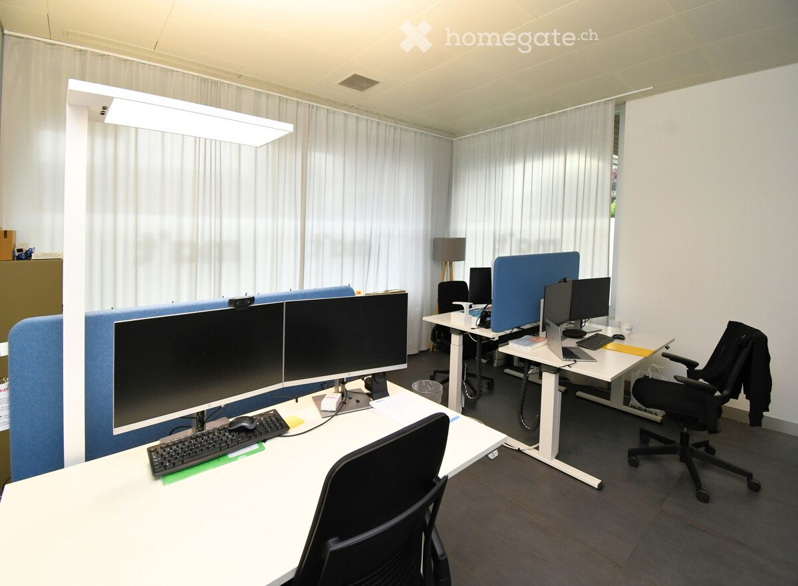
*`01.jpg` — 1200x882 px — Bild 6*

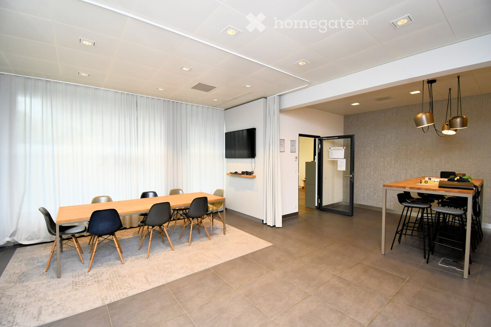
*`02.jpg` — 1200x800 px — Bild 2*

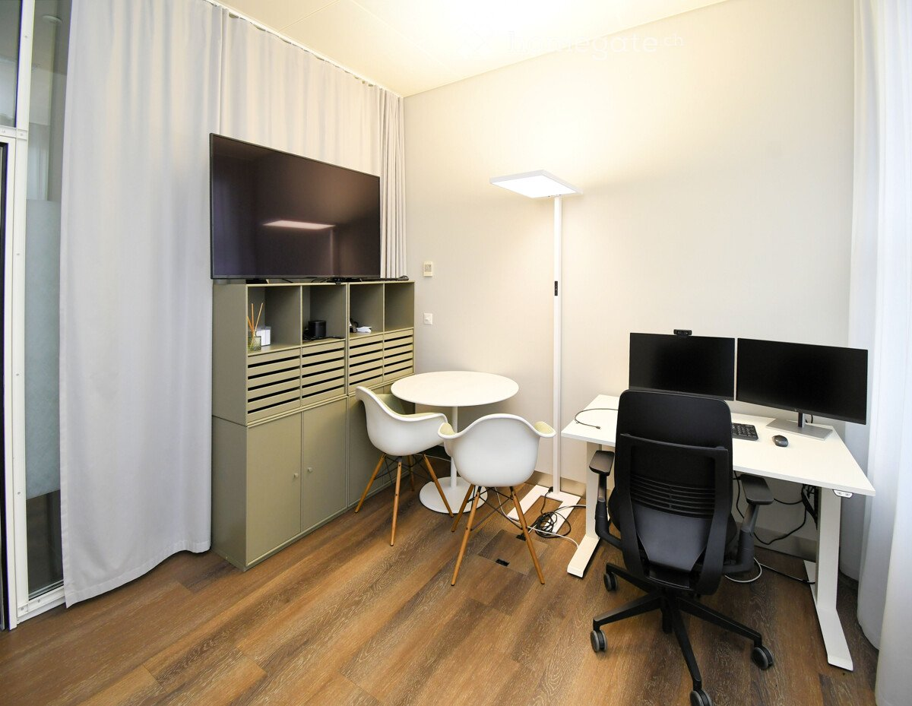
*`03.jpg` — 1200x929 px — Bild 7*

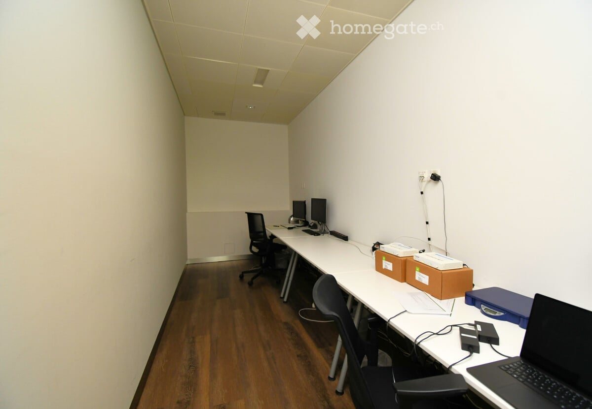
*`04.jpg` — 1200x831 px — Bild 5*

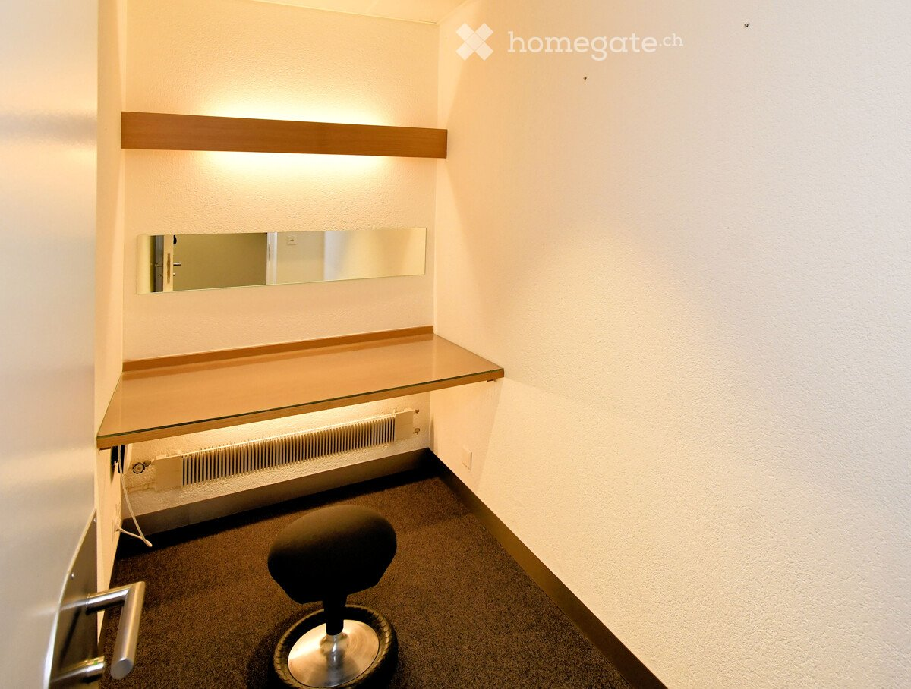
*`05.jpg` — 1200x908 px — Bild 11*

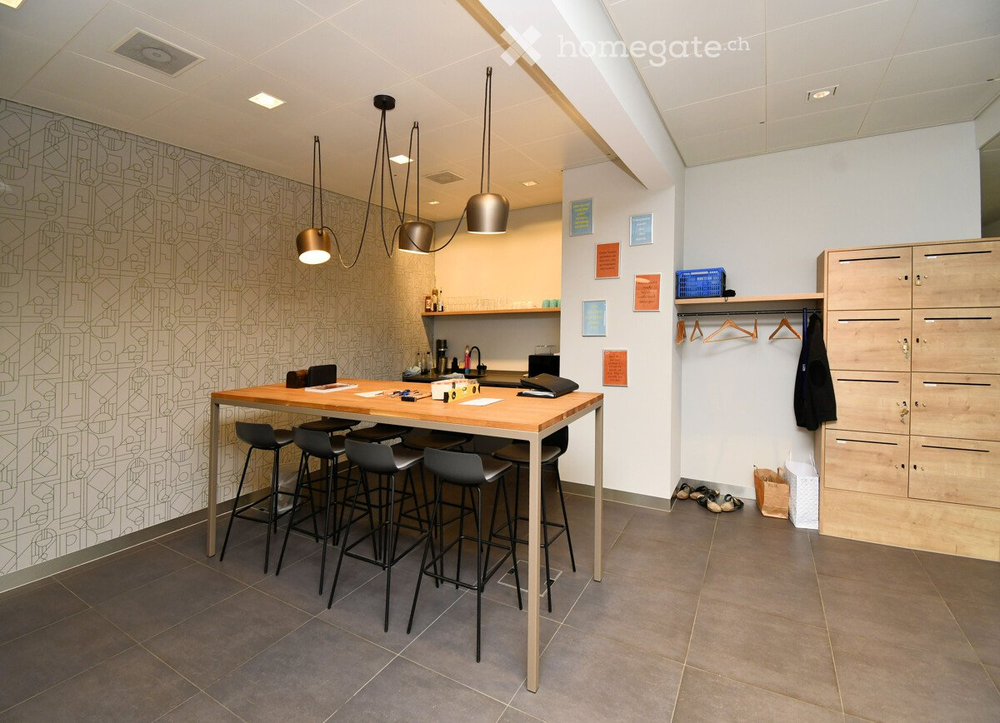
*`06.jpg` — 1200x868 px — Bild 4*

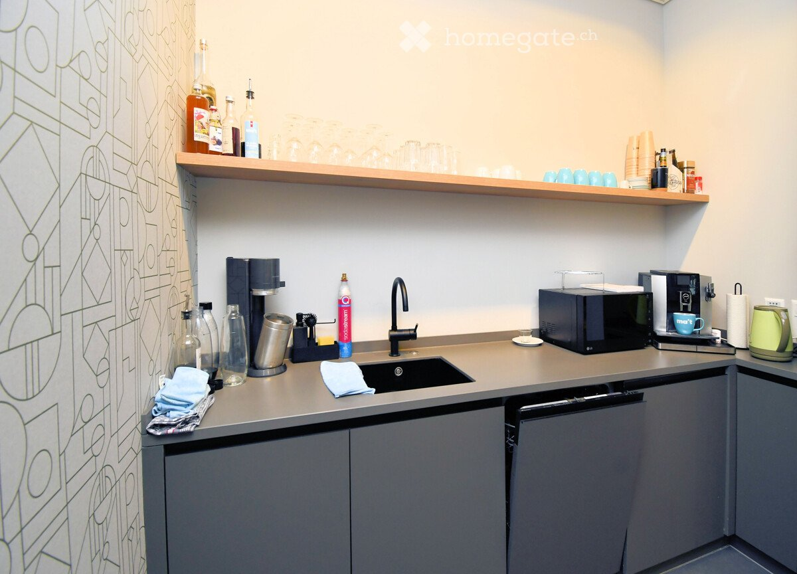
*`07.jpg` — 1200x864 px — Bild 3*

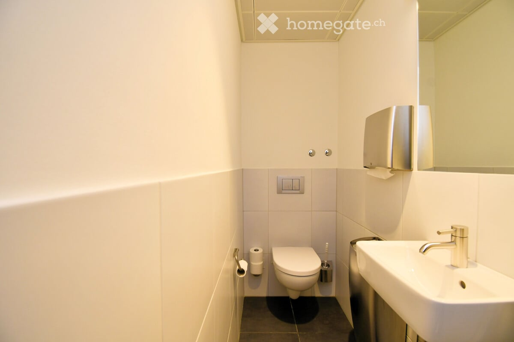
*`08.jpg` — 1200x800 px — Bild 8*

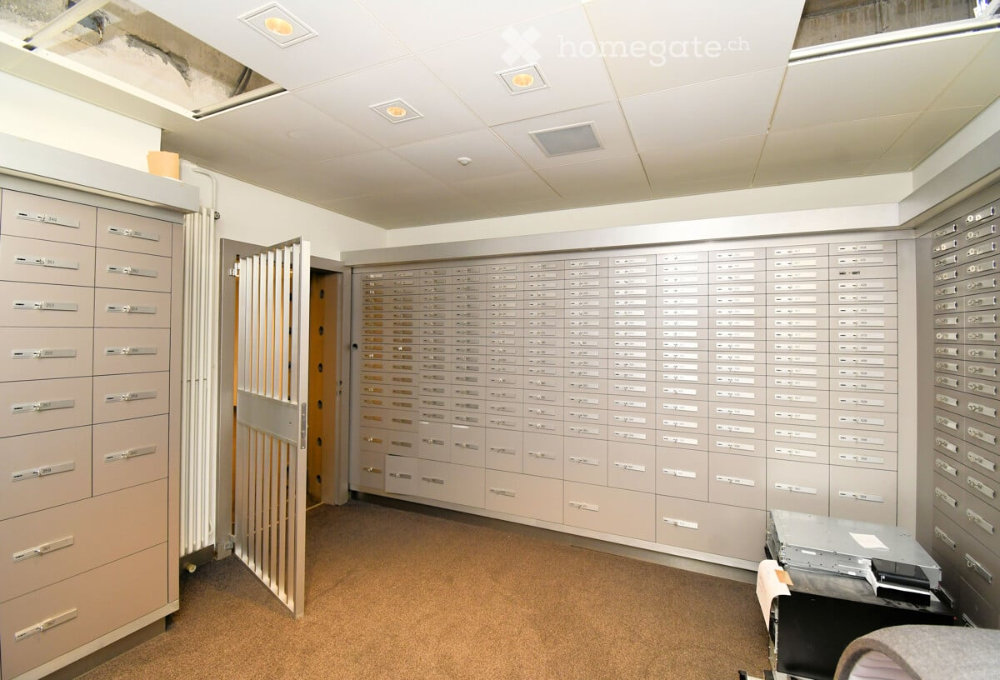
*`09.jpg` — 1200x816 px — Bild 9*

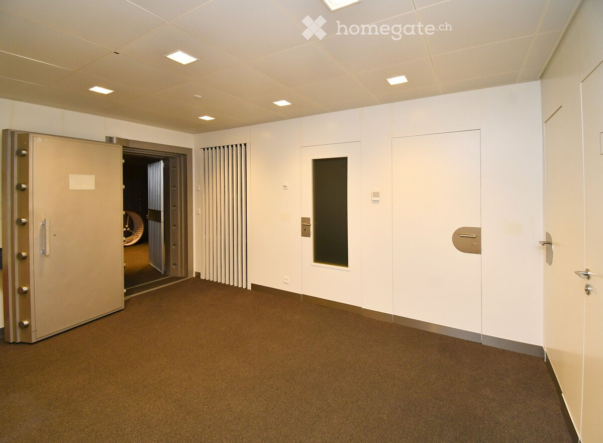
*`10.jpg` — 1200x881 px — Bild 12*

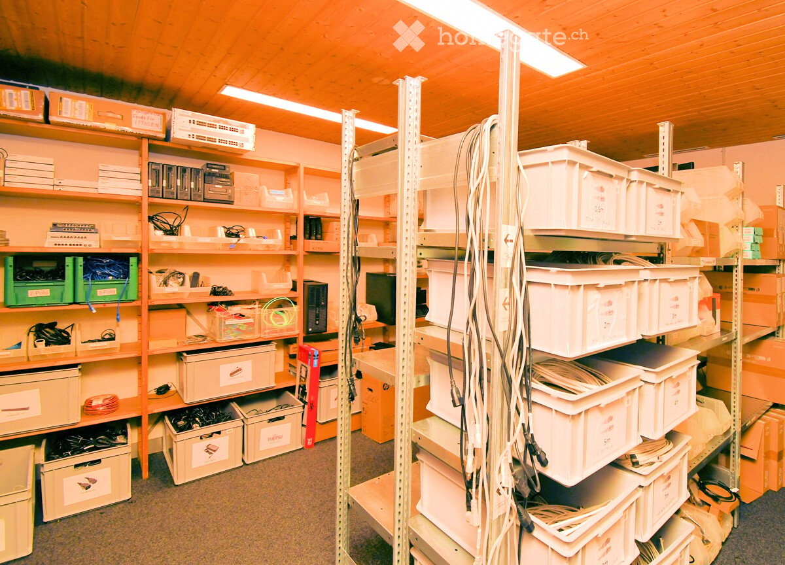
*`11.jpg` — 1200x864 px — Bild 10*

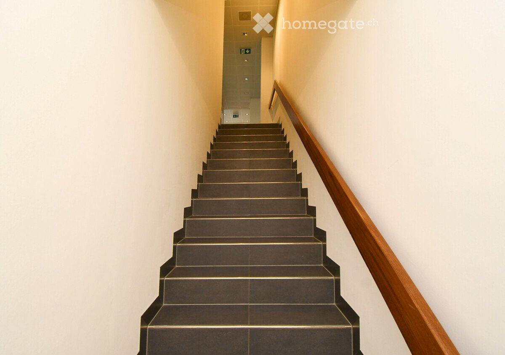
*`12.jpg` — 1200x843 px — Bild 13*

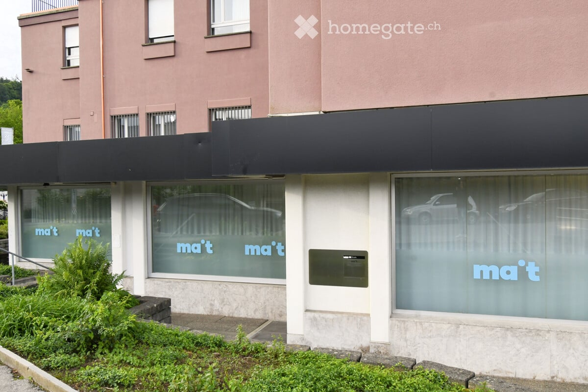
*`13.jpg` — 1200x800 px — Bild 14*
