# Zentralstrasse 99, 2503 Biel/Bienne - CHF 3’210

> **Categorie:** `B_buero_gewerbe`  
> **Regiune:** Cantonul Berna  
> **Tip ofertă:** RENT / SHOP  
> **Relevant pentru praxis:** da (praxis)  
> **Sursă:** [flatfox.ch](https://flatfox.ch/de/wohnung/zentralstrasse-99-2503-bielbienne/86254562/)  
> **Descărcat:** 2026-08-17 12:27

## Date obiect

| Câmp | Valoare |
|---|---|
| Adresă | Zentralstrasse 99, 2503 Biel/Bienne |
| Categorie obiect | INDUSTRY |
| Tip obiect | SHOP |
| Chirie netă | CHF 2'800 |
| Nebenkosten | CHF 410 |
| Chirie brută | CHF 3'210 |
| Preț afișat | CHF 3'210 |
| Suprafață utilă | 105 m² |
| Etaj | 0 |
| Disponibil de la | imm |
| Referință | .1782652.8bbe6b9f-922f-11f1-a4e0-069ae14c7a06 |

## Texte originale (germană)

**Titlu public:** Zentralstrasse 99, 2503 Biel/Bienne - CHF 3’210

**Titlu scurt:** 105m² Ladenfläche

**Pitch:** 105m² Ladenfläche in Biel/Bienne mieten

**Titlu descriere:** Geschäftslokal an Top-Lage in Biel zu vermieten

**Titlu chirie:** 105m² Ladenfläche in Biel/Bienne mieten

**Spațiu afișat:** 105

### Descriere completă

Biel 

**Ladenfläche zu vermieten - Zentralstrasse 99, 2502 Biel/Bienne**

An zentraler und gut frequentierter Lage in Biel vermieten wir per 1. August 2026 eine attraktive, helle und vielseitig nutzbare Gewerbefläche mit grosszügigen Schaufenstern. 

Die Räumlichkeiten eignen sich ideal für Detailhandel, Dienstleistungsbetriebe, Showroom, Studio, Praxis oder Büronutzung - beispielsweise für Architektur-, Treuhand-, Planungs-, Beratungs- oder Kreativbüros. 

Die grossen Fensterfronten sorgen für optimale Sichtbarkeit und viel Tageslicht, was sowohl für Verkaufs- als auch für Büronutzungen eine angenehme Arbeitsatmosphäre schafft. 

**Ausstattung & Highlights **

  * Ladenfläche: ca. 105 m² 
  * Lagerraum: ca. 31 m² 
  * Keller: zusätzliche Lagerfläche 
  * Schaufenster: grosse, gut sichtbare Fensterfront 
  * Verfügbarkeit: ab 1. August 2026 
  * Detailhandel, Boutique, Studio, Büro (z. B. Architektur, Treuhand, Beratung), Praxis oder Dienstleistung 

  
**Lage**   
Die Liegenschaft befindet sich an gut frequentierter Lage an der Zentralstrasse in Biel/Bienne. Die zentrale Position bietet optimale Erreichbarkeit sowohl für Kundschaft als auch für Mitarbeitende. Öffentliche Verkehrsmittel sowie diverse Einkaufsmöglichkeiten befinden sich in unmittelbarer Nähe. 

**Hinweis: Die Bilder zeigen eine digitale Visualisierung einer möglichen Einrichtung. Das Lokal wird unmöbliert vermietet.**

  
**Besonderheiten**

  * Sehr gute Visibilität dank grossen Schaufenstern 
  * Attraktive Innenstadtlage 
  * Flexible Nutzungsmöglichkeiten 
  * Zusätzlicher Stauraum durch Lager und Keller 
  * Helle und freundliche Verkaufsfläche 

**Parkplätze**

Auf Wunsch können bis zu zwei Aussenparkplätze für je CHF 100.00 dazugemietet werden. 

**Kontakt**   
Für weitere Informationen oder zur Vereinbarung eines Besichtigungstermins freuen wir uns auf Ihre Kontaktaufnahme. 

____________________________________________________ 

**Surface commerciale à louer - Rue Centrale 99, 2502 Biel/Bienne**

Dans un emplacement central et très fréquenté à Bienne, nous louons à partir du 1er août 2026 un espace commercial attrayant, lumineux et polyvalent avec de grandes vitrines. 

Les locaux sont idéaux pour le commerce de détail, les entreprises de services, les showrooms, les studios, les cabinets ou les bureaux, par exemple pour les cabinets d'architecture, les fiduciaires, les bureaux d'études, les cabinets de conseil ou les bureaux créatifs. 

Les grandes baies vitrées offrent une visibilité optimale et beaucoup de lumière naturelle, ce qui crée une atmosphère de travail agréable tant pour la vente que pour les bureaux. 

**Équipement et points forts**

  * Surface commerciale : environ 105 m² 
  * Espace de stockage : environ 31 m² 
  * Cave : espace de stockage supplémentaire 
  * Vitrines : grandes baies vitrées bien visibles 
  * Disponibilité : à partir du 1er août 2026 
  * Commerce de détail, boutique, studio, bureau (p. ex. architecture, fiduciaire, conseil), cabinet ou prestation de services   

**Situation**

Le bien immobilier est situé dans un endroit très fréquenté de la Zentralstrasse à Bienne. Sa position centrale offre une accessibilité optimale tant pour la clientèle que pour les employés. Les transports publics et divers commerces se trouvent à proximité immédiate. 

**Remarque : les photos présentent une représentation numérique d'un aménagement possible. Le local est loué non meublé.**

**Particularités**

  * Très bonne visibilité grâce à de grandes vitrines 
  * Situation attrayante en centre-ville 
  * Possibilités d'utilisation flexibles 
  * Espace de rangement supplémentaire grâce à un entrepôt et une cave 
  * Surface de vente lumineuse et agréable 

**Place de parc**

Sur demande, il est possible de louer jusqu'à deux places de stationnement extérieures pour CHF 100.00 chacune. 

**Contact**

Pour plus d'informations ou pour convenir d'un rendez-vous pour une visite, n'hésitez pas à nous contacter.

## Dotări (attributes)

- parkingspace

## Ofertant

- **Nume:** MB2 Immobilien AG
- **Stradă:** Mühlebrücke 2
- **NPA:** 2500
- **Localitate:** Biel/Bienne

## Imagini (11)

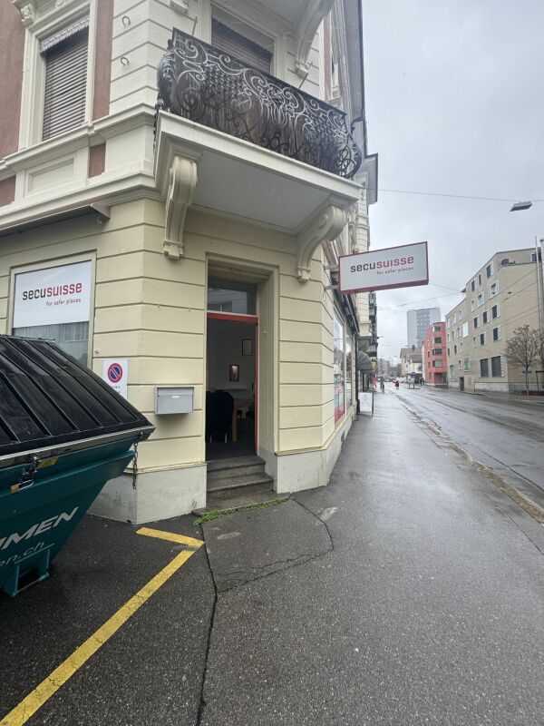
*`01.jpg` — 600x800 px*

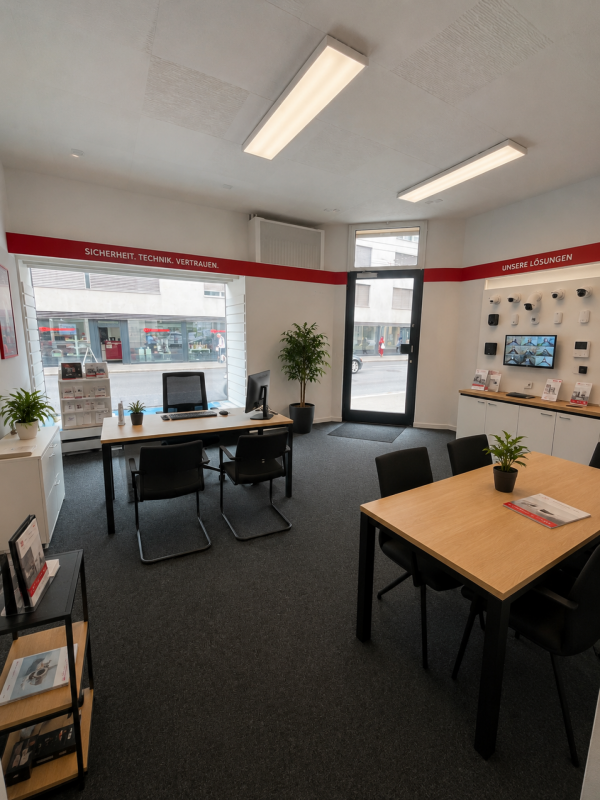
*`02.png` — 600x800 px*

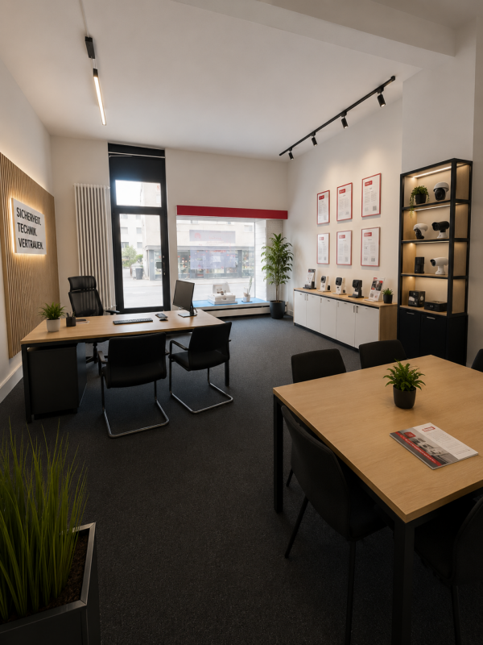
*`03.png` — 600x800 px*

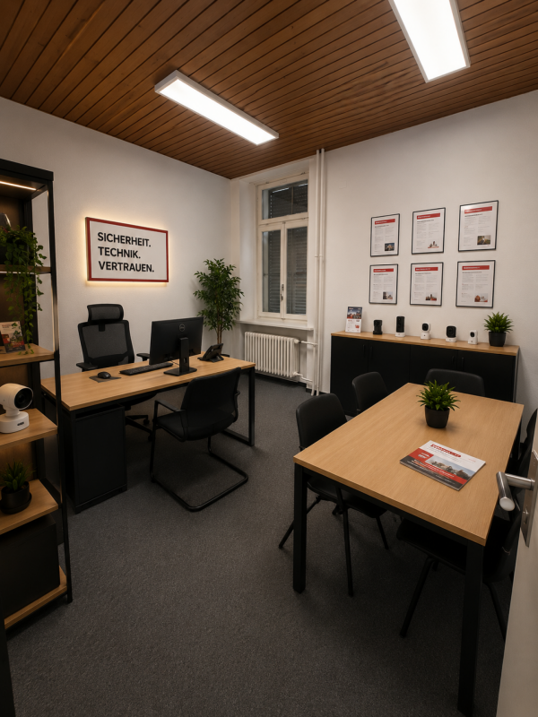
*`04.png` — 600x800 px*

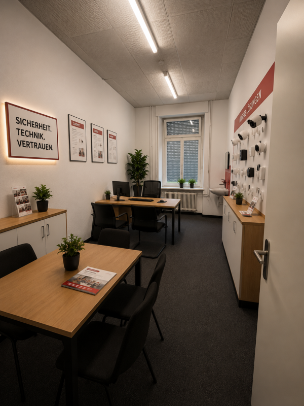
*`05.png` — 600x800 px*

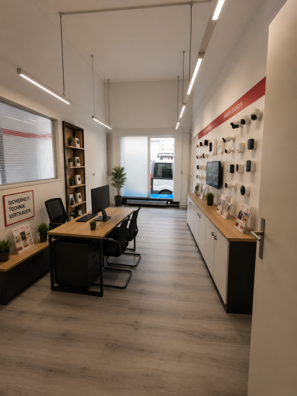
*`06.png` — 600x800 px*

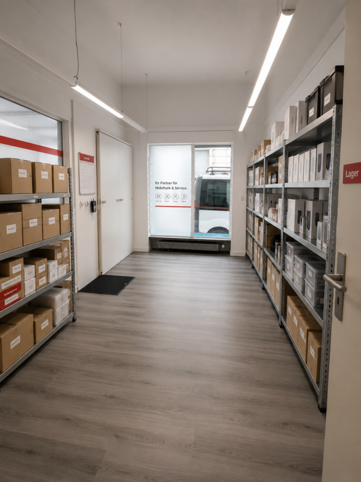
*`07.png` — 600x800 px*

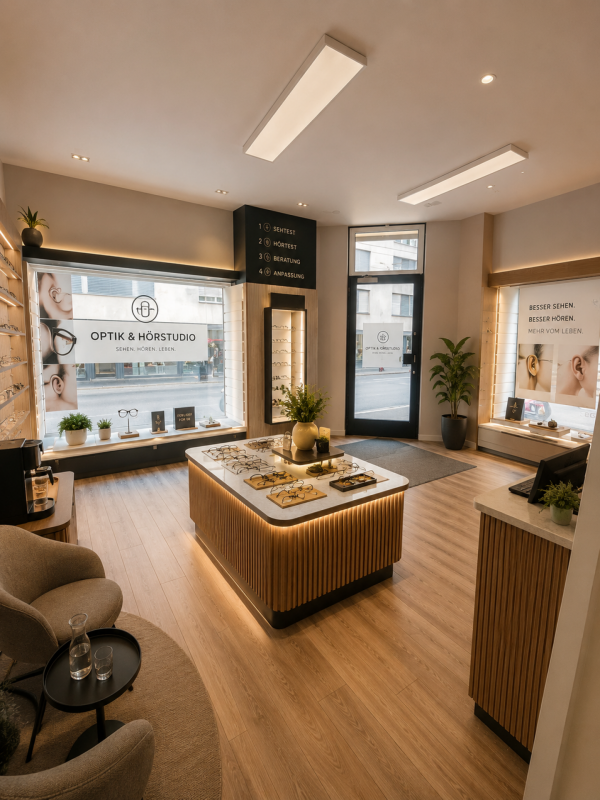
*`08.png` — 600x800 px*

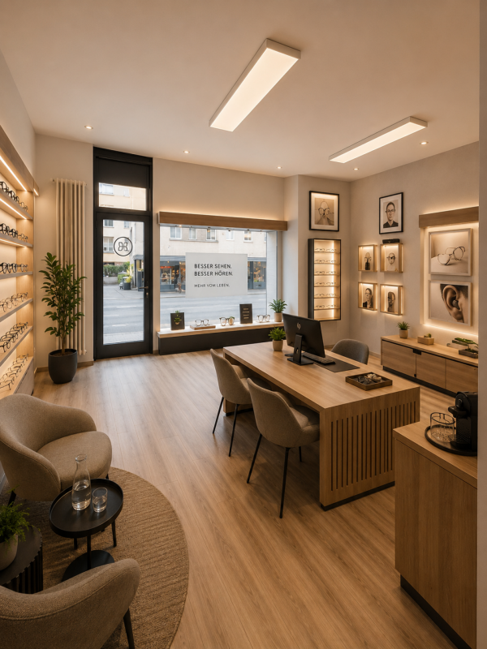
*`09.png` — 600x800 px*

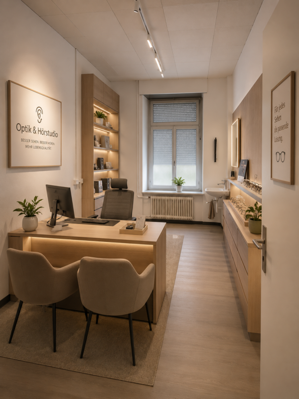
*`10.png` — 600x800 px*

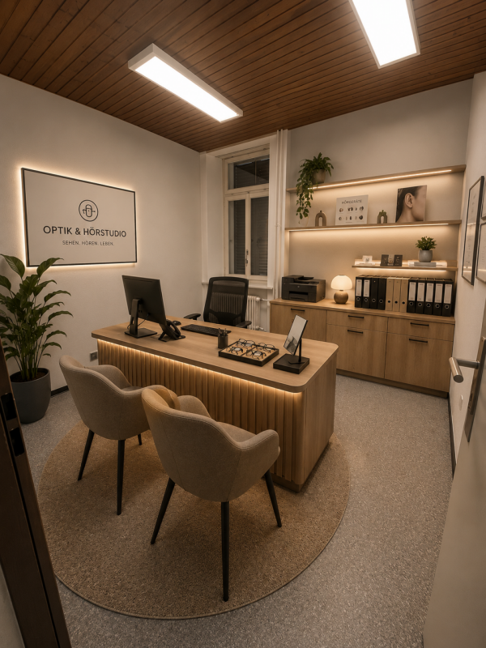
*`11.png` — 600x800 px*
