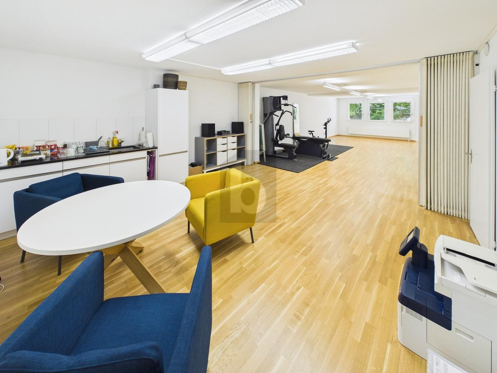
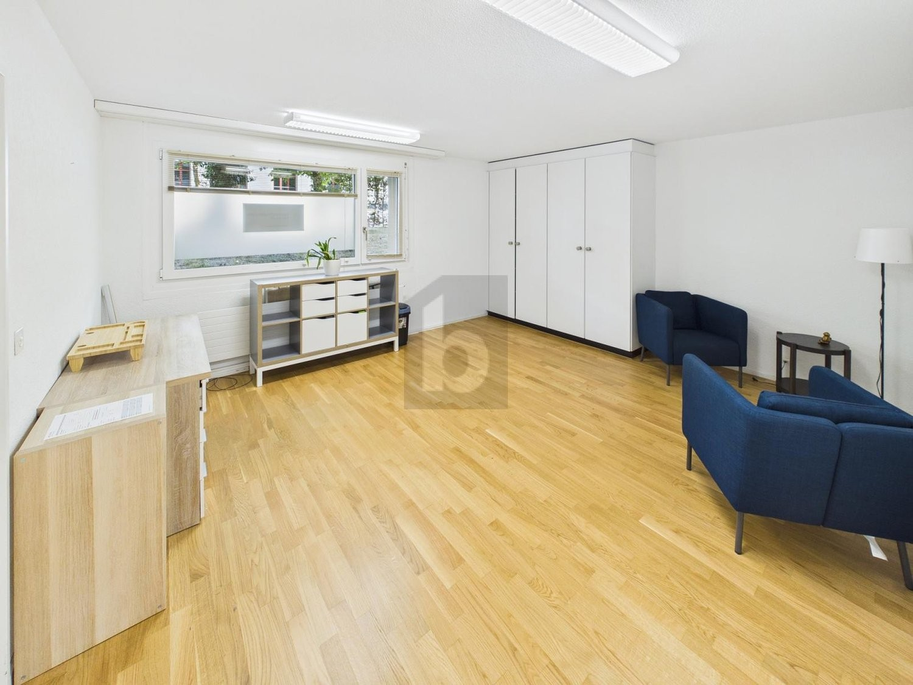
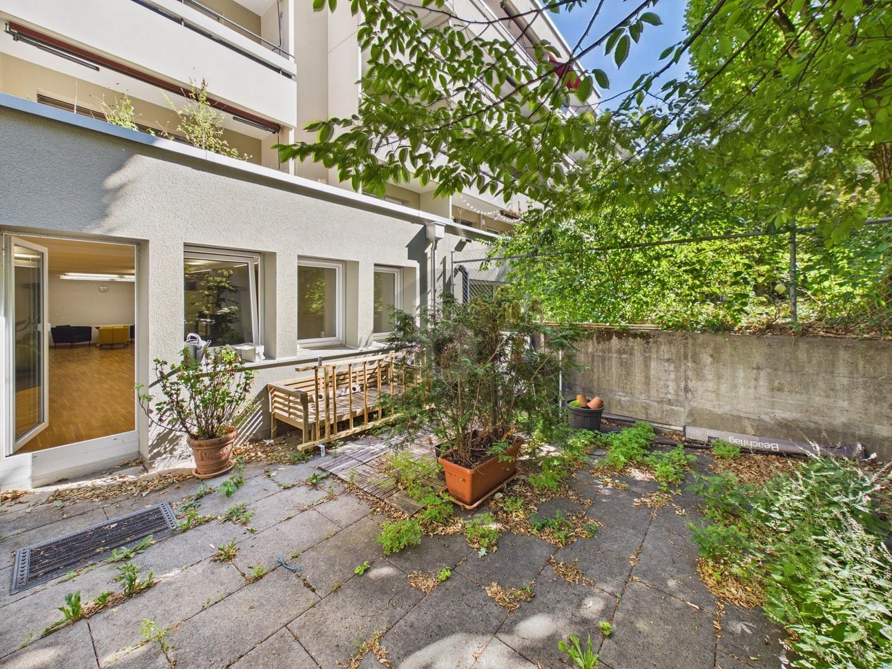
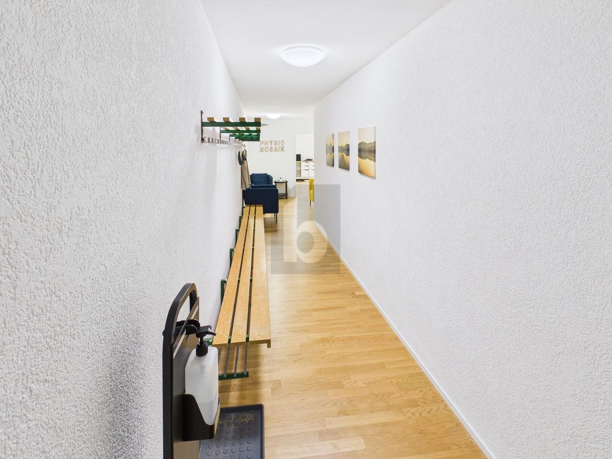

# Auf Anfrage, 3012 Bern - CHF 3’120 inkl. NK pro Monat

> **Categorie:** `B_buero_gewerbe`  
> **Regiune:** Berna (oraș)  
> **Tip ofertă:** RENT / OFFICE  
> **Relevant pentru praxis:** da (behandlungszimmer, praxis)  
> **Sursă:** [flatfox.ch](https://flatfox.ch/de/wohnung/auf-anfrage-3012-bern/86258245/)  
> **Descărcat:** 2026-08-17 12:29

## Date obiect

| Câmp | Valoare |
|---|---|
| Adresă | Auf Anfrage, 3012 Bern |
| Categorie obiect | INDUSTRY |
| Tip obiect | OFFICE |
| Chirie netă | CHF 2'835 |
| Nebenkosten | CHF 285 |
| Chirie brută | CHF 3'120 |
| Preț afișat | CHF 3'120 |
| Suprafață utilă | 136 m² |
| Suprafață teren | 0 m² |
| Etaj | 0 |
| Disponibil de la | agr |
| Referință | ..1412236 |

## Texte originale (germană)

**Titlu public:** Auf Anfrage, 3012 Bern - CHF 3’120 inkl. NK pro Monat

**Titlu scurt:** 136m² Büro

**Pitch:** 136m² Büro in Bern mieten

**Titlu descriere:** ZENTRAL, GEPFLEGT UND VIELSEITIG NUTZBAR

**Titlu chirie:** 136m² Büro in Bern mieten

**Spațiu afișat:** 136

### Descriere completă

Diese lichtdurchflutete 3-Zimmer-Bürofläche im beliebten Länggassquartier vereint zentrale Lage mit angenehmer Ruhe. Grosszügige Räume schaffen eine professionelle, gleichzeitig entspannte Arbeitsatmosphäre - ideal für Teams, Einzelunternehmen oder eine Praxis mit Empfang und Behandlungszimmern. Dank flexibler Nutzung eignet sich die Fläche auch hervorragend für Therapie- oder Beratungsräume. Eine kleine Büroküche ist integriert, der Aussensitzplatz im Grünen lädt zu Pausen ein. Einstellhallenplatz optional (CHF 145.-/Monat).   
  
Dieses BETTERHOMES-Angebot zeichnet sich durch folgende Vorteile aus:   
\- zentrale und doch ruhige Lage in Länggassquartier   
  
\- lichtdurchflutete und grosszügige Räumlichkeiten   
  
\- vielseitige Nutzung als Büro, Praxis oder Therapieräume möglich   
  
\- kleine Büroküche eingebaut   
  
\- Aussensitzplatz im Grünen   
  
\- Einstellhallenplatz optional CHF 145.-/mtl.   
  
\- und, und, und ...   
  
  
Interessiert? Kontaktieren Sie uns für eine unverbindliche Besichtigung – auch Online-Besichtigung möglich!   
  
Nichts Passendes gefunden? Über 2'000 weitere Angebote unter: www.betterhomes.ch - der Immobilienfairmittler®   
  
Selber eine Immobilie zu vermarkten?   
Profitieren Sie von unserem Know-how: https://www.betterhomes.ch/de/profitieren   
  
Sie möchten eine Immobilie schätzen lassen?   
Erfahren Sie jetzt ihren Wert über unsere Gratis-Schätzung, sofort und unverbindlich!   
https://www.betterhomes.ch/de/knowledge/estimation   
  
  
Mehr Details   
Lage: zentral   
Zustand: gut   
  
Bäder / Nasszellen: 1 (1x WC / Lavabo)   
Öffentliche Verkehrsmittel: Bus, 100 m   
Geschäfte: Migros, 100 m / diverse Geschäfte in unmittelbarer Umgebung

## Dotări (attributes)

- accessiblewithwheelchair

## Ofertant

- **Nume:** BETTERHOMES (Schweiz) AG
- **Stradă:** Weltpoststrasse 3E
- **NPA:** 3015
- **Localitate:** Bern

## Imagini (4)

*`01.jpg` — 1500x1125 px*

*`02.jpg` — 1500x1125 px*

*`03.jpg` — 1500x1125 px*

*`04.jpg` — 1500x1125 px*

## Media suplimentară

- **website_url:** https://www.betterhomes.ch/de/immobilie-suchen/detail/objectId/536fbd6fbfce231a2d63c24b9a68c649
