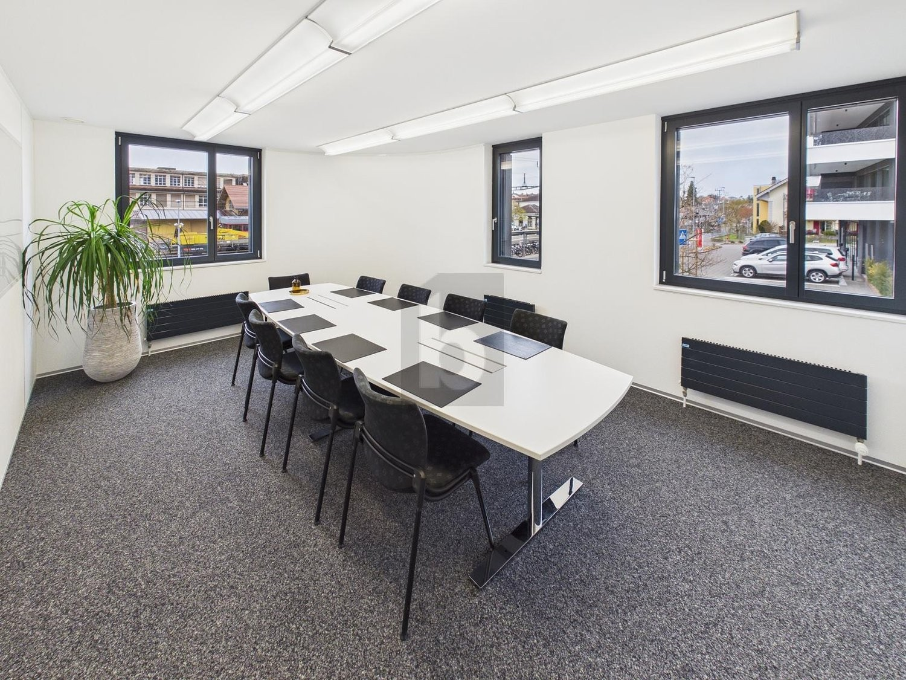
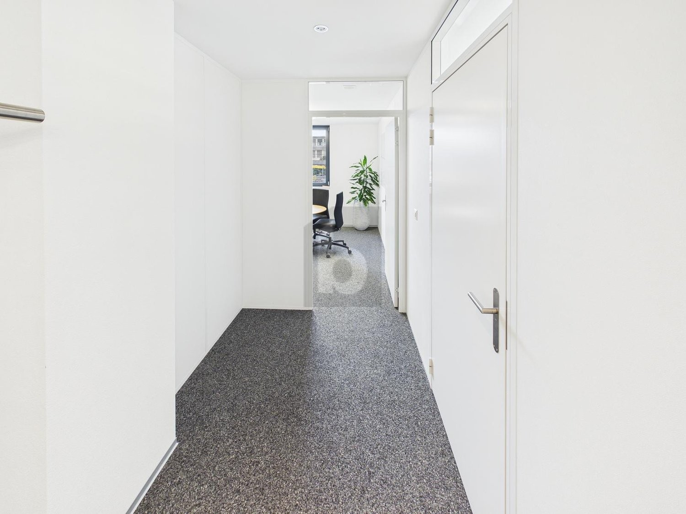
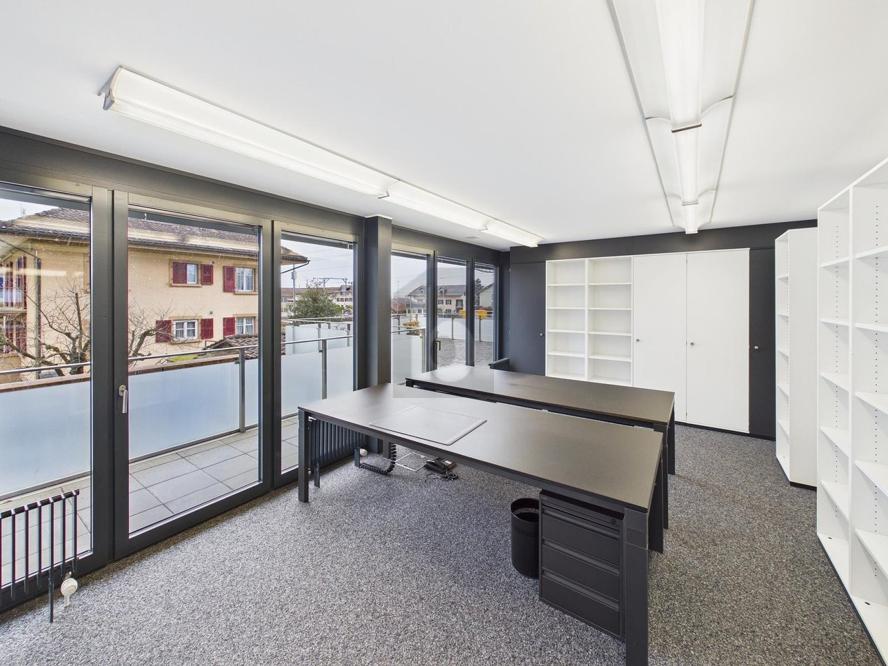
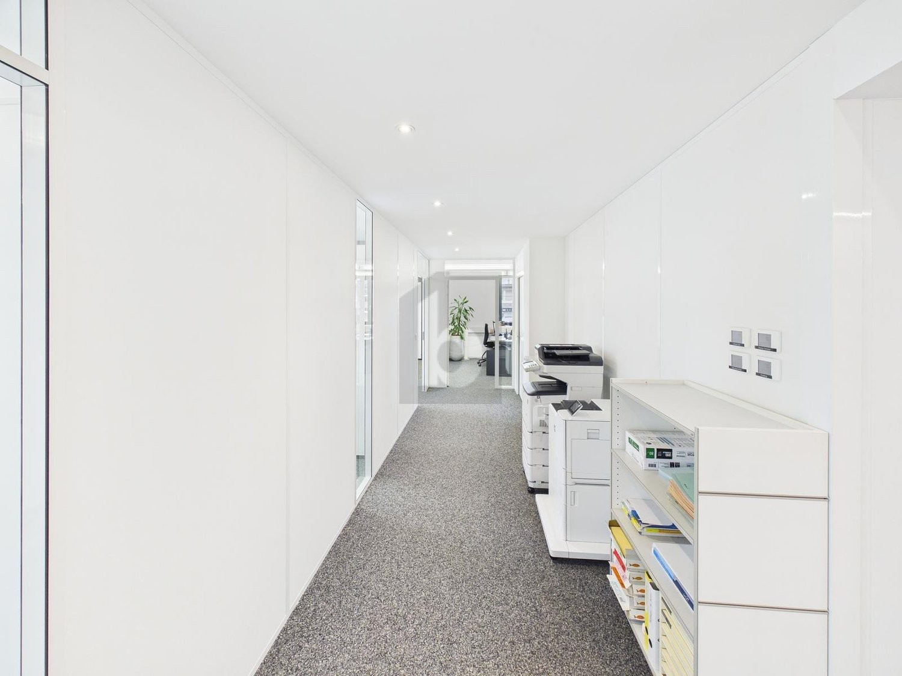

# Auf Anfrage, 3280 Murten - CHF 1’980 inkl. NK pro Monat

> **Categorie:** `B_buero_gewerbe`  
> **Regiune:** Cantonul Berna  
> **Tip ofertă:** RENT / OFFICE  
> **Relevant pentru praxis:** da (praxen)  
> **Sursă:** [flatfox.ch](https://flatfox.ch/de/wohnung/auf-anfrage-3280-murten/86259156/)  
> **Descărcat:** 2026-08-17 12:38

## Date obiect

| Câmp | Valoare |
|---|---|
| Adresă | Auf Anfrage, 3280 Murten |
| Categorie obiect | INDUSTRY |
| Tip obiect | OFFICE |
| Chirie netă | CHF 1'730 |
| Nebenkosten | CHF 250 |
| Chirie brută | CHF 1'980 |
| Preț afișat | CHF 1'980 |
| Suprafață utilă | 87 m² |
| Suprafață teren | 0 m² |
| Etaj | 1 |
| Disponibil de la | agr |
| Referință | ..1412338 |

## Texte originale (germană)

**Titlu public:** Auf Anfrage, 3280 Murten - CHF 1’980 inkl. NK pro Monat

**Titlu scurt:** 87m² Büro

**Pitch:** 87m² Büro in Murten mieten

**Titlu descriere:** ZENTRAL UND GROSSZÜGIG

**Titlu chirie:** 87m² Büro in Murten mieten

**Spațiu afișat:** 87

### Descriere completă

Diese grosszügige, lichtdurchflutete Bürofläche in zentraler Lage in Murten bietet moderne Zimmer mit durchdachter Raumaufteilung und lichtdurchflutetem Ambiente. Die repräsentative Liegenschaft eignet sich ideal für Agenturen, Beratungen, Praxen oder Teams, die stilvoll arbeiten und Kundschaft professionell empfangen möchten. Highlights sind die grosse Terrasse für Pausen im Freien sowie die Mitbenutzung der Cafeteria. Einstellplatz CHF 120./Monat, Aussenparkplatz CHF 80./Monat.   
  
Dieses BETTERHOMES-Angebot zeichnet sich durch folgende Vorteile aus:   
\- grosszügig und lichtdurchflutet   
  
\- grosszügige Raumaufteilung   
  
\- moderne Büroräume   
  
\- grosse terrasse   
  
\- zentral gelegen   
  
\- hochwertige Immobilie   
  
\- Mitbenutzung der Cafeteria   
  
\- Einstellplatz zzgl. CHF 120. pro Monat / Aussenparkplatz zzgl. CHF 80.- pro Monat   
  
\- und, und, und ...   
  
  
Interessiert? Kontaktieren Sie uns für eine unverbindliche Besichtigung – auch Online-Besichtigung möglich!   
  
Nichts Passendes gefunden? Über 2'000 weitere Angebote unter: www.betterhomes.ch - der Immobilienfairmittler®   
  
Selber eine Immobilie zu vermarkten?   
Profitieren Sie von unserem Know-how: https://www.betterhomes.ch/de/profitieren   
  
Sie möchten eine Immobilie schätzen lassen?   
Erfahren Sie jetzt ihren Wert über unsere Gratis-Schätzung, sofort und unverbindlich!   
https://www.betterhomes.ch/de/knowledge/estimation   
  
  
Mehr Details   
Lage: zentral   
Zustand: gut   
  
Bäder / Nasszellen: 1 ( 1 x WC / Lavabo)   
Heizsystem: Wärmepumpe /Erdsonde   
Öffentliche Verkehrsmittel: Bahnhof, 50 m   
Geschäfte: Einkaufsläden, 100 m

## Dotări (attributes)

- lift
- parkingspace
- balconygarden
- accessiblewithwheelchair

## Ofertant

- **Nume:** BETTERHOMES (Schweiz) AG
- **Stradă:** Weltpoststrasse 3E
- **NPA:** 3015
- **Localitate:** Bern

## Imagini (4)

*`01.jpg` — 1500x1125 px*

*`02.jpg` — 1500x1125 px*

*`03.jpg` — 1500x1125 px*

*`04.jpg` — 1500x1125 px*

## Media suplimentară

- **website_url:** https://www.betterhomes.ch/de/immobilie-suchen/detail/objectId/cd289645416e71ddc3d263d454d4083d
