# 3210 Ried b. Kerzers - CHF 2’280 inkl. NK pro Monat

> **Categorie:** `B_buero_gewerbe`  
> **Regiune:** Cantonul Berna  
> **Tip ofertă:** RENT / COMMERCIAL  
> **Sursă:** [flatfox.ch](https://flatfox.ch/de/wohnung/3210-ried-b-kerzers/86271539/)  
> **Descărcat:** 2026-08-17 12:33

## Date obiect

| Câmp | Valoare |
|---|---|
| Adresă | 3210 Ried b. Kerzers |
| Categorie obiect | INDUSTRY |
| Tip obiect | COMMERCIAL |
| Chirie netă | CHF 2'160 |
| Nebenkosten | CHF 120 |
| Chirie brută | CHF 2'280 |
| Preț afișat | CHF 2'280 |
| Suprafață utilă | 147 m² |
| An construcție | 2026 |
| Disponibil de la | agr |
| Referință | ISFR3216.10.1785009.108bbce8-972b-11f1-a4e0-069ae14c7a06 |

## Texte originale (germană)

**Titlu public:** 3210 Ried b. Kerzers - CHF 2’280 inkl. NK pro Monat

**Titlu scurt:** 147m² Gewerbe

**Pitch:** 147m² Gewerbe in Ried b. Kerzers mieten

**Titlu descriere:** Vermietung von attraktiven Lager- und Gewerbeboxen

**Titlu chirie:** 147m² Gewerbe in Ried b. Kerzers mieten

**Spațiu afișat:** 147

### Descriere completă

An verkehrstechnisch hervorragend erschlossener Lage in Ried bei Kerzers entstehen sieben moderne Gewerbe- und Lagerboxen zur Vermietung. Das Konzept richtet sich an Unternehmen, Selbstständige und Dienstleister, die maximale Flexibilität in der Nutzung und im Ausbau ihrer Flächen suchen.   
  
Die Boxen sind zweigeschossig konzipiert und bestehen jeweils aus einem Erdgeschoss sowie einem Obergeschoss. Zusätzlich besteht die Möglichkeit, jede Einheit individuell mit einem Zwischenboden auszustatten, welcher eine zusätzliche Nutzfläche von rund 28 m² schafft. Dadurch lassen sich die Flächen optimal an betriebliche Abläufe anpassen und effizient nutzen.   
  
Die Nutzung der Boxen ist äusserst vielseitig. Denkbar sind unter anderem:   
  

  * klassische Lagerflächen 
  * Werkstatt- oder Fahrzeugnutzungen 
  * Auto-, Tuning- oder Detailbetriebe 
  * Musik- oder Proberäume 
  * Ateliers und kreative Arbeitsräume 
  * Ausstellungsflächen 
  * Büro- oder Dienstleistungsbetriebe 
  * Kombinationen aus Arbeiten, Lagern und Präsentieren 

Dank der flexiblen Raumstruktur eignen sich die Boxen sowohl für Start-ups als auch für etablierte Unternehmen, die eine funktionale und erweiterbare Lösung suchen.   
  
Die Einheiten werden im Grundausbau vermietet. Sämtliche individuellen Ausbauten, Installationen und Einrichtungen, wie Zwischenböden, Innenausbau, technische sowie sanitäre Installationen oder spezifische Anpassungen, gehen zu Lasten des Mieters. Dies ermöglicht eine massgeschneiderte Gestaltung ganz nach den eigenen betrieblichen Bedürfnissen und Anforderungen.   
  
Die klare Architektur, die grosszügigen Raumhöhen sowie die flexible Grundrissgestaltung schaffen optimale Voraussetzungen für eine wirtschaftliche, zukunftsorientierte Nutzung. Die gute Erreichbarkeit für Kunden, Mitarbeitende und Lieferanten rundet das attraktive Gesamtangebot ab.   
  
Verlangen Sie unsere ausführliche Dokumentation für weitere interessante Informationen.   
  
Noch nicht das Richtige gefunden? Das Team von IMMOSEEKER steht Ihnen gerne zur Seite.

## Ofertant

- **Nume:** IMMOSEEKER AG
- **Stradă:** Bernstrasse 26
- **NPA:** 3280
- **Localitate:** Murten

## Imagini (13)

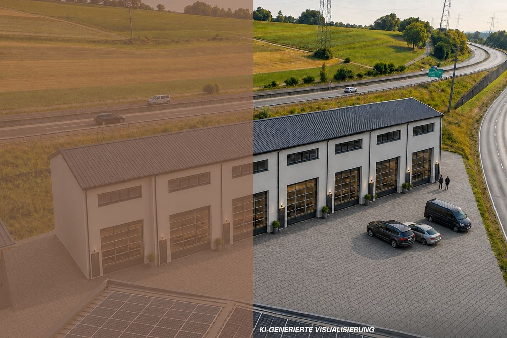
*`01.jpg` — 1500x1000 px — KI-Visualisierung Aussenansicht*

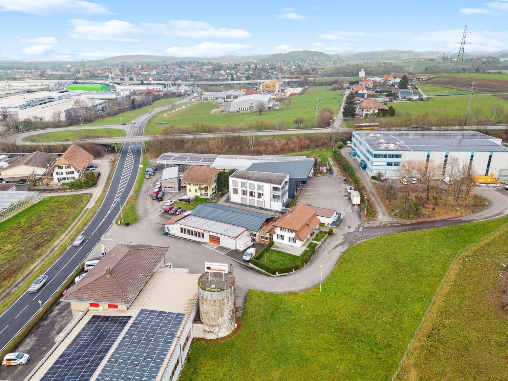
*`02.jpg` — 1500x1125 px — Drohnenaufnahme*

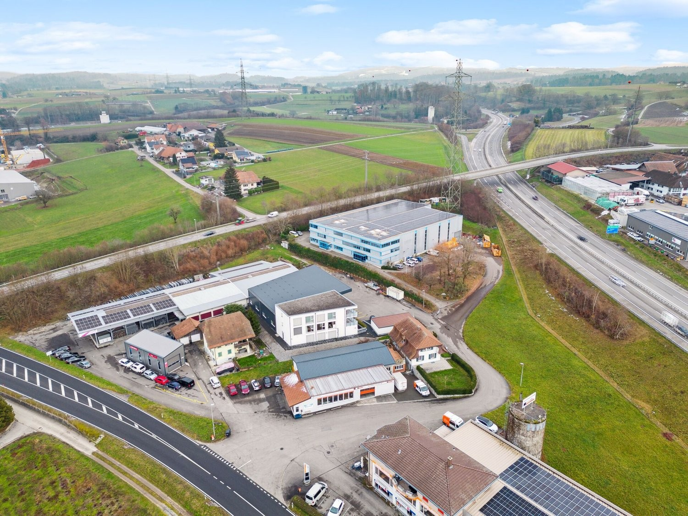
*`03.jpg` — 1500x1125 px — Drohnenaufnahme*

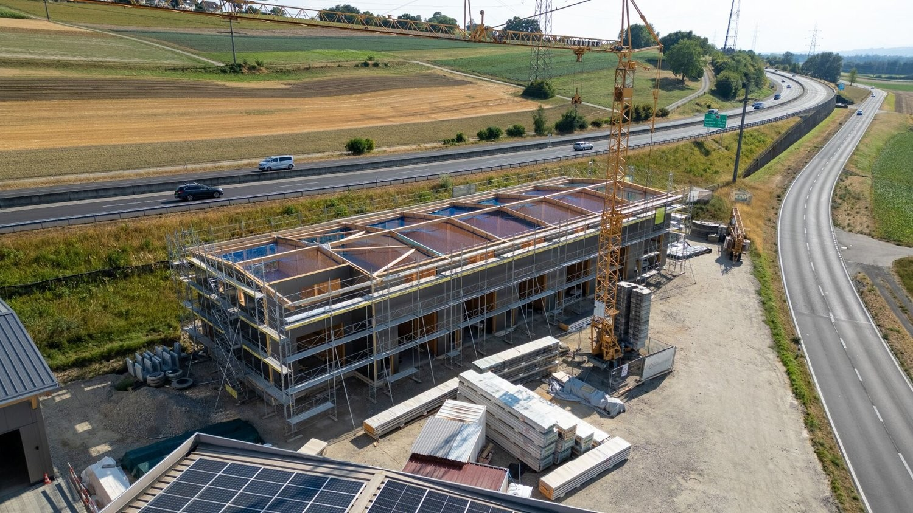
*`04.jpg` — 1500x844 px — Drohnenaufnahme*

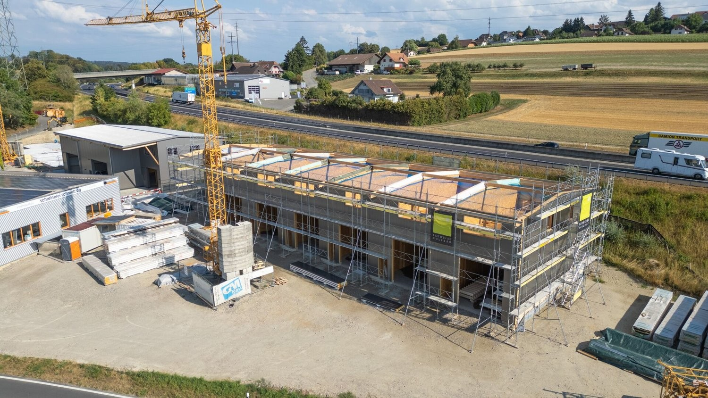
*`05.jpg` — 1500x844 px — Drohnenaufnahme*

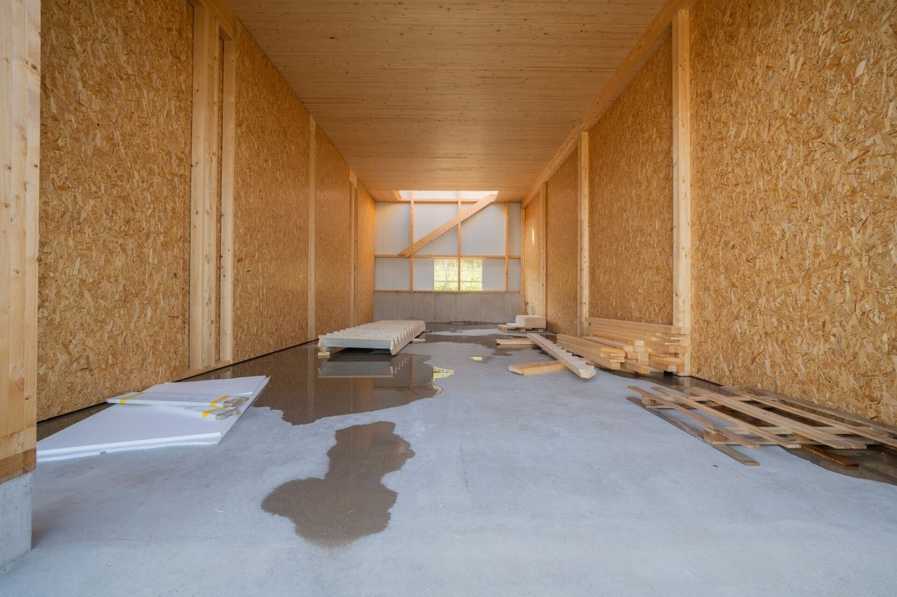
*`06.jpg` — 1500x1000 px — Innenaufnahme Erdgeschoss*

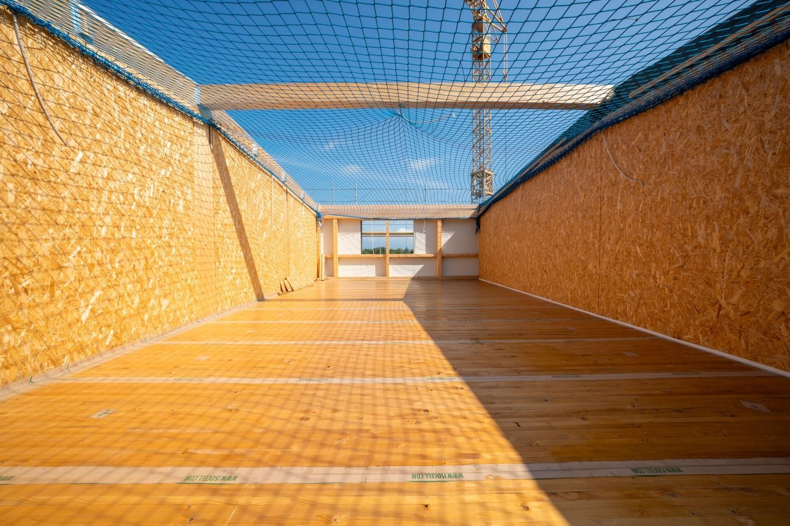
*`07.jpg` — 1500x1000 px — Innenaufnahme Obergeschoss*

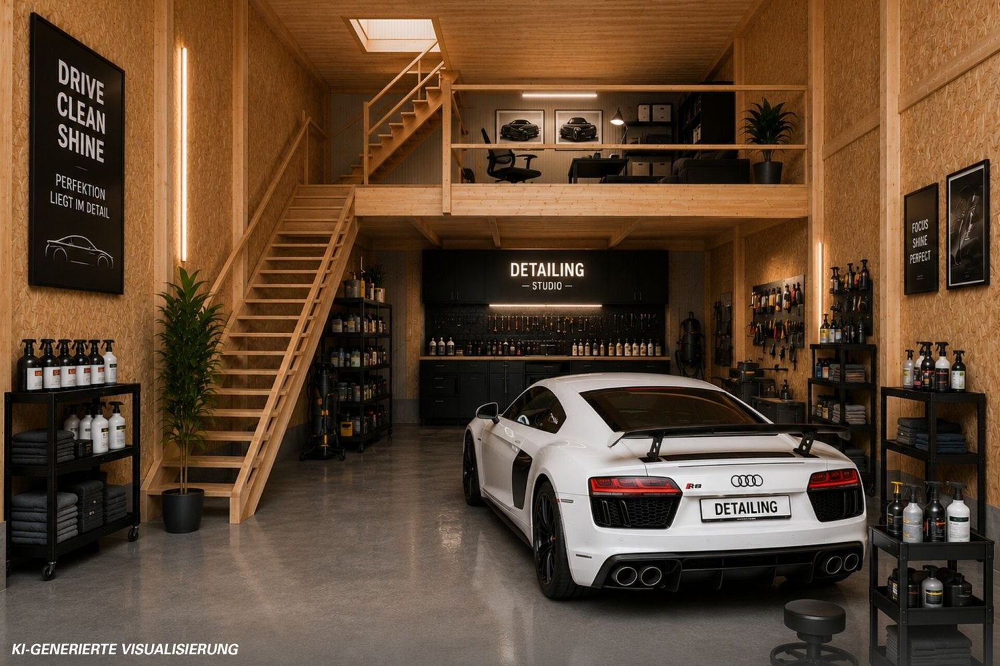
*`08.jpg` — 1500x1000 px — KI-Visualisierung möglicher Innenausbau*

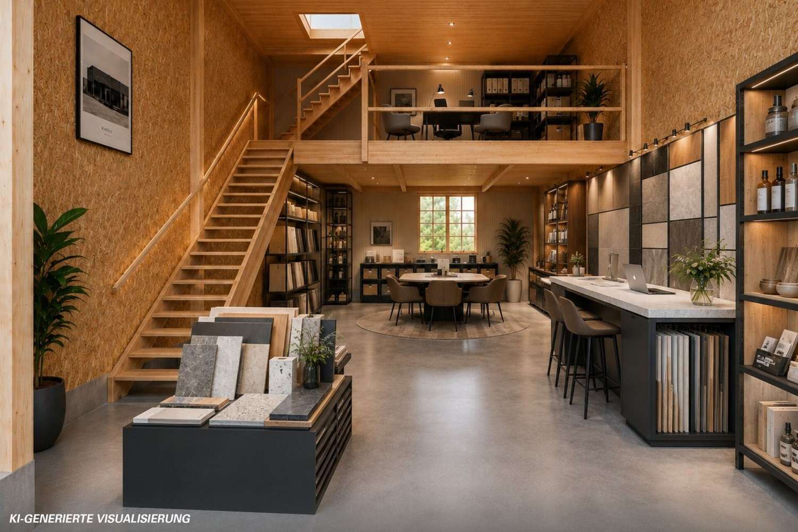
*`09.jpg` — 1500x1000 px — KI-Visualisierung möglicher Innenausbau*

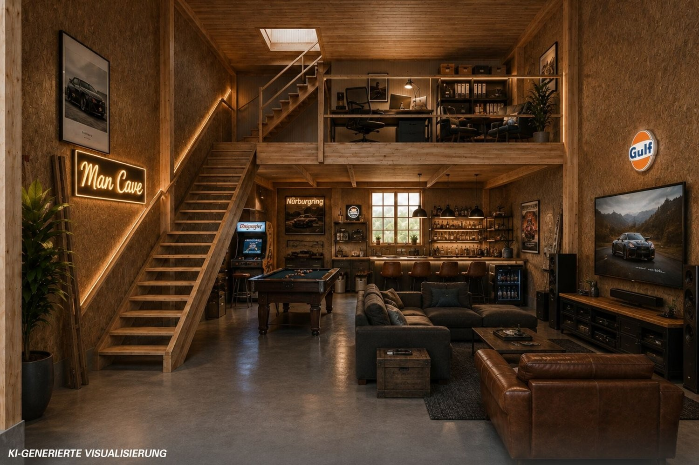
*`10.jpg` — 1500x1000 px — KI-Visualisierung möglicher Innenausbau*

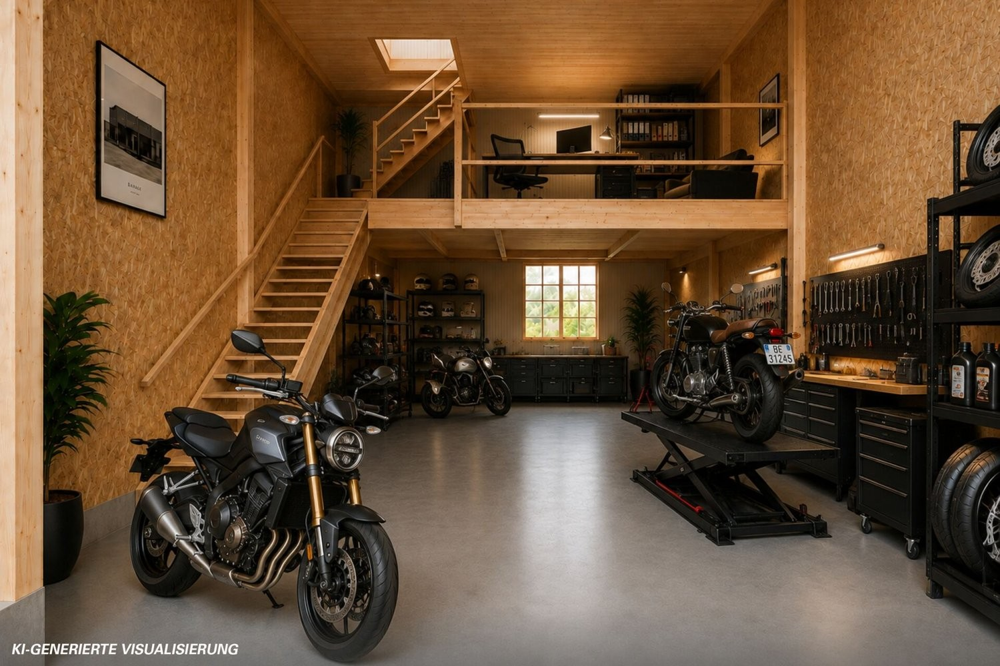
*`11.jpg` — 1500x1000 px — KI-Visualisierung möglicher Innenausbau*

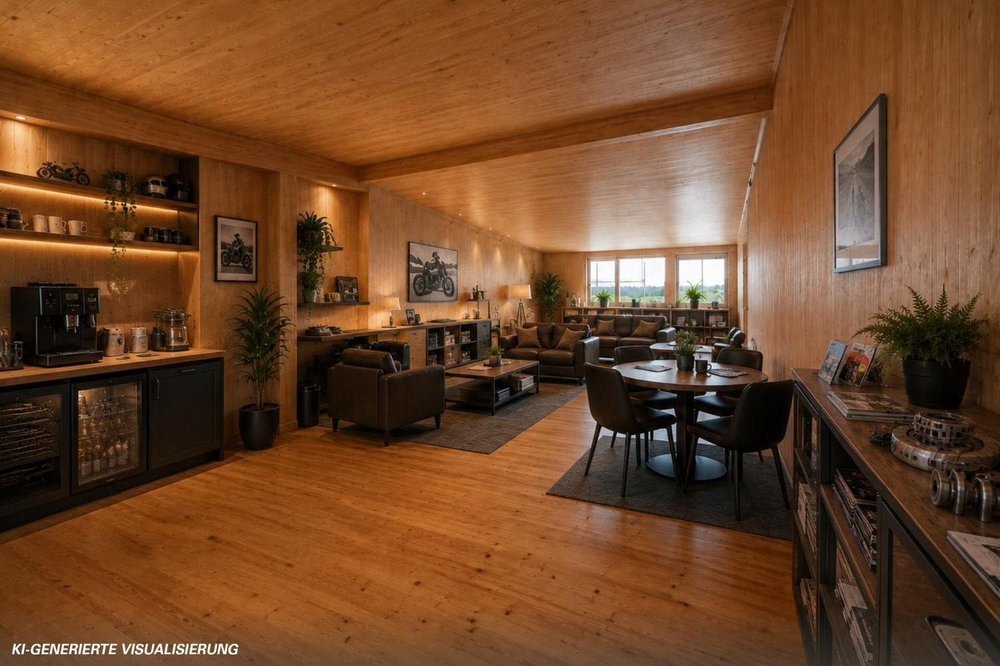
*`12.jpg` — 1500x1000 px — KI-Visualisierung möglicher Innenausbau*

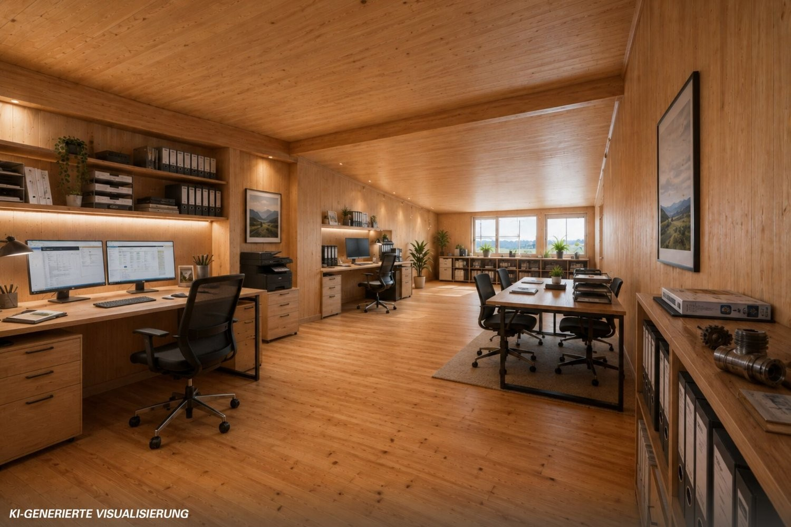
*`13.jpg` — 1500x1000 px — KI-Visualisierung möglicher Innenausbau*

## Media suplimentară

- **video_url:** https://youtu.be/g2MPetxgUzs
