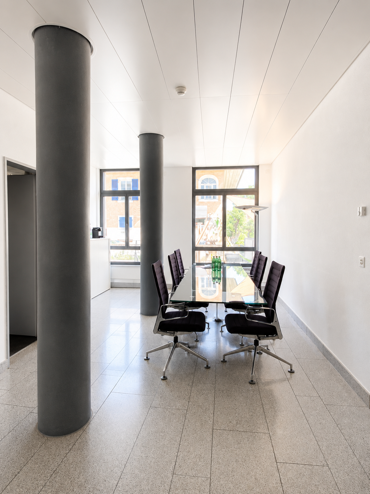
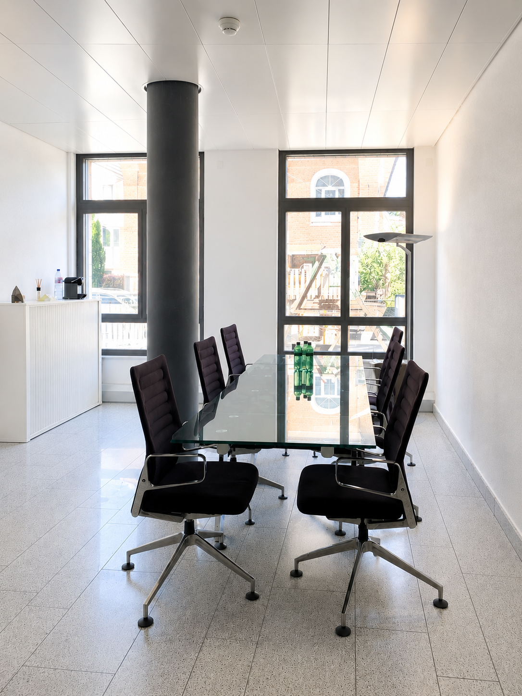
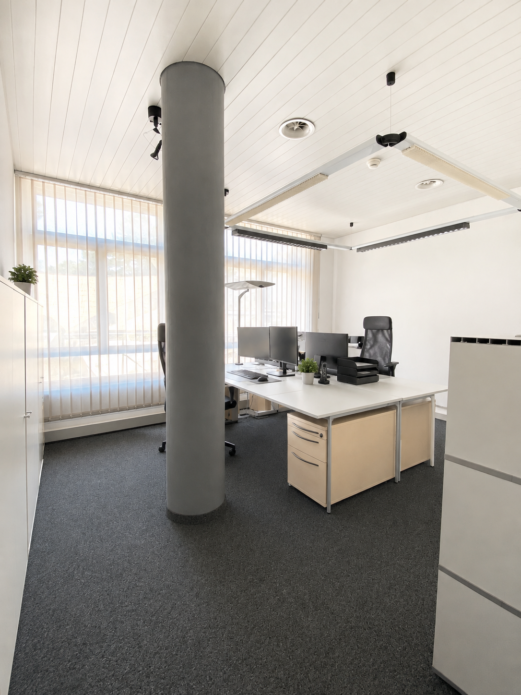
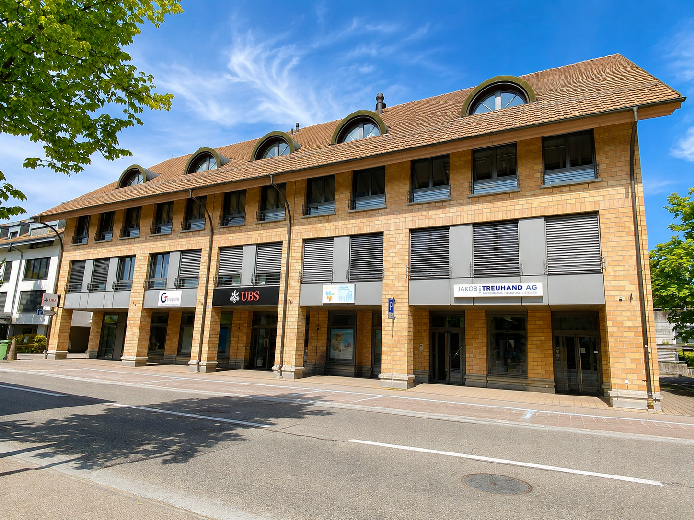
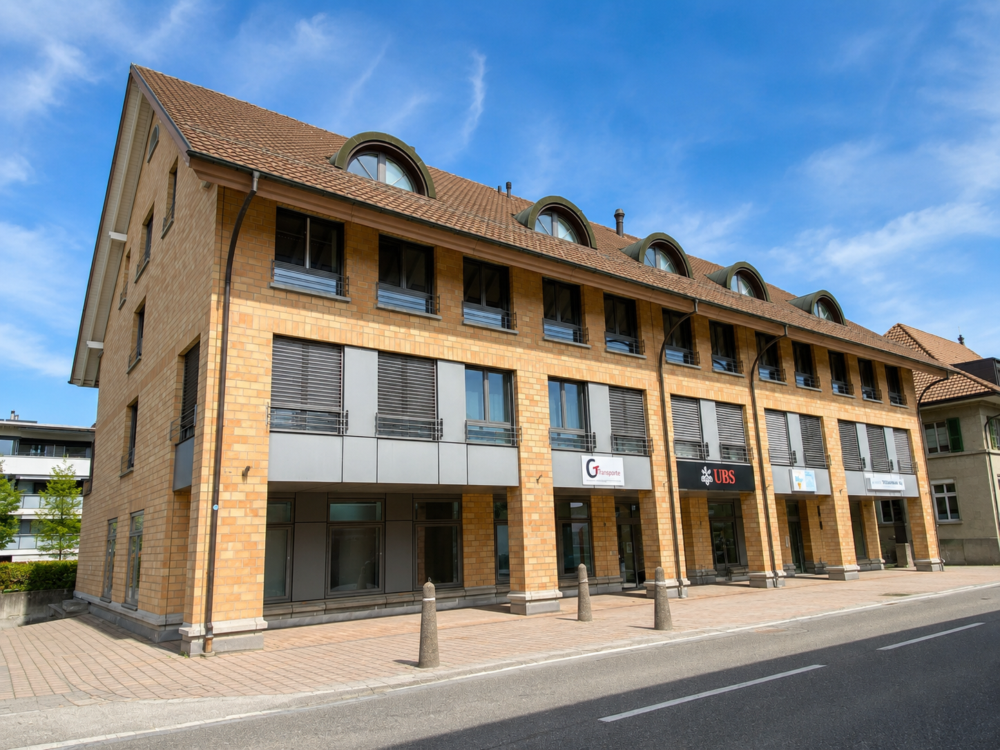
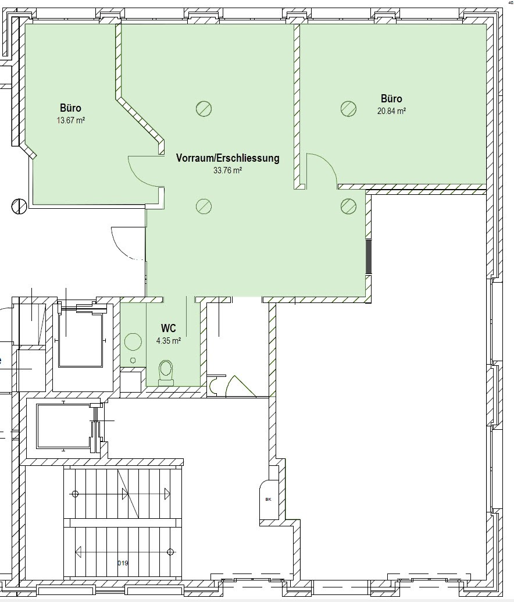

# Solothurnstrasse 4, 3422 Kirchberg BE - CHF 1’190

> **Categorie:** `B_buero_gewerbe`  
> **Regiune:** Cantonul Berna  
> **Tip ofertă:** RENT / COMMERCIAL  
> **Relevant pentru praxis:** da (praxis)  
> **Sursă:** [flatfox.ch](https://flatfox.ch/de/wohnung/solothurnstrasse-4-3422-kirchberg-be/86272310/)  
> **Descărcat:** 2026-08-17 12:31

## Date obiect

| Câmp | Valoare |
|---|---|
| Adresă | Solothurnstrasse 4, 3422 Kirchberg BE |
| Categorie obiect | INDUSTRY |
| Tip obiect | COMMERCIAL |
| Chirie netă | CHF 885 |
| Nebenkosten | CHF 305 |
| Chirie brută | CHF 1'190 |
| Preț afișat | CHF 1'190 |
| Suprafață utilă | 73 m² |
| Etaj | 0 |
| Disponibil de la | agr |
| Referință | ..elbbc.zldje |

## Texte originale (germană)

**Titlu public:** Solothurnstrasse 4, 3422 Kirchberg BE - CHF 1’190

**Titlu scurt:** 73m² Gewerbe

**Pitch:** 73m² Gewerbe in Kirchberg BE mieten

**Titlu descriere:** Viusitigi Gschäftsrümlechkeite im Härze vo Chiuberg

**Titlu chirie:** 73m² Gewerbe in Kirchberg BE mieten

**Spațiu afișat:** 73

### Descriere completă

Mitten im Zentrum von Kirchberg BE vermieten wir attraktive und vielseitig nutzbare Gewerberäumlichkeiten mit rund 73 m² Nutzfläche im Erdgeschoss. 

Die Fläche eignet sich ideal für Büro, Praxis, Beratung, Dienstleistung oder andere gewerbliche Nutzungen. Dank des praktischen Grundrisses, der grosszügigen Fensterflächen und des ebenerdigen Zugangs bieten die Räumlichkeiten ein angenehmes und freundliches Arbeitsumfeld. 

**Das erwartet Sie:**

  * ca. 73 m² Nutzfläche im Erdgeschoss 

  * helle und gepflegte Räumlichkeiten 

  * praktischer, flexibel nutzbarer Grundriss 

  * Sitzungs-/Besprechungsbereich 

  * eigene Toilette 

  * ebenerdiger Zugang 

  * zentrale und gut sichtbare Lage 

  * sehr gute Erreichbarkeit mit dem öffentlichen Verkehr 

  * Einkaufsmöglichkeiten, Restaurants, Banken, Post und weitere Dienstleistungen in unmittelbarer Nähe 

Die zentrale Lage macht den Standort sowohl für Mitarbeitende als auch für Kundschaft besonders attraktiv. 

**Parkiere**

Bei Bedarf können zusätzlich zwei Einstellhallenplätze für je CHF 105.– pro Monat dazu gemietet werden. 

**Dr Gwunger gweckt?**

Dann freuen wir uns auf Ihre Kontaktaufnahme. Gerne zeigen wir Ihnen die Räumlichkeiten bei einer persönlichen Besichtigung und lassen Sie sich selbst von diesem vielseitigen Standort überzeugen.

## Dotări (attributes)

- parkingspace
- lift

## Ofertant

- **Nume:** Mühlemann Immobilien AG
- **Stradă:** Solothurnstrasse 6
- **NPA:** 3422
- **Localitate:** Kirchberg BE

## Imagini (6)

*`01.png` — 1086x1448 px*

*`02.png` — 1086x1448 px*

*`03.png` — 1086x1448 px*

*`04.png` — 1448x1086 px*

*`05.png` — 1448x1086 px*

*`06.jpg` — 884x1035 px*
