# Chutzenstrasse 28, 3007 Bern - CHF 1’930 inkl. NK pro Monat

> **Categorie:** `B_buero_gewerbe`  
> **Regiune:** Berna (oraș)  
> **Tip ofertă:** RENT / COMMERCIAL  
> **Relevant pentru praxis:** da (praxis)  
> **Sursă:** [flatfox.ch](https://flatfox.ch/de/wohnung/chutzenstrasse-28-3007-bern/86272388/)  
> **Descărcat:** 2026-08-17 12:30

## Date obiect

| Câmp | Valoare |
|---|---|
| Adresă | Chutzenstrasse 28, 3007 Bern |
| Categorie obiect | INDUSTRY |
| Tip obiect | COMMERCIAL |
| Nebenkosten | CHF 280 |
| Chirie brută | CHF 1'930 |
| Preț afișat | CHF 1'930 |
| Etaj | 0 |
| Disponibil de la | agr |

## Texte originale (germană)

**Titlu public:** Chutzenstrasse 28, 3007 Bern - CHF 1’930 inkl. NK pro Monat

**Titlu scurt:** Gewerbe

**Pitch:** Gewerbe in Bern mieten

**Titlu descriere:** Befristet vermietbarer Gewerberaum mit 6 Zimmern an der Chutzenstrasse 28

**Titlu chirie:** Gewerbe in Bern mieten

### Descriere completă

**Befristete Vermietung bis 30.06.2027**  
An attraktiver Lage vermieten wir einen vielseitig nutzbaren Gewerberaum an der Chutzenstrasse 28. Die Räumlichkeiten eignen sich ideal als Büro, Praxis, Atelier, Schulungsraum oder für andere gewerbliche Nutzungen.  
Das Objekt bietet:  
  

*   5 separate Zimmer
*   1 WC-Anlage
*   Helle und gut nutzbare Räume
*   Flexible Nutzungsmöglichkeiten
*   Gute Erreichbarkeit mit dem öffentlichen Verkehr
*   Einkaufsmöglichkeiten und Dienstleistungen in unmittelbarer Nähe

Dank der durchdachten Raumaufteilung eignet sich die Fläche sowohl für kleinere Unternehmen als auch für Teams mit mehreren Arbeitsbereichen.  
**Mietdauer:** Befristet bis 30. Juni 2027  
Haben wir Ihr Interesse geweckt? Gerne stehen wir Ihnen für weitere Informationen oder einen Besichtigungstermin zur Verfügung.  
Wir freuen uns auf Ihre Kontaktaufnahme.

## Imagini (11)

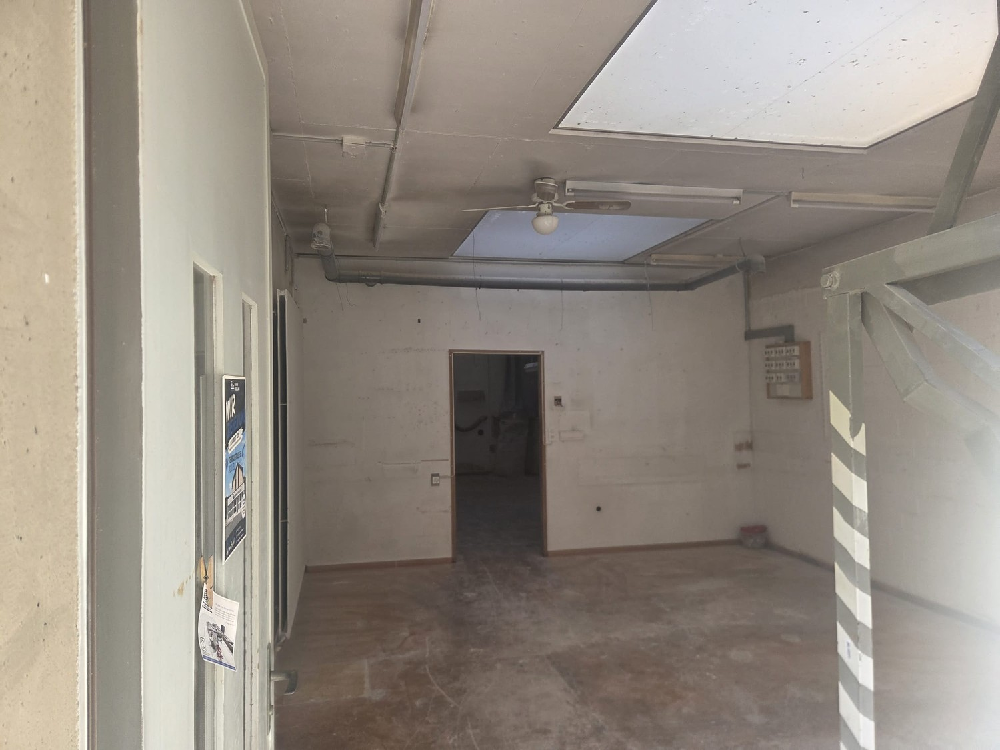
*`01.jpg` — 1500x1125 px*

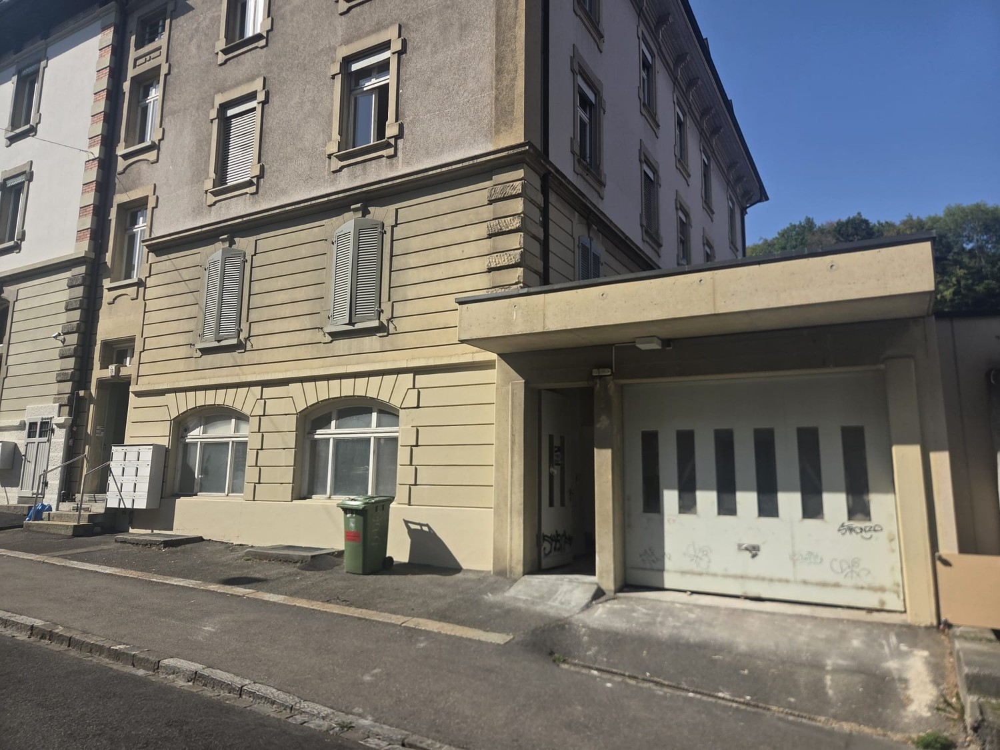
*`02.jpg` — 1500x1125 px*

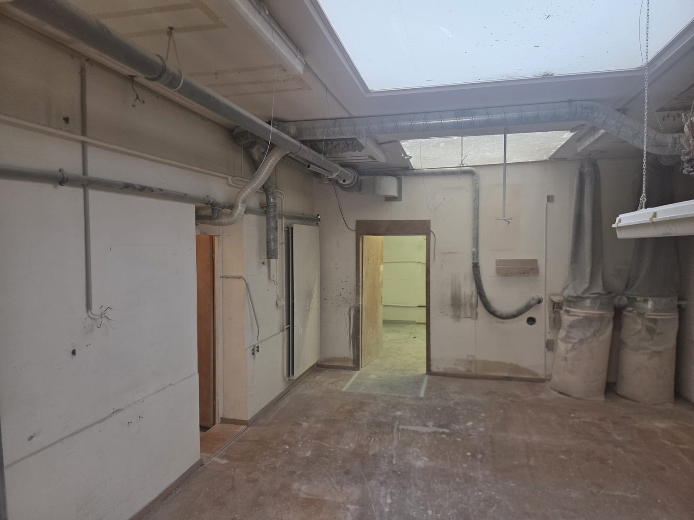
*`03.jpg` — 1500x1125 px*

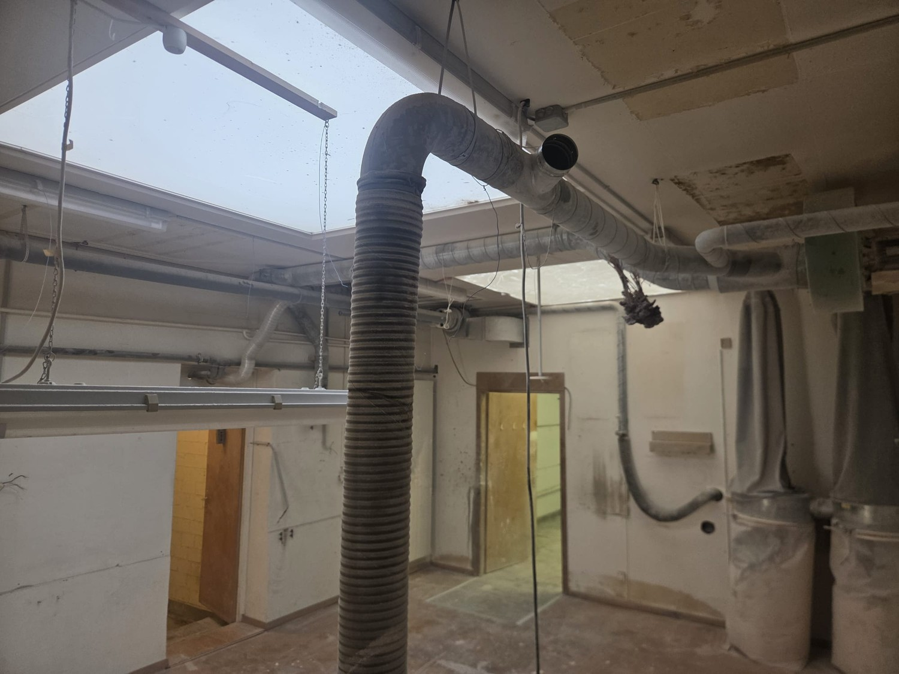
*`04.jpg` — 1500x1125 px*

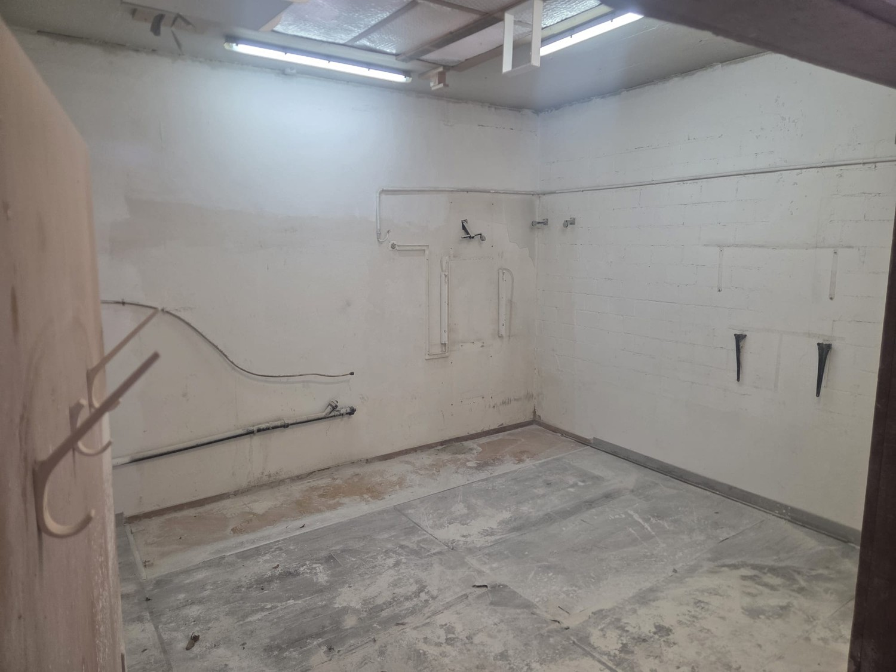
*`05.jpg` — 1500x1125 px*

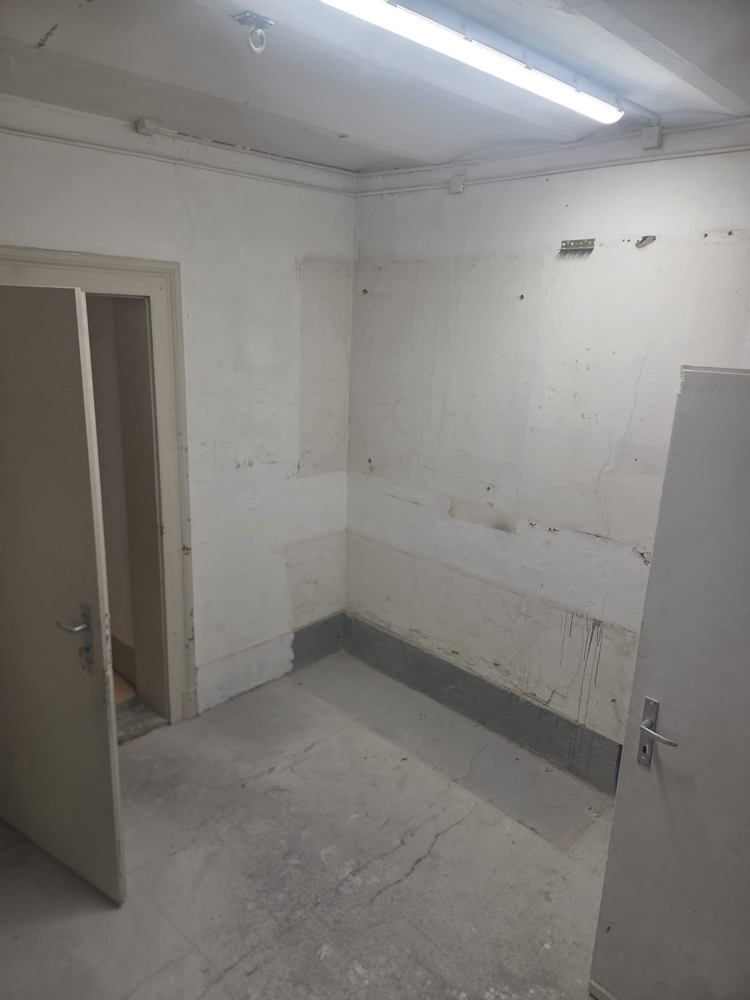
*`06.jpg` — 1125x1500 px*

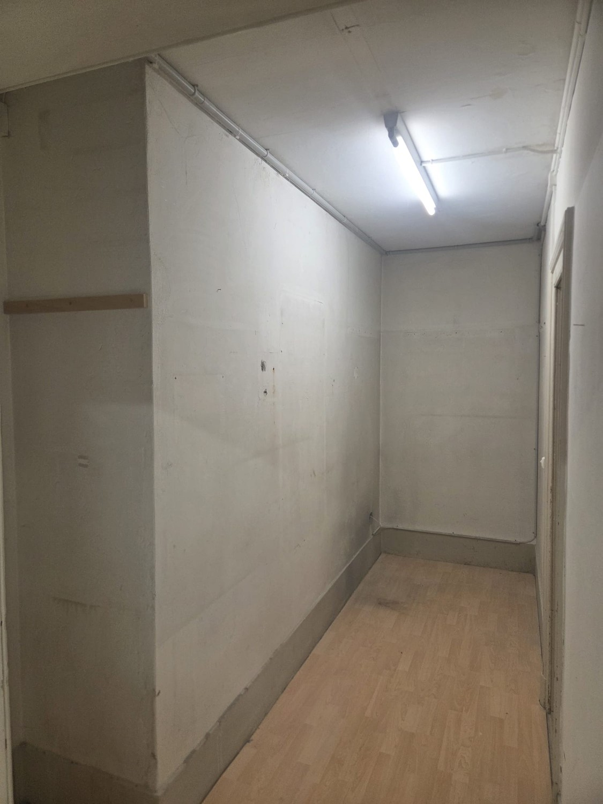
*`07.jpg` — 1125x1500 px*

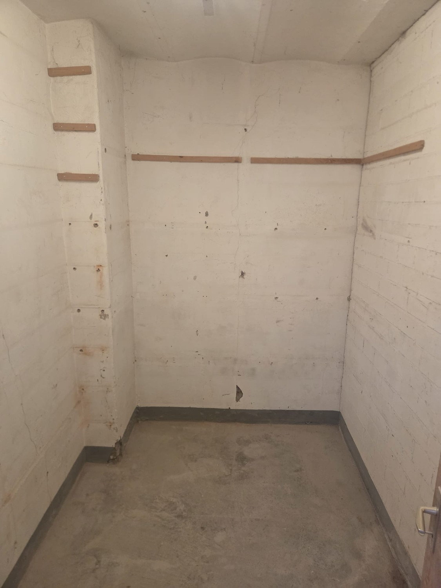
*`08.jpg` — 1125x1500 px*

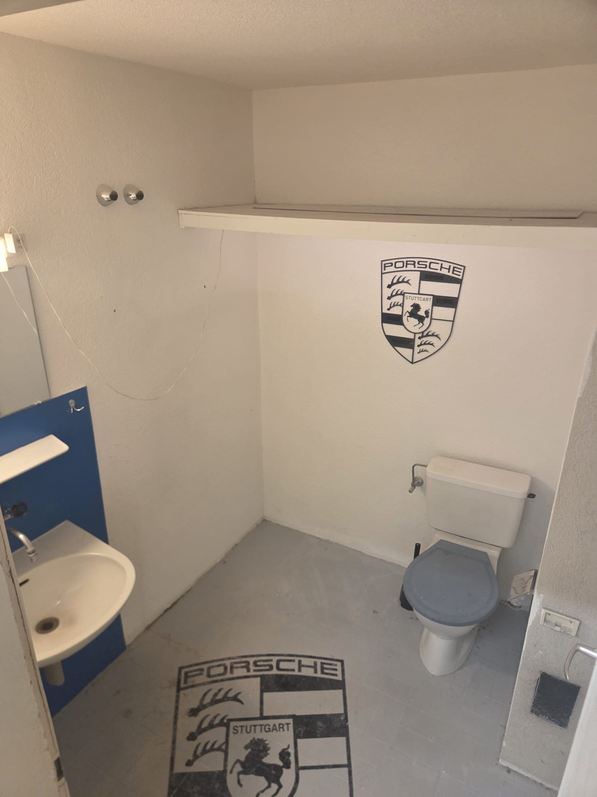
*`09.jpg` — 1125x1500 px*

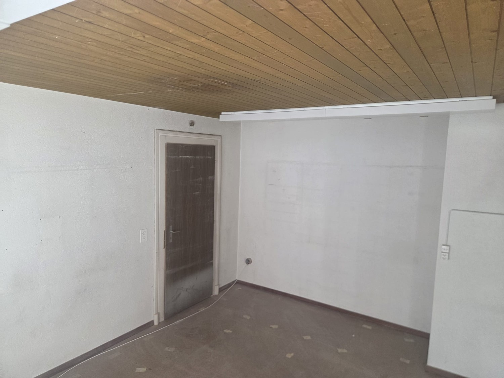
*`10.jpg` — 1500x1125 px*

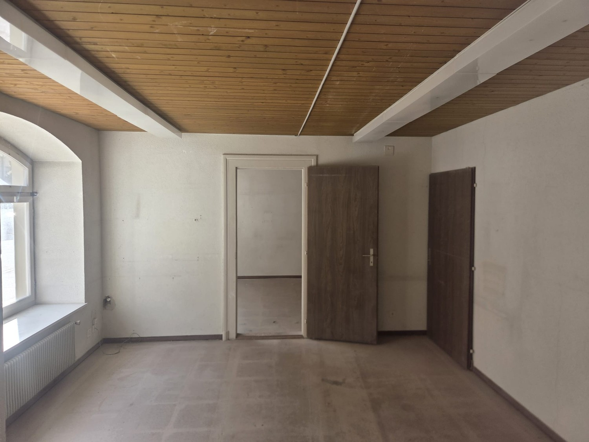
*`11.jpg` — 1500x1125 px*
