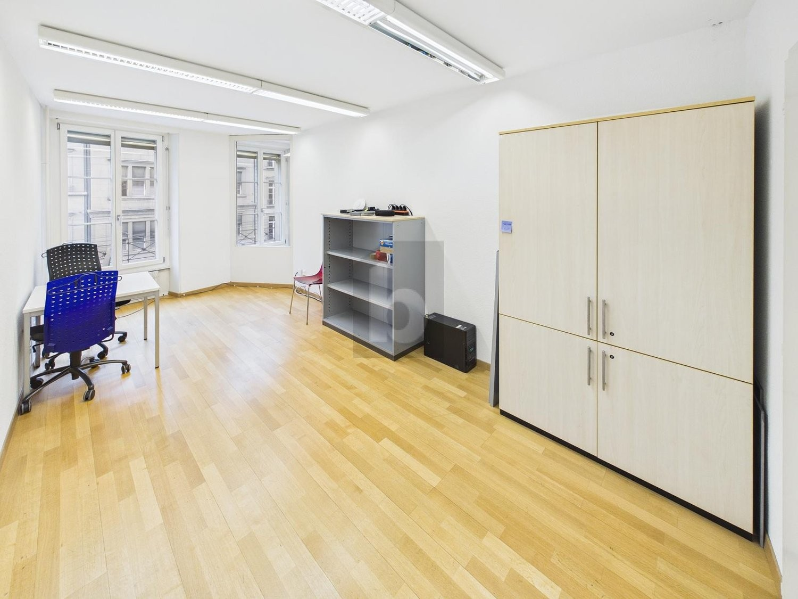
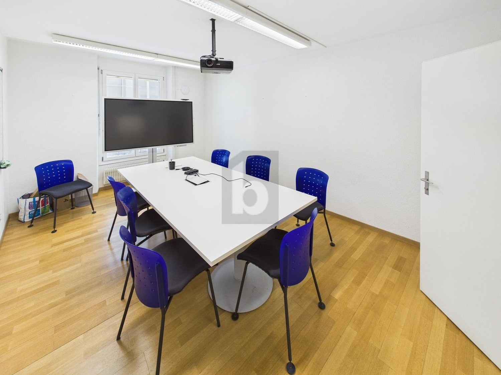
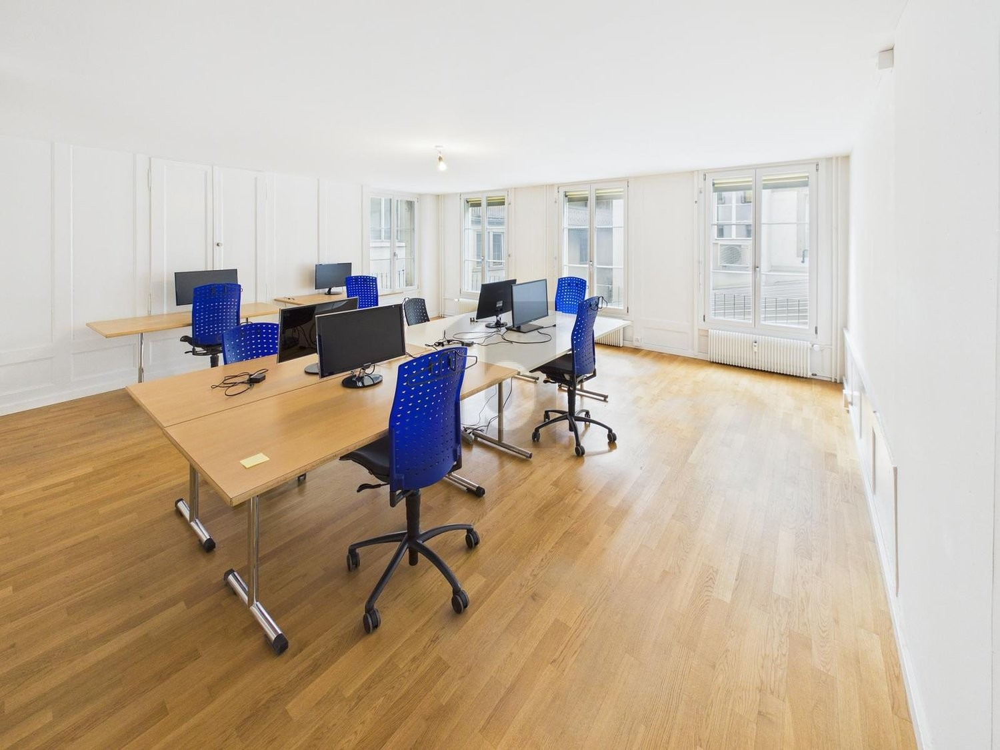
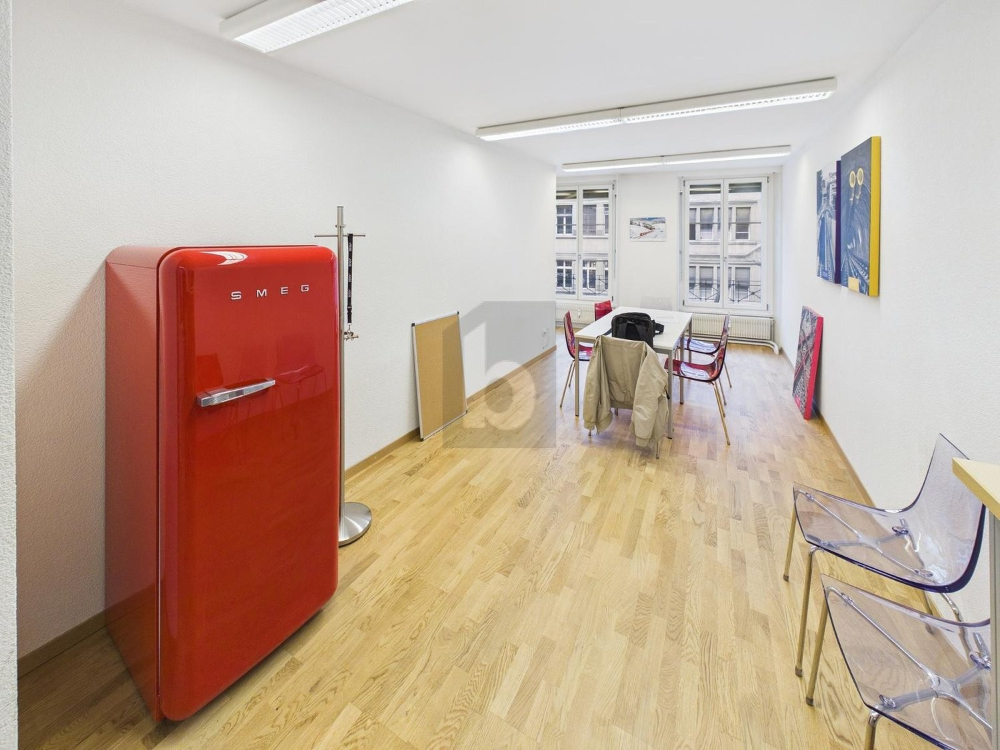

# Auf Anfrage, 3011 Bern - CHF 3’830 inkl. NK pro Monat

> **Categorie:** `B_buero_gewerbe`  
> **Regiune:** Berna (oraș)  
> **Tip ofertă:** RENT / OFFICE  
> **Relevant pentru praxis:** da (praxen)  
> **Sursă:** [flatfox.ch](https://flatfox.ch/de/wohnung/auf-anfrage-3011-bern/86275884/)  
> **Descărcat:** 2026-08-17 12:30

## Date obiect

| Câmp | Valoare |
|---|---|
| Adresă | Auf Anfrage, 3011 Bern |
| Categorie obiect | INDUSTRY |
| Tip obiect | OFFICE |
| Chirie netă | CHF 3'450 |
| Nebenkosten | CHF 380 |
| Chirie brută | CHF 3'830 |
| Preț afișat | CHF 3'830 |
| Suprafață utilă | 0 m² |
| Suprafață teren | 153 m² |
| Etaj | 1 |
| Disponibil de la | agr |
| Referință | ..1412704 |

## Texte originale (germană)

**Titlu public:** Auf Anfrage, 3011 Bern - CHF 3’830 inkl. NK pro Monat

**Titlu scurt:** Büro

**Pitch:** Büro in Bern mieten

**Titlu descriere:** GROSSZÜGIG UND ZENTRAL, ERSTE 3 MONATE GRATIS

**Titlu chirie:** Büro in Bern mieten

### Descriere completă

Diese grosszügige, gepflegte Bürofläche in 3011 Bern überzeugt mit 5 Zimmern auf ca. 153 m² in sehr zentraler Lage nahe Bahnhof Bern. Ideal für Teams, Agenturen, Beratungen oder Praxen, die kurze Wege und ein repräsentatives Umfeld schätzen. Ein Pausenraum mit Dusche sorgt für Komfort im Arbeitsalltag, die kleine Kochecke für unkomplizierte Verpflegung. Auf Wunsch ist die Übernahme von Mobiliar möglich.   
  
Dieses BETTERHOMES-Angebot zeichnet sich durch folgende Vorteile aus:   
\- sehr zentrale Lage nähe Bahnhof Bern   
  
\- grosszügige und gepflegte Räumlichkeiten   
  
\- mit Pausenraum und Dusche   
  
\- kleine Küchenecke   
  
\- Übernahme von Mobiliar möglich   
  
\- und, und, und ...   
  
  
Interessiert? Kontaktieren Sie uns für eine unverbindliche Besichtigung – auch Online-Besichtigung möglich!   
  
Nichts Passendes gefunden? Über 2'000 weitere Angebote unter: www.betterhomes.ch - der Immobilienfairmittler®   
  
Selber eine Immobilie zu vermarkten?   
Profitieren Sie von unserem Know-how: https://www.betterhomes.ch/de/profitieren   
  
Sie möchten eine Immobilie schätzen lassen?   
Erfahren Sie jetzt ihren Wert über unsere Gratis-Schätzung, sofort und unverbindlich!   
https://www.betterhomes.ch/de/knowledge/estimation   
  
  
Mehr Details   
Lage: sehr zentral   
Zustand: gut   
  
Bäder / Nasszellen: 3 (1 x Dusche / Lavabo, 2 x WC / Lavabo)   
Öffentliche Verkehrsmittel: Bahn, 100 m   
Geschäfte: Coop, 30 m / Div. Geschäfte, in unmittelbarer Umgebung

## Dotări (attributes)

- lift

## Ofertant

- **Nume:** BETTERHOMES (Schweiz) AG
- **Stradă:** Weltpoststrasse 3E
- **NPA:** 3015
- **Localitate:** Bern

## Imagini (4)

*`01.jpg` — 1500x1125 px*

*`02.jpg` — 1500x1125 px*

*`03.jpg` — 1500x1125 px*

*`04.jpg` — 1500x1125 px*

## Media suplimentară

- **website_url:** https://www.betterhomes.ch/de/immobilie-suchen/detail/objectId/82b3618a8979a0793766562749dfc438
